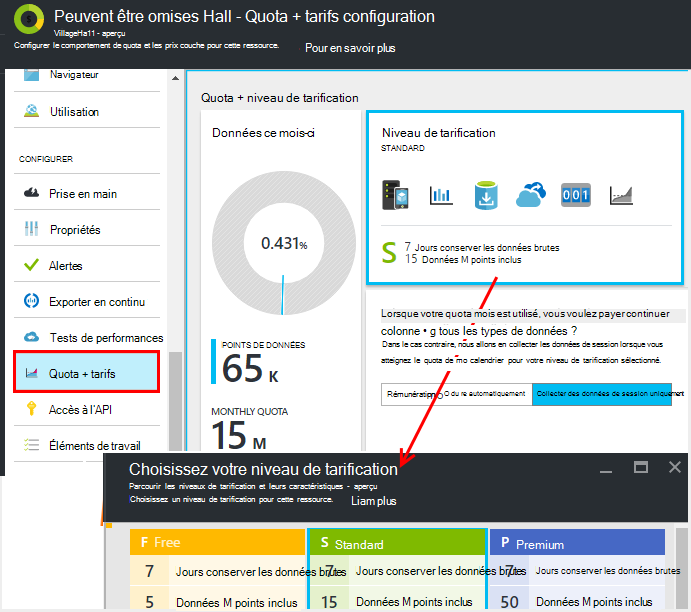
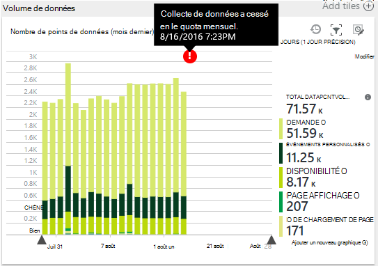
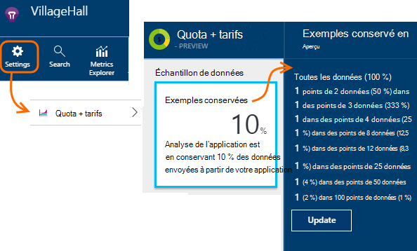
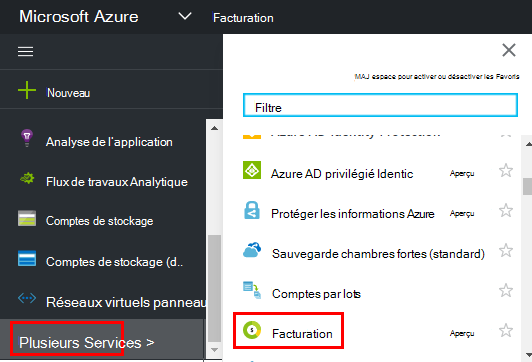

<properties 
    pageTitle="Gérer les tarifs et quota pour avoir un aperçu Application | Microsoft Azure" 
    description="Choisir l’offre de prix que vous avez besoin, gérer les volumes de télémétrie" 
    services="application-insights" 
    documentationCenter=""
    authors="alancameronwills" 
    manager="douge"/>

<tags 
    ms.service="application-insights" 
    ms.workload="tbd" 
    ms.tgt_pltfrm="ibiza" 
    ms.devlang="na" 
    ms.topic="article" 
    ms.date="10/13/2016" 
    ms.author="awills"/>

# Gérer les tarifs et quota pour avoir un aperçu Application

*Analyse de l’application est en mode Aperçu.*

[Tarifs] [ pricing] pour [Visual Studio Application Insights] [ start] est basé sur le volume de données par application. Il existe un niveau gratuit significative dans lequel vous obtenez la plupart des fonctionnalités avec certaines limitations.

Chaque ressource Application Insights est facturée comme service séparé et contribue à la facture de votre abonnement à Azure.

[Afficher le modèle de tarification][pricing].

## Examen du plan quota et le prix de la ressource de perspectives d’Application

Vous pouvez ouvrir le Quota + tarifs carte à partir des paramètres de la ressource votre application.

Votre choix du mécanisme de tarification affecte :

* [Quota mensuel](#monthly-quota) - la quantité de télémétrie que vous pouvez d’analyser chaque mois.
* [Taux de données](#data-rate) - la vitesse maximale à laquelle les données provenant de votre application peuvent être traitées.
* [Exporter continu](#continuous-export) - si vous pouvez exporter des données à d’autres outils et services.

Ces limites sont définies séparément pour chaque ressource Application perspectives.

### Version d’évaluation gratuite de Premium

Lorsque vous créez une nouvelle ressource Application perspectives, il commence dans la couche gratuite.

À tout moment, vous pouvez passer à la version d’évaluation de Premium gratuite de 30 jours. Cela vous offre les avantages de la couche Premium. Après 30 jours, il sera automatiquement rétablie en cascade de tout ce qui vous ont été avant - sauf si vous choisissez explicitement une autre couche. Vous sélectionnez le niveau souhaité à tout moment pendant la période d’évaluation, mais vous obtenez toujours la version d’évaluation gratuite jusqu'à la fin de la période de 30 jours.

## Quota mensuel

* Dans chaque mois du calendrier, votre application peut envoyer vers le haut sur une quantité déterminée de télémétrie d’analyse de l’Application. Actuellement le quota pour le niveau de tarification gratuit correspond aux points de données 5 millions par mois, etc. sensiblement pour les autres schémas ; Vous pouvez acheter plus si vous atteignez le quota.  Consultez les [tarifs jeu] [ pricing] pour les nombres réels. 
* Le quota dépend du niveau de prix que vous avez choisi.
* Le quota est calculée à partir de minuit UTC sur le premier jour de chaque mois.
* Le graphique de points de données indique la quantité de votre quota a été utilisé des moyennes du mois.
* Le quota est mesuré en *observations.* Un point de données est un appel à l’une des méthodes de suivi, si appelée explicitement dans votre code ou par un des modules de télémétrie standard. Il peut avoir plusieurs propriétés attachées et indicateurs.
* Points de données sont générées par :
 * [Modules SDK](app-insights-configuration-with-applicationinsights-config.md) qui automatiquement collecter les données, par exemple pour signaler une demande ou blocage ou à mesurer les performances.
 * [API](app-insights-api-custom-events-metrics.md) `Track...` appels que vous avez écrit, tel que `TrackEvent` ou `trackPageView`.
 * [Tests de site web de disponibilité](app-insights-monitor-web-app-availability.md) que vous avez configuré.
* Pendant que vous êtes le débogage, vous pouvez afficher des points de données en provenance de votre application dans la fenêtre de sortie de Visual Studio. Événements client peuvent être vu via que l’onglet réseau dans votre navigateur de débogage volet (généralement F12).
* *Les données de session* n’est pas comptée dans le quota. Cela inclut le nombre d’utilisateurs, sessions, environnement et données de l’appareil.
* Si vous voulez connaître le nombre des points de données par une inspection, vous pouvez les retrouver facilement à différents endroits :
 * Chaque élément que vous voyez dans [recherche diagnostic](app-insights-diagnostic-search.md), qui inclut les demandes HTTP, exceptions, traces journal, affichages de page, les événements de dépendance et des événements personnalisés.
 * Chaque mesure brute d’une [métrique](app-insights-metrics-explorer.md) par exemple un compteur de performance. (Les points que vous voyez sur les graphiques sont généralement des regroupements de plusieurs points de données brutes).
 * Chaque point sur un graphique de disponibilité web est également un agrégat de plusieurs points de données.
* Vous pouvez également inspecter les points de données individuels au niveau de source pendant le débogage :
 * Si vous exécutez votre application en mode débogage dans Visual Studio, les points de données sont enregistrés dans la fenêtre de sortie. 
 * Pour afficher les points de données client, ouvrez le volet débogage de votre navigateur (généralement F12), puis ouvrez l’onglet réseau.
* Le taux de données peut être (par défaut) diminué [d’échantillonnage adapté](app-insights-sampling.md). Cela signifie que, comme l’utilisation de votre application augmente, le taux de télémétrie n’augmente autant que vous pouvez vous attendre.

### Excédent

Si votre application envoie plus grande que le quota mensuel, vous pouvez :

* Paiement en fonction des données supplémentaires. Consultez les [tarifs jeu] [ pricing] pour plus d’informations. Vous pouvez choisir cette option à l’avance. Cette option n’est pas disponible dans la Free tarifs niveau.
* Mettre à niveau votre niveau de tarification.
* Ne rien faire. Les données de session continuent à être enregistré, mais d’autres données n’apparaîtront pas dans Rechercher des diagnostics ou dans l’Explorateur de mesures.

## La quantité de données que j’envoie ?

Le graphique en bas de la tarification carte indique le volume des points de données de votre application, regroupées par type de point de données. (Vous pouvez également créer ce graphique dans l’Explorateur de métrique).

Cliquez sur le graphique pour plus de détails, ou faites-le et cliquez sur (+) pour les détails d’un intervalle de temps.

Le graphique indique le volume de données qui arrive au niveau du service d’analyse de l’Application, après [l’échantillonnage](app-insights-sampling.md).

Si le volume de données atteint votre quota mensuel, une annotation s’affiche dans le graphique.

## Taux de données

Outre le quota mensuel, il existe la limitation des limites sur le taux de données. Pour la gratuit [tarifs couche] [ pricing] la limite est de 200 données points/seconde moyennes plus de 5 minutes et pour le payant niveaux il est 500/s moyenne supérieure d’une minute. 

Il existe trois plages qui sont comptés séparément :

* [Appels TrackTrace](app-insights-api-custom-events-metrics.md#track-trace) et [capturé journaux](app-insights-asp-net-trace-logs.md)
* [Exceptions](app-insights-api-custom-events-metrics.md#track-exception), limité à 50 points/s.
* Tous les autres télémétrie (affichages de page, sessions, demandes, dépendances, mesures, les événements personnalisés, résultats des tests web).

*Que se passe-t-il si mon application dépasse le taux par seconde ?*

* Le volume de données qui envoie votre application est évalué toutes les minutes. S’il dépasse le taux par seconde moyenne pour les minutes, le serveur refuse des requêtes. Le Kit de développement met en mémoire tampon les données, puis tente renvoyer, répartition une augmentation sur plusieurs minutes. Si votre application de manière cohérente à travers envoie des données en au-dessus de la vitesse de régulation, certaines données seront supprimées. (La ASP.NET, Java et JavaScript SDK essaient de renvoyer de cette manière ; autres SDK peut simplement les données portée limitée).

Si la limitation se produit, vous verrez une notification avertissement que ceci est arrivé.

*Comment savoir combien observations envoie mon application ?*

* Ouvrez Paramètres/Quota et tarification pour afficher le graphique du Volume de données.
* Ou dans l’Explorateur de mesures, ajouter un nouveau graphique et sélectionnez **volume des points de données** comme métrique. Basculez sur regroupement et de groupe par **type de données**.

## Pour réduire la fréquence des données

Si vous rencontrez les limites de limitation, voici quelques actions que possibles :

* Utilisez [l’échantillonnage](app-insights-sampling.md). Cette technique diminue débit sans inclinaison vos mesures et sans interruption de la possibilité de naviguer entre les éléments associés de recherche.
* [Limiter le nombre d’appels Ajax qui peut être déclaré](app-insights-javascript.md#detailed-configuration) dans chaque commutateur désactiver la création de rapports Ajax ou mode page.
* Désactiver les modules de collection de sites que vous n’avez pas besoin en [modifiant ApplicationInsights.config](app-insights-configuration-with-applicationinsights-config.md). Par exemple, vous pouvez décider que compteurs de performance ou données de dépendance sont inessential.
* Agréger des indicateurs. Si vous avez placé les appels à TrackMetric dans votre application, vous pouvez réduire le trafic à l’aide de la surcharge qui accepte le calcul de la moyenne et l’écart type d’un lot de mesures. Ou vous pouvez utiliser un [package préalable agrégation](https://www.myget.org/gallery/applicationinsights-sdk-labs). 

## Échantillonnages

[Échantillonnage](app-insights-sampling.md) est une méthode de réduire le taux auquel télémétrie est envoyé à votre application, tout en conservant la possibilité de rechercher les événements liés au cours des recherches de diagnostics et en conservant correcte événement compte. 

Échantillonnage est un moyen efficace de réduire les frais et de rester au sein de votre quota mensuel. L’algorithme d’échantillonnage conserve les éléments liés de télémétrie, afin que, par exemple, lorsque vous utilisez la recherche, vous pouvez trouver la demande liée à une exception particulière. L’algorithme conserve également les nombres de corrects, afin que vous voyez les valeurs correctes dans l’Explorateur de métrique taux demande, taux d’exception et autres nombres.

Il existe plusieurs formulaires d’échantillonnage.

* [D’échantillonnage adapté](app-insights-sampling.md) est la valeur par défaut pour le Kit de développement ASP.NET, qui s’ajuste automatiquement pour le volume de télémétrie qui envoie votre application. Il fonctionne automatiquement dans le Kit de développement dans votre application web, si bien que le trafic de télémétrie sur le réseau est réduit. 
* *Échantillonnage de réception* est un texte de remplacement qui fonctionne à l’endroit où télémétrie depuis votre application entre le service d’analyse de l’Application. Il n’affecte pas le volume de télémétrie envoyé à partir de votre application, mais il permet de réduire le volume conservé par le service. Vous pouvez l’utiliser pour réduire le quota utilisé par télémétrie de navigateurs et d’autres SDK.

Pour définir d’échantillonnage de réception, définissez le contrôle dans les Quotas + tarifs carte :

> [AZURE.WARNING] La valeur indiquée sur la vignette des échantillons conservés n'indique que la valeur que vous avez défini d’échantillonnage de réception. Il n’indique pas le taux d’échantillonnage qui fonctionne au Kit de développement dans votre application. 
> 
> Si la télémétrie entrant a déjà été échantillonnée en le Kit de développement, échantillonnages réception ne sont pas appliqué.
 
Pour découvrir la fréquence d’échantillonnage réelle quel que soit l’endroit où il a été appliqué, utilisez une [requête Analytique](app-insights-analytics.md) telles que :

    requests | where timestamp > ago(1d)
  	| summarize 100/avg(itemCount) by bin(timestamp, 1h) 
  	| render areachart 

Dans chacune conservées enregistrement, `itemCount` indique le nombre d’enregistrements d’origine qu’elle représente, égale à 1 + le nombre d’enregistrements ignorés précédents. 

## Passez en revue la facture de votre abonnement à Azure

Application analyse des frais sont ajoutés à votre facture Azure. Vous pouvez afficher des détails concernant votre Azure nomenclature dans la section facturation du portail Azure ou dans le [Portail de facturation Azure](https://account.windowsazure.com/Subscriptions). 

## Limites de nom

1.  Maximum 200 uniques métriques de noms d’et 200 propriété unique pour votre application. Métrique inclure des données envoyées par TrackMetric, ainsi que les mesures sur d’autres types de données telles que des événements.  [Noms d’indicateurs et propriétés] [ api] sont globales par clé instrumentation.
2.  [Propriétés] [ apiproperties] peut être utilisé pour le filtrage et group by uniquement pendant qu’ils ont moins de 100 valeurs uniques pour chaque propriété. Une fois que le nombre de valeurs uniques est supérieure à 100, vous pouvez toujours effectuer une recherche dans la propriété, mais n’est plus utiliser des filtres ou group by.
3.  Propriétés standards telles que le nom de la demande et l’URL de la Page sont limitées à 1000 des valeurs uniques par semaine. Après avoir 1 000 valeurs uniques, des valeurs supplémentaires sont marqués comme « Autres valeurs ». Les valeurs d’origine peuvent toujours servir de recherche en texte intégral et de filtrage.

Si vous avez trouvé votre application est supérieure à ces limites, pensez à fractionner vos données entre clés instrumentation différents - autrement dit, [créer de nouvelles perspectives Application ressources](app-insights-create-new-resource.md) et envoyer des données vers les nouvelles clés instrumentation. Il peut arriver que le résultat est mieux structuré. Vous pouvez utiliser des [tableaux de bord](app-insights-dashboards.md#dashboards) pour placer les différentes mesures sur le même écran, afin que cette approche ne limiter votre capacité à comparer les différentes mesures. 

## Résumé des limites

[AZURE.INCLUDE [application-insights-limits](../../includes/application-insights-limits.md)]

<!--Link references-->

[api]: app-insights-api-custom-events-metrics.md
[apiproperties]: app-insights-api-custom-events-metrics.md#properties
[start]: app-insights-overview.md
[pricing]: http://azure.microsoft.com/pricing/details/application-insights/

 