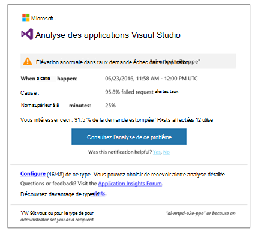
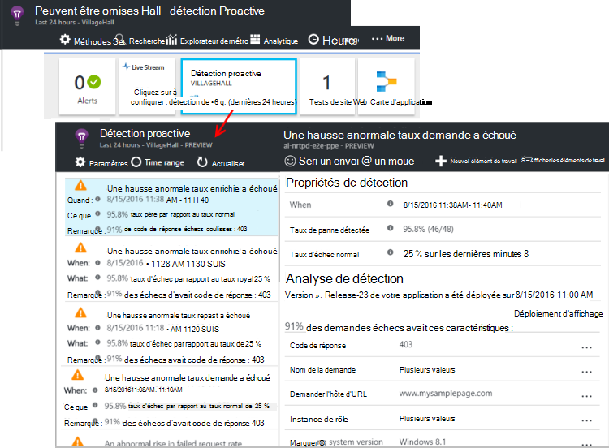

<properties 
    pageTitle="Diagnostics proactifs dans perspectives Application | Microsoft Azure" 
    description="Application analyse effectue une analyse approfondie automatique de télémétrie de votre application et vous avertit des problèmes potentiels." 
    services="application-insights" 
    documentationCenter="windows"
    authors="rakefetj" 
    manager="douge"/>

<tags 
    ms.service="application-insights" 
    ms.workload="tbd" 
    ms.tgt_pltfrm="ibiza" 
    ms.devlang="na" 
    ms.topic="article" 
    ms.date="08/15/2016" 
    ms.author="awills"/>

#  Diagnostics proactifs dans perspectives d’Application

 Diagnostics proactifs automatiquement vous avertit d’éventuels problèmes de performances dans votre application web. Elle effectue une analyse intelligente de télémétrie qui envoie votre application [Visual Studio Application](app-insights-overview.md)analyse. S’il existe une hausse soudaine de taux d’échec, ou des motifs anormales des performances client ou serveur, vous recevez une alerte. Cette fonctionnalité ne nécessite aucune configuration. Elle fonctionne si votre application envoie suffisamment télémétrie.

Vous pouvez accéder alertes de détection Proactive à la fois dans les messages électroniques que vous recevez et à partir de la carte de détection Proactive.

## Passez en revue vos détection Proactive

Vous pouvez découvrir détection de deux façons :

* **Vous recevez un message électronique** d’analyse de l’Application. Voici un exemple classique :

    

    Cliquez sur le bouton pour ouvrir plus en détail dans le portail.

* **La détection Proactive vignette** sur carte de vue d’ensemble de votre application affiche le nombre d’alertes récentes. Cliquez sur la vignette pour afficher la liste des alertes récentes.

Sélectionnez une alerte pour afficher les détails.

## Quels sont les problèmes sont détectés ?

Il existe trois types de détection :

* [Diagnostics de défaillance proactive de taux](app-insights-proactive-failure-diagnostics.md). Nous utilisons machine d’apprentissage définir la fréquence prévue des échecs de requêtes pour votre application, corrélation avec chargement et d’autres facteurs. Si le taux de défaillance accède à l’extérieur de l’enveloppe attendu, nous envoyer une alerte.
* [Diagnostics des performances proactive](app-insights-proactive-performance-diagnostics.md). Nous rechercher modèles anormales dans les temps de réponse et taux d’échec quotidiennement. Nous faire correspondre ces problèmes avec les propriétés telles que l’emplacement, navigateur et système d’exploitation client, instance du serveur et heure de la journée.
* [Services en nuage azure](https://azure.microsoft.com/blog/proactive-notifications-on-cloud-service-issues-with-azure-diagnostics-and-application-insights/). Vous prévient si votre application est hébergée dans les Services en nuage Azure et une instance de rôle possède des échecs de démarrage, recyclage fréquent ou runtime se bloque.

(Les liens d’aide dans chaque notification alors à des articles pertinents.)

## Étapes suivantes

Ces outils de diagnostic vous aident à inspecter la télémétrie provenant de votre application :

* [Explorer métrique](app-insights-metrics-explorer.md)
* [Explorateur de recherche](app-insights-diagnostic-search.md)
* [Analytique - langage de requête puissantes](app-insights-analytics-tour.md)

Diagnostics proactifs sont entièrement automatiques. Mais peut-être que vous souhaitez utiliser configurer des alertes plus ?

* [Alertes métriques configurées manuellement](app-insights-alerts.md)
* [Disponibilité des tests de site web](app-insights-monitor-web-app-availability.md) 

