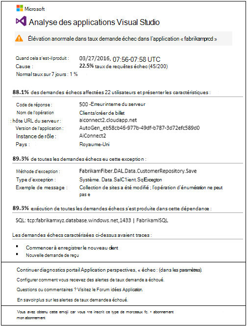
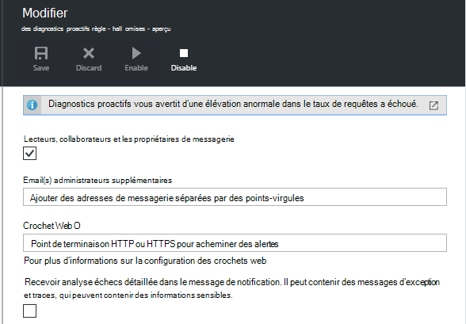

<properties 
    pageTitle="Échec proactive taux Diagnostics dans perspectives Application | Microsoft Azure" 
    description="Vous avertit des modifications inhabituelles dans le taux d’échecs de requêtes dans votre application web et offre une analyse des Diagnostics. Aucune configuration est nécessaire." 
    services="application-insights" 
    documentationCenter=""
    authors="yorac" 
    manager="douge"/>

<tags 
    ms.service="application-insights" 
    ms.workload="tbd" 
    ms.tgt_pltfrm="ibiza" 
    ms.devlang="na" 
    ms.topic="article" 
    ms.date="10/12/2016" 
    ms.author="awills"/>
 
# Échec proactive taux Diagnostics

[Visual Studio Application Insights](app-insights-overview.md) automatiquement vous avertit en temps quasi réel si votre application web rencontre une élévation anormale dans le taux d’échecs. Il détecte une élévation inhabituelle dans le taux de demandes HTTP signalé comme a échoué. Il s’agit généralement ceux avec les codes de réponse dans les plages 400 et 500. Pour vous aider à trier et diagnostiquer le problème, une analyse des caractéristiques des échecs de requêtes et de télémétrie associée est fournie dans la notification. Il existe également des liens vers le portail Application perspectives pour davantage de diagnostic. La fonctionnalité ne doit aucune installation ou configuration, qu’elle utilise des algorithmes d’apprentissage machine pour prévoir la proportion normal.

Cette fonctionnalité est disponible pour les applications web Java et ASP.NET, hébergées dans le nuage ou sur vos propres serveurs. Il fonctionne également pour une application qui génère télémétrie demande : par exemple, si vous avez un rôle de collaborateur appelle [TrackRequest()](app-insights-api-custom-events-metrics.md#track-request). 

Une fois la configuration [d’Analyse des applications pour votre projet](app-insights-overview.md)et fourni votre application génère une certaine quantité minimale de télémétrie, échec Proactive diagnostics prend 24 heures pour découvrir le comportement normal de votre application, avant qu’il est allumé et peut envoyer des alertes.

Voici un échantillon d’alerte. 

> [AZURE.NOTE] Par défaut, vous obtenez un message de mise en forme plus court que cet exemple. Mais vous pouvez [Basculer vers ce format détaillé](#configure-alerts).

Notez qu’il vous indique :

* Le taux de défaillance par rapport au comportement d’application normal.
* Combien d’utilisateurs est affectés – afin de déterminer quel à vous soucier.
* Un modèle caractéristique associé les échecs. Dans cet exemple, il est un code de réponse particulière, le nom de demande (opération) et la version de l’application. Qui indique immédiatement où commencer à rechercher dans votre code. Autres possibilités peuvent être un système d’exploitation navigateur ou d’un client spécifique.
* L’exception, journal traces et Échec de la dépendance (bases de données ou d’autres composants externes) qui s’affichent à associer à la caractérisé a échoué demandes.
* Liens directement aux recherches pertinents sur la télémétrie dans Application perspectives.

## Avantages liés aux alertes proactives

Ordinaire [alertes métriques](app-insights-alerts.md) indiquent peut-être un problème. Mais échec proactive diagnostics commence le travail diagnostic à votre place, en effectuant un grand nombre de l’analyse que c’est dans le cas contraire à effectuer vous-même. Vous obtenez les résultats clairement empaquetés, pour vous aider à accéder rapidement à la racine du problème.

## Mode de fonctionnement

Près moniteurs Diagnostics proactifs en temps réel la télémétrie reçus depuis votre application et notamment le taux de requêtes a échoué. Cette métrique compte le nombre de requêtes pour lesquelles la `Successful request` propriété est fausse. Par défaut, `Successful request== (resultCode < 400)` (sauf si vous avez écrit du code personnalisé pour [un filtrage](app-insights-api-filtering-sampling.md#filtering) ou générer vos propres appels [TrackRequest](app-insights-api-custom-events-metrics.md#track-request) ). 

Performances de votre application contient un modèle typique du comportement. Certaines demandes sera plus aux erreurs à d’autres personnes ; et le taux de défaillance générale peut remonter charge croissante. Échec proactive diagnostics utilise d’apprentissage trouver ces anomalies automatique. 

De télémétrie année à vos applications à partir de votre application web, diagnostics échec proactive compare le comportement actuel avec les modèles constatés au cours des derniers jours. Si une hausse anormale proportion est observé par rapport aux performances précédente, une analyse se déclenche.

Lorsqu’une analyse est déclenchée, le service effectue une analyse cluster sur la requête a échoué, pour tenter d’identifier un motif de valeurs qui caractérisation les échecs. Dans l’exemple ci-dessus, l’analyse a découvert que la plupart des échecs concernent un code de résultat spécifique, nom de la requête, hôte de l’URL du serveur et instance de rôle. En revanche, l’analyse a découvert que la propriété de système d’exploitation client est répartie sur plusieurs valeurs, et donc il n’est pas répertorié.

Lorsque votre service est équipé de ces télémétrie, l’analyseur détecte une exception et un échec de dépendance qui sont associées à des demandes dans le cluster qu'a identifié avec un exemple de n’importe quel associé à ces demandes les journaux de suivi.

L’analyse qui en résulte est envoyé à vous comme alerte, sauf si vous l’avez configuré ne pas le faire.

Comme les [alertes que vous définissez manuellement](app-insights-alerts.md), vous pouvez examiner l’état de l’alerte et configurez-le dans la carte alertes de la ressource de perspectives d’Application. Mais contrairement aux autres alertes, vous n’avez pas besoin configurer ou configurer les diagnostics de panne Proactive. Si vous le souhaitez, vous pouvez désactiver ou modifier son adresse de messagerie cible.

## Configurer des alertes 

Vous pouvez désactiver les diagnostics proactive, modifier les destinataires du message, créer un webhook ou participer à des messages d’alerte plus détaillées.

Ouvrez la page alertes. Diagnostics proactifs est inclus ainsi que toutes les alertes que vous avez défini manuellement, et vous pouvez voir si elle est actuellement dans l’état d’alerte.

Cliquez sur l’alerte afin de configurer celle-ci.

Notez que vous pouvez désactiver Diagnostics proactifs, mais vous ne pouvez pas supprimer (ou en créer une nouvelle).

#### Alertes détaillées

Si vous sélectionnez « Recevoir analyse détaillée » le courrier électronique contient des informations de diagnostic. Parfois, vous pourrez identifier le problème uniquement à partir des données dans le message électronique. 

Il existe un risque que l’alerte plus détaillée peut contenir des informations sensibles, parce qu’il inclut une exception et suivi des messages. Toutefois, il a lieu uniquement si votre code peut permettre à des informations sensibles dans ces messages. 

## Tri et une alerte de diagnostic

Une alerte indique qu’une hausse anormale le taux de requêtes échec a été détectée. Il est probable qu’il existe un problème avec votre application ou son environnement.

À partir du pourcentage de demandes et le nombre d’utilisateurs affectés, vous pouvez choisir comment urgent le problème est. Dans l’exemple ci-dessus, le taux de défaillance de 22.5 % par rapport à celles un taux normal de 1 %, indique que quelque chose se passe. En revanche, 11 utilisateurs ont été affectées. S’il s’agissait de votre application, vous ne pourrez pas évaluer comment graves c'est-à-dire.

Dans de nombreux cas, vous ne pourrez pas diagnostiquer le problème rapidement de nom de la requête, exception, dépendance échec et suivi des données fournies. 

Il existe des autres indices. Par exemple, le taux d’échec de dépendance dans cet exemple est le même que le taux d’exception (89.3 %). Cela signifie que l’exception survient directement à partir de l’échec de dépendance - ce qui vous donne une idée claire des où commencer la recherche dans votre code.

Pour approfondir, les liens de chaque section vous accédez alors directement à une [page de recherche](app-insights-diagnostic-search.md) filtrés aux demandes appropriées, exception, dépendance ou traces. Ou vous pouvez ouvrir le [portail Azure](https://portal.azure.com), accédez à la ressource Application perspectives pour votre application et ouvrez la carte échecs.

Dans cet exemple, en cliquant sur le lien « Afficher les détails des échecs dépendance » s’ouvre Insights Application recherche carte sur l’instruction SQL à l’origine du problème : les valeurs NULL où fournies à champs obligatoires et n’a pas réussi validation pendant l’enregistrement opération.

## Passez en revue les alertes récentes

Pour consulter les alertes dans le portail, ouvrez **paramètres, les journaux d’Audit**.

Cliquez sur une alerte pour afficher tous les détails.

Ou cliquez sur **la détection Proactive** pour accéder directement dans l’alerte plus récente :

## Quelle est la différence...

Échec proactive taux diagnostics complète d’autres similaires, mais distinctes fonctionnalités d’analyse de l’Application. 

* [Métrique alertes](app-insights-alerts.md) sont définies par vous et contrôler un large éventail de mesures tels que processeur initiaux à l’emménagement demande taux, temps de chargement de page et ainsi de suite. Vous pouvez les utiliser pour vous avertir, par exemple, si vous devez ajouter davantage de ressources. En revanche, échec proactive diagnostics couvrant une petite gamme de mesures critiques (actuellement uniquement demande échec taux), conçue pour être averti vous dans près de manière en temps réel une fois que votre application web a échoué demander taux augmente considérablement par rapport au comportement normal de l’application web.

    Échec proactive taux diagnostics ajuste automatiquement son seuil en réponse aux conditions en vigueur.

    Échec proactive taux diagnostics démarrer le Diagnostics de travail pour vous. 
* [Diagnostics des performances proactive](app-insights-proactive-performance-diagnostics.md) utilise également intelligence machine pour découvrir des motifs inhabituels vos mesures et aucune configuration en vous est requise. Mais à la différence des diagnostics de défaillance Proactive de taux, l’objectif de diagnostics proactive des performances consiste à trouver des segments du votre collecteur de l’utilisation qui peut-être être servie mal, par exemple par des pages spécifiques sur un type spécifique de navigateur. L’analyse est effectuée tous les jours, et si un résultat est trouvé, il est susceptible d’être beaucoup moins urgents à une alerte. En revanche, l’analyse des diagnostics échec proactive est exécutée en continu sur télémétrie entrant, et vous serez averti quelques minutes Si taux d’échec serveur sont plus grande que prévu.

## Si vous recevez une alerte Échec Proactive taux diagnostics

*Pourquoi ai reçu cette alerte ?*

*   Nous a détecté une élévation anormale dans fréquence échecs de requêtes par rapport à la référence normale de la période précédente. Après l’analyse des échecs de télémétrie associé, nous penser qu’il existe un problème à prendre en compte dans. 

*La notification signifie que j’ai certainement un problème ?*

*   Nous tenter d’alerte sur interruption d’application ou une dégradation, bien seulement vous pouvez cerner la sémantique et l’impact sur l’application ou les utilisateurs.

*Par conséquent, vous équipe consultez mes données ?*

*   Non. Le service est entièrement automatique. Vous obtenez uniquement les notifications. Vos données sont [privés](app-insights-data-retention-privacy.md).

*Je dois s’abonner à cette alerte ?* 

*   Non. Chaque télémétrie demande envoi application a cette règle d’alerte.

*Puis-je annuler un abonnement ou obtenir des notifications envoyées à la place à Mes collègues ?*

*   Oui, les règles dans l’alerte, cliquez sur la règle Diagnostics proactifs à le faire. Vous pouvez désactiver l’alerte, ou modifier les destinataires de l’alerte. 

*J’ai perdu le message électronique. Où puis-je trouver les notifications dans le portail ?*

*   Dans les journaux d’Audit. Cliquez sur paramètres, les journaux d’Audit, puis sur une alerte pour afficher l’occurrence, mais avec une vue détaillée limitée.

*Certaines des alertes sont des problèmes connus et je ne souhaite pas les recevoir.*

*   Nous avons la suppression des alertes sur notre file d’attente.

## Étapes suivantes

Ces outils de diagnostic vous aident à inspecter la télémétrie provenant de votre application :

* [Explorer métrique](app-insights-metrics-explorer.md)
* [Explorateur de recherche](app-insights-diagnostic-search.md)
* [Analytique - langage de requête puissantes](app-insights-analytics-tour.md)

Détection proactive est entièrement automatiques. Mais peut-être que vous souhaitez utiliser configurer des alertes plus ?

* [Alertes métriques configurées manuellement](app-insights-alerts.md)
* [Disponibilité des tests de site web](app-insights-monitor-web-app-availability.md) 

