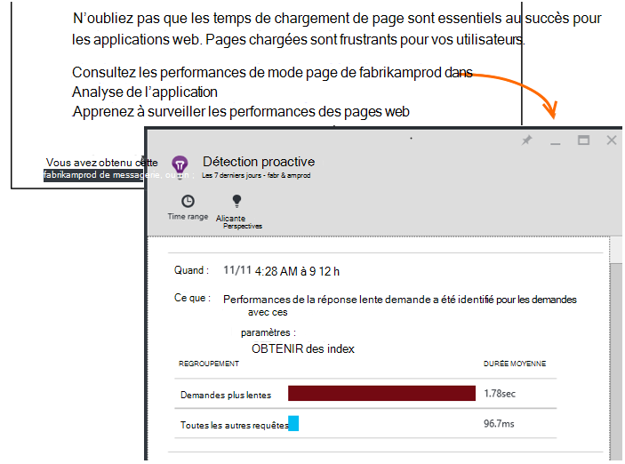

<properties 
    pageTitle="Application Insights : Diagnostics des performances Proactive | Microsoft Azure" 
    description="Application analyse effectue une analyse approfondie de télémétrie de votre application et vous avertit des problèmes potentiels." 
    services="application-insights" 
    documentationCenter="windows"
    authors="antonfrMSFT" 
    manager="douge"/>

<tags 
    ms.service="application-insights" 
    ms.workload="tbd" 
    ms.tgt_pltfrm="ibiza" 
    ms.devlang="na" 
    ms.topic="article" 
    ms.date="08/31/2016" 
    ms.author="awills"/>

#  Diagnostics des performances proactive

*Analyse de l’application est en mode Aperçu.*

[Visual Studio Application Insights](app-insights-overview.md) effectue une analyse approfondie de télémétrie de votre application et peut vous signaler les éventuels problèmes de performances. Vous êtes probablement lire parce que vous avez reçu un de nos alertes proactives par courrier électronique. 

Cette fonctionnalité ne nécessite aucun le programme d’installation et est automatiquement active lorsque votre application génère suffisamment télémétrie.

## Que sont les diagnostics de performances proactive ?

Diagnostics des performances proactive découvre des motifs inhabituels des performances dans votre application, en analysant la télémétrie votre application envoie analyse de l’Application. 

En particulier, il détecte des problèmes de performances qui affectent uniquement certains de vos utilisateurs, ou affecte uniquement les utilisateurs dans certains cas.

Par exemple, il peut vous informer si vos pages application chargent beaucoup plus lentement sur un type de navigateur à d’autres personnes, ou si demandes sont pris en charge plus lentement à partir d’un serveur particulier. Il peut également découvrir problèmes associés à combinaisons des propriétés, telles que le chargement de la page lente dans une zone géographique à des moments de la journée.

Anomalies comme ceux-ci sont très difficiles à détecter simplement en inspectant les données, mais sont plus courantes que vous ne pensez. Souvent qu’ils apparaissent uniquement lorsque vous plaindre vos clients. À ce stade, il est trop tard : les utilisateurs concernés sont déjà passer à vos concurrents !

Pour l’instant, notre algorithmes examiner les temps de chargement de page, les temps de réponse demande au niveau du serveur et les heures de réponse dépendance.  

Vous n’êtes pas obligé de définir des seuils ou configurer des règles. Algorithmes d’exploration de données et l’apprentissage machine servent à détecter des modèles anormales. 

Nous sommes très puissions pour que vos commentaires. N’hésitez pas comment il contribue à vous, comment nous pouvons l’améliorer la détection Proactive et quelles sont les fonctionnalités supplémentaires que vous souhaitez ajouter. Vous pouvez fournir des commentaires à envoyer un sourire/une moue dans le portail ou nous envoyer un e-mail à AppInsightsML@microsoft.com. 

## À propos de l’alerte proactive

* *Pourquoi ai reçu ce message ?*
 * Détection proactive analysées la télémétrie votre application envoyés analyse de l’Application et a détecté un problème de performance dans votre application. 
* *La notification signifie que j’ai certainement un problème ?*
 * Non. Il est simplement une suggestion quelque chose que vous souhaiterez peut-être étudier plus étroitement. 
* *Que dois-je faire ?*
 * [Examiner les données présentées](#responding-to-an-alert). Utilisez métriques Explorer pour examiner les performances au fil du temps et Explorer les niveaux d’aux mesures supplémentaires. Utiliser la recherche pour filtrer des événements spécifiques pour vous aider à identifier la cause. 
* *Par conséquent, vous équipe consultez mes données ?*
 * Non. Le service est entièrement automatique. Vous obtenez uniquement les notifications. Vos données sont [privés](app-insights-data-retention-privacy.md).

## Le processus de détection

* *Quels types d’anomalies de performance ne sont détectées ?*
 * Modèles que vous le feriez trouvez-le beaucoup de temps vérifier pour vous-même. Par exemple, mauvaises performances d’une combinaison spécifique d’emplacement, l’heure du jour et de plateforme.
* *Vous analysez de toutes les données collectées par Application Insights ?*
 * Pas à l’heure actuelle. Pour l’instant, nous analyser une demande de temps de chargement de temps de réponse, l’heure de réponse de dépendance et page. Analyse des statistiques supplémentaires sera bientôt disponible. 
* *Puis-je créer mon propre anomalie de règles de détection ?*
 * Pas encore. Mais vous pouvez :
 * [Définir des alertes](app-insights-alerts.md) qui vous indiquent quand une métrique dépasse un seuil.)
 * [Exportation de télémétrie](app-insights-export-telemetry.md) vers un outil de [base de données](app-insights-code-sample-export-sql-stream-analytics.md) [à PowerBI](app-insights-export-power-bi.md) ou [autres](app-insights-code-sample-export-telemetry-sql-database.md) , où vous pouvez les analyser vous-même.
* *La fréquence à laquelle l’analyse est terminée ?*
 * Nous exécuter l’analyse de tous les jours sous la télémétrie du jour précédent.
* * Donc cela remplace [métriques alertes](app-insights-alerts.md)?
 * Non.  Nous ne valider pour détecter chaque comportement que vous pouvez envisager d’interruption anormale.

## Comment faire pour rechercher les problèmes élevés

Ouvrez le rapport de diagnostic dans le message électronique ou dans la liste anomalies.

* **Lorsque** indique la durée que le problème a été détecté.
* **Quels** décrit
 * Le problème a été détecté ;
 * Les caractéristiques de l’ensemble d’événements trouvés affichent le problème.
* Le tableau compare l’ensemble qui ne fonctionnent avec le comportement moyen de tous les autres événements.

Cliquez sur les liens pour ouvrir métrique Explorer et effectuez une recherche sur les rapports pertinents, filtrés selon l’heure et les propriétés de l’ensemble de performances lente.

Modifier la plage horaire et filtres pour Explorer la télémétrie.

## Comment puis-je améliorer les performances ?

Réponses lentes et échecs sont un du plus frustrant lors des utilisateurs du site web, comme vous le savez à partir de votre propre expérience. Il est donc important corriger les problèmes.

### Tri

Tout d’abord, il est important ? Si une page est toujours lente à charger, mais uniquement 1 % des utilisateurs de votre site présentent jamais à consulter, vous disposez peut-être points importants plus à vous soucier. En revanche, si une seule ouvrez-le 1 % des utilisateurs, mais il lève des exceptions chaque fois, qui peuvent être semblent.

Utiliser la déclaration d’impact dans le message électronique comme un guide général, mais sachez qu’il n’est pas tout. Collecter les autres titres pour confirmer.

Examinez les paramètres du problème. S’il est dépendant de la géographie, configurer [les tests de disponibilité](app-insights-monitor-web-app-availability.md) , y compris cette région : problèmes réseau pourrait simplement être dans cette zone. 

### Diagnostiquer chargement des pages lent 

Où se trouve le problème ? Le serveur n’est lent à répondre, est la page très longues ou le navigateur doit effectuer un grand nombre de travail pour l’afficher ?

Ouvrez la carte métrique de navigateurs. [L’affichage segmenté de temps de chargement de page navigateur](app-insights-javascript.md#explore-your-data) indique où va le temps. 

* **Envoyer la durée de la demande** est élevé, le serveur répond lentement ou la demande est une publication avec un grand nombre de données. Examiner les [performances](app-insights-web-monitor-performance.md#metrics) d’étudier le temps de réponse. 
* Configurer la [dépendance de suivi](app-insights-dependencies.md) pour voir si la lenteur est dû à des services externes ou votre base de données.
* **Réception de réponse** soit prédominance, votre page et ses parties dépendantes - JavaScript, CSS, images et ainsi de suite (mais données chargées de façon asynchrone) sont longues. Préparation d’un [test de disponibilité](app-insights-monitor-web-app-availability.md)et n’oubliez pas de définir l’option charger des parties dépendantes. Lorsque vous obtenez des résultats, ouvrez les détails d’un résultat et développer pour afficher les temps de chargement de fichiers différents.
* Élevé **temps de traitement du Client** suggère des scripts sont exécutées lentement. Si la raison pour laquelle n’est pas évident, vous pouvez ajouter du code minutage et envoyer les heures dans les appels trackMetric.

### Améliorer les pages chargées

Il existe un site web complet des conseils sur l’amélioration de vos réponses du serveur et les temps de chargement de page, afin que nous n’essaient de répéter toutes les ici. Voici quelques conseils qui vous est déjà probablement connaissez, simplement pour vous aider à penser :

* Lente chargement en raison de fichiers volumineux : charger les scripts et autres composants de manière asynchrone. Utiliser le regroupement de script. Pénétrer la page principale widgets qui se chargent leurs données séparément. N’envoyez pas HTML ancien simple pour les grands tableaux : un script permet de demander les données en tant que JSON ou un autre format compact, puis remplissez la table en place. Il existe des structures rédaction pour vous aider à tout cela. (Elles également comportent des scripts volumineux, bien sûr.)
* Ralentir dépendances server : prendre en compte les emplacements géographiques de vos composants. Par exemple, si vous utilisez Azure, vérifiez que le serveur web et la base de données se trouvent dans la même région. Requêtes récupèrent davantage d’informations qu’ils ont besoin ? Est-ce mise en cache ou le traitement par lots aide ?
* Problèmes de capacité : examinez les métriques de serveur de temps de réponse et de demande de compte. Si le temps de réponse pic disproportionnée avec pointes dans les nombres de la demande, il est probable que vos serveurs sont étirées. 

## E-mails de notification

* *Je dois s’abonner à ce service pour recevoir des notifications*
 * Non. Notre robot régulièrement les données provenant de tous les utilisateurs de perspectives Application des enquêtes et envoie des notifications quand il détecte des problèmes.
* *Puis-je annuler un abonnement ou obtenir des notifications envoyées à la place à Mes collègues ?*
 * Cliquez sur le lien Annuler l’abonnement dans l’alerte ou de messagerie. 
 
    Actuellement, celles-ci sont envoyées à ceux qui ont [accès en écriture à la ressource Application perspectives](app-insights-resources-roles-access-control.md).

    Vous pouvez également modifier la liste des destinataires paramètres dans la carte de détection Proactive.
* *Je ne veux être répartis avec ces messages.*
 * Ils sont limitées à une par jour avec le problème plus pertinent que nous n’avons pas signalé sur encore. Vous n’obtiendrez répétitions de tous les messages.
* *Si je ne faites rien, j’ai obtenez un rappel ?*
 * Non, vous obtenez un message sur chaque problème qu’une seule fois. 
* *J’ai perdu le message électronique. Où puis-je trouver les notifications dans le portail ?*
 * Dans la vue d’ensemble de l’analyse des applications de votre application, cliquez sur la vignette de **Détection Proactive** . Il vous pourrez rechercher toutes les notifications à l’arrière-plan des 7 derniers jours.

## Étapes suivantes

Ces outils de diagnostic vous aident à inspecter la télémétrie provenant de votre application :

* [Explorer métrique](app-insights-metrics-explorer.md)
* [Explorateur de recherche](app-insights-diagnostic-search.md)
* [Analytique - langage de requête puissantes](app-insights-analytics-tour.md)

Détection proactive est entièrement automatiques. Mais peut-être que vous souhaitez utiliser configurer des alertes plus ?

* [Alertes métriques configurées manuellement](app-insights-alerts.md)
* [Disponibilité des tests de site web](app-insights-monitor-web-app-availability.md) 

