<properties
    pageTitle="Notes de publication pour Extension Visual Studio pour développeur Analytique"
    description="Les dernières mises à jour pour Visual Studio tools pour développeur Analytique."
    services="application-insights"
    documentationCenter=""
    authors="acearun"
    manager="douge"/>
<tags
    ms.service="application-insights"
    ms.workload="tbd"
    ms.tgt_pltfrm="ibiza"
    ms.devlang="na"
    ms.topic="article"
    ms.date="06/09/2016"
    ms.author="acearun"/>

# Notes de publication pour développeur Analytique outils
Quelles sont les nouveautés : Application Insights et HockeyApp analytique dans Visual Studio.
## Version 7.0
### Visual Studio Application analyse des tendances
Visual Studio Application Insights est un nouvel outil dans Visual Studio que vous pouvez utiliser pour vous aider à analyser le fonctionne de votre application dans le temps. Pour commencer, sur le bouton de barre d’outils **Application Insights** ou dans la fenêtre d’Application Insights recherche, cliquez sur **Explorer les tendances de télémétrie**. Ou, dans le menu **affichage** , cliquez sur **Autres fenêtres**, puis sur **Application analyse des tendances**. Choisissez une des cinq fréquemment utilisées pour commencer. Vous pouvez analyser les différents jeux de données en fonction de types de télémétrie, plages de temps et d’autres propriétés. Pour trouver anomalies dans vos données, choisissez une des options anomalie dans la liste déroulante **Type d’affichage** . Les options de filtrage en bas de la fenêtre facilitent la comprendre sous-groupes de votre télémétrie spécifiques.

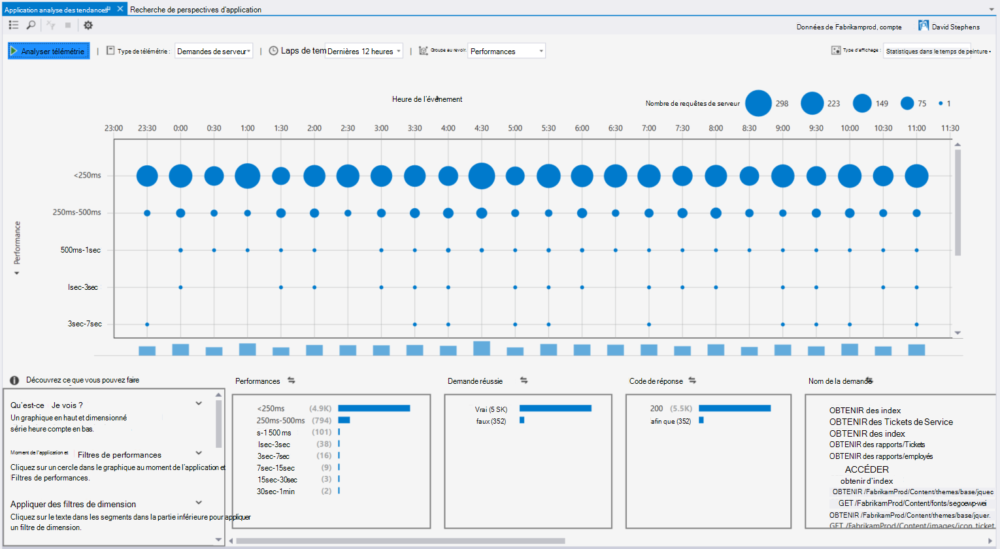

### Exceptions dans CodeLens
Télémétrie exception s’affiche désormais dans CodeLens. Si vous avez connecté votre projet pour le service d’analyse de l’Application, vous verrez le nombre d’exceptions qui se sont produites dans chaque méthode de production dans les dernières 24 heures. À partir de CodeLens, vous pouvez accéder à rechercher ou des tendances pour examiner les exceptions plus en détail.

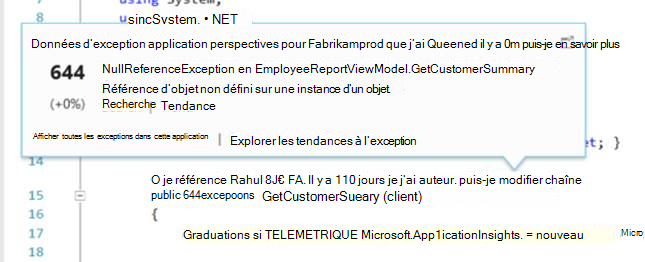

### Support de base ASP.NET
Analyse de l’application prend désormais en charge les projets ASP.NET Core RC2 dans Visual Studio. Vous pouvez ajouter des perspectives Application aux nouveaux projets ASP.NET Core RC2 à partir de la boîte de dialogue **Nouveau projet** , comme dans l’écran suivant. Ou bien, vous pouvez ajouter à un projet existant, droit sur le projet dans l’Explorateur de solutions, puis sur **Ajouter Application Insights télémétrie**.

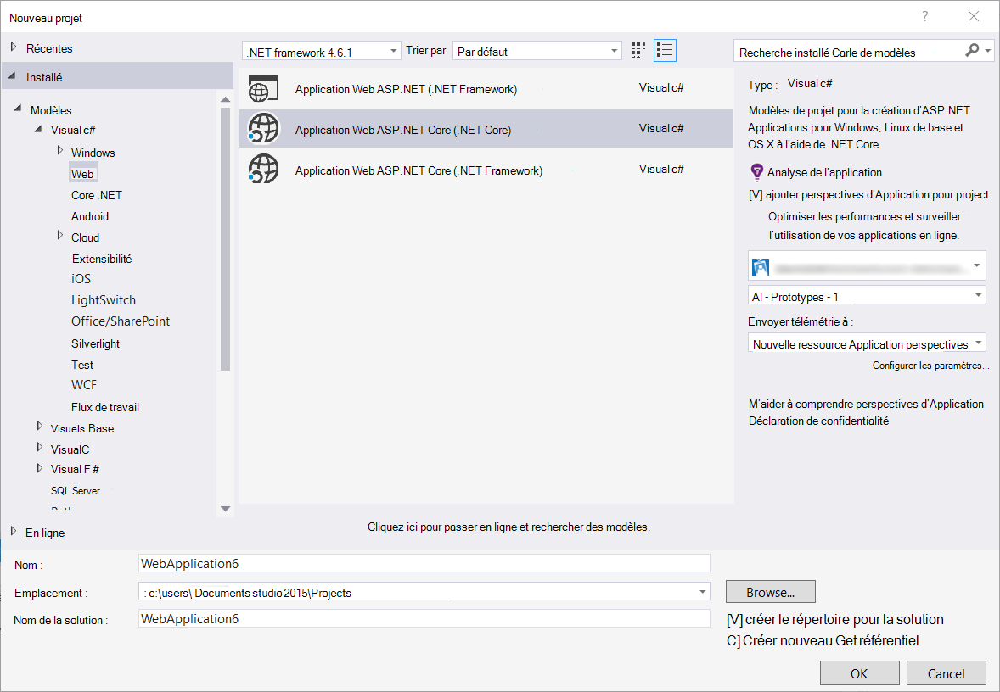

ASP.NET 5 RC1 et projets ASP.NET Core RC2 ont également la prise en charge dans la fenêtre Outils de Diagnostic. Vous verrez événements Application Insights tels que les demandes et les exceptions à partir de votre application ASP.NET pendant le débogage localement sur votre PC. À partir de chaque événement, cliquez sur **Rechercher** pour Explorer les niveaux inférieurs pour plus d’informations.

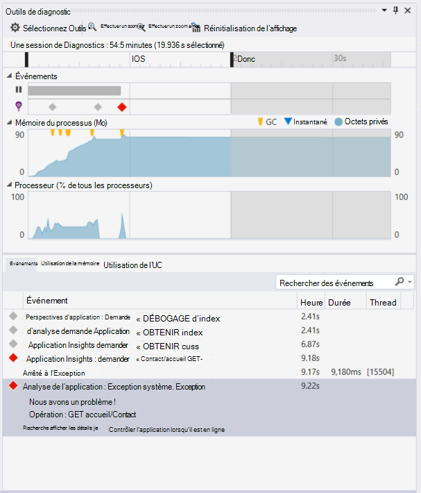

### HockeyApp pour les applications Windows universel
Outre les commentaires d’utilisateur et de distribution bêta, HockeyApp fournit blocage symbolicated création de rapports pour vos applications Windows universel. Nous avons apporté encore plus facile d’ajouter le HockeyApp SDK : avec le bouton droit sur votre projet universel de Windows, puis cliquez sur **L’application Hockey - activer les Analytique se bloquer**. Cela installe le Kit de développement, définit la collection de blocage et dispositions une ressource HockeyApp dans le cloud, tout sans télécharger votre application du service HockeyApp.

D’autres fonctionnalités nouvelles :

* Nous avons apporté l’expérience de recherche de perspectives Application plus rapide et plus intuitive. À présent, plages de temps et des filtres de détail sont appliquées automatiquement lorsque vous les sélectionnez.
* Également dans l’Application Insights recherche, il existe désormais une option pour accéder au code directement à partir de télémétrie de la demande.
* Nous avons apporté des améliorations à l’expérience de connexion HockeyApp.
* Dans outils de Diagnostic, les informations de télémétrie de production pour les exceptions sont affiche.

## Version 5,2.
Nous sommes satisfaits d’annoncer l’introduction de scénarios HockeyApp dans Visual Studio. L’intégration première est la distribution bêta des applications Windows universel et applications Windows Forms dans Visual Studio.

Avec la fonction de distribution bêta, vous téléchargez des versions antérieures de vos applications sur HockeyApp pour la distribution à un sous-ensemble choisi de clients ou testeurs. Fonction de distribution bêta, combinée avec HockeyApp blocage collecte et utilisateur commentaires fonctionnalités, peut vous fournir des informations importantes sur votre application avant de procéder à une publication majeure. Vous pouvez utiliser ces informations pour résoudre les problèmes avec votre application afin que vous pouvez éviter ou réduire les futurs problèmes, tels que les évaluations application faible, évaluations négatives et ainsi de suite.

Extraction combien il est simple de télécharger crée pour la distribution bêta de Visual Studio.
### Applications universel de Windows
Le menu contextuel pour un nœud de projet d’application universel de Windows inclut désormais une option de téléchargement votre version à HockeyApp.

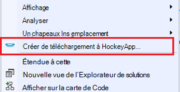

Sélectionnez l’élément et le HockeyApp ouvre la boîte de dialogue téléchargement. Vous avez besoin d’un compte HockeyApp pour télécharger votre version. Si vous êtes un nouvel utilisateur, ne vous inquiétez pas. Création d’un compte est un processus simple.

Lorsque vous êtes connecté, vous verrez le formulaire de téléchargement dans la boîte de dialogue.

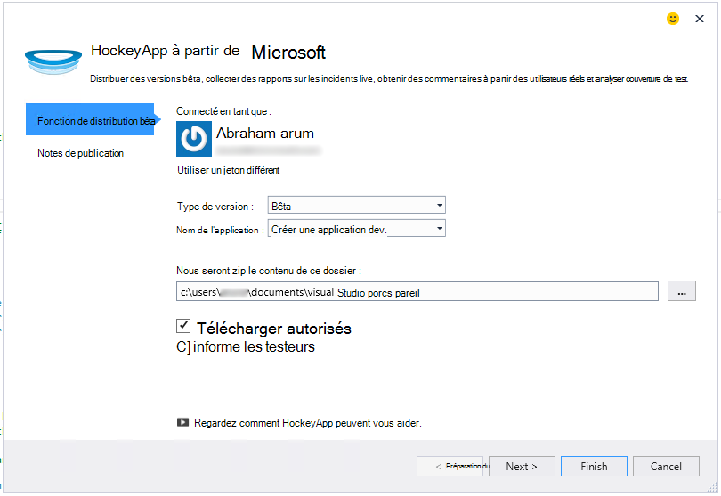

Sélectionnez le contenu à télécharger (fichier .appxbundle ou .aspx), puis choisissez les options de publication dans l’Assistant. Si vous le souhaitez, vous pouvez ajouter des notes de publication sur la page suivante. Cliquez sur **Terminer** pour commencer le téléchargement.

Lorsque le téléchargement est terminé, une notification HockeyApp avec confirmation et un lien vers l’application dans le portail HockeyApp s’affiche.

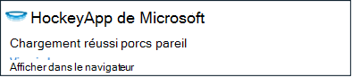

Voilà ! Vous venez de télécharger une version pour une distribution bêta en quelques clics.

Vous pouvez gérer votre application de plusieurs façons dans le portail HockeyApp. Cela inclut les invitant des utilisateurs, afficher les rapports de blocage et les commentaires, modifier les détails et ainsi de suite.

Consultez la [Base de connaissances HockeyApp](http://support.hockeyapp.net/kb/app-management-2) pour plus d’informations sur la gestion de l’application.

### Windows Forms applications
Le menu contextuel pour un nœud de projet de formulaire Windows inclut désormais une option de téléchargement votre version à HockeyApp.

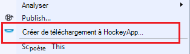

Cette action ouvre la HockeyApp téléchargement boîte de dialogue, qui est similaire à celui d’une application universel de Windows.

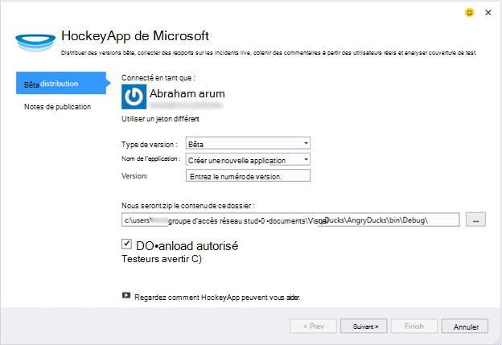

Remarque un nouveau champ dans cet Assistant, permettant de spécifier la version de l’application. Pour les applications universel de Windows, les informations sont remplies à partir du manifeste. Malheureusement, applications Windows Forms, n’ont pas d’équivalent à cette fonctionnalité. Vous devrez les spécifier manuellement.

Le reste du flux est semblable aux applications Windows universel : choisissez Générer et relâchez options, ajouter release notes, télécharger et à gérer dans le portail HockeyApp.

Il est aussi simple que cela. Faire un essai et dites-nous ce que vous pensez.
## Version 4.3
### Télémétrie de recherche à partir de sessions de débogage local
Dans cette version, vous pouvez maintenant rechercher télémétrie Application perspectives généré pendant la session de débogage Visual Studio. Avant, vous pouvez aussi utiliser recherche uniquement si vous avez enregistré votre application avec des aperçus de l’Application. À présent, votre application seulement doit comporter le Kit de développement de perspectives Application installée pour effectuer une recherche de télémétrie local.

Si vous avez une application ASP.NET avec le Kit de développement de perspectives Application, procédez comme suit pour utiliser la recherche.

1. Déboguer votre application.
2. Ouvrir une Application recherche Insights dans une des manières suivantes :
    - Dans le menu **affichage** , cliquez sur **Autres fenêtres**, puis cliquez sur **Recherche de perspectives d’Application**.
    - Cliquez sur le bouton de barre d’outils **d’Analyse de l’Application** .
    - Dans l’Explorateur de solutions, développez **ApplicationInsights.config**, puis cliquez sur **télémétrie de session de débogage de recherche**.
3. Si vous n’avez pas inscrit avec des aperçus de l’Application, la fenêtre de recherche s’ouvre en mode de télémétrie débogage session.
4. Cliquez sur l’icône de **recherche** pour afficher votre télémétrie local.

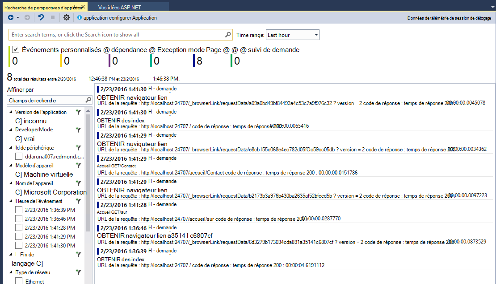

## Version 4.2
Dans cette version, nous avons ajouté des fonctionnalités pour faciliter la recherche de données plus facilement dans le contexte d’événements, avec la fonctionnalité permettant d’accéder au code à partir des événements de données supplémentaires et une expérience sans effort pour envoyer vos données de journalisation analyse de l’Application. Cette extension est mis à jour tous les mois. Si vous avez des demandes de commentaires ou une fonctionnalité, envoyez-le à aidevtools@microsoft.com.
### Cliquez sur aucun enregistrement expérience
Si vous utilisez déjà NLog, log4net ou System.Diagnostics.Tracing, vous n’avez à vous soucier de déplacement toutes vos traces d’analyse de l’Application. Dans cette version, nous avons intégré les cartes de journalisation de l’analyse de l’Application avec l’expérience de configuration normale.
Si vous disposez déjà d’une de ces structures de journalisation configurés, la section suivante décrit comment l’obtenir.
**Si vous avez déjà ajouté perspectives d’Application :**
1. Cliquez sur le nœud de projet et puis cliquez sur **Analyse de l’Application**, puis cliquez sur **Configurer Application perspectives**. Vérifiez que l’option pour ajouter la carte appropriée dans la fenêtre de configuration.
2. Par ailleurs, lorsque vous créez la solution, notez la fenêtre contextuelle qui s’affiche dans le coin supérieur droit de votre écran, cliquez sur **configurer**.

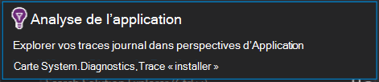

Lorsque vous avez la carte de journalisation installée, exécutez l’application et vérifiez que vous consultez les données dans l’onglet Outils de diagnostic, comme suit :

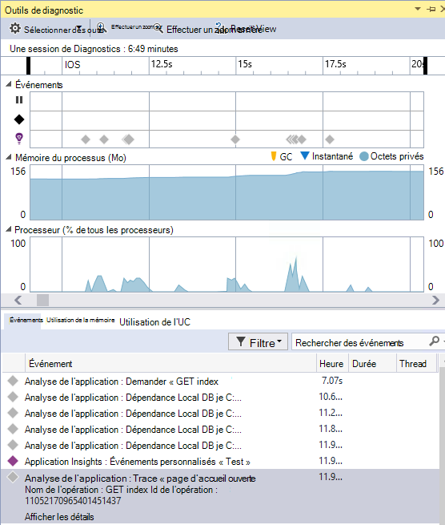

### Atteindre ou rechercher le code de l’endroit où la propriété d’événement télémétrie est émise
Avec la nouvelle version utilisateur peut cliquer sur n’importe quelle valeur de l’événement en détail et il recherche une chaîne correspondante dans la solution ouverte en cours. Les résultats seront affichent dans Visual Studio « Résultats de la recherche » liste comme indiqué ci-dessous :

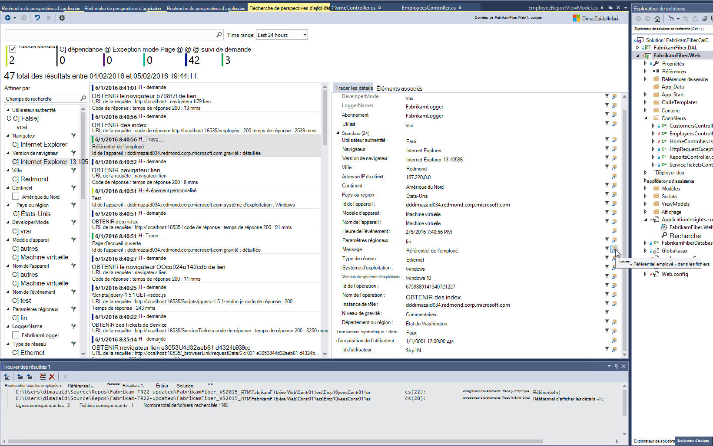

### Nouvelle fenêtre de recherche pour lorsque vous n’êtes pas connecté
Nous avons amélioré l’apparence de la fenêtre de recherche de perspectives d’Application pour vous aider à rechercher vos données pendant que votre application est en production.

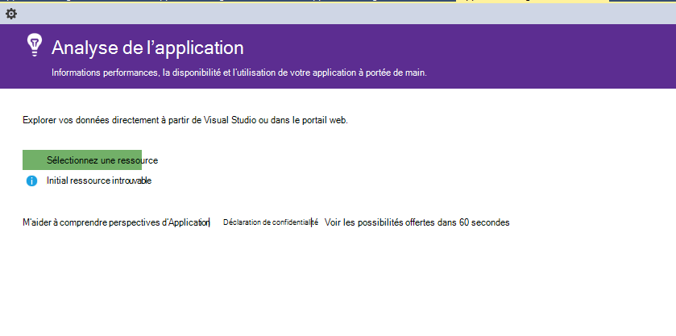

### Voir tous les événements de télémétrie associés à l’événement
Nous avons ajouté un nouvel onglet, avec des requêtes prédéfinies pour toutes les données relatives à l’événement de télémétrie que l’utilisateur est affiché, en regard de l’onglet de détails de l’événement. Par exemple, une demande de comporte un champ appelé **ID de l’opération**. Tous les événements liés à cette demande a la même valeur pour **l’ID de l’opération**. Si une exception se produit pendant l’opération de traitement de la demande, l’exception reçoit le même ID opération que la demande pour faciliter la recherche. Si vous cherchez à la demande, cliquez sur **tous les télémétrie pour cette opération** pour ouvrir un nouvel onglet affichant les nouveaux résultats de recherche.

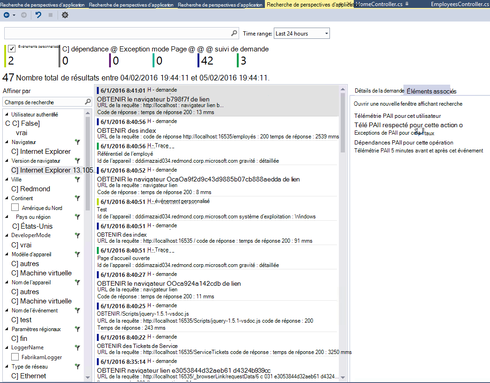

### Précédent et l’historique de recherche
Vous pouvez désormais accéder en arrière entre les résultats de la recherche.

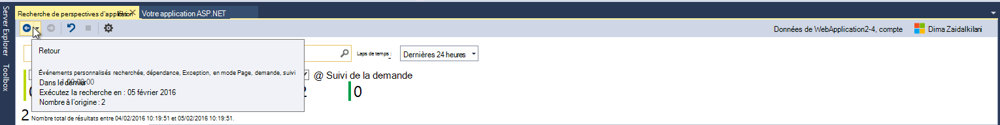

## Version 4.1
Cette version est fourni avec un nombre de nouvelles fonctionnalités et les mises à jour. Vous devez avoir installé pour installer cette version de mise à jour 1.

### Passer d’une exception à la méthode dans le code source
À présent, si vous affichez des exceptions à partir de votre application de production dans la fenêtre de recherche de perspectives d’Application, vous pouvez accéder à la méthode dans votre code où l’exception se produit. Vous devez uniquement au projet correct chargé et analyse de l’Application prend en charge le reste ! (Pour en savoir plus sur la fenêtre de recherche de perspectives d’Application, voir les notes de publication pour Version 4.0 dans les sections suivantes.)

Comment cela fonctionne-t-il ? Vous pouvez utiliser les Applications Insights recherche même si une solution n’est pas ouverte. La zone de traçage pile affiche un message d’informations, et la plupart des éléments dans la trace de pile ne sont pas disponibles.

Si les informations du fichier sont disponibles, certains éléments peuvent être des liens, mais l’élément d’informations solution est toujours visibles.

Si vous cliquez sur le lien hypertexte, vous devez accéder à l’emplacement de la méthode sélectionnée dans votre code. Il peut y avoir une différence dans le numéro de version, mais la fonctionnalité, d’accéder à la version correcte du code, est transférés dans les versions ultérieures.

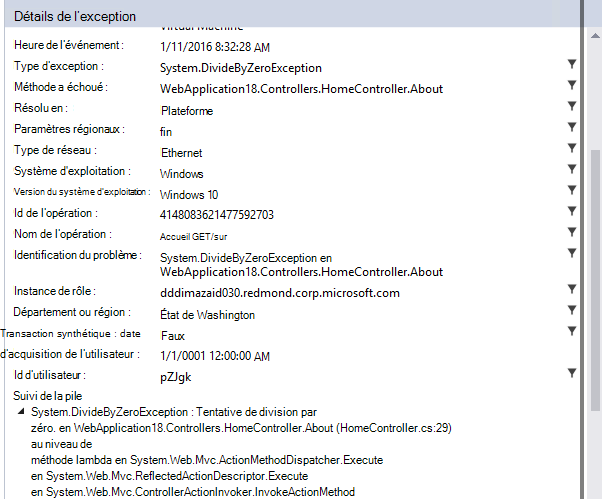

### Expérience de nouveaux points d’entrée pour la recherche dans l’Explorateur
Vous pouvez désormais accéder recherche via l’Explorateur de solutions.

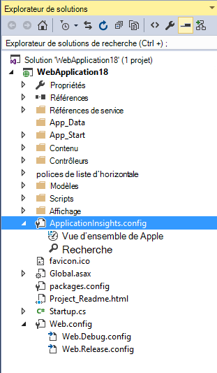

### Affiche une notification lorsque publiez terminée
Une boîte de dialogue s’affiche lorsque le projet est publié en ligne, afin que vous puissiez afficher vos données d’analyse de l’Application en production.

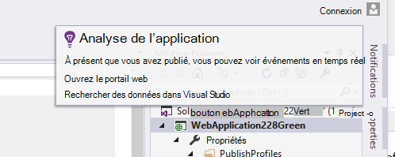

## Version 4.0

### Rechercher des données d’analyse de l’Application à partir de dans Visual Studio
Comme la fonction recherche dans l’analyse de l’Application portail, à présent dans Visual Studio, vous pouvez filtrer et de recherche sur les types d’événements, les valeurs de propriété et du texte, puis d’examiner les événements individuels.

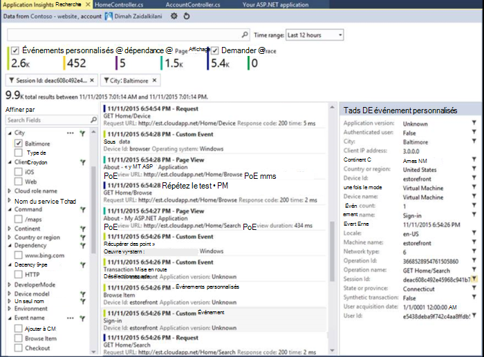

### Afficher des données en provenance de votre ordinateur local dans outils de Diagnostic

Vous pouvez afficher votre télémétrie, en plus des autres données débogage, dans la page Outils de Diagnostic Visual Studio. Uniquement ASP.NET 4.5 est pris en charge.

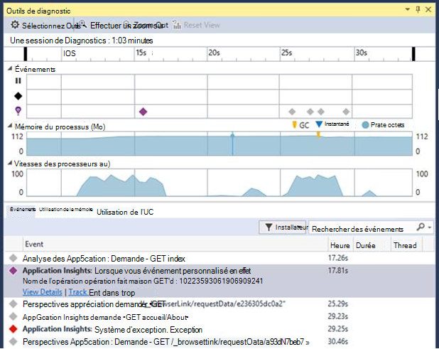

### Ajouter le Kit de développement à votre projet sans se connecter à Azure

Vous n’avez plus à se connecter à Azure pour ajouter des packages d’Application perspectives à votre projet, via la boîte de dialogue **Nouveau projet** ou dans le menu contextuel de projet. Si vous vous connectez, le Kit de développement est installé et configuré pour l’envoi de télémétrie au portail comme avant. Si vous ne vous connectez, le Kit de développement est ajouté à votre projet et génèrent télémétrie pour le diagnostic concentrateur. Vous pouvez le configurer ultérieurement si vous voulez.

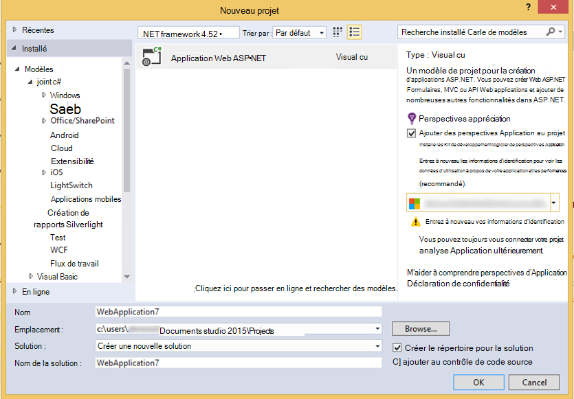

### Prise en charge

En *Connect() ;* 2015, nous avons [annoncé](https://azure.microsoft.com/blog/deep-diagnostics-for-web-apps-with-application-insights/) que notre expérience de développement mobile pour les appareils est HockeyApp. HockeyApp vous permet de distribuer des versions bêta pour les testeurs, collecter et analyser tous les incidents depuis votre application et recueillir les commentaires directement à partir de vos clients.
HockeyApp prend en charge votre application sur n’importe quel plate-forme vous choisissez de créer, que ce soit iOS, Android ou Windows ou une solution de disponibilité sur plusieurs plateformes comme Xamarin, Cordova ou unité.

À l’avenir les versions de l’extension Application perspectives, nous allons présenter une expérience plus intégrée entre HockeyApp et Visual Studio. Pour l’instant, vous pouvez commencer avec HockeyApp en ajoutant simplement la référence NuGet. Consultez la [documentation](http://support.hockeyapp.net/kb/client-integration-windows-and-windows-phone) pour plus d’informations.
