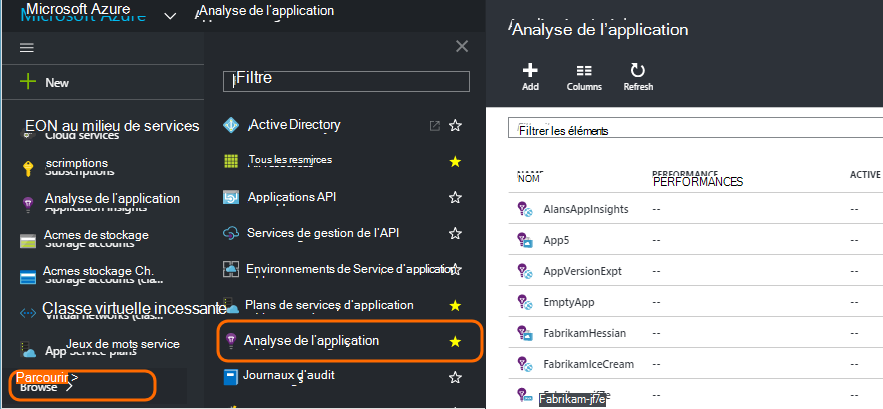
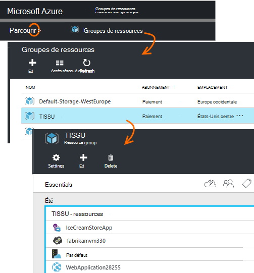
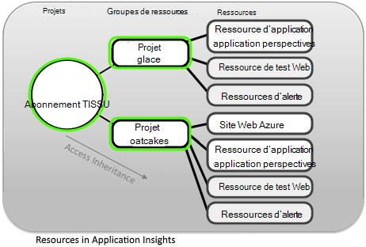
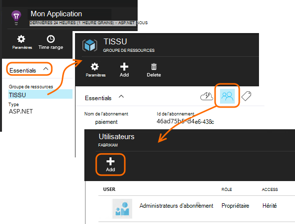
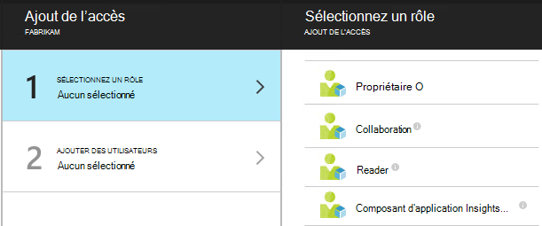
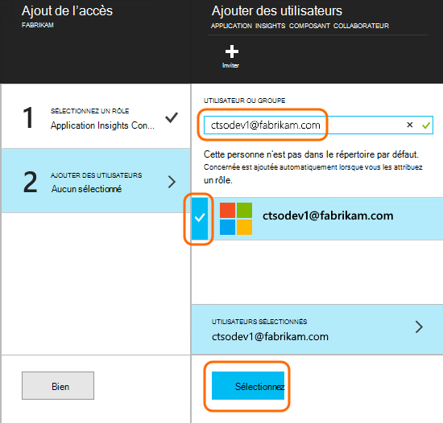

<properties
    pageTitle="Contrôle d’accès dans l’Application perspectives, les rôles et les ressources"
    description="Propriétaires, les collaborateurs et les lecteurs d’analyse de votre organisation."
    services="application-insights"
    documentationCenter=""
    authors="alancameronwills"
    manager="douge"/>

<tags
    ms.service="application-insights"
    ms.workload="tbd"
    ms.tgt_pltfrm="ibiza"
    ms.devlang="na"
    ms.topic="article"
    ms.date="05/07/2016"
    ms.author="awills"/>

# Contrôle d’accès dans l’Application perspectives, les rôles et les ressources

Vous pouvez contrôler qui a lu et mettre à jour de l’accès à vos données dans Visual Studio [Application Insights][start], à l’aide de [contrôle d’accès basé sur un rôle dans Microsoft Azure](../active-directory/role-based-access-control-configure.md).

> [AZURE.IMPORTANT] Attribuer l’accès à des utilisateurs dans **groupe de ressources ou d’abonnement** auquel appartient la ressource d’application - pas dans la ressource proprement dite. Attribuer le rôle de **collaborateur de composant d’Application perspectives** . De cette façon uniform contrôle d’accès aux tests de site web et les alertes ainsi que des ressources de votre application. [En savoir plus](#access).

## Ressources, des groupes et des abonnements

Tout d’abord, quelques définitions :

* **Ressource** - une instance d’un service Microsoft Azure. La ressource de perspectives Application collecte, analyse et affiche les données de télémétrie envoyées à partir de votre application.  Autres types de ressources Azure incluent des applications web, les bases de données et les machines virtuelles.

    Pour afficher toutes les ressources, accédez au [Portail Azure][portal], connectez-vous, puis cliquez sur Parcourir.

    

* [**Groupe de ressources** ] [ group] -chaque ressource appartient à un groupe. Un groupe est un moyen pratique pour gérer les ressources connexes, en particulier pour contrôler l’accès. Par exemple, dans un groupe de ressources, vous pouvez placer une application Web, une ressource d’analyse des applications à surveiller l’application et une ressource de stockage pour conserver les données exportées.

    

* [**Abonnement**](https://manage.windowsazure.com) - utiliser Application Insights ou autres ressources Azure, vous êtes connecté à un abonnement Azure. Chaque groupe de ressources appartient à un abonnement Azure, dans laquelle vous choisissez votre package prix et, s’il s’agit d’un abonnement entreprise, sélectionnez les membres et les autorisations d’accès.
* [**Compte Microsoft** ] [ account] -le nom d’utilisateur et mot de passe que vous utilisez pour vous connecter à Microsoft Azure abonnements, XBox Live, Outlook.com et d’autres services Microsoft.

## Contrôler l’accès dans le groupe de ressources

Il est important de comprendre qu’en plus de la ressource que vous avez créé pour votre application, il existe également des ressources masquées distinctes pour les alertes et les tests de site web. Ils sont associés au même [groupe de ressources](#resource-group) que votre application. Vous pouvez également placer d’autres services Azure à cet emplacement, tels que des sites Web ou de stockage.

Pour contrôler l’accès à ces ressources, qu'il est donc recommandé :

* Contrôler l’accès au niveau du **groupe de ressources ou d’abonnement** .
* Affecter le rôle de **collaborateur composant d’Application Insights** aux utilisateurs. Cela lui permet de modifier les tests de site web, des alertes et des ressources de l’Application perspectives, sans permettre d’y accéder à d’autres services dans le groupe.

## Pour fournir un accès à un autre utilisateur

Vous devez disposer de droits de propriétaire pour l’abonnement ou le groupe de ressources.

L’utilisateur doit avoir un [Compte Microsoft][account], ou accéder à leur [Compte Microsoft Professionnel](..\active-directory\sign-up-organization.md). Vous pouvez donner accès aux personnes et aux groupes d’utilisateurs définis dans Azure Active Directory.

#### Accédez au groupe de ressources

Ajouter l’utilisateur.

Ou vous pouvez aller plus loin et ajouter l’utilisateur à l’abonnement.

#### Sélectionnez un rôle

Rôle | Dans le groupe de ressources
---|---
Propriétaire | Aucune information, y compris l’accès utilisateur modifiables
Collaboration | Aucune information, y compris toutes les ressources modifiables
Collaboration de perspectives composant d’application | Modifier les ressources Application perspectives, les tests de site web et les alertes
Reader | Peuvent afficher mais ne modifie en rien

« L’Édition » inclut la création, suppression et la mise à jour :

* Ressources
* Tests de site Web
* Alertes
* Exporter en continu

#### Sélectionnez l’utilisateur

Si l’utilisateur souhaité ne figure pas dans l’annuaire, vous pouvez inviter toute personne disposant d’un compte Microsoft.
(Si elles utilisent des services, tels que Outlook.com, OneDrive, Windows Phone ou XBox Live, elles ont un compte Microsoft.)

## Utilisateurs et les rôles

* [Contrôle d’accès dans Azure basé sur un rôle](../active-directory/role-based-access-control-configure.md)

<!--Link references-->

[account]: https://account.microsoft.com
[group]: ../resource-group-overview.md
[portal]: https://portal.azure.com/
[start]: app-insights-overview.md
