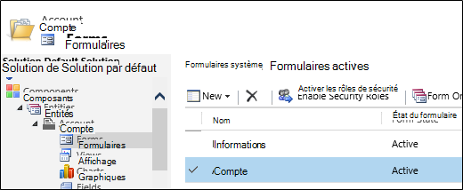

<properties 
    pageTitle="Procédure pas à pas : Surveiller Microsoft Dynamics CRM avec des aperçus d’Application" 
    description="Obtenez télémétrie de Microsoft Dynamics CRM Online à l’aide d’analyse de l’Application. Procédure pas à pas de l’installation, l’obtention de données, de visualisation et d’exportation." 
    services="application-insights" 
    documentationCenter=""
    authors="mazharmicrosoft" 
    manager="douge"/>

<tags 
    ms.service="application-insights" 
    ms.workload="tbd" 
    ms.tgt_pltfrm="ibiza" 
    ms.devlang="na" 
    ms.topic="article" 
    ms.date="11/17/2015" 
    ms.author="awills"/>
 
# Procédure pas à pas : Activation de télémétrie pour Microsoft Dynamics CRM Online à l’aide de perspectives d’Application

Cet article vous explique comment obtenir des données de télémétrie depuis [Microsoft Dynamics CRM Online](https://www.dynamics.com/) à l’aide de [Visual Studio Application perspectives](https://azure.microsoft.com/services/application-insights/). Nous allons le processus complet de l’ajout de script d’analyse des applications à votre application, capturer des données et visualisation des données.

>[AZURE.NOTE] [Parcourir la solution de l’échantillon](https://dynamicsandappinsights.codeplex.com/).

## Ajouter des perspectives d’Application à existante ou nouvelle instance CRM Online 

Pour analyser votre application, vous ajoutez une Application Insights SDK à votre application. Le Kit de développement envoie télémétrie au [portail d’analyse de l’Application](https://portal.azure.com), où vous pouvez utiliser notre puissantes analyses et outils de diagnostic ou exporter les données vers le stockage.

### Création d’une ressource d’Application Insights dans Azure

1. Obtenir [un compte dans Microsoft Azure](http://azure.com/pricing). 
2. Se connecter au [portail Azure](https://portal.azure.com) et ajouter une nouvelle ressource Application perspectives. Il s’agit de l’endroit où vos données seront traitées et affichées.

    

    Sélectionnez ASP.NET en tant que le type d’application.

3. Ouvrez l’onglet Quick Start et ouvrez le script de code.

    

**Laissez la page de codes ouverte** pendant que vous effectuez la prochaine étape dans une autre fenêtre de navigateur. Vous devez le code plus rapidement. 

### Créer une ressource web JavaScript dans Microsoft Dynamics CRM

1. Ouvrez votre instance CRM Online et connectez-vous en tant qu’administrateur.
2. Ouvrir Microsoft Dynamics CRM paramètres, les personnalisations, personnalisez le système

    
    
    

    

3. Créez une ressource JavaScript.

    

    Attribuez un nom, sélectionnez **Script (JScript)** et ouvrez l’éditeur de texte.

    
    
4. Copiez le code d’analyse de l’Application. Lors de la copie veillez à ignorer les balises de script. Désigner en dessous de capture d’écran :

    

    Le code inclut la clé d’instrumentation qui identifie votre ressource perspectives d’Application.

5. Enregistrer et publier.

    

### Formulaires instrument

1. Dans Microsoft CRM Online, ouvrez le formulaire compte

    

2. Ouvrez le formulaire de propriétés

    

3. Ajouter la ressource web JavaScript que vous avez créé

    

    

4. Enregistrez et publiez vos personnalisations de formulaire.

## Métrique capturé

Vous avez maintenant configuré la capture de télémétrie pour le formulaire. Chaque fois qu’elle est utilisée, données recevrez votre ressource Application perspectives.

Voici quelques exemples des données que vous voyez.

#### Santé des applications

Exceptions de navigateur :

Cliquez sur le graphique pour obtenir plus en détail :

#### Utilisation

#### Navigateurs

#### GÉOLOCALISATION

#### Afficher la demande de page à l’intérieur

## Exemples de code

[Recherchez l’exemple de code](https://dynamicsandappinsights.codeplex.com/).

## Power BI

Vous pouvez effectuer une analyse plus approfondie même si vous [exportez les données à Microsoft Power BI](app-insights-export-power-bi.md).

## Solution d’exemple Microsoft Dynamics CRM

[Voici l’exemple de solution implémentée dans Microsoft Dynamics CRM] (https://dynamicsandappinsights.codeplex.com/).

## Pour en savoir plus

* [Quelles sont les perspectives d’Application ?](app-insights-overview.md)
* [Application perspectives pour les pages web](app-insights-javascript.md)
* [Autres exemples et des procédures pas à pas](app-insights-code-samples.md)

 
