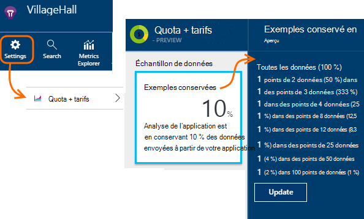

<properties 
    pageTitle="Échantillonnages de télémétrie dans perspectives Application | Microsoft Azure" 
    description="Comment conserver le volume de télémétrie sous contrôle." 
    services="application-insights" 
    documentationCenter="windows"
    authors="vgorbenko" 
    manager="douge"/>

<tags 
    ms.service="application-insights" 
    ms.workload="tbd" 
    ms.tgt_pltfrm="ibiza" 
    ms.devlang="na" 
    ms.topic="article" 
    ms.date="08/30/2016" 
    ms.author="awills"/>

#  <a name="sampling-in-application-insights"></a>Sondage dans perspectives d’Application

*Analyse de l’application est en mode Aperçu.*


L’échantillonnage est qu'une fonctionnalité [d’Analyse des applications Visual Studio](app-insights-overview.md) est recommandée pour réduire le trafic de télémétrie et stockage tout en conservant une analyse statistique correcte des données d’application. Le filtre sélectionne les éléments liés afin que vous pouvez naviguer entre les éléments lorsque vous effectuez des diagnostics investigations.
Lorsque métrique nombre vous est présentés dans le portail, ils sont renormalisés pour tenir compte de l’échantillonnage, pour réduire aucun effet sur les statistiques.

Échantillonnage réduit le trafic, vous permet de maintenir dans les quotas de données mensuel et vous permet d’éviter la limitation.

## <a name="in-brief"></a>En bref :

* Échantillonnages conservant 1 dans les enregistrements *n* et ignore le reste. Par exemple, il peut conserver des événements de 1/5, un taux d’échantillonnage de 20 %. 
* Échantillonnages s’effectue automatiquement si votre application envoie un grand nombre de télémétrie, dans les applications de serveur web ASP.NET.
* Vous pouvez également définir d’échantillonnage manuellement, dans le portail de la page tarification ; ou, dans le Kit de développement ASP.NET dans le fichier .config, également réduire le trafic réseau.
* Si vous ouvrez une session événements personnalisés et que vous voulez vous assurer qu’un ensemble d’événements est conservé ou ignoré ensemble, assurez-vous qu’ils ont la même valeur OperationId.
* Le diviseur échantillonnages *n* est signalé dans chaque enregistrement dans la propriété `itemCount`, qui recherche apparaît sous le nom convivial « demande count » ou « nombre d’événements ». Lorsque échantillonnages ne sont pas en marche, `itemCount==1`.
* Si vous écrivez requêtes Analytique, vous devez [tenir compte des échantillonnages](app-insights-analytics-tour.md#counting-sampled-data). En particulier, au lieu de simplement comptage des enregistrements, vous devez utiliser `summarize sum(itemCount)`.


## <a name="types-of-sampling"></a>Types d’échantillonnage


Il existe trois méthodes de remplacement d’échantillonnage :

* **D’échantillonnage adapté** ajuste automatiquement le volume de télémétrie envoyé à partir du Kit de développement dans votre application ASP.NET. Par défaut à partir du Kit de développement logiciel v 2.0.0-beta3. Actuellement disponible pour télémétrie côté serveur ASP.NET uniquement. 
* **Taux fixe échantillonnages** permet de réduire le volume de télémétrie envoyé à partir de votre serveur ASP.NET et de navigateurs de vos utilisateurs. Vous définissez la vitesse. Le client et serveur synchronisera les échantillonnages afin que, la recherche en, vous pouvez naviguer entre les affichages de page connexes et les demandes.
* **Échantillonnages réception** permet de réduire le volume de télémétrie conservée par le service d’analyse de l’Application, à un taux que vous avez défini. Il ne réduire le trafic de télémétrie, mais vous permet de conserver au sein de votre quota mensuel. 

Si deux ou fixe échantillonnages taux fonctionnent, échantillonnage de réception est désactivé.

## <a name="ingestion-sampling"></a>Échantillonnages de réception

Ce formulaire d’échantillonnage fonctionne à l’endroit où la télémétrie à partir de votre serveur web, les navigateurs et les appareils atteint le point de terminaison du service Application perspectives. Bien qu’il ne réduire le trafic de télémétrie envoyé à partir de votre application, il Réduisez la quantité traitées et conservées (et facturées) par Application perspectives.

Utilisez ce type d’échantillonnage si votre application accède souvent dépassement du quota mensuel et que vous n’avez la possibilité d’utiliser un des types d’échantillonnage basée sur le Kit de développement logiciel. 

Définir la fréquence d’échantillonnage dans les Quotas et les prix carte :



Comme les autres types d’échantillonnage, l’algorithme conserve les éléments de télémétrie connexes. Par exemple, lorsque vous êtes inspectant la télémétrie de recherche, vous pourrez trouver la demande liée à une exception particulière. Métrique compte tels que des taux de demande et taux d’exception sont conservés correctement.

Points de données qui sont ignorées par échantillonnage ne sont pas disponibles dans n’importe quel fonctionnalité analyse des applications comme [Exporter continue](app-insights-export-telemetry.md).

Échantillonnages de réception ne fonctionnent pendant basée sur le Kit de développement logiciel adaptive taux fixe d’échantillonnage ou opération. Si le taux d’échantillonnage en le Kit de développement est inférieur à 100 %, le taux d’échantillonnage de réception que vous avez défini est ignoré.

> [AZURE.WARNING] La valeur indiquée sur la vignette indique la valeur que vous avez défini d’échantillonnage de réception. Il ne représente le taux d’échantillonnage réel si échantillonnages SDK sont opérationnel.


## <a name="adaptive-sampling-at-your-web-server"></a>D’échantillonnage adapté à votre serveur web

D’échantillonnage adapté est disponible pour le Kit de développement du perspectives d’Application pour ASP.NET v 2.0.0-beta3 et versions ultérieures et est activée par défaut. 


D’échantillonnage adapté affecte le volume de télémétrie envoyé à partir de votre application de serveur web pour le service d’analyse de l’Application. Le volume est réglé automatiquement pour conserver au sein d’un taux du trafic maximal spécifié.

Il ne fonctionne de faibles volumes de télémétrie, pour une application dans le débogage ou un site Web avec faible utilisation ne seront pas affecté.

Pour obtenir le volume cible, certaines de la télémétrie générée sont ignorées. Mais comme les autres types d’échantillonnage, l’algorithme conserve les éléments de télémétrie connexes. Par exemple, lorsque vous êtes inspectant la télémétrie de recherche, vous pourrez trouver la demande liée à une exception particulière. 

Métrique compte tels que des taux de demande et taux d’exception sont ajustées pour compense la fréquence d’échantillonnage, afin qu’ils affichent environ les valeurs correctes dans l’Explorateur de métrique.

**Mettre à jour NuGet de votre projet** packages vers la dernière version *préliminaire* d’analyse de l’Application : droit sur le projet dans l’Explorateur, sélectionnez Manage NuGet Packages, cochez **inclure la version préliminaire** et effectuez une recherche Microsoft.ApplicationInsights.Web. 

Dans [ApplicationInsights.config](app-insights-configuration-with-applicationinsights-config.md), vous pouvez ajuster plusieurs paramètres dans le `AdaptiveSamplingTelemetryProcessor` nœud. Les chiffres indiqués sont les valeurs par défaut :

* `<MaxTelemetryItemsPerSecond>5</MaxTelemetryItemsPerSecond>`

    Taux cible qui a pour but l’algorithme adaptatif pour **sur chaque hôte du serveur**. Si votre application web s’exécute sur plusieurs hôtes, réduisez cette valeur afin de rester au sein de votre taux cible du trafic sur le portail d’analyse de l’Application.

* `<EvaluationInterval>00:00:15</EvaluationInterval>` 

    L’intervalle auquel le taux de télémétrie est évalué de nouveau. Évaluation porte sur une courbe de moyenne mobile. Vous souhaiterez peut-être raccourcir cet intervalle si votre télémétrie est soumis à la rupture de lancer une.

* `<SamplingPercentageDecreaseTimeout>00:02:00</SamplingPercentageDecreaseTimeout>`

    Lors de l’échantillonnage pourcentage la valeur change, combien de temps après avoir nous autorisées afin de réduire le pourcentage d’échantillonnage à nouveau pour capturer moins de données.

* `<SamplingPercentageIncreaseTimeout>00:15:00</SamplingPercentageIncreaseTimeout>`

    Lors de l’échantillonnage pourcentage la valeur change, combien de temps après avoir nous autorisés à augmenter le pourcentage d’échantillonnage à nouveau pour capturer davantage de données.

* `<MinSamplingPercentage>0.1</MinSamplingPercentage>`

    Comme échantillonnage pourcentage varie, quelle est la valeur minimale que nous sommes autorisés à définir.

* `<MaxSamplingPercentage>100.0</MaxSamplingPercentage>`

    Comme échantillonnage pourcentage varie, quelle est la valeur maximale que nous sommes autorisés à définir.

* `<MovingAverageRatio>0.25</MovingAverageRatio>` 

    Dans le calcul de la moyenne mobile, l’épaisseur affecté à la valeur la plus récente. Utilisez une valeur de 1 inférieur ou égale à. Plus petites valeurs forcer l’algorithme de modifications grâce reactive lancer une.

* `<InitialSamplingPercentage>100</InitialSamplingPercentage>`

    La valeur affectée lorsque vient de démarrer l’application. Ne réduisez ce pendant que vous êtes débogage. 

### <a name="alternative-configure-adaptive-sampling-in-code"></a>À la place : configurer d’échantillonnage adapté dans le code

Au lieu d’échantillonnage dans le fichier .config, vous pouvez utiliser le code. Cela permet de spécifier une fonction de rappel qui est appelée chaque fois que le taux d’échantillonnage est évalué nouveau. Vous pouvez utiliser, par exemple, pour déterminer quel est le taux d’échantillonnage est utilisé.

Supprimer la `AdaptiveSamplingTelemetryProcessor` nœud à partir du fichier .config.


*C#*

```C#

    using Microsoft.ApplicationInsights;
    using Microsoft.ApplicationInsights.Extensibility;
    using Microsoft.ApplicationInsights.WindowsServer.Channel.Implementation;
    using Microsoft.ApplicationInsights.WindowsServer.TelemetryChannel;
    ...

    var adaptiveSamplingSettings = new SamplingPercentageEstimatorSettings();

    // Optional: here you can adjust the settings from their defaults.

    var builder = TelemetryConfiguration.Active.TelemetryProcessorChainBuilder;
    
    builder.UseAdaptiveSampling(
         adaptiveSamplingSettings,

        // Callback on rate re-evaluation:
        (double afterSamplingTelemetryItemRatePerSecond,
         double currentSamplingPercentage,
         double newSamplingPercentage,
         bool isSamplingPercentageChanged,
         SamplingPercentageEstimatorSettings s
        ) =>
        {
          if (isSamplingPercentageChanged)
          {
             // Report the sampling rate.
             telemetryClient.TrackMetric("samplingPercentage", newSamplingPercentage);
          }
      });

    // If you have other telemetry processors:
    builder.Use((next) => new AnotherProcessor(next));

    builder.Build();

```

([En savoir plus sur les processeurs de télémétrie](app-insights-api-filtering-sampling.md#filtering).)


<a name="other-web-pages"></a>
## <a name="sampling-for-web-pages-with-javascript"></a>Échantillonnages pour les pages web avec JavaScript

Vous pouvez configurer les pages web d’échantillonnage de taux fixe à partir de n’importe quel serveur. 

Lorsque vous [Configurez les pages web pour avoir un aperçu Application](app-insights-javascript.md), modifier l’extrait de code que vous obtenez à partir du portail d’analyse de l’Application. (Dans les applications ASP.NET, l’extrait de code généralement se trouvent dans _Layout.cshtml.)  Insérer une ligne comme `samplingPercentage: 10,` avant la touche instrumentation :

    <script>
    var appInsights= ... 
    }({ 


    // Value must be 100/N where N is an integer.
    // Valid examples: 50, 25, 20, 10, 5, 1, 0.1, ...
    samplingPercentage: 10, 

    instrumentationKey:...
    }); 
    
    window.appInsights=appInsights; 
    appInsights.trackPageView(); 
    </script> 

Pour le pourcentage d’échantillonnage, choisissez un pourcentage est près de 100/N où N est un nombre entier.  Échantillonnage actuellement ne prend pas en charge d’autres valeurs.

Si vous activez également échantillonnages taux fixe au niveau du serveur, les clients et server synchronisera afin que, la recherche en, vous pouvez naviguer entre les affichages de page connexes et les demandes.


## <a name="fixed-rate-sampling-for-aspnet-web-sites"></a>Taux fixe échantillonnages pour les sites web ASP.NET

Taux fixe échantillonnages réduisant le trafic envoyé à partir de votre serveur web et les navigateurs web. À la différence d’échantillonnage adapté, il réduit télémétrie à taux fixe décidé par vous. Il également synchronise les client et échantillonnages serveur afin que les éléments associés sont conservés - par exemple, afin que si vous examinez un mode page de recherche, vous pouvez trouver sa demande associée.

L’algorithme d’échantillonnage conserve les éléments associés. Pour chaque demande HTTP événement, elle et ses événements associés sont ignorées ou transmises. 

Dans l’Explorateur de mesures, taux telles que les nombres de demande et exception sont multipliés par un facteur de la fréquence d’échantillonnage, afin qu’ils soient approximativement correctes.

1. **Mises à jour de votre projet NuGet** vers la dernière version *préliminaire* d’analyse de l’Application. Droit sur le projet dans l’Explorateur, choisissez Manage NuGet Packages, cochez **inclure la version préliminaire** et effectuez une recherche Microsoft.ApplicationInsights.Web. 

2. **Désactiver d’échantillonnage adapté**: dans [ApplicationInsights.config](app-insights-configuration-with-applicationinsights-config.md), supprimez ou commentez la `AdaptiveSamplingTelemetryProcessor` nœud.

    ```xml

    <TelemetryProcessors>
    <!-- Disabled adaptive sampling:
      <Add Type="Microsoft.ApplicationInsights.WindowsServer.TelemetryChannel.AdaptiveSamplingTelemetryProcessor, Microsoft.AI.ServerTelemetryChannel">
        <MaxTelemetryItemsPerSecond>5</MaxTelemetryItemsPerSecond>
      </Add>
    -->
    

    ```

2. **Activer le module d’échantillonnage de taux fixe.** Ajoutez cet extrait de code à [ApplicationInsights.config](app-insights-configuration-with-applicationinsights-config.md):

    ```XML

    <TelemetryProcessors>
     <Add  Type="Microsoft.ApplicationInsights.WindowsServer.TelemetryChannel.SamplingTelemetryProcessor, Microsoft.AI.ServerTelemetryChannel">

      <!-- Set a percentage close to 100/N where N is an integer. -->
     <!-- E.g. 50 (=100/2), 33.33 (=100/3), 25 (=100/4), 20, 1 (=100/100), 0.1 (=100/1000) -->
      <SamplingPercentage>10</SamplingPercentage>
      </Add>
    </TelemetryProcessors>

    ```

> [AZURE.NOTE] Pour le pourcentage d’échantillonnage, choisissez un pourcentage est près de 100/N où N est un nombre entier.  Échantillonnage actuellement ne prend pas en charge d’autres valeurs.


### <a name="alternative-enable-fixed-rate-sampling-in-your-server-code"></a>À la place : activer échantillonnages taux fixe dans le code de votre serveur


Au lieu de paramètre d’échantillonnage dans le fichier .config, vous pouvez utiliser le code. 

*C#*

```C#

    using Microsoft.ApplicationInsights.Extensibility;
    using Microsoft.ApplicationInsights.WindowsServer.TelemetryChannel;
    ...

    var builder = TelemetryConfiguration.Active.GetTelemetryProcessorChainBuilder();
    builder.UseSampling(10.0); // percentage

    // If you have other telemetry processors:
    builder.Use((next) => new AnotherProcessor(next));

    builder.Build();

```

([En savoir plus sur les processeurs de télémétrie](app-insights-api-filtering-sampling.md#filtering).)


## <a name="when-to-use-sampling"></a>Quand utiliser échantillonnages ?

D’échantillonnage adapté est activée automatiquement si vous utilisez la 2.0.0-beta3 version ASP.NET SDK ou version ultérieure. Quelle que soit la version SDK vous utilisez, vous pouvez utiliser d’échantillonnage de réception (auprès de notre serveur).

Vous n’avez pas besoin d’échantillonnage pour la plupart des applications de petites et moyennes. Les informations de diagnostic plus utiles et les plus précis statistiques sont obtenus par collecte des données dans les activités de l’utilisateur. 

 
Les principaux avantages d’échantillonnage sont :

* Application Insights service projections (« limitations ») des points de données lorsque votre application envoie un taux très haut de télémétrie en bref intervalle. 
* À garder à l’intérieur du [quota](app-insights-pricing.md) de points de données pour votre niveau de tarification. 
* Réduire le trafic réseau de la collection de télémétrie. 

### <a name="which-type-of-sampling-should-i-use"></a>Quel type d’échantillonnage dois-je utiliser ?


**Utilisez l’acquisition échantillonnage si :**

* Vous passez souvent via votre quota mensuel de télémétrie.
* Vous utilisez une version du Kit de développement qui ne prennent en charge d’échantillonnage - par exemple, le Kit de développement logiciel Java ou les versions d’ASP.NET antérieures à 2.
* Vous recevez un grand nombre de télémétrie émanant de navigateurs web de vos utilisateurs.

**Utiliser taux fixe d’échantillonnage si :**

* Vous utilisez le Kit de développement Application perspectives pour la version de services web ASP.NET 2.0.0 ou version ultérieure, et
* Vous voulez échantillonnage synchronisés entre client et serveur, afin que lorsque vous êtes recherches sur les événements de [recherche](app-insights-diagnostic-search.md), vous pouvez naviguer entre autres événements associés sur le client et le serveur, tels que des affichages de page et les demandes http.
* Vous êtes sûr du pourcentage d’échantillonnage approprié pour votre application. Il doit être suffisamment élevé pour obtenir des mesures précises, mais au-dessous du taux qui dépasse votre quota de tarification et les limites de limitation. 


**Utilisez d’échantillonnage adapté :**

Dans le cas contraire, nous vous recommandons d’échantillonnage adapté. Cette option est activée par défaut dans le serveur ASP.NET SDK, version 2.0.0-beta3 ou version ultérieure. Il ne réduire le trafic jusqu'à un certain taux minimal, afin qu’il n’affecte pas un site peu utilisé.


## <a name="how-do-i-know-whether-sampling-is-in-operation"></a>Comment savoir si échantillonnages se trouve dans l’opération ?

Pour découvrir la fréquence d’échantillonnage réelle quel que soit l’endroit où il a été appliqué, utilisez une [requête Analytique](app-insights-analytics.md) telles que :

    requests | where timestamp > ago(1d)
  	| summarize 100/avg(itemCount) by bin(timestamp, 1h) 
  	| render areachart 

Dans chacune conservées enregistrement, `itemCount` indique le nombre d’enregistrements d’origine qu’elle représente, égale à 1 + le nombre d’enregistrements ignorés précédents. 


## <a name="how-does-sampling-work"></a>Comment fonctionnent les échantillonnages ?

Taux fixe et échantillonnage adapté sont une fonctionnalité du Kit de développement dans les versions ASP.NET à partir de là 2.0.0. Échantillonnages de réception sont une fonctionnalité du service Application perspectives et peuvent être dans opération si le Kit de développement ne fonctionne pas d’échantillonnage. 

L’algorithme d’échantillonnage décide les éléments de télémétrie à déplacer et celles que vous voulez conserver (qu’il s’agisse dans le Kit de développement ou dans le service d’analyse de l’Application). La décision d’échantillonnage est basée sur plusieurs règles qui visent à conserver tous les points de données reliées intact, maintenir une expérience de diagnostic dans perspectives Application exploitables et fiable même avec un ensemble réduit de données. Par exemple, si pour une demande d’échec votre application envoie des éléments de télémétrie supplémentaire (par exemple, exception et traces connectés à partir de cette demande), échantillonnages ne fractionnement pas cette demande et autres télémétrie. Elle conserve ou supprime les ensemble. Par conséquent, lorsque vous examinez les détails de la demande dans l’Application perspectives, vous pouvez toujours voir la demande ainsi que ses éléments de télémétrie associé. 

Pour les applications qui définissent « utilisateurs » (autrement dit, des applications web plus typiques), la décision d’échantillonnage est basée sur le hachage de l’id utilisateur, ce qui signifie que tous les télémétrie pour un utilisateur particulier est conservé ou rejeté. Pour les types d’applications qui ne définissent les utilisateurs (par exemple, les services web), la décision d’échantillonnage est basée sur l’id d’opération de la demande. Enfin, pour les éléments de télémétrie ayant ni id utilisateur ni opération définie (par exemple articles de télémétrie déclarés à partir de threads asynchrones sans contexte http) échantillonnages capture simplement un pourcentage d’éléments de télémétrie de chaque type. 

Lorsque vous présentez télémétrie avec vous, le service d’Application Insights ajuste les métriques par le pourcentage d’échantillonnage même ayant servi au moment de la collection de sites, des points de données manquants. Par conséquent, lorsque vous examinez la télémétrie dans Application perspectives, les utilisateurs voient approximations statistique correctes qui sont très près les nombres réels.

La précision de la rapprochement dépend le pourcentage d’échantillonnage configuré. En outre, la précision augmente pour les applications qui gèrent un grand nombre de requêtes généralement similaires à partir d’un nombre important d’utilisateurs. En revanche, pour les applications qui ne fonctionnent pas avec une charge significative, échantillonnages ne sont pas nécessaire que ces applications peuvent envoyer généralement tous leur télémétrie tout en restant dans le quota, sans provoquer de perte de données à partir de la limitation. 

Notez qu’Application Insights ne pas exemple de types de télémétrie mesures et les Sessions, depuis pour ces types de réduction de la précision peut être très indésirable. 

### <a name="adaptive-sampling"></a>D’échantillonnage adapté

D’échantillonnage adapté ajoute un composant qui surveille le taux de transmission à partir du Kit de développement et s’adapte le pourcentage d’échantillonnage pour essayer de rester au sein de la vitesse maximale de cible. L’ajustement est recalculée à intervalles réguliers et est basé sur une moyenne de la vitesse de transmission sortants.

## <a name="sampling-and-the-javascript-sdk"></a>Échantillonnage et le Kit de développement JavaScript

Le côté client (JavaScript) SDK participe à taux fixe échantillonnages conjointement avec le Kit de développement côté serveur. Les pages instrumentés enverront de télémétrie côté client aux utilisateurs mêmes dont le côté serveur apportées sa décision à « échantillon dans ». Cette logique est conçue pour maintenir l’intégrité de session utilisateur sur côtés client et serveur. Par conséquent, à partir de n’importe quel élément de télémétrie particulier dans l’Application perspectives, vous pouvez trouver tous les autres éléments de télémétrie pour cet utilisateur ou de la session. 

*Mon client et côté serveur télémétrie ne pas afficher les exemples coordonnés comme vous décrivez ci-dessus.*

* Vérifiez que vous avez activé échantillonnages taux fixe à la fois sur le serveur et le client.
* Vérifiez que la version SDK est 2.0 ou une version ultérieure.
* Vérifiez que vous définissez le pourcentage d’échantillonnage même dans le client et le serveur.


## <a name="frequently-asked-questions"></a>Forum aux Questions 

*Pourquoi n’est pas d’échantillonnage un simple « collecter X pourcentage de chaque type de télémétrie » ?*

 *  Tandis que cette approche échantillonnages peuvent fournir une précision de très haute dans approximations métriques, entraînerait la rupture de capacité à faire correspondre les données par utilisateur, session et demande, ce qui est essentiel pour les diagnostics de diagnostic. Par conséquent, un échantillonnage fonctionne mieux avec « collecter tous les éléments de télémétrie de X % des utilisateurs de l’application », ou « collecter tous les télémétrie de X % des demandes d’application » logique. Pour les éléments de télémétrie non associés avec les requêtes (par exemple, traitement asynchrone en arrière-plan), l’automne revenir consiste à « collecter X pourcentage de tous les éléments pour chaque type de télémétrie. » 

*Le pourcentage d’échantillonnage peut modifier le temps ?*

 * Oui, d’échantillonnage adapté graduellement le pourcentage d’échantillonnage, basé sur le volume de la télémétrie rencontrés jusqu'à présent.

 

*Si j’utilise échantillonnages taux fixe, comment puis-je savoir que lesquelles échantillonnages pourcentage fonctionnent le mieux pour mon application ?*

* Une des façons d’échantillonnage tout d’abord adapté, découvrez ce qui règle de taux (voir la question ci-dessus) et puis passez à taux fixe échantillonnage à l’aide de ce taux. 

    Dans le cas contraire, vous devez deviner. Analyser votre utilisation actuelle de télémétrie dans AI, observez la limitation qui se produit et estimer le volume de la télémétrie collecté. Ces trois entrées, ainsi que votre niveau de tarification sélectionné, suggérant combien vous souhaiterez peut-être réduire le volume de la télémétrie collecté. Toutefois, le nombre de vos utilisateurs augmente ou certaines autres MAJ dans le volume de télémétrie peut invalider votre estimation.

*Que se passe-t-il si je configure pourcentage d’échantillonnage trop bas ?*

* Pourcentage d’échantillonnage trop faible (échantillonnage over-aggressive) réduit la précision du rapprochement lorsque l’Application Insights succès de compense perte la visualisation des données pour la réduction de volume de données. En outre, expérience des diagnostics peut-être être réduite, comme des requêtes rarement défectueux ou lentes peuvent prélever arrière.

*Que se passe-t-il si je configure pourcentage d’échantillonnage trop élevée ?*

* Configuration de pourcentage d’échantillonnage trop élevés (pas agressif suffisamment) se traduit par une réduction du volume de la télémétrie collecté insuffisante. Vous pouvez toujours rencontrer perte de données de télémétrie lié à la limitation, et le coût d’utilisation d’analyse de l’Application peut être supérieur à vous planifiée en raison de limites d’âge frais.

*Sur les plateformes puis-je utiliser échantillonnages ?*

* Échantillonnages réception peuvent se produire automatiquement pour n’importe quel télémétrie au-dessus d’un certain volume, si le Kit de développement ne fonctionne pas d’échantillonnage. Cette méthode fonctionne, par exemple, si votre application utilise un serveur Java, ou si vous utilisez une version antérieure du Kit de développement ASP.NET.

* Si vous utilisez des versions de ASP.NET SDK 2.0.0 et ci-dessus (hébergé dans Azure ou sur votre propre serveur), vous obtenez adaptive d’échantillonnage par défaut, mais vous pouvez basculer à taux fixe comme décrit ci-dessus. Avec l’échantillonnage taux fixe, le navigateur SDK se synchronise automatiquement sur exemple événements liés. 

*Il existe certains événements rares que je veux toujours voir. Comment puis-je obtenir les au-delà du module d’échantillonnage ?*

 * Initialisation d’une instance distincte de TelemetryClient avec une nouveau TelemetryConfiguration (pas par défaut actif). Utiliser pour envoyer vos événements rares.


## <a name="next-steps"></a>Étapes suivantes

* [Filtrage](app-insights-api-filtering-sampling.md) pouvez fournir davantage de contrôle strict de ce que votre SDK envoie.
