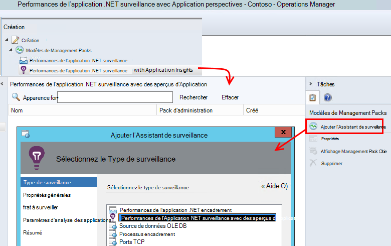
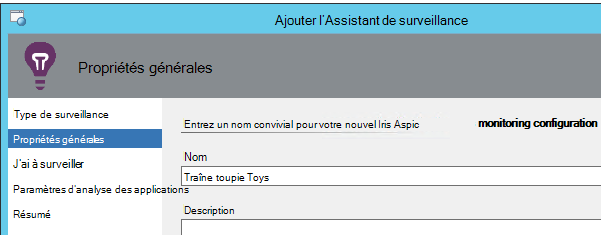
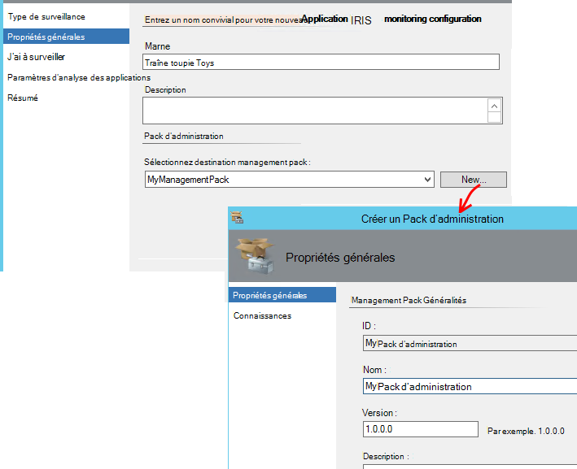
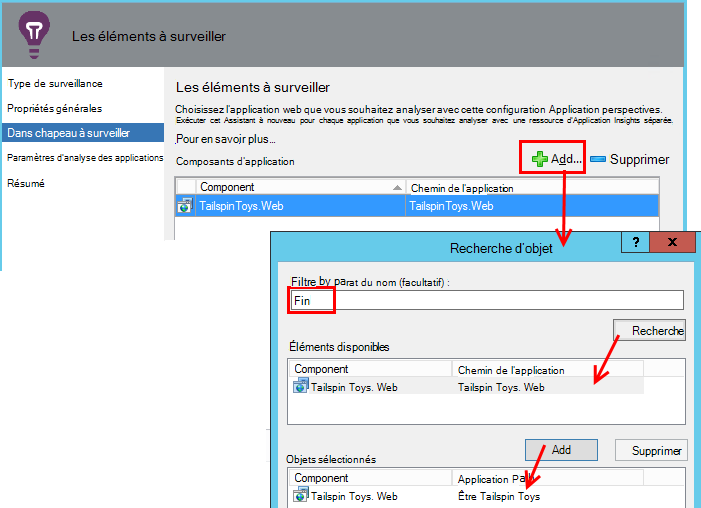
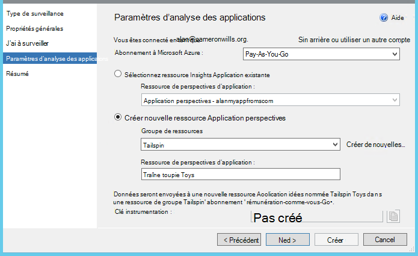
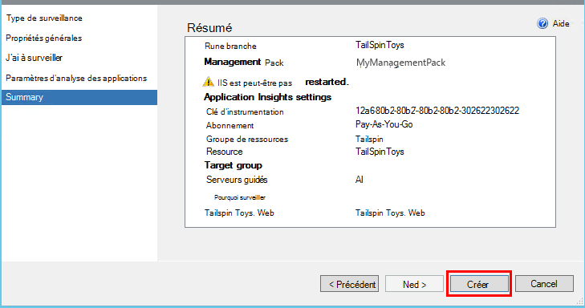
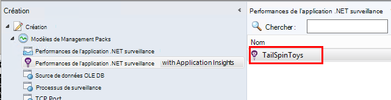
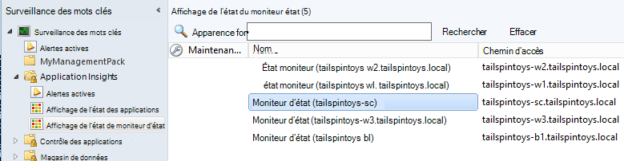

<properties 
    pageTitle="Intégration de SCOM avec des aperçus Application | Microsoft Azure" 
    description="Si vous êtes un utilisateur SCOM, surveiller les performances et diagnostiquer les problèmes avec des aperçus de l’Application. Tableaux de bord complète, alertes actives, puissants outils de diagnostic et des requêtes d’analyse." 
    services="application-insights" 
    documentationCenter=""
    authors="alancameronwills" 
    manager="douge"/>

<tags 
    ms.service="application-insights" 
    ms.workload="tbd" 
    ms.tgt_pltfrm="ibiza" 
    ms.devlang="na" 
    ms.topic="article" 
    ms.date="08/12/2016" 
    ms.author="awills"/>
 
# Analyse des performances application à l’aide d’Application perspectives pour SCOM

Si vous utilisez System Center Operations Manager (SCOM) pour gérer vos serveurs, vous pouvez surveiller les performances et diagnostiquer les problèmes de performance à l’aide de [Visual Studio Application perspectives](app-insights-asp-net.md). Application Insights surveille demandes entrantes de votre application web, sortant reste et les appels SQL, les exceptions et les traces journal. Celui-ci propose des tableaux de bord avec graphiques métriques et alertes actives, ainsi que recherche diagnostic puissant requêtes analytiques sur cette télémétrie. 

Vous pouvez basculer sur l’analyse des perspectives d’Application à l’aide d’un pack de gestion SCOM.

## Avant de commencer

Nous part du principe :

* Vous avez l’habitude de SCOM et que vous utilisez SCOM 2012 R2 ou 2016 à gérer votre IIS des serveurs web.
* Vous avez déjà installé sur vos serveurs d’une application web que vous souhaitez surveiller avec des aperçus de l’Application.
* Application framework version est .NET 4.5 ou version ultérieure.
* Vous avez accès à un abonnement dans [Microsoft Azure](https://azure.com) et que vous pouvez vous connecter au [portail Azure](https://portal.azure.com). Votre organisation peut avoir un abonnement et pouvez ajouter votre compte Microsoft lui.

(L’équipe de développement peut créer le [Kit de développement de perspectives Application](app-insights-asp-net.md) dans l’application web. Cette instrumentation création leur donne une plus grande flexibilité lors de l’écriture de télémétrie personnalisé. Toutefois, il n’a pas d’importance : vous pouvez suivre les étapes décrites ici avec ou sans le Kit de développement intégré.)

## (Une fois) Installer Insights Application management pack

Sur l’ordinateur où vous exécutez Operations Manager :

2. Désinstallez les versions anciennes du management pack :
 1. Dans Operations Manager, ouvrez l’Administration, Packs d’administration. 
 2. Supprimer l’ancienne version.
1. Téléchargez et installez le pack d’administration à partir du catalogue.
2. Redémarrez Operations Manager.

## Créer un pack d’administration

1. Dans Operations Manager, ouvrez **Création**, **.NET... avec des aperçus de l’Application**, **Assistant Ajout de contrôle**, puis sélectionnez à nouveau **.NET... avec des aperçus de l’Application**.

    

2. Nom de la configuration après votre application. (Vous devez d’instrumentation d’une application à la fois).
    
    

3. Dans la même page de l’Assistant, créer un nouveau pack d’administration, ou sélectionnez un module d’analyse de l’Application que vous avez créée.

     (L' Application Insights [pack d’administration](https://technet.microsoft.com/library/cc974491.aspx) est un modèle à partir de laquelle vous créez une instance. Vous pouvez réutiliser la même instance ultérieurement.)

    

4. Choisissez une application que vous souhaitez analyser. La fonctionnalité de recherche recherche parmi les applications installées sur vos serveurs.

    

    Le champ étendue surveillance facultatif peut être utilisé pour spécifier un sous-ensemble de vos serveurs, si vous ne voulez pas surveiller l’application dans tous les serveurs.

5. Dans la page suivante de l’Assistant, vous devez tout d’abord fournir vos informations d’identification pour vous connecter à Microsoft Azure.

    Dans cette page, vous choisissez la ressource Application Insights lequel les données de télémétrie à être analysé et affiché. 

 * Si l’application a été configurée pour avoir un aperçu Application pendant le développement, sélectionnez son ressource existante.
 * Sinon, créez une nouvelle ressource appelée pour l’application. S’il existe d’autres applications qui sont des composants du même système, placez-les dans le même groupe de ressources, pour faciliter l’accès à la télémétrie gérer.

    Vous pouvez modifier ces paramètres ultérieurement.

    

6. Exécuter l’Assistant.

    
    
Répétez cette procédure pour chaque application que vous souhaitez analyser.

Si vous avez besoin de modifier les paramètres ultérieurement, ouvrez à nouveau les propriétés de l’écran à partir de la fenêtre de création.

## Vérifier la surveillance

Le moniteur que vous avez installé recherches pour votre application sur tous les serveurs. Où il détecte que l’application, il configure Application moniteur d’état perspectives pour surveiller l’application. Si nécessaire, elle commence par installer moniteur d’état sur le serveur.

Vous pouvez vérifier les instances de l’application qui a ont été trouvés :

## Affichage télémétrie dans perspectives d’Application

Dans le [portail Azure](https://portal.azure.com), accédez à la ressource pour votre application. Vous [consultez graphiques montrant télémétrie](app-insights-dashboards.md) depuis votre application. (S’il n’a pas établi vers le haut dans la page principale encore, cliquez sur flux métriques).

## Étapes suivantes

* [Configurer un tableau de bord](app-insights-dashboards.md) permettent de rassembler les graphiques les plus importantes surveillance cela et autres applications.
* [En savoir plus sur les indicateurs](app-insights-metrics-explorer.md)
* [Configurer des alertes](app-insights-alerts.md)
* [Diagnostiquer les problèmes de performances](app-insights-detect-triage-diagnose.md)
* [Requêtes Analytique puissantes](app-insights-analytics.md)
* [Disponibilité des tests de site web](app-insights-monitor-web-app-availability.md)
