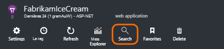
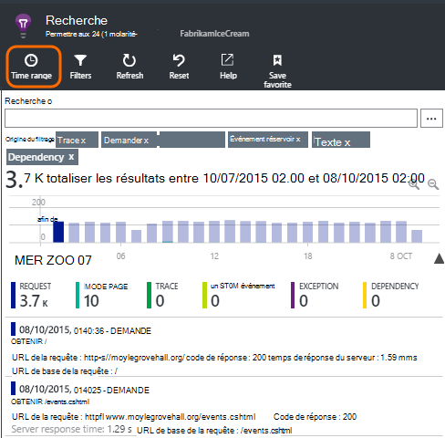
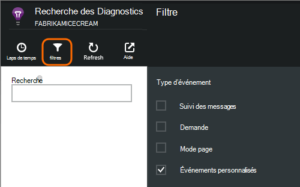
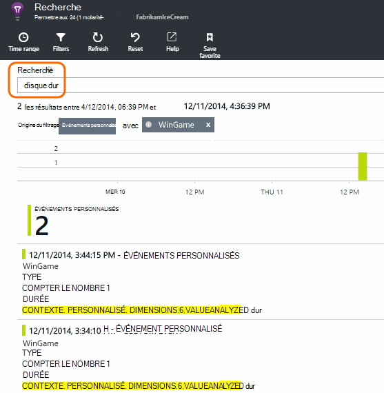
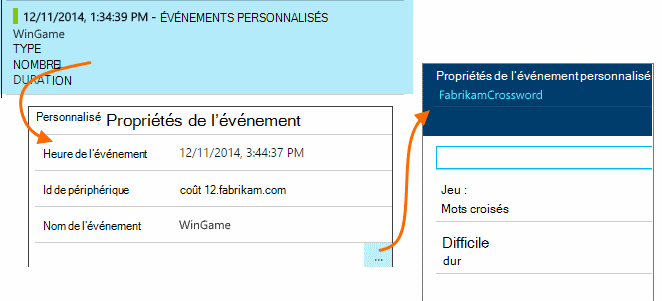
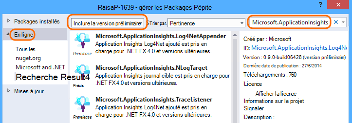
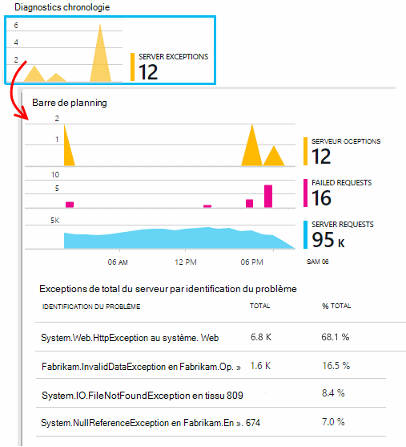
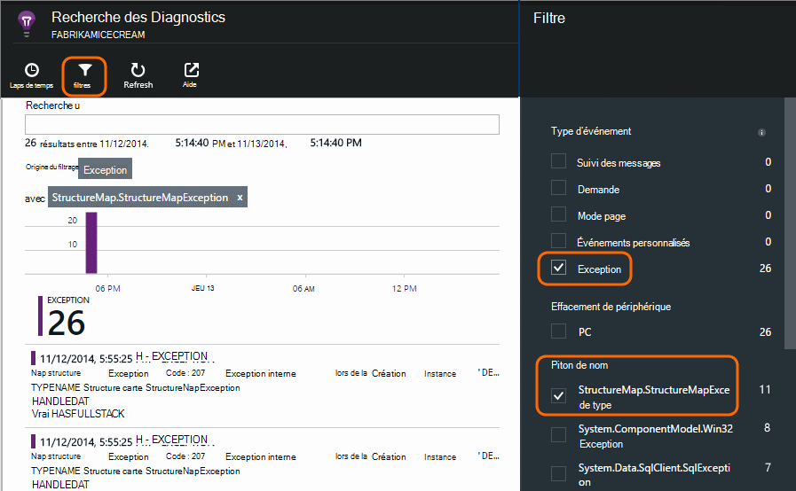

<properties 
    pageTitle="Les journaux, exceptions et les diagnostics personnalisés pour ASP.NET dans perspectives d’Application" 
    description="Diagnostiquer les problèmes dans les applications web ASP.NET en recherchant des requêtes, des exceptions et journaux générés avec Trace, NLog ou Log4Net." 
    services="application-insights" 
    documentationCenter=""
    authors="alancameronwills" 
    manager="douge"/>

<tags 
    ms.service="application-insights" 
    ms.workload="tbd" 
    ms.tgt_pltfrm="ibiza" 
    ms.devlang="na" 
    ms.topic="article" 
    ms.date="04/08/2016" 
    ms.author="awills"/>
 
# Les journaux, exceptions et les diagnostics personnalisés pour ASP.NET dans perspectives d’Application

[Application Insights] [ start] inclut une puissante [Recherche Diagnostic] [ diagnostic] outil qui vous permet d’Explorer et Explorer les niveaux de télémétrie envoyé par le Kit de développement de perspectives Application à partir de votre application. Grand nombre d’événements telles que des affichages de page utilisateur est envoyé automatiquement par le Kit de développement.

Vous pouvez également écrire du code pour envoyer les traces, les rapports d’exception et événements personnalisés. Et si vous utilisez déjà un cadre journalisation comme log4J, log4net, NLog ou System.Diagnostics.Trace, vous pouvez capturer ces fichiers journaux et les inclure dans la recherche. Cela facilite le faire correspondre des traces journal des actions de l’utilisateur, exceptions et d’autres événements.

## Avant d’écrire télémétrie personnalisé

Si vous n’avez pas encore [configurer Application perspectives pour votre projet][start], faire maintenant.

Lorsque vous exécutez votre application, il vous envoie certaines télémétrie s’affiche-t-il dans Rechercher des diagnostics, y compris les requêtes reçues par le serveur, page affichages connectés au niveau du client et non interceptée exceptions.

Ouvrir la recherche de Diagnostic pour afficher la télémétrie le Kit de développement envoie automatiquement.

Les détails varient de type d’une application à l’autre. Vous pouvez cliquer sur via un événement individuel pour obtenir plus de détails.

## Échantillonnages 

Si votre application envoie un grand nombre de données et que vous utilisez le Kit de développement du perspectives d’Application pour ASP.NET version 2.0.0-beta3 ou version ultérieure, la fonctionnalité d’échantillonnage adapté peut-être fonctionner et envoyer uniquement un pourcentage de votre télémétrie. [Découvrez les échantillonnages.](app-insights-sampling.md)

##Événements personnalisés

Événements personnalisés s’affichent à la fois dans [Recherche Diagnostic] [ diagnostic] et dans [l’Explorateur de métrique][metrics]. Vous pouvez leur envoyer à partir d’appareils, des pages web et des applications serveur. Elles peuvent être utilisées pour des diagnostics et de [comprendre l’utilisation modèles][track].

Un événement personnalisé a un nom et peut également comporter des propriétés que vous pouvez filtrer, ainsi que les mesures numériques.

JavaScript au niveau client

    appInsights.trackEvent("WinGame",
         // String properties:
         {Game: currentGame.name, Difficulty: currentGame.difficulty},
         // Numeric measurements:
         {Score: currentGame.score, Opponents: currentGame.opponentCount}
         );

C# sur le serveur

    // Set up some properties:
    var properties = new Dictionary <string, string> 
       {{"game", currentGame.Name}, {"difficulty", currentGame.Difficulty}};
    var measurements = new Dictionary <string, double>
       {{"Score", currentGame.Score}, {"Opponents", currentGame.OpponentCount}};

    // Send the event:
    telemetry.TrackEvent("WinGame", properties, measurements);

Visual Basic sur le serveur

    ' Set up some properties:
    Dim properties = New Dictionary (Of String, String)
    properties.Add("game", currentGame.Name)
    properties.Add("difficulty", currentGame.Difficulty)

    Dim measurements = New Dictionary (Of String, Double)
    measurements.Add("Score", currentGame.Score)
    measurements.Add("Opponents", currentGame.OpponentCount)

    ' Send the event:
    telemetry.TrackEvent("WinGame", properties, measurements)

### Exécuter votre application et afficher les résultats.

Ouvrir la recherche de Diagnostic.

Sélectionnez Custom Event et sélectionnez un nom de l’événement particulier.

Filtrer les données plus en entrant un terme de recherche sur une valeur de propriété.  

Extraire vers un événement individuel pour afficher ses propriétés détaillées.

##Affichages de page

Télémétrie d’affichage de page est envoyé par l’appel trackPageView() dans [l’extrait de code JavaScript que vous insérez dans vos pages web][usage]. Son objectif principal est de contribuer au nombre d’affichages de page que vous voyez dans la page Vue d’ensemble.

En règle générale, il est appelé une fois dans chaque page HTML, mais vous pouvez insérer plusieurs appels - par exemple, si vous avez une application d’une page simple et vous souhaitez enregistrer une nouvelle page chaque fois que l’utilisateur obtient davantage de données.

    appInsights.trackPageView(pageSegmentName, "http://fabrikam.com/page.htm"); 

Il est parfois utile de joindre des propriétés que vous pouvez utiliser en tant que filtres dans Rechercher des diagnostics :

    appInsights.trackPageView(pageSegmentName, "http://fabrikam.com/page.htm",
     {Game: currentGame.name, Difficulty: currentGame.difficulty});

##Trace télémétrie

Trace télémétrie est code que vous insérez spécifiquement pour créer les journaux de diagnostic. 

Par exemple, vous pouvez insérer des appels à ceci :

    var telemetry = new Microsoft.ApplicationInsights.TelemetryClient();
    telemetry.TrackTrace("Slow response - database01");

####  Installer une carte pour votre infrastructure de journalisation

Vous pouvez également rechercher journaux générés avec un cadre journalisation - log4Net, NLog ou System.Diagnostics.Trace. 

1. Si vous prévoyez d’utiliser log4Net ou NLog, installez-le dans votre projet. 
2. Dans l’Explorateur, avec le bouton droit de votre projet, puis sélectionnez **Manage NuGet Packages**.
3. Sélectionnez en ligne > tout, sélectionnez **Inclure la version préliminaire** et effectuez une recherche « Microsoft.ApplicationInsights »

    

4. Sélectionnez le package approprié - un des :
  + Microsoft.ApplicationInsights.TraceListener (pour capturer des appels System.Diagnostics.Trace)
  + Microsoft.ApplicationInsights.NLogTarget
  + Microsoft.ApplicationInsights.Log4NetAppender

Le package NuGet installe les assemblys nécessaires et également modifie web.config ou app.config.

#### Insérer des appels journal de diagnostic

Si vous utilisez System.Diagnostics.Trace, un appel typique serait le suivant :

    System.Diagnostics.Trace.TraceWarning("Slow response - database01");

Si vous préférez log4net ou NLog :

    logger.Warn("Slow response - database01");

Exécuter votre application en mode débogage ou déployer.

Vous verrez les messages de Diagnostic recherche lorsque vous sélectionnez le filtre de Trace.

### Exceptions

Obtention de rapports d’exception dans perspectives Application fournit une expérience très puissante, en particulier dans la mesure où vous pouvez naviguer entre les échecs de requêtes et les exceptions et lire la pile d’exception.

Dans certains cas, vous devez [Insérer plusieurs lignes de code] [ exceptions] pour vous assurer que vos exceptions est capturées automatiquement.

Vous pouvez également écrire du code explicite pour envoyer de télémétrie d’exception :

JavaScript

    try 
    { ...
    }
    catch (ex)
    {
      appInsights.TrackException(ex, "handler loc",
        {Game: currentGame.Name, 
         State: currentGame.State.ToString()});
    }

C#

    var telemetry = new TelemetryClient();
    ...
    try 
    { ...
    }
    catch (Exception ex)
    {
       // Set up some properties:
       var properties = new Dictionary <string, string> 
         {{"Game", currentGame.Name}};

       var measurements = new Dictionary <string, double>
         {{"Users", currentGame.Users.Count}};

       // Send the exception telemetry:
       telemetry.TrackException(ex, properties, measurements);
    }

VISUAL BASIC

    Dim telemetry = New TelemetryClient
    ...
    Try
      ...
    Catch ex as Exception
      ' Set up some properties:
      Dim properties = New Dictionary (Of String, String)
      properties.Add("Game", currentGame.Name)

      Dim measurements = New Dictionary (Of String, Double)
      measurements.Add("Users", currentGame.Users.Count)
  
      ' Send the exception telemetry:
      telemetry.TrackException(ex, properties, measurements)
    End Try

Les paramètres propriétés et des mesures sont facultatives, mais sont utiles pour le filtrage et ajouter des informations supplémentaires. Par exemple, si vous avez une application qui peut exécuter plusieurs jeux, vous pouvez rechercher tous les rapports d’exception liés à un jeu particulier. Vous pouvez ajouter autant d’éléments que vous le souhaitez pour chaque dictionnaire.

#### Affichage des exceptions

Vous verrez un résumé des exceptions signalées sur la carte de vue d’ensemble, et vous pouvez cliquer à pour afficher plus de détails. Par exemple :

[]

Cliquez sur n’importe quel type d’exception pour afficher des occurrences spécifiques :

[]

Vous pouvez également ouvrir la recherche de Diagnostic directement, filtrer sur les exceptions et choisissez le type d’exception que vous souhaitez faire figurer.

### Création de rapports exceptions non gérées

Rapports de l’analyse des application non gérée exceptions où cela est possible, à partir d’appareils, [navigateurs web][usage], ou les serveurs web, si instrumentées par [État moniteur] [ redfield] ou [Application Insights SDK][greenbrown]. 

Toutefois, il n’est toujours pas en mesure d’effectuer cette opération dans certains cas, car le .NET framework d’intercepter les exceptions.  Pour vérifier que vous consultez toutes les exceptions, vous devez donc écrire un gestionnaire d’exceptions petite. La procédure best varie en fonction de la technologie. Voir [télémétrie Exception pour ASP.NET] [ exceptions] pour plus d’informations. 

### Corrélation avec une version

Lorsque vous lisez les journaux de diagnostic, il est probable que votre code source aura changé depuis que le code en direct a été déployé.

Il est donc utile placer les informations de génération, telle que l’URL de la version actuelle, en une propriété ainsi que chaque exception ou trace. 

Au lieu de l’ajout de la propriété séparément pour chaque appel exception, vous pouvez définir les informations dans le contexte par défaut. 

    // Telemetry initializer class
    public class MyTelemetryInitializer : ITelemetryInitializer
    {
        public void Initialize (ITelemetry telemetry)
        {
            telemetry.Properties["AppVersion"] = "v2.1";
        }
    }

Dans l’initialiseur application comme Global.asax.cs :

    protected void Application_Start()
    {
        // ...
        TelemetryConfiguration.Active.TelemetryInitializers
        .Add(new MyTelemetryInitializer());
    }

###Requêtes Web Server

Demande de télémétrie est automatiquement envoyé lorsque [installer le moniteur d’état sur le serveur web][redfield], ou en [Ajouter Application perspectives à votre projet web][greenbrown]. Il est également flux dans les graphiques de temps demande et réponse dans l’Explorateur de métrique et sur la page Vue d’ensemble.

Si vous souhaitez envoyer des événements supplémentaires, vous pouvez utiliser l’API TrackRequest().

## Q & A

### J’obtiens une erreur « clé Instrumentation ne peut pas être vide »

Il semble que vous avez installé le package journalisation carte Nuget sans l’installation d’analyse de l’Application.

Dans l’Explorateur de solutions, avec le bouton droit `ApplicationInsights.config` et sélectionnez **Mise à jour Application perspectives**. Vous recevrez une boîte de dialogue qui vous invite à se connecter à Azure et créez une ressource d’Application perspectives, ou utiliser une existante. Qui doit le correctif.

### La quantité de données est conservée ?

Jusqu'à 500 événements par seconde à partir de chaque application. Les événements sont conservés pendant sept jours.

### Certains de Mes événements ou les traces ne s’affichent pas

Si votre application envoie un grand nombre de données et que vous utilisez le Kit de développement du perspectives d’Application pour ASP.NET version 2.0.0-beta3 ou version ultérieure, la fonctionnalité d’échantillonnage adapté peut-être fonctionner et envoyer uniquement un pourcentage de votre télémétrie. [Découvrez les échantillonnages.](app-insights-sampling.md)

## Étapes suivantes

* [Configurer la disponibilité et teste la réactivité][availability]
* [Résolution des problèmes][qna]

<!--Link references-->

[availability]: app-insights-monitor-web-app-availability.md
[diagnostic]: app-insights-diagnostic-search.md
[exceptions]: app-insights-asp-net-exceptions.md
[greenbrown]: app-insights-asp-net.md
[metrics]: app-insights-metrics-explorer.md
[qna]: app-insights-troubleshoot-faq.md
[redfield]: app-insights-monitor-performance-live-website-now.md
[start]: app-insights-overview.md
[track]: app-insights-api-custom-events-metrics.md
[usage]: app-insights-web-track-usage.md

 
