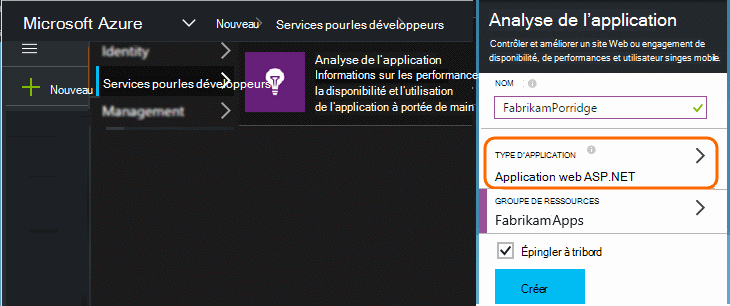
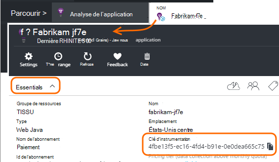

<properties 
    pageTitle="Ressources Application perspectives distinctes pour le développement, de test et de production" 
    description="Surveiller les performances et l’utilisation de votre application à différentes phases de développement" 
    services="application-insights" 
    documentationCenter=""
    authors="alancameronwills" 
    manager="douge"/>

<tags 
    ms.service="application-insights" 
    ms.workload="tbd" 
    ms.tgt_pltfrm="ibiza" 
    ms.devlang="na" 
    ms.topic="article" 
    ms.date="05/04/2016" 
    ms.author="awills"/>

# Séparer les ressources de l’analyse des applications

Devez-vous la télémétrie à partir de différents composants et les versions de votre application être envoyée à des ressources différentes perspectives Application ou combinée en une seule ? Cet article ressemble au mieux pratiques et les techniques nécessaires.

Tout d’abord, nous allons comprendre la question. Les données provenant de votre application sont stockées et traitées par des perspectives d’Application dans une *ressource*de Microsoft Azure. Chaque ressource est identifié par une *clé d’instrumentation* (iKey). Dans votre application, la clé est fournie pour le Kit de développement de perspectives Application afin qu’il puisse envoyer les données collectées à la ressource de droite. La clé peut être fournie dans le code ou dans ApplicationInsights.config. Lorsque vous modifiez la clé dans le Kit de développement, vous pouvez diriger les données à différentes ressources. 

Dans un cas simple, lorsque vous créez le code pour une nouvelle application, vous créez également une nouvelle ressource dans l’Application perspectives. Dans Visual Studio, la boîte de dialogue *Nouveau projet* met à votre place.

S’il s’agit d’un site Web volumineux, il peut être déployé sur plusieurs instance du serveur.

Dans des scénarios plus complexes, vous avez un système qui est composé de plusieurs composants - par exemple, un site web et un processeur principale. 

## Quand utiliser iKeys distincte

Voici quelques conseils généraux :

* L’endroit où vous avez une unité pouvant être déployées indépendamment d’application qui s’exécute sur un ensemble de serveur haut/bas instances qui peuvent être mise à l’échelle indépendamment de celles d’autres composants, puis vous devez généralement qui mapper à une seule ressource - autrement dit, celui-ci possède une clé d’instrumentation unique (iKey).
* En revanche, raisons d’utiliser iKeys distinctes sont les suivantes :
 - Facile à lire métriques distincte à partir de composants distincts.
 - Séparer télémétrie faible volume de volumineux, afin que la limitation des quotas et échantillonnage sur un seul flux n’affectent l’autre.
 - Alertes distinctes, exporter et utiliser les configurations de produit.
 - Répartissez [limites](app-insights-pricing.md#limits-summary) telles que quota de télémétrie, la limitation et web tests count.
 - Code en cours de développement et test doit envoyer à un iKey distinct que l’horodatage de production.  

Un grand nombre d’expériences portails analyse des applications sont conçues à ces instructions à l’esprit. Par exemple, les serveurs afficher des segments sur instance du serveur, effectuer l’hypothèse que télémétrie sur un composant logique peut provenir de plusieurs instances de serveur.

## IKey unique

Où vous envoyez télémétrie à partir de plusieurs composants à une seule iKey :

* Ajouter une propriété à toutes les télémétrie qui vous permet de filtrage sur l’identité du composant et le segment. L’ID de rôle est ajouté automatiquement à télémétrie provenant des instances de rôle serveur, mais dans d’autres cas, que vous pouvez utiliser un [initialiseur de télémétrie](app-insights-api-filtering-sampling.md#add-properties) pour ajouter la propriété.
* Mettre à jour le SDK Insights Application dans les différents composants en même temps. Télémétrie pour un seul iKey doit provenir avec la même version du Kit de développement.

## IKeys distincte

Lorsque vous avez plusieurs iKeys pour différents composants d’application :

* Créer un [tableau de bord](app-insights-dashboards.md) pour un affichage de la télémétrie clé à partir de votre application logique, combinée à partir des composants d’application. Tableaux de bord peut être partagés, pour un affichage seul système logique puisse être utilisé par différentes équipes.
* Organiser des [groupes de ressources](app-insights-resources-roles-access-control.md) au niveau de l’équipe. Autorisations d’accès sont affectées par groupe de ressources, et ces incluent les autorisations nécessaires pour configurer des alertes. 
* Utiliser des [modèles de gestionnaire de ressources Azure et Powershell](app-insights-powershell.md) pour gérer des objets tels que des règles d’alerte et tests web.

## IKeys distincts pour le développement/Test et de Production

Pour rendre plus facile de modifier la clé automatiquement lorsque vous relâchez votre application, définissez l’iKey dans le code, plutôt que dans ApplicationInsights.config.

### Clé instrumentation dynamiques

Définir la clé dans une méthode d’initialisation, par exemple global.aspx.cs dans un service ASP.NET :

*C#*

    protected void Application_Start()
    {
      Microsoft.ApplicationInsights.Extensibility.
        TelemetryConfiguration.Active.InstrumentationKey = 
          // - for example -
          WebConfigurationManager.AppSettings["ikey"];
      ...

Dans cet exemple, les ikeys pour les différentes ressources sont placées dans différentes versions de fichier de configuration web. Remplacer le fichier de configuration web - ce que vous pouvez faire dans le cadre du script release - bascule la ressource cible.

### Pages Web

L’iKey est également utilisé dans les pages de votre application web, dans le [script que vous avez obtenu à partir de la carte de démarrage rapide](app-insights-javascript.md). Au lieu de rédaction du code littéralement dans le script, générer un à partir de l’état du serveur. Par exemple, dans une application ASP.NET :

*JavaScript dans Razor*

    <script type="text/javascript">
    // Standard Application Insights web page script:
    var appInsights = window.appInsights || function(config){ ...
    // Modify this part:
    }({instrumentationKey:  
      // Generate from server property:
      "@Microsoft.ApplicationInsights.Extensibility.
         TelemetryConfiguration.Active.InstrumentationKey"
    }) // ...

## Création d’une ressource d’analyse des applications supplémentaire
  
Si vous décidez de séparer télémétrie pour différents composants d’application, ou pour différents tampons (développement/test/de production) du même composant, vous devrez créer une nouvelle ressource Application perspectives.

Dans la [portal.azure.com](https://portal.azure.com), ajoutez une ressource d’analyse de l’Application :

* **Type d’application** affecte ce que vous voyez sur la carte de présentation et les propriétés disponibles dans [l’Explorateur métrique](app-insights-metrics-explorer.md). Si vous ne voyez pas votre type d’application, sélectionnez un des types web pour les pages web.
* **Groupe de ressources** est pratique pour la gestion des propriétés, telles que [le contrôle d’accès](app-insights-resources-roles-access-control.md). Vous pouvez utiliser des groupes de ressources distincts pour le développement, de test et de production.
* **Abonnement** est votre compte de paiement dans Azure.
* **Emplacement** est l’endroit où nous conserver vos données. Actuellement il ne peut pas être modifié. 
* **Ajouter au tableau de bord** place une vignette d’accès rapide pour la ressource sur votre page d’accueil Azure. 

Création de la ressource prend quelques secondes. Vous verrez une alerte lorsqu’il est terminé.

(Vous pouvez écrire un [script PowerShell](app-insights-powershell-script-create-resource.md) pour créer automatiquement une ressource).

## Obtenir la clé d’instrumentation

La clé d’instrumentation identifie la ressource que vous avez créé. 

Vous avez besoin des touches instrumentation de toutes les ressources auquel votre application vous envoie des données.

 
