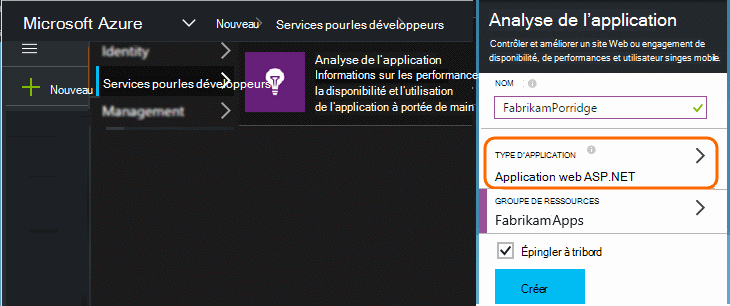
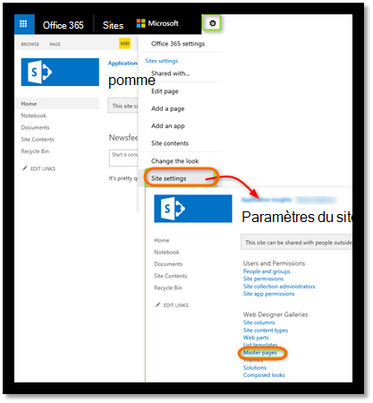
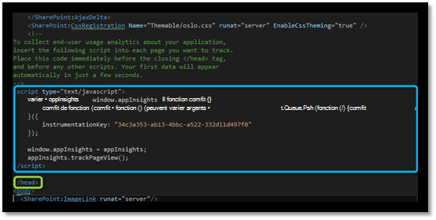
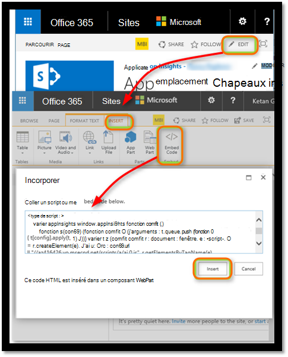
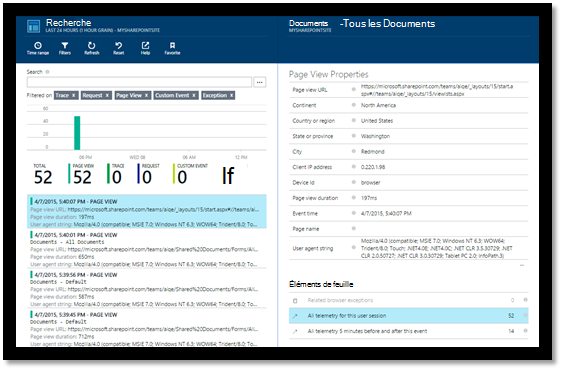
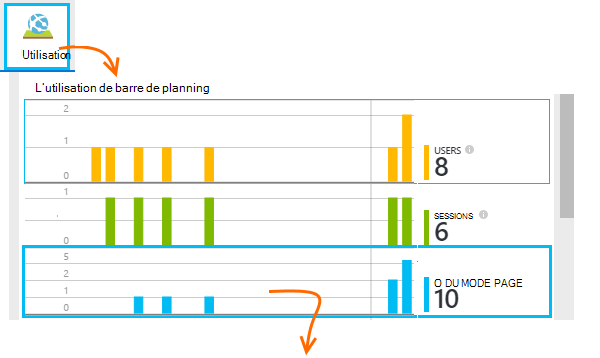
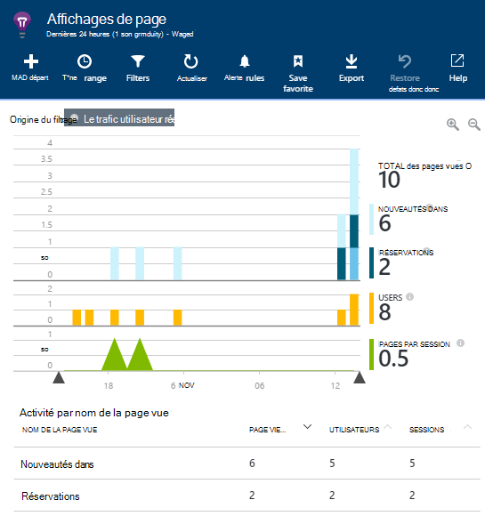
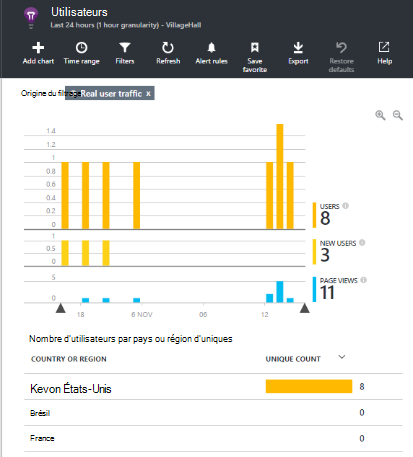
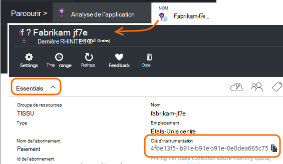

<properties 
    pageTitle="Analyser un site SharePoint avec des aperçus d’Application" 
    description="Démarrer le contrôle d’une nouvelle application avec une nouvelle clé d’instrumentation" 
    services="application-insights" 
    documentationCenter=""
    authors="alancameronwills" 
    manager="douge"/>

<tags 
    ms.service="application-insights" 
    ms.workload="tbd" 
    ms.tgt_pltfrm="ibiza" 
    ms.devlang="na" 
    ms.topic="article" 
    ms.date="03/24/2016" 
    ms.author="awills"/>

# <a name="monitor-a-sharepoint-site-with-application-insights"></a>Analyser un site SharePoint avec des aperçus d’Application


Visual Studio Application Insights surveille la disponibilité, de performances et de l’utilisation de vos applications. Ici, vous allez découvrir comment configurer pour un site SharePoint.


## <a name="create-an-application-insights-resource"></a>Création d’une ressource d’Application perspectives


Dans le [portail Azure](https://portal.azure.com), créez une nouvelle ressource Application perspectives. Sélectionnez ASP.NET en tant que le type d’application.




La carte qui s’ouvre est l’endroit où vous pouvez afficher les performances et données d’utilisation sur votre application. Pour revenir au prochaine fois que vous vous connectez à Azure, vous devez trouver une vignette pour qu’elle sur l’écran d’accueil. Sinon, cliquez sur Parcourir pour le rechercher.
    


## <a name="add-our-script-to-your-web-pages"></a>Ajouter notre script à vos pages web

Dans la zone Démarrage rapide, obtenir le script pour les pages web :


Insérer le script juste avant le &lt;/tête&gt; balise de chaque page que vous voulez effectuer le suivi. Si votre site Web a une page maître, vous pouvez y placez le script. Par exemple, dans un projet ASP.NET MVC, vous devez placer dans View\Shared\_Layout.cshtml

Le script contient la clé d’instrumentation qui achemine la télémétrie à votre ressource Application perspectives.

### <a name="add-the-code-to-your-site-pages"></a>Ajouter le code à vos pages de site

#### <a name="on-the-master-page"></a>Dans la page maître

Si vous pouvez modifier la page maître du site, qui offre de surveillance pour chaque page du site.

Consultez la page maître et le modifier à l’aide de SharePoint Designer ou un autre éditeur.




Ajouter le code juste avant le </head> balise. 




#### <a name="or-on-individual-pages"></a>Ou sur des pages individuelles

Pour analyser un ensemble limité de pages, ajoutez le script séparément pour chaque page. 

Insérer un composant WebPart et incorporer l’extrait de code qu’il contient.





## <a name="view-data-about-your-app"></a>Afficher les données sur votre application

Redéployez votre application.

Revenir à votre carte d’application dans le [portail Azure](https://portal.azure.com).

Les premiers événements seront affichent dans la recherche. 



Si vous attendez plus de données, cliquez sur Actualiser après quelques secondes.

À partir de la carte de la vue d’ensemble, cliquez sur **analytique de l’utilisation** pour afficher les graphiques d’utilisateurs, des sessions et des affichages de page :



Cliquez sur graphique quelconque pour afficher plus de détails - par exemple les affichages de Page :



Ou les utilisateurs :





## <a name="capturing-user-id"></a>Id d’utilisateur de capture


L’extrait de code de page web standard ne capture l’id d’utilisateur à partir de SharePoint, mais vous pouvez le faire avec une petite modification.


1. Copier la clé d’instrumentation de votre application à partir des liste déroulante dans perspectives Application Essentials. 


    

2. Remplacez la clé instrumentation pour « XXXX » dans l’extrait de code ci-dessous. 
3. Incorporer le script dans votre application SharePoint au lieu de l’extrait de code que vous obtenez à partir du portail.


```


<SharePoint:ScriptLink ID="ScriptLink1" name="SP.js" runat="server" localizable="false" loadafterui="true" /> 
<SharePoint:ScriptLink ID="ScriptLink2" name="SP.UserProfiles.js" runat="server" localizable="false" loadafterui="true" /> 
  
<script type="text/javascript"> 
var personProperties; 
  
// Ensure that the SP.UserProfiles.js file is loaded before the custom code runs. 
SP.SOD.executeOrDelayUntilScriptLoaded(getUserProperties, 'SP.UserProfiles.js'); 
  
function getUserProperties() { 
    // Get the current client context and PeopleManager instance. 
    var clientContext = new SP.ClientContext.get_current(); 
    var peopleManager = new SP.UserProfiles.PeopleManager(clientContext); 
     
    // Get user properties for the target user. 
    // To get the PersonProperties object for the current user, use the 
    // getMyProperties method. 
    
    personProperties = peopleManager.getMyProperties(); 
  
    // Load the PersonProperties object and send the request. 
    clientContext.load(personProperties); 
    clientContext.executeQueryAsync(onRequestSuccess, onRequestFail); 
} 
     
// This function runs if the executeQueryAsync call succeeds. 
function onRequestSuccess() { 
var appInsights=window.appInsights||function(config){
function s(config){t[config]=function(){var i=arguments;t.queue.push(function(){t[config].apply(t,i)})}}var t={config:config},r=document,f=window,e="script",o=r.createElement(e),i,u;for(o.src=config.url||"//az416426.vo.msecnd.net/scripts/a/ai.0.js",r.getElementsByTagName(e)[0].parentNode.appendChild(o),t.cookie=r.cookie,t.queue=[],i=["Event","Exception","Metric","PageView","Trace"];i.length;)s("track"+i.pop());return config.disableExceptionTracking||(i="onerror",s("_"+i),u=f[i],f[i]=function(config,r,f,e,o){var s=u&&u(config,r,f,e,o);return s!==!0&&t["_"+i](config,r,f,e,o),s}),t
    }({
        instrumentationKey:"XXXX"
    });
    window.appInsights=appInsights;
    appInsights.trackPageView(document.title,window.location.href, {User: personProperties.get_displayName()});
} 
  
// This function runs if the executeQueryAsync call fails. 
function onRequestFail(sender, args) { 
} 
</script> 


```


## <a name="next-steps"></a>Étapes suivantes

* [Tests de site web](app-insights-monitor-web-app-availability.md) de contrôler la disponibilité de votre site.

* [Analyse de l’application](app-insights-overview.md) d’autres types d’application.


<!--Link references-->


 