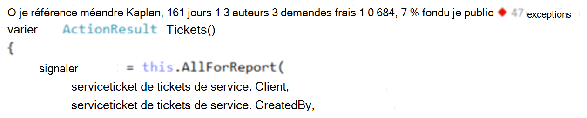
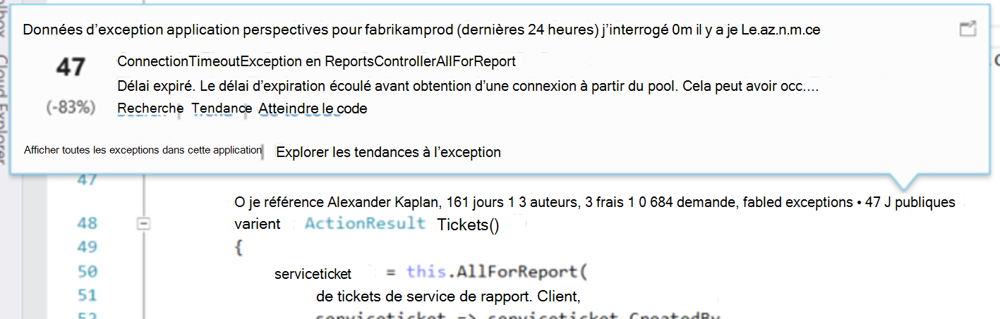
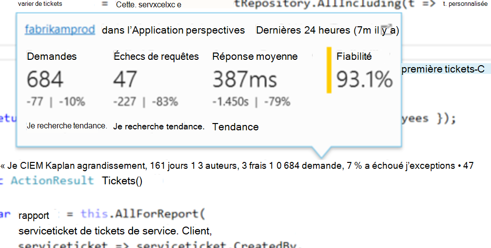
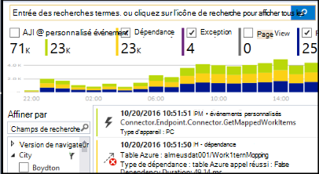

<properties 
    pageTitle="Télémétrie d’analyse des applications dans Visual Studio CodeLens | Microsoft Azure" 
    description="Accéder rapidement à votre télémétrie Insights Application demande et exception avec CodeLens dans Visual Studio." 
    services="application-insights" 
    documentationCenter=".net"
    authors="numberbycolors" 
    manager="douge"/>

<tags 
    ms.service="application-insights" 
    ms.workload="tbd" 
    ms.tgt_pltfrm="ibiza" 
    ms.devlang="na" 
    ms.topic="get-started-article" 
    ms.date="08/30/2016" 
    ms.author="daviste"/>
    
# Télémétrie d’analyse des applications dans Visual Studio CodeLens

Méthodes dans le code de votre application web peuvent être annotées avec télémétrie sur les exceptions d’exécution et demander le temps de réponse. Si vous installez [Visual Studio Application Insights](app-insights-overview.md) dans votre application, la télémétrie apparaît dans Visual Studio [CodeLens](https://msdn.microsoft.com/library/dn269218.aspx) - les notes en haut de chaque fonction où vous avez l’habitude de voir des informations utiles telles que le nombre de chiffres de la fonction sont référencées ou la dernière personne ayant modifié celle-ci.

> [AZURE.NOTE] Application Insights dans CodeLens est disponible dans Visual Studio 2015 mise à jour de 3 et une version ultérieure ou avec la dernière version [d’extension de développeur Analytique outils](https://visualstudiogallery.msdn.microsoft.com/82367b81-3f97-4de1-bbf1-eaf52ddc635a). CodeLens est disponible dans les éditions entreprise et professionnel de Visual Studio.

## Où trouver des données d’analyse de l’Application

Recherchez télémétrie Application Insights dans les indicateurs CodeLens des méthodes demande public de votre application web. Indicateurs de CodeLens sont présentés ci-dessus méthode et d’autres déclarations dans le code c# et Visual Basic. Si les données d’analyse de l’Application seront disponibles pour une méthode, vous verrez des indicateurs pour les demandes et les exceptions telles que « demande 100, 1 % a échoué » ou « 10 exceptions. » Cliquez sur un indicateur CodeLens pour plus d’informations. 

> [AZURE.TIP] Demande l’analyse des applications et indicateurs exception peuvent prendre quelques secondes supplémentaires pour charger une fois que d’autres indicateurs CodeLens apparaissent.

## Exceptions dans CodeLens

L’indicateur de CodeLens exception indique le nombre d’exceptions qui se sont produites dans les dernières 24 heures dans les 15 qui se produisent fréquemment des exceptions dans votre application pendant cette période, pendant le traitement de la demande pris en charge par la méthode.

Pour afficher plus de détails, cliquez sur l’indicateur CodeLens exceptions :

* Le pourcentage de variation de nombre d’exceptions des dernières 24 heures par rapport au préalable dernières 24 heures
* Cliquez sur **Atteindre le code** pour atteindre le code source de la fonction lever l’exception
* Cliquez sur **recherche** pour interroger toutes les instances de cette exception qui se sont produites dans les dernières 24 heures
* Choisissez **tendance** pour afficher une visualisation de tendance occurrences de cette exception dans les dernières 24 heures
* Cliquez sur **Afficher toutes les exceptions de cette application** pour interroger toutes les exceptions qui se sont produites dans les dernières 24 heures
* Sélectionnez **les tendances à l’exception Explorer** pour afficher une visualisation tendance pour toutes les exceptions qui se sont produites dans les dernières 24 heures. 

> [AZURE.TIP] Si vous voyez « 0 exceptions » dans CodeLens mais que vous connaissez il doit avoir des exceptions, vérifiez que la ressource Application Insights appropriée est sélectionnée dans CodeLens. Pour sélectionner une autre ressource, avec le bouton droit sur votre projet dans l’Explorateur de solutions et choisissez **Application Insights > choisir une Source de télémétrie**. CodeLens apparaît uniquement pour les 15 la plupart des exceptions fréquentes dans votre application dans les dernières 24 heures, par conséquent, si une exception est le 16 plus fréquemment ou moins, vous verrez « 0 exceptions. » Les exceptions à partir de vues ASP.NET n’apparaissent pas sur les méthodes de contrôleur à l’origine de ces affichages.

> [AZURE.TIP] Si vous voyez « ? exceptions » dans CodeLens, vous devez associer votre compte Azure Visual Studio ou vos informations d’identification de compte Azure a peut-être expiré. Dans les deux cas, cliquez sur « ? exceptions » et sélectionnez **Ajouter un compte...** pour entrer vos informations d’identification.

## Demandes dans CodeLens

La requête CodeLens indicateur indique le nombre de requêtes HTTP qui été traitées par une méthode dans les dernières 24 heures, ainsi que le pourcentage de ces requêtes qui a échoué.

Pour afficher plus de détails, cliquez sur les requêtes CodeLens indicateur :

* La modification absolue et le pourcentage du nombre de demandes, les échecs de requêtes et les heures de réponse moyen sur les dernières 24 heures par rapport au préalable dernières 24 heures
* La fiabilité de la méthode, calculée en tant que pourcentage de demandes sans erreur dans les dernières 24 heures
* Cliquez sur **recherche** pour les demandes ou échec pour interroger toutes les requêtes (échecs) qui s’est produite sur les dernières 24 heures
* Choisissez **tendance** pour afficher une visualisation de tendance pour les demandes, les échecs de requêtes ou les temps de réponse moyens dans les dernières 24 heures.
* Sélectionnez le nom de la ressource Application Insights dans le coin supérieur gauche de l’affichage de détails CodeLens pour modifier la ressource est la source de données CodeLens.

## Étapes suivantes

||
|---|---
|**[Travailler avec des aperçus d’Application dans Visual Studio](app-insights-visual-studio.md)** Recherche de télémétrie, afficher des données dans CodeLens et configurer Application perspectives. Dans Visual Studio. |
|**[Ajouter davantage de données](app-insights-asp-net-more.md)** Surveiller l’utilisation, disponibilité, dépendances, exceptions. Intégrer traces à partir de structures de journalisation. Écrire télémétrie personnalisé. | 
|**[Utiliser le portail d’analyse de l’Application](app-insights-dashboards.md)** Exporter des tableaux de bord, puissants outils de diagnostics et analytiques et les alertes, une carte de dépendance live de votre application et télémétrie. |
