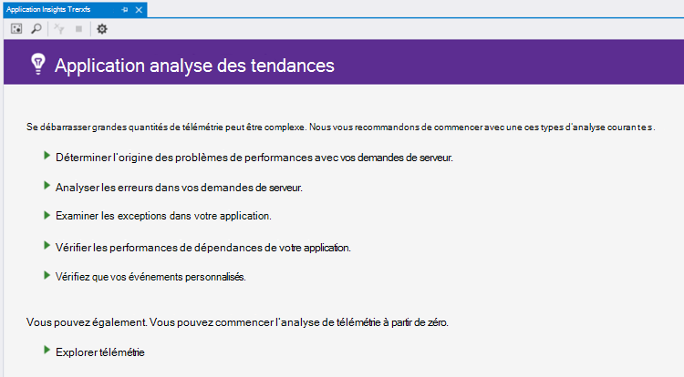
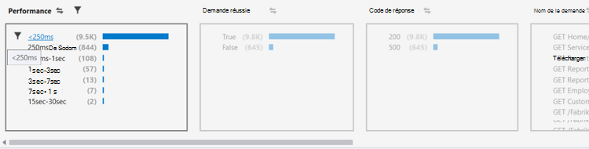
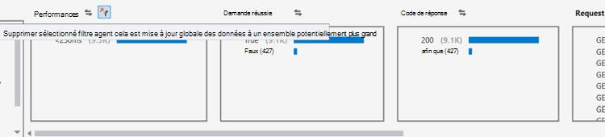
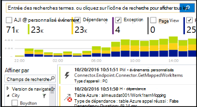
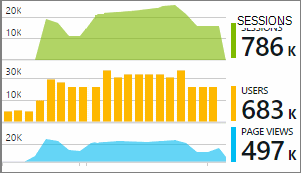

<properties 
    pageTitle="Analyse des tendances dans Visual Studio | Microsoft Azure" 
    description="Analyser, visualiser et Explorer les tendances dans votre télémétrie Application Insights dans Visual Studio." 
    services="application-insights" 
    documentationCenter=".net"
    authors="numberbycolors" 
    manager="douge"/>

<tags 
    ms.service="application-insights" 
    ms.workload="tbd" 
    ms.tgt_pltfrm="ibiza" 
    ms.devlang="na" 
    ms.topic="get-started-article" 
    ms.date="10/25/2016" 
    ms.author="daviste"/>
    
# Analyser les tendances dans Visual Studio

L’outil Application analyse des tendances visualise comment événements de télémétrie important de votre application modifient le temps, pour vous aider à identifier rapidement les problèmes et anomalies. En liant vous pour plus d’informations de diagnostic, les tendances peuvent vous aider à améliorer les performances de votre application et analyser les causes des exceptions de révéler perspectives à partir de vos événements personnalisés.

> [AZURE.NOTE] Application analyse des tendances est disponible dans Visual Studio 2015 mise à jour de 3 et une version ultérieure ou avec la version [développeur Analytique outils extension](https://visualstudiogallery.msdn.microsoft.com/82367b81-3f97-4de1-bbf1-eaf52ddc635a) 5.209 et versions ultérieure.

## Application ouverte analyse des tendances

Pour ouvrir la fenêtre d’Application analyse des tendances :

* À partir du bouton de barre d’outils Application perspectives, cliquez sur **Explorer les tendances de télémétrie**, ou
* Dans le menu contextuel du projet, choisissez **Application Insights > tendances de télémétrie Explorer**, ou
* Dans la barre de menus Visual Studio, choisissez **Affichage > autres fenêtres > Application analyse des tendances**.

Vous pouvez recevoir un message pour sélectionner une ressource. Cliquez sur **Sélectionner une ressource**, connectez-vous à l’aide d’un abonnement Azure, puis sélectionnez une ressource d’analyse des applications dans la liste pour laquelle vous voulez analyser les tendances de télémétrie.

## Choisissez une analyse de tendance.

Prise en main en choisissant depuis un des cinq analyses tendance courantes, chaque l’analyse des données à partir des dernières 24 heures :

* **Examiner les problèmes de performances avec vos demandes server** - demandes apportées à votre service, regroupés par temps de réponse
* **Analyser les erreurs dans vos demandes de serveur** - demandes apportées à votre service, regroupés par code de réponse HTTP
* **Examiner les exceptions dans votre application** - toutes les Exceptions de votre service, regroupées par type d’exception
* **Vérifier les performances de dépendances de votre application** - Services appelés par votre service, regroupés par temps de réponse
* **Inspecter vos événements personnalisés** - événements personnalisés que vous avez configuré pour votre service, regroupées par type d’événement.

Ces analyses prédéfinies sont disponibles ultérieurement sur le bouton **Afficher les types communs de l’analyse de télémétrie** dans le coin supérieur gauche de la fenêtre de tendances.

## Visualiser les tendances dans votre application

Application analyse des tendances crée une visualisation de série de temps à partir de télémétrie de votre application. Chaque ponctualité série affiche un seul type de télémétrie, regroupé par propriété de ce télémétrie, sur une plage de temps. Par exemple, vous souhaiterez peut-être afficher les demandes de serveur, regroupés par le pays provient, sur les dernières 24 heures. Dans cet exemple, chacune des bulles sur la visualisation représente un nombre de requêtes du serveur pour certains pays/région pendant une heure.

Utilisez les contrôles en haut de la fenêtre pour ajuster les types de télémétrie vous permet d’afficher. Tout d’abord, choisissez les types de télémétrie qui vous intéressent :

* **Type de télémétrie** - demandes de serveur, exceptions, depdendencies ou des événements personnalisés
* **Plage horaire** - n’importe où dans les dernières 30 minutes pour les 3 derniers jours
* **Group By** - Exception type, identification du problème, pays/région et plus.

Ensuite, cliquez sur **Analyser de télémétrie** pour exécuter la requête.

Naviguer entre les bulles dans la visualisation :

* Cliquez sur pour sélectionner une bulle, ce qui met à jour les filtres en bas de la fenêtre, résumer les uniquement les événements qui se sont produites pendant une période spécifique
* Double-cliquez sur une bulle pour accéder à l’outil de recherche et afficher tous les événements de télémétrie individuels qui se sont produites pendant la période
* CTRL et cliquez sur une bulle pour désélectionner dans la visualisation.

> [AZURE.TIP] Les tendances et recherche tools fonctionnent ensemble pour vous aider à identifier les causes fréquentes des problèmes dans votre service parmi des milliers d’événements de télémétrie. Par exemple, si un après-midi vos clients Notez votre application est injoignable moins, commencer avec les tendances. Analyser les demandes d’apportées à votre service au cours des heures passées plusieurs, regroupés par le temps de réponse. Déterminer si un cluster inhabituelle grand des demandes lentes. Puis double-cliquez sur cette bulle pour accéder à l’outil recherche, filtrée sur les événements de requête. De la recherche, vous pouvez explorer le contenu de ces demandes et accédez au code impliqués résoudre le problème.

## Filtre

Découvrez les tendances plus spécifiques avec les contrôles de filtre en bas de la fenêtre. Pour appliquer un filtre, cliquez sur son nom. Vous pouvez basculer rapidement entre différents filtres pour découvrir les tendances qui peuvent être masquer dans une dimension particulière de votre télémétrie. Si vous appliquez un filtre dans une dimension, comme Type d’Exception, filtres d’autres dimensions restent cliquables, même si elles apparaissent grisées. Pour annuler-appliquer un filtre, cliquez sur Nouveau. CTRL et cliquez sur pour sélectionner plusieurs filtres dans la même dimension.

Que se passe-t-il si vous souhaitez appliquer plusieurs filtres ? 

1. Appliquer le premier filtre. 
2. Cliquez sur le bouton **appliquer des filtres sélectionnés et à nouveau requête** selon le nom de la dimension de votre premier filtre. Cela envoie une nouvelle requête votre télémétrie pour que les événements qui correspond au premier filtre. 
3. Appliquer un deuxième filtre. 
4. Répétez le processus pour trouver les tendances dans des sous-groupes de votre télémétrie spécifiques. Par exemple, des demandes de serveur nommé « GET accueil/Index » _et_ dont provient Allemagne _et_ qui a reçu un code de 500 réponse. 

Pour annuler-appliquer l’une de ces filtres, cliquez sur le bouton **Supprimer les filtres sélectionnés et requête à nouveau** pour la dimension.

## Rechercher des anomalies

L’outil de tendances pouvez mettre en surbrillance des bulles des événements qui sont anormales par rapport aux autres bulles dans la même série chronologique. Dans la liste déroulante Type d’affichage, choisissez **décomptes dans temps peinture (mise en surbrillance anomalies)** ou **des pourcentages dans temps peinture (mise en surbrillance anomalies)**. Rouge bulles sont anormales. Anomalies sont définis sous forme de bulles avec des décomptes/pourcentages dépassant 2.1 fois l’écart type des décomptes/pourcentages passée deux périodes (48 heures si vous affichez les dernières 24 heures, etc..).

> [AZURE.TIP] Mise en surbrillance anomalies est particulièrement utile pour rechercher des valeurs aberrantes dans la série chronologique de petites bulles qui peuvent s’affichent dans le cas contraire de taille similaire.  

## Étapes suivantes

||
|---|---
|**[Travailler avec des aperçus d’Application dans Visual Studio](app-insights-visual-studio.md)** Recherche de télémétrie, afficher des données dans CodeLens et configurer Application perspectives. Dans Visual Studio. |
|**[Ajouter davantage de données](app-insights-asp-net-more.md)** Surveiller l’utilisation, disponibilité, dépendances, exceptions. Intégrer traces à partir de structures de journalisation. Écrire télémétrie personnalisé. | 
|**[Utiliser le portail d’analyse de l’Application](app-insights-dashboards.md)** Exporter des tableaux de bord, puissants outils de diagnostics et analytiques et les alertes, une carte de dépendance live de votre application et télémétrie. |
