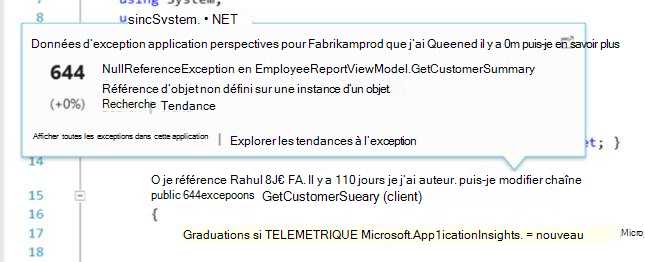
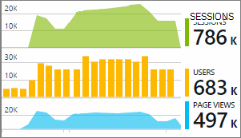

<properties 
    pageTitle="Travailler avec des aperçus d’Application sur Visual Studio" 
    description="Analyse des performances et les diagnostics pendant le débogage et en production." 
    services="application-insights" 
    documentationCenter=".net"
    authors="alancameronwills" 
    manager="douge"/>

<tags 
    ms.service="application-insights" 
    ms.workload="tbd" 
    ms.tgt_pltfrm="ibiza" 
    ms.devlang="na" 
    ms.topic="get-started-article" 
    ms.date="06/21/2016" 
    ms.author="awills"/>

# Travailler avec des aperçus d’Application dans Visual Studio

Dans Visual Studio (2015 et versions ultérieures), vous pouvez analyser les performances et diagnostiquer les problèmes de déboguer et en production, à l’aide de télémétrie de [Visual Studio Application perspectives](app-insights-overview.md).

Si vous n’avez pas encore [Installé Application Insights dans votre application](app-insights-asp-net.md), effectuez que maintenant.

## Déboguer votre projet

Exécuter votre application en appuyant sur F5 et essayez-le : ouvrir les différentes pages pour générer certains télémétrie.

Dans Visual Studio, vous verrez un compteur des événements qui ont été enregistrés.

Cliquez sur ce bouton pour ouvrir la recherche de diagnostic. 

## Recherche des Diagnostics

La fenêtre de recherche affiche des événements qui ont été enregistrés. (Si vous connecté à Azure lorsque vous configurez Application perspectives, vous pourrez rechercher les mêmes événements dans le portail.)

La recherche en texte libre fonctionne sur tous les champs dans les événements. Par exemple, recherchez partie de l’URL d’une page ; ou la valeur d’une propriété tel que Ville client ; ou des mots spécifiques dans un journal de suivi.

Cliquez sur n’importe quel événement pour afficher ses propriétés détaillées.

Vous pouvez également ouvrir l’onglet éléments associés pour aider à diagnostiquer les échecs de requêtes ou des exceptions.

## Concentrateur de Diagnostics

Le Hub Diagnostics (dans Visual Studio 2015 ou version ultérieure) affiche la télémétrie server Application Insights comme il est généré. Cela fonctionne même si vous choisi uniquement pour installer le Kit de développement, sans vous connecter à une ressource dans le portail Azure.

## Exceptions

Si vous avez [configuré de surveillance des exceptions](app-insights-asp-net-exceptions.md), les rapports d’exception seront affichent dans la fenêtre de recherche. 

Cliquez sur une exception pour obtenir une trace de la pile. Si le code de l’application est ouvert dans Visual Studio, vous pouvez cliquer sur par le biais de la trace de pile à la ligne du code.

En outre, dans la ligne de Code Lens au-dessus de chaque méthode, vous verrez un compteur des exceptions enregistrés par Application Insights dans les 24 heures passées.

## Surveillance local

(À partir de Visual Studio 2015 mise à jour 2) Si vous n’avez pas configuré le Kit de développement pour envoyer télémétrie au portail Insights Application (afin qu’il n’existe aucune clé instrumentation dans ApplicationInsights.config) la fenêtre diagnostics affichera télémétrie à partir de votre session de débogage plus récent. 

Il convient si vous avez déjà publié une version antérieure de votre application. Vous ne voulez pas la télémétrie dans vos sessions débogage mixte avec la télémétrie dans le portail d’analyse de l’Application à partir de l’application publié vers le haut.

Il est également utile si vous avez quelques [télémétrie personnalisé](app-insights-api-custom-events-metrics.md) que vous souhaitez déboguer avant l’envoi de télémétrie au portail.

* *Tout d’abord, j’ai configuré entièrement Insights Application pour envoyer de télémétrie au portail. Mais je souhaite maintenant voir la télémétrie uniquement dans Visual Studio.*

 * Dans les paramètres de la fenêtre de recherche, il existe une option pour rechercher des diagnostics local même si votre application envoie télémétrie au portail.
 * Pour arrêter de télémétrie envoyé au portail, commentez la ligne `<instrumentationkey>...` de ApplicationInsights.config. Lorsque vous êtes prêt à envoyer à nouveau télémétrie au portail, supprimez les commentaires.

## Tendances

Tendances est un outil de visualiser le comportement de votre application dans le temps. 

Cliquez sur **Explorer les tendances de télémétrie** à partir du bouton de barre d’outils d’analyse de l’Application ou une fenêtre de recherche de perspectives Application. Choisissez une des cinq fréquemment utilisées pour commencer. Vous pouvez analyser les différents jeux de données en fonction de types de télémétrie, plages de temps et d’autres propriétés. 

Pour trouver anomalies dans vos données, choisissez une des options anomalie sous la liste déroulante « Type d’affichage ». Les options de filtrage en bas de la fenêtre facilitent la comprendre sous-groupes de votre télémétrie spécifiques.

[En savoir plus sur les tendances](app-insights-visual-studio-trends.md).

## Quoi d’autre ?

||
|---|---
|**[Ajouter davantage de données](app-insights-asp-net-more.md)** Surveiller l’utilisation, disponibilité, dépendances, exceptions. Intégrer traces à partir de structures de journalisation. Écrire télémétrie personnalisé. | 
|**[Utiliser le portail d’analyse de l’Application](app-insights-dashboards.md)** Exporter des tableaux de bord, puissants outils de diagnostics et analytiques et les alertes, une carte de dépendance live de votre application et télémétrie. |

 
