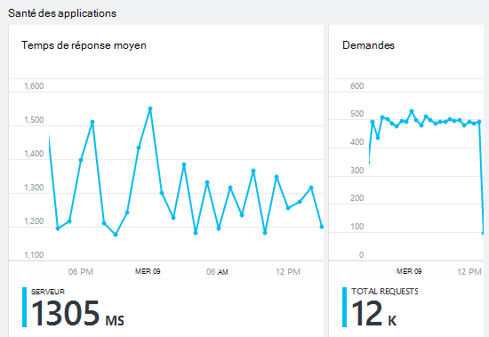

<properties 
    pageTitle="Surveiller votre application santé et l’utilisation avec des aperçus d’Application" 
    description="Prise en main avec des aperçus de l’Application. Analyser l’utilisation et les performances de vos applications de Microsoft Azure ou en local." 
    services="application-insights" 
    documentationCenter=""
    authors="alancameronwills" 
    manager="douge"/>

<tags 
    ms.service="application-insights" 
    ms.workload="tbd" 
    ms.tgt_pltfrm="ibiza" 
    ms.devlang="na" 
    ms.topic="article" 
    ms.date="11/25/2015" 
    ms.author="awills"/>
 
# Surveiller les performances dans les applications web

*Analyse de l’application est en mode Aperçu.*

Assurez-vous que votre application fonctionne correctement et découvrez rapidement tous les échecs. [Application Insights] [ start] sera vous informer des problèmes de performances et des exceptions et vous aider à trouver et diagnostiquer les causes premières.

Analyse de l’application peut surveiller des applications web Java et ASP.NET et les services, les services WCF. Elles peuvent être hébergés localement, machines virtuelles, ou en tant que des sites Web de Microsoft Azure. 

Sur le côté client, Insights Application peut prendre télémétrie à partir de pages web et un large éventail de périphériques, y compris iOS, Android et Windows applications du Store.

## Configurer l’analyse des performances

Si vous n’avez pas encore ajouté analyse des applications à votre projet (autrement dit, si elle n’a pas ApplicationInsights.config), choisissez une des manières suivantes pour commencer :

* [Applications web ASP.NET](app-insights-asp-net.md)
 * [Ajouter une exception de surveillance](app-insights-asp-net-exceptions.md)
 * [Ajouter la surveillance des dépendances](app-insights-monitor-performance-live-website-now.md)
* [Applications web J2EE](app-insights-java-get-started.md)
 * [Ajouter la surveillance des dépendances](app-insights-java-agent.md)

## Exploration des indicateurs de performance

Dans [le portail Azure](https://portal.azure.com), accédez à la ressource d’analyse de l’Application que vous avez configuré pour votre application. La carte de vue d’ensemble affiche des données de performance de base :

Cliquez sur un graphique quelconque pour afficher plus en détail et pour afficher des résultats pour une période plus longue. Par exemple, cliquez sur la vignette de requêtes, puis sélectionnez un intervalle de temps :

Cliquez sur un graphique pour choisir les indicateurs il s’affiche, ou ajouter un nouveau graphique et sélectionnez ses paramètres :

> [AZURE.NOTE] **Décochez toutes les mesures** pour afficher la sélection complète est disponible. Les mesures sont réparties en groupes ; Quand n’importe quel membre d’un groupe est sélectionnée, seuls les autres membres de ce groupe s’affiche.

## Ce qui signifie qu’il tous les ? Vignettes de performances et les États

Il existe une variété de performances, que vous pouvez accéder. Commençons par celles qui s’affichent par défaut sur la carte de l’application.

### Demandes

Le nombre de requêtes HTTP reçues dans une période spécifiée. Faites la comparaison avec les résultats sur d’autres rapports pour voir comment votre application se comporte comme la charge varie.

Requêtes HTTP incluent toutes les demandes GET ou POST de pages et des données.

Cliquez sur la vignette pour obtenir le nombre d’URL spécifiques.

### Temps de réponse moyen

Mesure le temps entre une requête web entrant dans votre application et la réponse est renvoyée.

Les points indiquent un déplacement moyenne. S’il existe un grand nombre de requêtes, peut-être certaines écarter la moyenne sans un pic évident ou fondu dans le graphique.

Recherchez les pointes inhabituelles. En règle générale, ils doivent s’attendre temps de réponse d’augmenter avec une hausse de requêtes. Si l’augmentation est disproportionnée, votre application peut en appuyant sur une limite de ressource comme processeur ou la capacité d’un service qu’il utilise.

Cliquez sur la vignette pour obtenir des heures pour une URL spécifique.

### Demandes plus lentes

Affiche les demandes devrez optimisation des performances.

### Échecs de requêtes

Un nombre de requêtes qui a levé exceptions non gérées.

Cliquez sur la vignette pour afficher les détails d’échecs spécifiques, puis sélectionnez une requête individuelle pour afficher ses détails. 

Qu’un échantillon représentant des échecs est conservé pour inspection individuelle.

### Autres mesures

Pour afficher un aperçu d’autres mesures que vous pouvez afficher et cliquez sur un graphique, puis désactivez l’option toutes les mesures pour afficher la version complète disponible définir. Cliquez sur (i) pour voir la définition de chaque métrique.

Sélection d’une métrique désactiver les autres colonnes qui ne sont pas sur le même graphique.

## Définir des alertes

Pour recevoir une notification par courrier électronique de valeurs inhabituelles d’une métrique, ajoutez une alerte. Vous pouvez choisir des options pour envoyer le message électronique aux administrateurs de compte ou aux adresses de messagerie spécifique.

Définissez la ressource avant les autres propriétés. Ne sélectionnez les ressources webtest si vous voulez définir des alertes sur les indicateurs de performances ou d’utilisation.

Veillez à noter les unités dans lequel vous êtes invité à entrer la valeur de seuil.

*Je ne vois pas le bouton Ajouter une alerte.* -S’agit-il d’un groupe compte auquel vous avez accès en lecture seule ? Contactez l’administrateur du compte.

## Diagnostiquer les problèmes

Voici quelques conseils pour rechercher et diagnostiquer les problèmes de performances :

* Configurer des [tests de site web] [ availability] pour être alerté si votre site web s’arrête ou répond de manière incorrecte ou lentement. 
* Comparer le nombre de demande avec d’autres mesures pour voir si échecs ou lenteur est associé à charger.
* [Insérer et effectuer une recherche dans les instructions de traçage] [ diagnostic] dans votre code pour aider à identifier les problèmes.

## Étapes suivantes

[Tests Web] [ availability] -demandes web envoyées à votre application à intervalles réguliers à partir du monde entier.

[Capturer et rechercher des suivis de diagnostic] [ diagnostic] - insérer le suivi des appels et passer en revue les résultats afin d’identifier les problèmes.

[Suivi de l’utilisation] [ usage] -déterminer l’utilisation de votre application.

[Résolution des problèmes] [ qna] -questions et réponses

## Vidéo

[AZURE.VIDEO performance-monitoring-application-insights]

<!--Link references-->

[availability]: app-insights-monitor-web-app-availability.md
[diagnostic]: app-insights-diagnostic-search.md
[greenbrown]: app-insights-asp-net.md
[qna]: app-insights-troubleshoot-faq.md
[redfield]: app-insights-monitor-performance-live-website-now.md
[start]: app-insights-overview.md
[usage]: app-insights-web-track-usage.md

 
