<properties 
    pageTitle="Analyse de l’utilisation des applications web avec des aperçus d’Application" 
    description="Vue d’ensemble des analytique de l’utilisation pour les applications web avec des aperçus d’Application" 
    services="application-insights" 
    documentationCenter=""
    authors="alancameronwills" 
    manager="douge"/>

<tags 
    ms.service="application-insights" 
    ms.workload="tbd" 
    ms.tgt_pltfrm="ibiza" 
    ms.devlang="na" 
    ms.topic="article" 
    ms.date="06/12/2016" 
    ms.author="awills"/>
 
# <a name="usage-analysis-for-web-applications-with-application-insights"></a>Analyse de l’utilisation des applications web avec des aperçus d’Application

Connaissance de l’utilisation de votre application vous permet de votre travail de développement vous concentrer sur les scénarios qui les plus importantes pour les et familiarisez-vous dans les objectifs qu’elle trouve plus facile ou plus difficile à atteindre. 

Visual Studio Application perspectives fournit deux niveaux de suivi de l’utilisation :

* **Afficher les données utilisateur, session et page** - prêts à l’emploi.  
* **Télémétrie personnalisée** - [écrire du code] [ api] effectuer le suivi de vos utilisateurs via l’expérience utilisateur de votre application. 

## <a name="setting-up"></a>La configuration

Ouvrez une ressource d’analyse des applications dans le [Portail Azure](https://portal.azure.com), cliquez sur le graphique de chargement de page navigateur vide, puis suivez les instructions de configuration.

[Pour en savoir plus](app-insights-javascript.md) 


## <a name="how-popular-is-my-web-application"></a>Comment les plus consultée est mon application web ?

Connectez-vous au [portail Azure][portal], accédez à la ressource de l’application, puis cliquez sur l’utilisation :

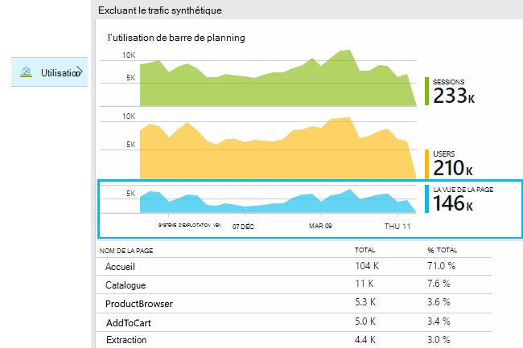

* **Utilisateurs :** Le nombre d’utilisateurs actifs distincts dans la plage de temps du graphique. 
* **Sessions :** Le nombre de sessions actives
* **Affichages de page** Compte le nombre d’appels à trackPageView(), généralement appelé une fois dans chaque page web.

Cliquez sur tous les graphiques pour afficher plus en détail. Notez que vous pouvez modifier la plage horaire des graphiques.

### <a name="where-do-my-users-live"></a>Où mes utilisateurs live ?

À partir de la carte de l’utilisation, cliquez sur le graphique utilisateurs pour afficher plus en détail :

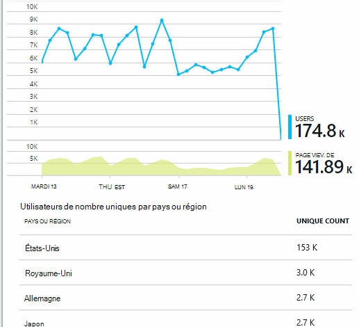
 
### <a name="what-browsers-or-operating-systems-do-they-use"></a>Quels navigateurs ou les systèmes d’exploitation ils utilisez-vous ?

Grouper (segment) des données par une propriété comme navigateur, système d’exploitation ou City :

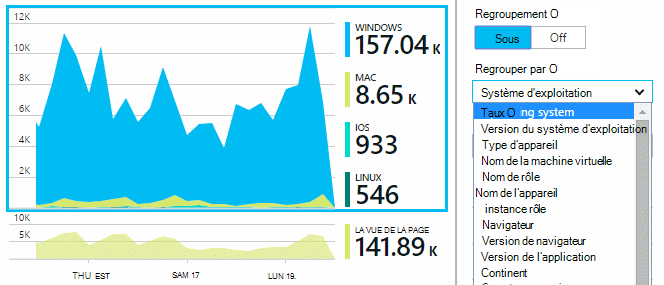


## <a name="sessions"></a>Sessions

Session est des concepts fondamentaux de Insights d’Application, qui s’efforce d’associer chaque événement de télémétrie - par exemple, demandes, des affichages de page, des exceptions, ou des événements personnalisés que vous le code vous-même - à une session utilisateur spécifique. 

Informations de contexte enrichi sont collectées sur chaque session, tels que les caractéristiques de l’appareil, emplacement géographique, système d’exploitation et ainsi de suite.

Si vous instrumentez le client et le serveur ([ASP.NET] [ greenbrown] ou [J2EE][java]), le SDK seront propagées l’id de session entre client et serveur, afin que les événements des deux côtés peuvent être mis en corrélation.

Lorsque [diagnostiquer les problèmes][diagnostic], vous pouvez rechercher tous les télémétrie liée à la session dans lequel un problème est survenu, y compris les exceptions toutes les requêtes et tous les événements, ou les traces qui ont été enregistrées.

Sessions fournissent une bonne mesure de la popularité des contextes tels que périphérique, système d’exploitation ou emplacement. En affichant le nombre de sessions regroupés par périphérique, par exemple, vous obtenez un inventaire plus précis de la fréquence à laquelle ce périphérique est utilisé avec votre application, qu’en comptant les affichages de page. Il s’agit d’une entrée utile pour trier les problèmes spécifiques à l’appareil.


#### <a name="whats-a-session"></a>Qu’est une session ?

Une session représente une seule rencontre entre l’utilisateur et l’application. Dans sa forme la plus simple, session commence par un utilisateur lancer l’application et se termine pas lorsque l’utilisateur quitte l’application. Pour les applications web, par défaut, la session se termine après 30 minutes d’inactivité ou après 24 heures d’activité. 

Vous pouvez modifier ces paramètres par défaut en modifiant l’extrait de code :

    <script type="text/javascript">
        var appInsights= ... { ... }({
            instrumentationKey: "...",
            sessionRenewalMs: 3600000,
            sessionExpirationMs: 172800000
        });

* `sessionRenewalMs`: La durée, en millisecondes, le point d’expirer la session en raison d’inactivité de l’utilisateur. Valeur par défaut : 30 minutes.
* `sessionExpirationMs`: La longueur maximale d’une session, en millisecondes. Si l’utilisateur reste active après cette fois, une autre session est comptée. Par défaut : 24 heures.

**Durée de la session** est une [métrique] [ metrics] qui enregistre l’intervalle de temps entre les éléments de télémétrie prénom et de la session. (Il ne comprend pas le délai d’expiration).

**Nombre de sessions** dans un intervalle donné est définie comme étant le nombre de sessions uniques avec une activité pendant cet intervalle. Lorsque vous examinez une plage beaucoup de temps tels que nombre de sessions quotidien pour la semaine précédente, il s’agit généralement équivalent au nombre total de sessions. 

Toutefois, lorsque vous explorez périodes plus courtes comme grains horaire, une session long couvrant plusieurs heures est comptée pour chaque heure dans lequel la session a été active. 

## <a name="users-and-user-counts"></a>Les utilisateurs et les nombres d’utilisateurs


Chaque session utilisateur est associée un id d’utilisateur unique. 

Par défaut, l’utilisateur est identifié en plaçant des cookies. Un utilisateur qui utilise plusieurs navigateurs ou appareils à compter plusieurs fois. (Mais voir [les utilisateurs authentifiés](#authenticated-users))


La métrique **nombre d’utilisateurs** dans un intervalle donné est définie comme étant le nombre d’utilisateurs uniques avec une activité enregistrée pendant cet intervalle. Par conséquent, les utilisateurs avec des sessions de temps peuvent être pris en compte plusieurs fois lorsque vous définissez un intervalle de temps pour que la grains est moins d’une heure ou afin.

**Nouveaux utilisateurs** compte les utilisateurs dont les sessions premières avec l’application s’est produite pendant cet intervalle. Si la méthode par défaut de l’inventaire par les utilisateurs par les cookies est utilisée, puis Cela inclura les utilisateurs qui ont désactivé leurs cookies, ou qui utilisent un nouvel appareil ou un navigateur pour accéder à votre application pour la première fois.
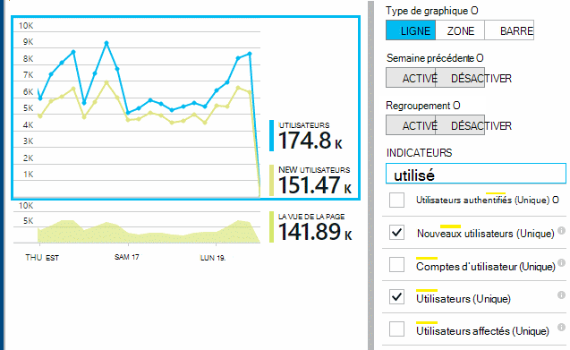

### <a name="authenticated-users"></a>Utilisateurs authentifiés

Si votre application web permet aux utilisateurs de se connecter, vous pouvez obtenir un inventaire plus précis en fournissant des perspectives Application avec un identificateur d’utilisateur unique. Il ne doit se trouver son nom ou le même id que vous utilisez dans votre application. Dès que votre application a identifié l’utilisateur, utilisez ce code :


*JavaScript au niveau client*

      appInsights.setAuthenticatedUserContext(userId);

Si votre application regroupe comptes d’utilisateurs, vous pouvez également passer un identificateur pour le compte. 

      appInsights.setAuthenticatedUserContext(userId, accountId);

L’ID d’utilisateur et de compte ne doivent pas contenir espaces ou les caractères`,;=|`


Dans l' [Explorateur de mesures](app-insights-metrics-explorer.md), vous pouvez créer un graphique des **comptes**et les **Utilisateurs authentifiés** . 

## <a name="synthetic-traffic"></a>Trafic synthétique

Le trafic synthétique inclut les requêtes à partir des tests de disponibilité et de chargement, robots des moteurs de recherche et d’autres agents. 

Applications tentatives d’analyse des s’efforce de déterminer automatiquement et classer le trafic synthétique et marquez-le correctement. Dans la plupart des cas, le trafic synthétique n’appelle pas le SDK JavaScript, afin que cette activité est exclue de l’utilisateur et de comptage de session. 

Toutefois, pour les idées Application [tests de site web][availability], l’id d’utilisateur est définie automatiquement en fonction emplacement POP et id de session est définie en fonction de la série de tests id. Par défaut des rapports, le trafic synthétique est filtré par défaut, ce qui va exclure ces utilisateurs et les sessions. Toutefois, lorsque le trafic synthétique est inclus, il peut entraîner une augmentation petite dans l’ensemble des utilisateurs et le nombre de session.
 
## <a name="page-usage"></a>Utilisation des pages

Cliquez sur la page de modes graphique pour obtenir une version plus zoom dans avec une répartition de vos pages les plus populaires :


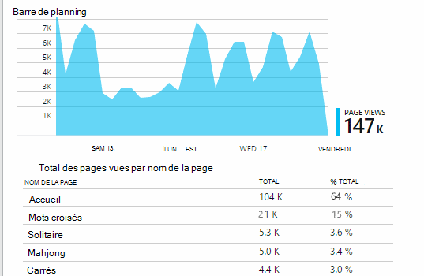
 
L’exemple ci-dessus est d’un site Web jeux. À partir de celui-ci nous pouvons voir instantanément :

* L’utilisation n’a pas été améliorée dans la semaine précédente. Peut-être que nous devons penser optimisation du moteur de recherche ?
* Beaucoup moins reportez-vous aux pages de jeux à la page d’accueil. Pourquoi ne notre page d’accueil attirer des personnes à participer à des jeux ?
* « Mots croisés » correspond au jeu les plus populaires. Nous devons donner la priorité à nouvelles idées et améliorations il.

## <a name="custom-tracking"></a>Suivi personnalisé

Supposons qu’au lieu d’implémenter chaque partie dans une page web distincte, vous décidez de refactoriser les toutes dans la même application page simple, avec la plupart des fonctionnalités codée en tant que Javascript dans la page web. Cela permet à l’utilisateur de basculer rapidement un jeu ou un autre ou même plusieurs jeux sur une seule page. 

Mais que vous voulez toujours Insights Application pour ouvrir une session le nombre de fois où chaque jeu est ouvert, dans la même façon que lorsqu’elles sont sur des pages web distinctes. C’est très simple : simplement insérer un appel vers le module de télémétrie dans votre JavaScript où vous souhaitez enregistrement une nouvelle « page » a ouvert :

    appInsights.trackPageView(game.Name);

## <a name="custom-events"></a>Événements personnalisés

Écrire télémétrie personnalisé afin de vous connecter à des événements spécifiques. En particulier dans une application d’une page simple, vous souhaiterez savoir la fréquence à laquelle l’utilisateur effectue les actions particuliers ou atteint certains objectifs : 

    appInsights.trackEvent("GameEnd");

Par exemple, pour ouvrir une session en cliquant sur un lien :

    <a href="target.htm" onclick="appInsights.trackEvent('linkClick');return true;">my link</a>


## <a name="view-counts-of-custom-events"></a>Afficher le nombre d’événements personnalisés

Ouvrez l’Explorateur métriques et ajouter un graphique pour afficher les événements. Segment par nom :

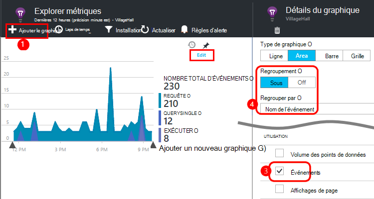


## <a name="drill-into-specific-events"></a>Explorer les événements spécifiques

Pour obtenir un mieux comprendre comment ouvre une session classique, vous souhaiterez peut-être vous concentrer sur une session utilisateur spécifique qui contient un type particulier d’événement. 

Dans cet exemple, nous codée un événement « NoGame » qui est appelé si l’utilisateur se déconnecte sans réellement démarrer un jeu personnalisé. Pourquoi un utilisateur pour cela ? Peut-être que nous Explorez certaines occurrences spécifiques, nous obtiendrez un indice. 

Les événements personnalisés provenant de l’application sont répertoriés par nom dans la carte de vue d’ensemble :


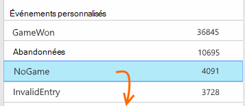
 
Cliquez sur l’événement de votre choix, puis sélectionnez une occurrence spécifique récente :


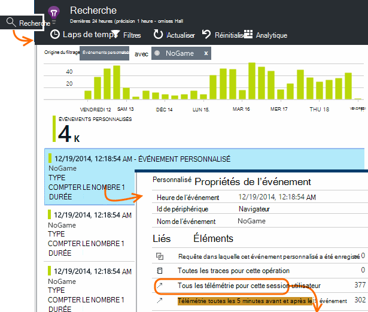
 
Examinons tous les télémétrie pour la session dans laquelle cet événement NoGame particulier s’est produite. 


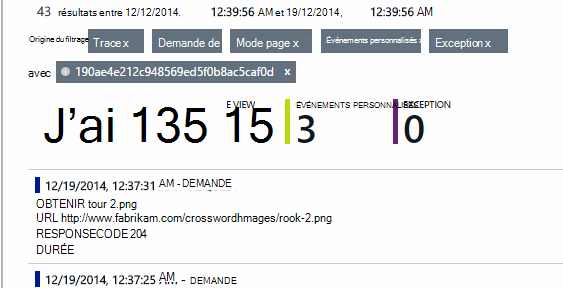
 
Qu’il n’existe aucune exceptions, afin que l’utilisateur n’a pas été empêché lecture par un échec.
 
Nous pouvons filtrer tous les types de télémétrie à l’exception des affichages de page pour cette session :


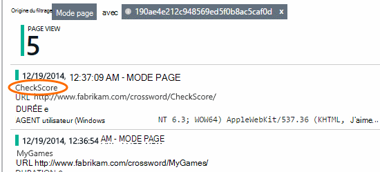
 
Et maintenant, nous voyons que cet utilisateur connecté simplement à vérifier les informations des plus récentes. Nous devons peut-être pensez à développer un récit utilisateur qui facilite le faire. (Et nous devons implémenter un événement personnalisé au rapport lorsque ce scénario spécifique se produit.)

## <a name="filter-search-and-segment-your-data-with-properties"></a>Filtrer, rechercher et segmenter vos données avec les propriétés
Vous pouvez joindre arbitraires balises et des valeurs numériques aux événements.
 

*JavaScript au niveau client*

```JavaScript

    appInsights.trackEvent("WinGame",
        // String properties:
        {Game: currentGame.name, Difficulty: currentGame.difficulty},
        // Numeric measurements:
        {Score: currentGame.score, Opponents: currentGame.opponentCount}
    );
```

*C# sur le serveur*

```C#

    // Set up some properties:
    var properties = new Dictionary <string, string> 
        {{"game", currentGame.Name}, {"difficulty", currentGame.Difficulty}};
    var measurements = new Dictionary <string, double>
        {{"Score", currentGame.Score}, {"Opponents", currentGame.OpponentCount}};

    // Send the event:
    telemetry.TrackEvent("WinGame", properties, measurements);
```

*Visual Basic sur le serveur*

```VB

    ' Set up some properties:
    Dim properties = New Dictionary (Of String, String)
    properties.Add("game", currentGame.Name)
    properties.Add("difficulty", currentGame.Difficulty)

    Dim measurements = New Dictionary (Of String, Double)
    measurements.Add("Score", currentGame.Score)
    measurements.Add("Opponents", currentGame.OpponentCount)

    ' Send the event:
    telemetry.TrackEvent("WinGame", properties, measurements)
```

Joindre des propriétés des affichages de page de la même façon :

*JavaScript au niveau client*

```JS

    appInsights.trackPageView("Win", 
        url,
        {Game: currentGame.Name}, 
        {Score: currentGame.Score});
```

Dans Rechercher des diagnostics, afficher les propriétés en cliquant sur via une occurrence d’un événement.


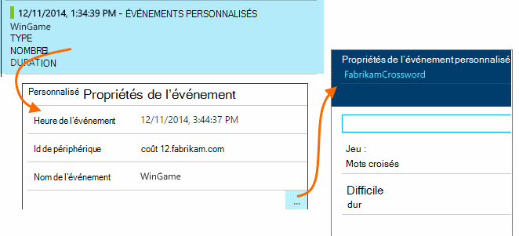
 
Utilisez le champ de recherche pour afficher les occurrences d’événement avec une valeur de propriété particulière.


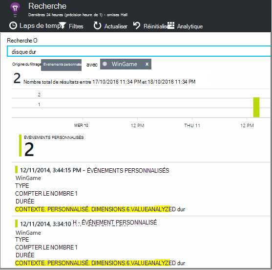


## <a name="a--b-testing"></a>A | Test B

Si vous ne savez pas quel type variant d’une fonctionnalité sera plus efficace, relâchez chacun d’eux, rendre chaque accessible à d’autres utilisateurs. Mesurer le succès de chaque et déplacez-le vers une version unifiée.

Pour cette technique, vous attachez balises distincts à tous les télémétrie envoyées par chaque version de votre application. Vous pouvez faire qui en définissant des propriétés dans le TelemetryContext active. Ces propriétés par défaut sont ajoutées à chaque message de télémétrie que l’application envoie - pas seulement vos messages personnalisés, mais également la télémétrie standard. 

Dans le portail d’Application perspectives, vous puis pourrez pour filtrer et grouper (segment) vos données sur les balises, afin de comparer les différentes versions.

*C# sur le serveur*

```C#

    using Microsoft.ApplicationInsights.DataContracts;

    var context = new TelemetryContext();
    context.Properties["Game"] = currentGame.Name;
    var telemetry = new TelemetryClient(context);
    // Now all telemetry will automatically be sent with the context property:
    telemetry.TrackEvent("WinGame");
```

*Visual Basic sur le serveur*

```VB

    Dim context = New TelemetryContext
    context.Properties("Game") = currentGame.Name
    Dim telemetry = New TelemetryClient(context)
    ' Now all telemetry will automatically be sent with the context property:
    telemetry.TrackEvent("WinGame")
```

Télémétrie individuel peut remplacer les valeurs par défaut.

Vous pouvez configurer un initialiseur universel afin que tous les TelemetryClients nouveau utiliser automatiquement votre contexte.

```C#


    // Telemetry initializer class
    public class MyTelemetryInitializer : ITelemetryInitializer
    {
        public void Initialize (ITelemetry telemetry)
        {
            telemetry.Properties["AppVersion"] = "v2.1";
        }
    }
```

Dans l’initialiseur application comme Global.asax.cs :

```C#

    protected void Application_Start()
    {
        // ...
        TelemetryConfiguration.Active.TelemetryInitializers
        .Add(new MyTelemetryInitializer());
    }
```


## <a name="build---measure---learn"></a>Génération - mesure - en savoir plus

Lorsque vous utilisez analytique, celle-ci devient partie intégrante de votre cycle de développement, pas simplement quelque chose que vous pensez que sur le point d’aider à résoudre les problèmes. Voici quelques conseils :

* Déterminer les mesures clés de votre application. Vous voulez utilisateurs autant que possible, ou vous préférez un petit ensemble d’utilisateurs Joyeux ? Vous voulez agrandir visites ou ventes ?
* Plan de mesurer chaque récit. Lorsque vous dessinez un nouveau récit utilisateur ou fonctionnalité ou plan pour mettre à jour une existante, réfléchissez toujours à comment vous allez mesurer la réussite de la modification. Avant de coder démarre, demandez à « effet que cela sera nos unités de mesure, si cela fonctionne ? Devons nous effectuer le suivi de tous les nouveaux événements ? »
Et bien entendu, lorsque la fonctionnalité est en ligne, vérifiez que vous examinez l’analytique et agir sur les résultats. 
* Mettre en relation d’autres mesures de la clé symétrique. Par exemple, si vous ajoutez une fonctionnalité « favoris », vous voulez connaître la fréquence à laquelle les utilisateurs ajouter aux Favoris. Mais il est peut-être plus intéressant de savoir la fréquence à laquelle ils sont revenir à leurs favoris. Et, plus important, les clients qui utilisent des Favoris achètent plus de votre produit ?
* Canaries test. Configurer un commutateur fonctionnalité qui permet de rendre une nouvelle fonctionnalité visible uniquement à certains utilisateurs. Utilisez Application perspectives pour voir si la nouvelle fonctionnalité est utilisée dans la façon dont vous prévues. Des ajustements, puis relâchez à un public plus large.
* Parler à vos utilisateurs ! Analytique n’est pas suffisamment dans sa propre, mais complémentaire pour conserver une relation client appropriée.


## <a name="references"></a>Références

* [À l’aide de l’API - vue d’ensemble][api]
* [Référence de l’API JavaScript](https://github.com/Microsoft/ApplicationInsights-JS/blob/master/API-reference.md)

## <a name="video"></a>Vidéo

> [AZURE.VIDEO usage-monitoring-application-insights]


<!--Link references-->

[api]: app-insights-api-custom-events-metrics.md
[availability]: app-insights-monitor-web-app-availability.md
[client]: app-insights-javascript.md
[diagnostic]: app-insights-diagnostic-search.md
[greenbrown]: app-insights-asp-net.md
[java]: app-insights-java-get-started.md
[metrics]: app-insights-metrics-explorer.md
[portal]: http://portal.azure.com/
[windows]: app-insights-windows-get-started.md

 
