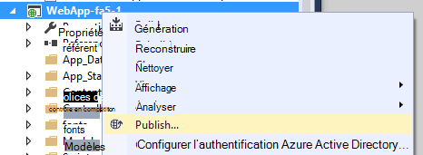

<properties
    pageTitle="Services d’application perspectives pour Windows et les rôles de travail | Microsoft Azure"
    description="Ajouter manuellement le Kit de développement de perspectives Application à votre application ASP.NET pour analyser l’utilisation et les performances."
    services="application-insights"
    documentationCenter=".net"
    authors="alancameronwills"
    manager="douge"/>

<tags
    ms.service="application-insights"
    ms.workload="tbd"
    ms.tgt_pltfrm="ibiza"
    ms.devlang="na"
    ms.topic="get-started-article"
    ms.date="08/30/2016"
    ms.author="awills"/>

# Configurer manuellement les applications perspectives pour les applications ASP.NET 4

*Analyse de l’application est en mode Aperçu.*

[AZURE.INCLUDE [app-insights-selector-get-started](../../includes/app-insights-selector-get-started.md)]

Vous pouvez configurer manuellement [Visual Studio Application analyse](app-insights-overview.md) pour analyser les services Windows, les rôles de travail et les autres applications ASP.NET. Pour les applications web, une configuration manuelle est une alternative à la [configuration automatique](app-insights-asp-net.md) offertes par Visual Studio.

Analyse de l’application vous permet de diagnostiquer les problèmes et surveiller les performances et l’utilisation de vos applications en ligne.

#### Avant de commencer

Tu as besoin de :

* Un abonnement à [Microsoft Azure](http://azure.com). Si votre équipe ou organisation dispose d’un abonnement Azure, le propriétaire peut vous ajouter au, à l’aide de votre [compte Microsoft](http://live.com).
* Visual Studio 2013 ou version ultérieure.

## 1. création d’une ressource d’Application perspectives

Se connecter au [portail Azure](https://portal.azure.com/)et créez une nouvelle ressource Application perspectives. Sélectionnez ASP.NET en tant que le type d’application.

Une [ressource](app-insights-resources-roles-access-control.md) dans Azure est une instance d’un service. Cette ressource est l’endroit où télémétrie depuis votre application est analysée et vous invite à.

Le choix du type d’application définit le contenu par défaut des propriétés et les cartes de ressources visible dans [l’Explorateur de mesures](app-insights-metrics-explorer.md).

#### Copiez la clé d’Instrumentation

La clé identifie la ressource, et vous devez l’installer disponible dans le Kit de développement pour diriger les données à la ressource.

Les étapes que vous venez de faire pour créer une nouvelle ressource sont un bon moyen de démarrer le contrôle n’importe quelle application. Désormais, vous pouvez envoyer des données à celui-ci.

## 2. Installez le Kit de développement dans votre application

Installer et configurer le Kit de développement de perspectives Application varient selon la plateforme sur laquelle vous travaillez. Pour les applications ASP.NET, il est facile.

1. Dans Visual Studio, modifiez les packages NuGet de votre projet d’application web.

    

2. Installer l’Application Insights SDK pour les applications Web.

    

    *Puis-je utiliser d’autres packages ?*

    Oui. Choisissez l’API Core (Microsoft.ApplicationInsights) si vous voulez uniquement utiliser l’API pour envoyer votre propre télémétrie. Le package Windows Server inclut automatiquement l’API Core plus un certain nombre d’autres packages tels que collecte compteur de performance et de surveillance des dépendances. 

#### Mise à niveau vers les versions ultérieures du Kit de développement

Nous publiez une nouvelle version du Kit de développement de temps à autre.

Pour mettre à niveau vers une [nouvelle version du Kit de développement](https://github.com/Microsoft/ApplicationInsights-dotnet-server/releases/), ouvrez à nouveau le Gestionnaire de package NuGet et de filtrer packages installés. Sélectionnez **Microsoft.ApplicationInsights.Web** et choisissez **mettre à niveau**.

Si vous avez ApplicationInsights.config toutes les personnalisations, enregistrez une copie de celui-ci avant de mettre à niveau et par la suite fusionner vos modifications dans la nouvelle version.

## 3. envoyer de télémétrie

**Si vous avez installé le package d’API de base :**

* Définir la clé d’instrumentation dans le code, par exemple dans `main()`: 

    `TelemetryConfiguration.Active.InstrumentationKey = "`*votre clé*`";` 

* [Écrivez votre propre à l’aide de l’API de télémétrie](app-insights-api-custom-events-metrics.md#ikey).

**Si vous avez installé autres packages d’Application perspectives,** vous pouvez, si vous préférez, utilisez le fichier .config pour définir la clé d’instrumentation :

* Modifier ApplicationInsights.config (qui a été ajouté par l’installation NuGet). Insérer juste avant la balise de fermeture :

    `<InstrumentationKey>`*la clé d’instrumentation que vous avez copié*`</InstrumentationKey>`

* Vérifiez que les propriétés de ApplicationInsights.config dans l’Explorateur de solutions sont définies **Build Action = Content, copier dans le répertoire de sortie = copier**.

## Exécuter votre projet

Utilisez le **F5** pour exécuter votre application et essayez-le : ouvrir les différentes pages pour générer certains télémétrie.

Dans Visual Studio, vous verrez un compteur des événements qui ont été envoyés.

## Afficher votre télémétrie

Revenez au [portail Azure](https://portal.azure.com/) et naviguez jusqu'à votre ressource Application perspectives.

Rechercher des données dans les graphiques de vue d’ensemble. Tout d’abord, vous ne voyez un ou deux points. Par exemple :

Cliquez dans un graphique quelconque pour afficher plus d’indicateurs. [En savoir plus sur les mesures.](app-insights-web-monitor-performance.md)

#### Aucune donnée ?

* Utiliser l’application, ouvrez différentes pages afin qu’il génère certaines télémétrie.
* Ouvrez la fenêtre de [recherche](app-insights-diagnostic-search.md) , pour consulter des événements particuliers. Parfois nécessaire événements un peu pendant plus de temps pour obtenir dans le pipeline de mesures.
* Patientez quelques secondes, puis cliquez sur **Actualiser**. Graphiques elles-mêmes actualiser régulièrement, mais vous pouvez actualiser manuellement si vous êtes en attente pour des données s’affiche.
* Voir [résolution des problèmes](app-insights-troubleshoot-faq.md).

## Publier votre application

Maintenant déployer votre application sur votre serveur ou sur Azure et regarder les données s’accumuler.

Lorsque vous exécutez en mode débogage, télémétrie est expédiée dans le pipeline, afin que les données figurant dans les secondes qui doit s’afficher. Lorsque vous déployez votre application dans configuration Release, les données sont additionnés plus lente.

#### Aucune donnée une fois que vous publiez sur le serveur ?

Ouvrez les ports pour le trafic sortant dans le pare-feu de votre serveur :

+ `dc.services.visualstudio.com:443`
+ `f5.services.visualstudio.com:443`

#### Problèmes sur votre serveur de génération ?

Consultez [cet article de résolution des problèmes](app-insights-asp-net-troubleshoot-no-data.md#NuGetBuild).

> [AZURE.NOTE]Si votre application génère un grand nombre de télémétrie (et l’utilisation de la 2.0.0-beta3 version ASP.NET SDK ou version ultérieure), le module d’échantillonnage adapté réduit automatiquement le volume est envoyé au portail en envoyant qu’une fraction représentant des événements. Toutefois, les événements liés à la même demande seront être activés ou désactivées en tant que groupe, afin que vous pouvez vous déplacer entre les événements liés. 
> [Découvrez les échantillonnages](app-insights-sampling.md).

## Étapes suivantes

* [Ajouter plus de télémétrie](app-insights-asp-net-more.md) pour obtenir la vue 360 degrés de votre application.

