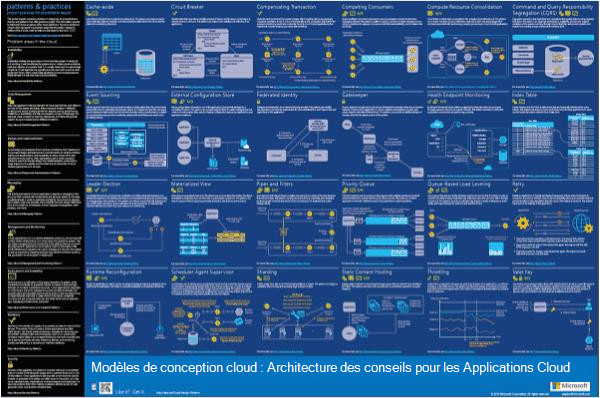
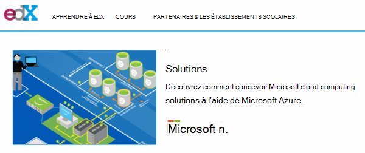
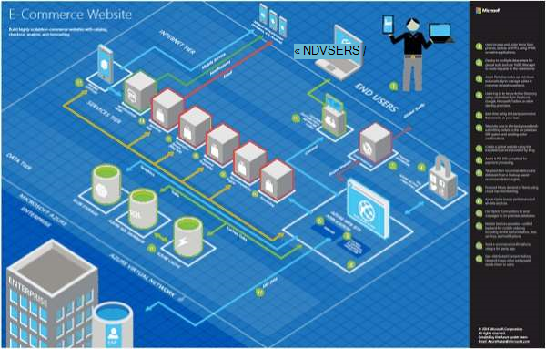
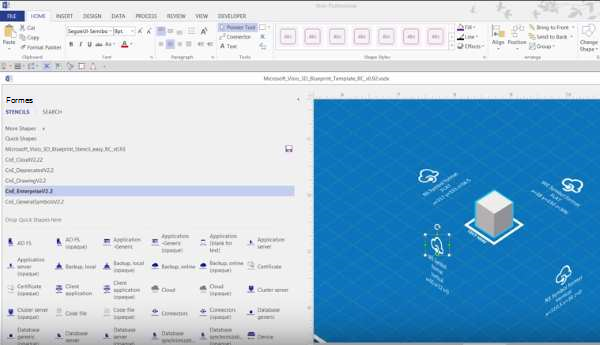
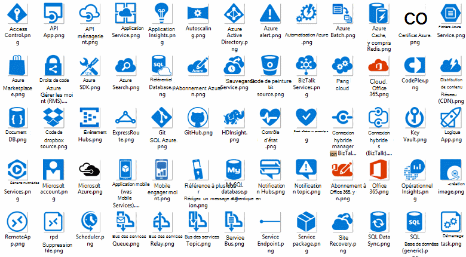
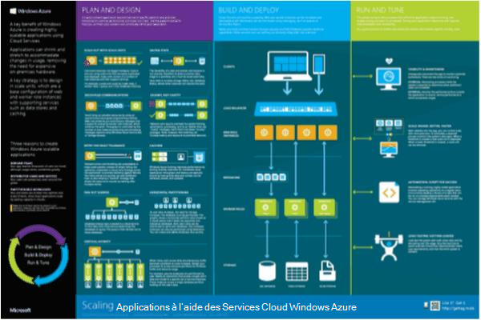

<properties 
    pageTitle="Architecture de l’application sur Microsoft Azure | Microsoft Azure" 
    description="Présentation de l’architecture qui recouvre des modèles de conception communs" 
    services="" 
    documentationCenter="" 
    authors="Rboucher" 
    manager="jwhit" 
    editor="mattshel"/>

<tags 
    ms.service="multiple" 
    ms.workload="na" 
    ms.tgt_pltfrm="na" 
    ms.devlang="na" 
    ms.topic="article" 
    ms.date="09/13/2016" 
    ms.author="robb"/>

#Architecture de l’application sur Microsoft Azure
Ressources pour la création d’applications qui utilisent Microsoft Azure. Cela inclut les outils pour vous aider à dessiner des diagrammes pour décrire visuellement les systèmes logiciels. 

##Affiche des modèles de conception

Motifs et méthodes Microsoft a publié le livre [Des modèles de conception Cloud](http://msdn.microsoft.com/library/dn568099.aspx) qui est disponible sur MSDN et dans le téléchargement du fichier PDF. Il existe également une affiche grand format disponible qui répertorie tous les modèles. 

##Cours de la certification Microsoft architecture

Microsoft a créé un cours architecture prenant en charge Microsoft examen de certification 70-534. Il est [disponible gratuitement sur EDX.ORG](https://www.edx.org/course/architecting-microsoft-azure-solutions-microsoft-dev205x).  Il utilise le [Modèle de Visio plan 3D](#3d-blueprint-visio-template). 

##Solutions de Microsoft

Microsoft publie un ensemble niveau élevé [architectures de solution](http://aka.ms/azblueprints) montrant comment créer des types de systèmes à l’aide des produits Microsoft spécifiques. 

Auparavant, Microsoft publié un ensemble de projets avec des exemples d’architecture. Ceux ont été remplacés par les architectures de solution mentionnés précédemment et le lien plan a été redirigé pour faire pointer vers les. Si vous devez accéder aux documents que les projets précédents pour une raison quelconque, veuillez envoyer un e-mail [CnESymbols@microsoft.com](mailto:CnESymbols@microsoft.com) avec votre requête.   

Les projets et diagrammes architectures de solution utilisent des parties du [Cloud et définir des symboles d’entreprise](#Drawing-symbol-and-icon-sets).   

##Modèle plan Visio 3D

Les versions 3D des [Projets d’Architecture Microsoft](http://aka.ms/azblueprints) désormais dépassé ont été créées initialement dans un outil non Microsoft. Modèle Visio 2013 (et versions ultérieur) expédiées 5 août 2015 dans le cadre d’un [cours de certification Microsoft Architecture distribué sur EDX.ORG](#microsoft-architecture-certification-course).

Le modèle est également disponible en dehors du cours. 

- [Afficher la vidéo de formation](http://aka.ms/3dBlueprintTemplateVideo) premier afin de déterminer ce qu’il peut faire   
- Télécharger le [Microsoft 3d plan Visio modèle](http://aka.ms/3DBlueprintTemplate)
- Télécharger [Cloud et symboles d’entreprise](#drawing-symbol-and-icon-sets) à utiliser avec le modèle 3D. 

Nous envoyer un e-mail à [CnESymbols@microsoft.com](mailto:CnESymbols@microsoft.com) pour des questions spécifiques sans réponse par les supports de formation ou à envoyer des commentaires. Le modèle n’est plus sous développement actif, mais il est toujours utile et pertinent car il peut utiliser n’importe quel PNG ou [nuage et symboles d’entreprise](#drawing-symbol-and-icon-sets), qui sont mises à jour.  

##Jeux de symbole et icône de dessin 

[Afficher les symboles vidéo de formation et Visio](http://aka.ms/CnESymbolsVideo) , puis [Télécharger le nuage et définir symbole d’entreprise](http://aka.ms/CnESymbols) pour créer des documents techniques qui décrivent Azure, Windows Server, SQL Server et plus encore. Vous pouvez utiliser les symboles de diagrammes d’architecture, supports de formation, des présentations, les feuilles de données, infographics, livres blancs et même 3e carnets de fête si la loi apprend sera utilisée pour les produits Microsoft. Toutefois, ils ne sont pas destinées à utiliser dans les interfaces utilisateur.

Les symboles CnE sont disponibles au format Visio, SVG et PNG. Des instructions supplémentaires sur l’utilisation de facilement utilisent les symboles de PowerPoint sont inclus dans l’ensemble. 

Le jeu de symboles fournie avec tous les trimestres et est mis à jour que nouveaux services sont disponibles. 

Autres symboles pour Microsoft Office et les technologies associées sont disponibles dans le [Gabarit de Microsoft Office Visio](http://www.microsoft.com/en-us/download/details.aspx?id=35772), même si elles ne sont pas optimisées pour les schémas d’architecture telles que le jeu CnE est.   

**Commentaires :** Si vous avez utilisé les symboles CnE, remplissez 5 question courte [enquête](http://aka.ms/azuresymbolssurveyv2) ou nous envoyer un e-mail à [CnESymbols@microsoft.com](mailto:CnESymbols@microsoft.com) pour les problèmes et questions spécifiques. Nous aimerions connaître votre avis, y compris les évaluations positives afin que nous en pour continuer à investir temps qu’ils. 

##Architecture Infographics

Microsoft publie plusieurs architecture liés posters/infographics. Ils incluent [Développement d’Applications Cloud réels](https://azure.microsoft.com/documentation/infographics/building-real-world-cloud-apps/) et [mise à l’échelle avec les Services Cloud](https://azure.microsoft.com/documentation/infographics/cloud-services/) . 

