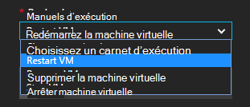

<properties
    pageTitle=" Résoudre les alertes de mémoire virtuelle Azure procédures opérationnelles Automation | Microsoft Azure"
    description="Cet article explique comment intégrer alertes Machine virtuelle Azure Azure Automation procédures opérationnelles et mise à jour automatique problèmes"
    services="automation"
    documentationCenter=""
    authors="mgoedtel"
    manager="jwhit"
    editor="tysonn" />    
<tags
    ms.service="automation"
    ms.devlang="na"
    ms.topic="article"
    ms.tgt_pltfrm="na"
    ms.workload="infrastructure-services"
    ms.date="06/14/2016"
    ms.author="csand;magoedte" />

# <a name="azure-automation-scenario---remediate-azure-vm-alerts"></a>Scénario d’automatisation Azure - remédier aux alertes machine virtuelle Azure

Azure Automation et Machines virtuelles Azure ont publié une nouvelle fonctionnalité qui vous permet de configurer des alertes de Machine virtuelle (machine virtuelle) pour exécuter les procédures opérationnelles Automation. Cette nouvelle fonctionnalité permet d’effectuer automatiquement une mise à jour standard en réponse aux alertes de mémoire virtuelle, comme le redémarrage ou l’arrêt de la machine virtuelle.

Précédemment, lors de la création d’une règle d’alerte machine virtuelle vous pouviez [spécifier un webhook automatisation](https://azure.microsoft.com/blog/using-azure-automation-to-take-actions-on-azure-alerts/) à un runbook pour pouvoir exécuter la procédure opérationnelle chaque fois que l’alerte déclenchée. Toutefois, cette nécessaire vous permettent d’effectuer le travail de création du runbook, création de la webhook pour la runbook, puis la copie et collage de la webhook lors de la création d’une règle d’alerte. Avec cette nouvelle version, le processus est beaucoup plus facile, car vous pouvez choisir directement un runbook dans une liste lors de la création d’une règle d’alerte, et vous pouvez choisir un compte Automation qui peuvent être exécutées du runbook ou créer facilement un compte.

Dans cet article, nous montre qu’il est facile à configurer une alerte machine virtuelle Azure et configurer un runbook Automation d’exécuter lorsque l’alerte se déclenche. Exemples de scénarios incluent le redémarrage d’un ordinateur virtuel lors de l’utilisation de la mémoire dépasse un seuil en raison d’une application sur l’ordinateur virtuel avec une perte de mémoire ou arrêter une machine virtuelle lorsque le temps utilisateur processeur a été inférieure à 1 % pendant les heures passées et n’est pas en cours d’utilisation. Nous vous expliquerons également comment la création automatique d’un service principal dans votre compte Automation simplifie l’utilisation des procédures opérationnelles dans Azure alerte mise à jour.

## <a name="create-an-alert-on-a-vm"></a>Créer une alerte pour une machine virtuelle

Effectuez les opérations suivantes pour configurer une alerte pour lancer une procédure opérationnelle lorsque son seuil a été satisfait.

>[AZURE.NOTE] Dans cette version, nous ne prennent en charge machines virtuelles V2 et prise en charge pour classique machines virtuelles seront bientôt ajoutés.  

1. Connectez-vous au portail Azure, cliquez sur **Machines virtuelles**.  
2. Sélectionnez une de vos machines virtuelles.  La carte de tableau de bord machine virtuelle s’affichent et les **paramètres** à sa droite.  
3. À partir de la carte de **paramètres** , sous la section Surveillance sélectionnez **règles d’alerte**.
4. Dans la carte de **règles d’alerte** , cliquez sur **Ajouter une alerte**.

Cette action ouvre la carte **Ajouter une règle d’alerte** , où vous pouvez configurer les conditions de l’alerte et choisir parmi un ou plusieurs des options suivantes : envoyer des messages électroniques à une personne, utilisez un webhook transférer l’alerte vers un autre système, et/ou l’exécution d’une procédure d’automatisation opérationnelle tentative de réponse à la résolution des problèmes.

## <a name="configure-a-runbook"></a>Configurer un runbook

Pour configurer un runbook à exécuter lorsque le seuil d’alerte machine virtuelle est remplie, sélectionnez **Automation Runbook**. Dans la carte **runbook de configurer** , vous pouvez sélectionner la runbook pour exécuter et le compte Automation pour exécuter la procédure opérationnelle.


>[AZURE.NOTE] Pour cette version, vous pouvez choisir parmi trois procédures opérationnelles fournie par le service – machine virtuelle redémarrer, machine virtuelle arrêter ou supprimer machine virtuelle (supprimer).  Permet de sélectionner d’autres procédures opérationnelles ou l’un de vos propres procédures opérationnelles sera disponible dans une version ultérieure.



Une fois que vous sélectionnez une des trois des disponibles procédures opérationnelles, la liste déroulante **compte Automation** s’affiche et vous pouvez sélectionner un compte automation que la runbook doit s’exécuter en tant que. Procédures opérationnelles doivent s’exécuter dans le contexte d’un [compte d’automatisation](automation-security-overview.md) qui se trouve dans votre abonnement Azure. Vous pouvez sélectionner un compte Automation que vous avez déjà créé, ou vous pouvez choisir un nouveau compte Automation créé pour vous.

Les procédures opérationnelles fournis s’authentifier à Azure à l’aide d’un principal de service. Si vous choisissez d’exécuter la procédure opérationnelle dans un de vos comptes Automation existants, nous crée automatiquement le service principal pour vous. Si vous choisissez de créer un nouveau compte automatisation, nous allons automatiquement créer le compte et l’entité de service. Dans les deux cas, deux actifs seront également être créées dans le compte automatisation – un actif de certificat nommé **AzureRunAsCertificate** et une ressource de connexion nommé **AzureRunAsConnection**. Les procédures opérationnelles utilisera **AzureRunAsConnection** pour vous authentifier avec Azure pour effectuer l’action gestion contre la machine virtuelle.

>[AZURE.NOTE] L’entité de service est créée dans l’étendue d’abonnement et le rôle de collaborateur est attribuée. Ce rôle est requis pour le compte à est autorisé à exécuter les procédures opérationnelles Automation puisse gérer machines virtuelles Azure.  La création d’un compte Automaton et/ou service principal est un événement ponctuel. Une fois qu’ils sont créés, vous pouvez utiliser ce compte pour exécuter les procédures opérationnelles d’autres alertes machine virtuelle Azure.

Lorsque vous cliquez sur **OK** l’alerte est configuré et si vous avez sélectionné l’option pour créer un nouveau compte automatisation, il est créé en même temps que le service principal.  Cela peut prendre quelques secondes pour terminer.  


Une fois la configuration terminée, vous verrez le nom de la procédure opérationnelle apparaissent dans la carte **Ajouter une règle d’alerte** .


Cliquez sur **OK** dans **Ajouter une règle d’alerte** carte et la règle d’alerte est créés et activer si la machine virtuelle est en cours d’exécution.

### <a name="enable-or-disable-a-runbook"></a>Activer ou désactiver un runbook

Si vous avez un runbook configurée pour une alerte, vous pouvez le désactiver sans supprimer la configuration du runbook. Cela permet de conserver l’alerte en cours d’exécution et peut-être tester certaines des règles d’alerte et alors réactiver ultérieurement la procédure opérationnelle.

## <a name="create-a-runbook-that-works-with-an-azure-alert"></a>Créer une procédure opérationnelle qui fonctionne avec une alerte Azure

Lorsque vous choisissez une runbook dans le cadre d’une règle d’alerte Azure, la runbook doit avoir logique dans la liste pour gérer les données d’alerte qui lui sont passées.  Lorsqu’un runbook est configuré dans une règle d’alerte, un webhook est créé pour la runbook ; Ce webhook est ensuite utilisé pour démarrer la runbook chaque fois que l’alerte se déclenche.  L’appel réel pour démarrer la procédure opérationnelle est une demande HTTP POST à l’URL webhook. Le corps de la requête POST contient un objet JSON formatée qui contient des propriétés utiles relatives à l’alerte.  Comme vous pouvez le voir ci-dessous, les données d’alerte contient des informations comme subscriptionID, resourceGroupName, resourceName et du type de ressource.

### <a name="example-of-alert-data"></a>Exemple de données d’alerte
```
{
    "WebhookName": "AzureAlertTest",
    "RequestBody": "{
    \"status\":\"Activated\",
    \"context\": {
        \"id\":\"/subscriptions/<subscriptionId>/resourceGroups/MyResourceGroup/providers/microsoft.insights/alertrules/AlertTest\",
        \"name\":\"AlertTest\",
        \"description\":\"\",
        \"condition\": {
            \"metricName\":\"CPU percentage guest OS\",
            \"metricUnit\":\"Percent\",
            \"metricValue\":\"4.26337916666667\",
            \"threshold\":\"1\",
            \"windowSize\":\"60\",
            \"timeAggregation\":\"Average\",
            \"operator\":\"GreaterThan\"},
        \"subscriptionId\":\<subscriptionID> \",
        \"resourceGroupName\":\"TestResourceGroup\",
        \"timestamp\":\"2016-04-24T23:19:50.1440170Z\",
        \"resourceName\":\"TestVM\",
        \"resourceType\":\"microsoft.compute/virtualmachines\",
        \"resourceRegion\":\"westus\",
        \"resourceId\":\"/subscriptions/<subscriptionId>/resourceGroups/TestResourceGroup/providers/Microsoft.Compute/virtualMachines/TestVM\",
        \"portalLink\":\"https://portal.azure.com/#resource/subscriptions/<subscriptionId>/resourceGroups/TestResourceGroup/providers/Microsoft.Compute/virtualMachines/TestVM\"
        },
    \"properties\":{}
    }",
    "RequestHeader": {
        "Connection": "Keep-Alive",
        "Host": "<webhookURL>"
    }
}
```

Lorsque le service de webhook Automation reçoit le billet HTTP, il extrait les données d’alerte et passe à la runbook dans le paramètre d’entrée de procédure opérationnelle WebhookData.  Voici un exemple de procédure opérationnelle qui montre comment utiliser le paramètre WebhookData et extraire les données d’alerte et utilisez-le pour gérer la ressource Azure qui a déclenché l’alerte.

### <a name="example-runbook"></a>Exemple runbook

```
#  This runbook will restart an ARM (V2) VM in response to an Azure VM alert.

[OutputType("PSAzureOperationResponse")]

param ( [object] $WebhookData )

if ($WebhookData)
{
    # Get the data object from WebhookData
    $WebhookBody = (ConvertFrom-Json -InputObject $WebhookData.RequestBody)

    # Assure that the alert status is 'Activated' (alert condition went from false to true)
    # and not 'Resolved' (alert condition went from true to false)
    if ($WebhookBody.status -eq "Activated")
    {
        # Get the info needed to identify the VM
        $AlertContext = [object] $WebhookBody.context
        $ResourceName = $AlertContext.resourceName
        $ResourceType = $AlertContext.resourceType
        $ResourceGroupName = $AlertContext.resourceGroupName
        $SubId = $AlertContext.subscriptionId

        # Assure that this is the expected resource type
        Write-Verbose "ResourceType: $ResourceType"
        if ($ResourceType -eq "microsoft.compute/virtualmachines")
        {
            # This is an ARM (V2) VM

            # Authenticate to Azure with service principal and certificate
            $ConnectionAssetName = "AzureRunAsConnection"
            $Conn = Get-AutomationConnection -Name $ConnectionAssetName
            if ($Conn -eq $null) {
                throw "Could not retrieve connection asset: $ConnectionAssetName. Check that this asset exists in the Automation account."
            }
            Add-AzureRMAccount -ServicePrincipal -Tenant $Conn.TenantID -ApplicationId $Conn.ApplicationID -CertificateThumbprint $Conn.CertificateThumbprint | Write-Verbose
            Set-AzureRmContext -SubscriptionId $SubId -ErrorAction Stop | Write-Verbose

            # Restart the VM
            Restart-AzureRmVM -Name $ResourceName -ResourceGroupName $ResourceGroupName
        } else {
            Write-Error "$ResourceType is not a supported resource type for this runbook."
        }
    } else {
        # The alert status was not 'Activated' so no action taken
        Write-Verbose ("No action taken. Alert status: " + $WebhookBody.status)
    }
} else {
    Write-Error "This runbook is meant to be started from an Azure alert only."
}
```

## <a name="summary"></a>Résumé

Lorsque vous configurez une alerte sur un ordinateur virtuel Azure, vous avez désormais la possibilité pour configurer un runbook Automation pour effectuer automatiquement une action de conversion lorsque l’alerte se déclenche en toute simplicité. Pour cette version, vous pouvez choisir de procédures opérationnelles redémarrer, arrêter ou supprimer une machine virtuelle en fonction de votre scénario alerte. Il s’agit évidemment de l’activation de scénarios dans laquelle vous contrôlez les actions (notification, résoudre les problèmes conversion) qui seront exécutées automatiquement lorsqu’une alerte se déclenche.

## <a name="next-steps"></a>Étapes suivantes

- Pour commencer à utiliser les procédures opérationnelles graphiques, voir [Mon premier runbook de graphique](automation-first-runbook-graphical.md)
- Pour commencer à utiliser les procédures opérationnelles de flux de travail de PowerShell, voir [Mon premier runbook de flux de travail PowerShell](automation-first-runbook-textual.md)
- Pour en savoir plus sur les limitations, leurs avantages et leurs types runbook, voir [types de runbook Automation Azure](automation-runbook-types.md)
