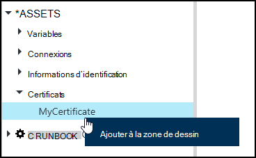
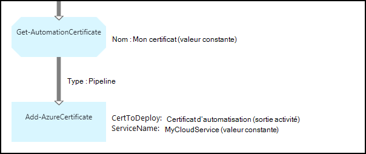

<properties 
   pageTitle="Certificat actifs dans Azure automatisation | Microsoft Azure"
   description="Certificats peuvent être stockés en toute sécurité dans Azure Automation afin qu’ils sont accessibles par les procédures opérationnelles ou configurations DSC à s’authentifier Azure et ressources tiers.  Cet article explique les détails des certificats et comment les utiliser dans textuelles et graphiques de création."
   services="automation"
   documentationCenter=""
   authors="mgoedtel"
   manager="stevenka"
   editor="tysonn" />
<tags 
   ms.service="automation"
   ms.devlang="na"
   ms.topic="article"
   ms.tgt_pltfrm="na"
   ms.workload="infrastructure-services"
   ms.date="02/23/2016"
   ms.author="magoedte;bwren" />

# Certificat actifs dans Azure Automation

Certificats peuvent être stockés en toute sécurité dans Azure Automation afin qu’ils sont accessibles par les procédures opérationnelles ou configurations DSC à l’aide de l’activité **Get-AutomationCertificate** . Cela vous permet de créer des procédures opérationnelles et configurations DSC qui utilisent des certificats pour l’authentification ou les ajoute aux ressources Azure ou tiers.

>[AZURE.NOTE] Sécurisation des ressources dans Azure Automation incluent les informations d’identification, des certificats, des connexions et des variables chiffrés. Ces éléments sont chiffrées et stockées dans l’Automation Azure à l’aide d’une clé unique est générée pour chaque compte automation. Cette clé est chiffrée par un certificat maître et stockée dans Azure Automation. Avant de stocker un bien sécurisé, la clé du compte automation est déchiffrée à l’aide du certificat maître et, utilisé pour chiffrer les biens.

## Applets de commande Windows PowerShell

Les applets de commande dans le tableau suivant sont utilisées pour créer et gérer les ressources de certificat automation avec Windows PowerShell. Ils sont fournis dans le cadre du [module Azure PowerShell](../powershell-install-configure.md) qui peut être utilisé dans les procédures opérationnelles Automation et configurations DSC.

|Applets de commande|Description|
|:---|:---|
|[Get-AzureAutomationCertificate](http://msdn.microsoft.com/library/dn913765.aspx)|Récupère des informations sur un certificat. Vous ne pouvez récupérer le certificat d’activité Get-AutomationCertificate.|
|[Nouvelle AzureAutomationCertificate](http://msdn.microsoft.com/library/dn913764.aspx)|Permet d’importer un nouveau certificat dans Azure Automation.|
|[Supprimer - AzureAutomationCertificate](http://msdn.microsoft.com/library/dn913773.aspx)|Supprime un certificat d’automatisation Azure.|
|[Set - AzureAutomationCertificate](http://msdn.microsoft.com/library/dn913763.aspx)|Définit les propriétés d’un certificat existant, y compris le téléchargement du fichier de certificat et le mot de passe pour un fichier .pfx.|

## Activités d’accéder aux certificats

Les activités dans le tableau suivant sont utilisées pour accéder aux certificats dans une configuration de DSC ou runbook.

|Activités|Description|
|:---|:---|
|Get-AutomationCertificate|Obtient un certificat à utiliser dans une configuration de DSC ou runbook.|

>[AZURE.NOTE] Évitez d’utiliser des variables dans le paramètre – Name de Get-AutomationCertificate dans la mesure où vous pouvez complique la découverte dépendances entre les procédures opérationnelles ou configurations DSC et de certificats actifs au moment de la conception.

## Création d’un certificat

Lorsque vous créez un nouveau certificat, vous téléchargez un fichier .cer ou .pfx à Automation Azure. Si vous sélectionnez le certificat exportable, vous pouvez également le transférer déconnecter le magasin de certificats Automation Azure. Si elle n’est pas exportable, puis il peut uniquement être utilisé pour la signature au sein de la configuration de DSC ou runbook.

### Pour créer un nouveau certificat grâce au portail classique Azure

1. À partir de votre compte automatisation, cliquez sur **ressources** dans la partie supérieure de la fenêtre.
1. Dans la partie inférieure de la fenêtre, cliquez sur **Ajouter un paramètre**.
1. Cliquez sur **Ajouter des informations d’identification**.
2. Dans la liste déroulante **Type d’informations d’identification** , sélectionnez le **certificat**.
3. Tapez un nom pour le certificat dans la zone **nom** , puis cliquez sur la flèche droite.
4. Rechercher un fichier .cer ou .pfx.  Si vous sélectionnez un fichier .pfx, spécifiez un mot de passe et si elle doit être autorisé à exporter.
1. Activez la case à cocher pour télécharger le fichier de certificat et enregistrer le nouveau certificat de capital.

### Pour créer un nouveau certificat grâce au portail Azure

1. À partir de votre compte automatisation, cliquez sur la partie de **biens** pour ouvrir la carte de **biens** .
1. Cliquez sur le composant **certificats** pour ouvrir la carte de **certificats** .
1. Cliquez sur **Ajouter un certificat** dans la partie supérieure de la cuillère.
2. Dans la zone **nom** , tapez un nom pour le certificat.
2. Cliquez sur **Sélectionner un fichier** sous **télécharger un fichier de certificat** pour rechercher un fichier .cer ou .pfx.  Si vous sélectionnez un fichier .pfx, spécifiez un mot de passe et si elle doit être autorisé à exporter.
1. Cliquez sur **créer** pour enregistrer le nouveau certificat de capital.

### Pour créer un nouveau certificat avec Windows PowerShell

Les exemples de commandes suivants montrent comment créer un nouveau certificat automation et marque exportable. Cela permet d’importer un fichier .pfx existant.

    $certName = 'MyCertificate'
    $certPath = '.\MyCert.pfx'
    $certPwd = ConvertTo-SecureString -String 'P@$$w0rd' -AsPlainText -Force
    
    New-AzureAutomationCertificate -AutomationAccountName "MyAutomationAccount" -Name $certName -Path $certPath –Password $certPwd -Exportable

## À l’aide d’un certificat

Vous devez utiliser l’activité **Get-AutomationCertificate** d’utiliser un certificat. Vous ne pouvez pas utiliser l’applet de commande [Get-AzureAutomationCertificate](http://msdn.microsoft.com/library/dn913765.aspx) dans la mesure où elle renvoie des informations sur la ressource certificat mais pas le certificat proprement dit.

### Exemple de runbook textuel

Le code suivant montre comment ajouter un certificat à un service cloud dans une procédure opérationnelle. Dans cet exemple, le mot de passe est extraite d’une variable automation chiffré.

    $serviceName = 'MyCloudService'
    $cert = Get-AutomationCertificate -Name 'MyCertificate'
    $certPwd = Get-AutomationVariable –Name 'MyCertPassword'
    Add-AzureCertificate -ServiceName $serviceName -CertToDeploy $cert

### Exemple de graphique runbook

Ajoutez un **Get-AutomationCertificate** à un graphique runbook en cliquant sur le certificat dans le volet de la bibliothèque de l’éditeur de graphique et en sélectionnant **Ajouter à la zone de dessin**.

L’image suivante montre un exemple d’utilisation d’un certificat dans un graphique runbook.  Il s’agit de l’exemple même ci-dessus pour ajouter un certificat à un service cloud à partir d’un runbook textuelle.  

Cet exemple utilise le paramètre **UseConnectionObject** défini pour l’activité **Envoyer TwilioSMS** qui utilise un objet de connexion pour l’authentification au service.  Un [lien pipeline](automation-graphical-authoring-intro.md#links-and-workflow) doit être utilisé ici dans la mesure où un lien séquence retournerait une collection de sites qui contient un objet unique qui le paramètre de connexion n’est pas attendu.

## Voir aussi

- [Liens lors de la création de graphique](automation-graphical-authoring-intro.md#links-and-workflow) 
