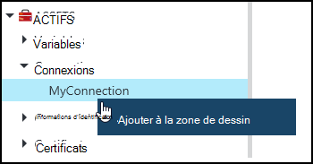
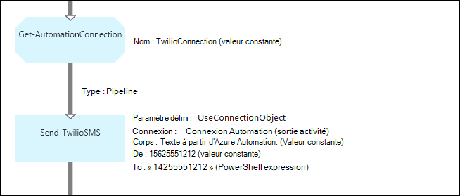
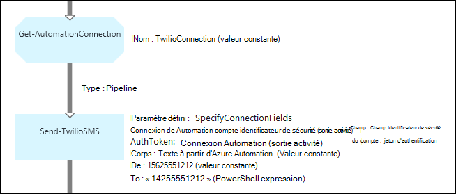

<properties 
   pageTitle="Éléments de connexion dans Azure automatisation | Microsoft Azure"
   description="Éléments de connexion dans Azure Automation contiennent les informations requises pour vous connecter à une application ou un service externe à partir d’une configuration de DSC ou runbook. Cet article explique les détails des connexions et comment les utiliser dans textuelles et graphiques de création."
   services="automation"
   documentationCenter=""
   authors="bwren"
   manager="stevenka"
   editor="tysonn" />
<tags 
   ms.service="automation"
   ms.devlang="na"
   ms.topic="article"
   ms.tgt_pltfrm="na"
   ms.workload="infrastructure-services"
   ms.date="01/27/2016"
   ms.author="bwren" />

# Éléments de connexion dans Azure Automation

Un bien connexion Automation contient les informations nécessaires pour vous connecter à une application ou un service externe à partir d’une configuration de DSC ou runbook. Cela peut inclure les informations requises pour l’authentification par exemple un nom d’utilisateur et mot de passe en plus des informations de connexion comme une URL ou un port. La valeur d’une connexion est tout en conservant toutes les propriétés de connexion à une application spécifique dans un actif au lieu de créer plusieurs variables. L’utilisateur peut modifier les valeurs d’une connexion à un seul endroit, et vous pouvez passer le nom d’une connexion à un runbook ou configuration DSC dans un seul paramètre. Les propriétés d’une connexion sont accessibles dans la configuration de DSC avec l’activité **Get-AutomationConnection** ou runbook.

Lorsque vous créez une connexion, vous devez spécifier un *type de connexion*. Le type de connexion est un modèle qui définit un ensemble de propriétés. La connexion définit des valeurs pour chaque propriété définie dans son type de connexion. Types de connexion sont ajoutés à Azure Automation dans les modules d’intégration ou créées avec l' [API d’automatisation d’Azure](http://msdn.microsoft.com/library/azure/mt163818.aspx). Les types de connexions uniquement qui sont disponibles lorsque vous créez une connexion sont ceux qui sont installés dans votre compte Automation.

>[AZURE.NOTE] Sécurisation des ressources dans Azure Automation incluent les informations d’identification, des certificats, des connexions et des variables chiffrés. Ces éléments sont chiffrées et stockées dans l’Automation Azure à l’aide d’une clé unique est générée pour chaque compte automation. Cette clé est chiffrée par un certificat maître et stockée dans Azure Automation. Avant de stocker un bien sécurisé, la clé du compte automation est déchiffrée à l’aide du certificat maître et, utilisé pour chiffrer les biens.

## Applets de commande Windows PowerShell

Les applets de commande dans le tableau suivant sont utilisées pour créer et gérer les connexions Automation avec Windows PowerShell. Ils sont fournis dans le cadre du [module Azure PowerShell](../powershell-install-configure.md) qui peut être utilisé dans les procédures opérationnelles Automation et configurations DSC.

|Applet de commande|Description|
|:---|:---|
|[Get-AzureAutomationConnection](http://msdn.microsoft.com/library/dn921828.aspx)|Extrait une connexion. Inclut une table de hachage avec les valeurs des champs de la connexion.|
|[Nouvelle AzureAutomationConnection](http://msdn.microsoft.com/library/dn921825.aspx)|Crée une nouvelle connexion.|
|[Supprimer AzureAutomationConnection](http://msdn.microsoft.com/library/dn921827.aspx)|Supprimer une connexion existante.|
|[Jeu de AzureAutomationConnectionFieldValue](http://msdn.microsoft.com/library/dn921826.aspx)|Définit la valeur d’un champ particulier pour une connexion existante.|

## Activités

Les activités dans le tableau suivant sont utilisées pour accéder aux connexions dans une configuration de DSC ou runbook.

|Activités|Description|
|---|---|
|Get-AutomationConnection|Obtient une connexion à utiliser. Renvoie une table de hachage avec les propriétés de la connexion.|

>[AZURE.NOTE] Évitez d’utiliser des variables dans le paramètre – Name **Get-AutomationConnection** étant donné que cela peut complique la découverte dépendances entre les procédures opérationnelles ou configurations DSC et éléments de connexion au moment de la conception.

## Création d’une nouvelle connexion

### Pour créer une nouvelle connexion avec le portail classique Azure

1. À partir de votre compte automatisation, cliquez sur **ressources** dans la partie supérieure de la fenêtre.
1. Dans la partie inférieure de la fenêtre, cliquez sur **Ajouter un paramètre**.
1. Cliquez sur **Ajouter une connexion**.
2. Dans la liste déroulante **Type de connexion** , sélectionnez le type de connexion que vous voulez créer.  L’Assistant présentera les propriétés pour ce type particulier.
1. Exécuter l’Assistant, cliquez sur la case à cocher pour enregistrer la nouvelle connexion.

### Pour créer une nouvelle connexion avec le portail Azure

1. À partir de votre compte automatisation, cliquez sur la partie de **biens** pour ouvrir la carte de **biens** .
1. Cliquez sur le composant **connexions** pour ouvrir la carte de **connexions** .
1. Cliquez sur **Ajouter une connexion** en haut de la carte.
2. Dans la liste déroulante **Type** , sélectionnez le type de connexion que vous voulez créer. La forme présentera les propriétés pour ce type particulier.
1. Remplissez le formulaire, cliquez sur **créer** pour enregistrer la nouvelle connexion.

### Pour créer une nouvelle connexion avec Windows PowerShell

Créer une nouvelle connexion avec Windows PowerShell à l’aide de l’applet de commande [New-AzureAutomationConnection](http://msdn.microsoft.com/library/dn921825.aspx) . Cette applet de commande possède un paramètre nommé **ConnectionFieldValues** qui attend une [table de hachage](http://technet.microsoft.com/library/hh847780.aspx) définissant les valeurs pour chacune des propriétés définies par le type de connexion.

Les exemples de commandes suivantes créent une nouvelle connexion pour [Twilio](http://www.twilio.com) qui est un service de la téléphonie qui vous permet d’envoyer et recevoir des messages texte.  Un module d’intégration exemple qui inclut un type de connexion Twilio est disponible dans le [Centre de scripts](http://gallery.technet.microsoft.com/scriptcenter/Twilio-PowerShell-Module-8a8bfef8).  Ce type de connexion définit les propriétés pour identificateur de sécurité compte et le jeton d’autorisation, qui sont requises pour valider votre compte lors de la connexion à Twilio.  Vous devez [télécharger ce module](http://gallery.technet.microsoft.com/scriptcenter/Twilio-PowerShell-Module-8a8bfef8) et installez dans votre compte automation pour cet exemple de code pour l’utiliser.

    $AccountSid = "DAf5fed830c6f8fac3235c5b9d58ed7ac5"
    $AuthToken  = "17d4dadfce74153d5853725143c52fd1"
    $FieldValues = @{"AccountSid" = $AccountSid;"AuthToken"=$AuthToken}

    New-AzureAutomationConnection -AutomationAccountName "MyAutomationAccount" -Name "TwilioConnection" -ConnectionTypeName "Twilio" -ConnectionFieldValues $FieldValues

## À l’aide d’une connexion dans une configuration de DSC ou runbook

Vous récupérez une connexion dans une configuration de DSC avec l’applet de commande **Get-AutomationConnection** ou runbook.  Cette activité récupère les valeurs des champs différents de la connexion et les renvoie sous forme d’une [table de hachage](http://go.microsoft.com/fwlink/?LinkID=324844) qui peut ensuite être utilisé avec les commandes appropriées dans la configuration de DSC ou runbook.

### Exemple de runbook textuel
Les exemples de commandes suivants montrent comment utiliser la connexion Twilio dans l’exemple précédent d’envoyer un message texte à partir d’une procédure opérationnelle.  L’activité envoyer TwilioSMS utilisée ici compte deux jeux de paramètres que chacun utiliser une autre méthode d’authentification pour le service Twilio.  Première utilise un objet de connexion et un autre paramètres individuels pour l’identificateur de sécurité compte et jeton d’autorisation.  Ces deux méthodes sont représentées dans cet exemple.

    $Con = Get-AutomationConnection -Name "TwilioConnection"
    $NumTo = "14255551212"
    $NumFrom = "15625551212"
    $Body = "Text from Azure Automation."

    #Send text with connection object.
    Send-TwilioSMS -Connection $Con -From $NumFrom -To $NumTo -Body $Body

    #Send text with connection properties.
    Send-TwilioSMS -AccountSid $Con.AccountSid -AuthToken $Con.AuthToken -From $NumFrom -To $NumTo -Body $Body

### Exemples de graphiques runbook

Vous ajoutez une activité **Get-AutomationConnection** à un graphique runbook en cliquant sur la connexion dans le volet Bibliothèque de l’éditeur de graphique et en sélectionnant **Ajouter à la zone de dessin**.

L’image suivante montre un exemple d’utilisation d’une connexion dans un graphique runbook.  Il s’agit de l’exemple même ci-dessus pour envoyer un message texte à l’aide de Twilio à partir d’un runbook textuelle.  Cet exemple utilise le paramètre **UseConnectionObject** défini pour l’activité **Envoyer TwilioSMS** qui utilise un objet de connexion pour l’authentification au service.  Un [lien pipeline](automation-graphical-authoring-intro.md#links-and-workflow) est utilisée ici dans la mesure où le paramètre de connexion attend un seul objet.

La raison pour laquelle un PowerShell expression est utilisée pour la valeur dans le paramètre **To** au lieu d’une valeur constante est que ce paramètre attend une valeur de type chaîne tableau afin que vous pouvez envoyer à multiplier des nombres.  Une expression de PowerShell vous permet de fournir une valeur unique ou un tableau.

L’image suivante montre l’exemple ci-dessus mais utilise le paramètre **SpecifyConnectionFields** défini qui attend les paramètres AccountSid et du jeton d’authentification pour être spécifiée individuellement au lieu d’utiliser un objet de connexion pour l’authentification.  Dans ce cas, les champs de la connexion sont spécifiés au lieu de l’objet lui-même.  

## Articles connexes

- [Liens lors de la création de graphique](automation-graphical-authoring-intro.md#links-and-workflow)
 
