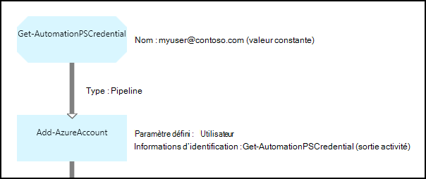

<properties 
   pageTitle="Des informations d’identification actifs dans Azure automatisation | Microsoft Azure"
   description="Éléments d’informations d’identification dans Azure Automation contiennent des informations d’identification de sécurité pouvant être utilisées pour authentifier aux ressources accédés par le runbook ou la configuration de DSC. Cet article décrit comment créer des éléments d’informations d’identification et les utiliser dans une configuration de DSC ou runbook."
   services="automation"
   documentationCenter=""
   authors="mgoedtel"
   manager="jwhit"
   editor="tysonn" />
<tags 
   ms.service="automation"
   ms.devlang="na"
   ms.topic="article"
   ms.tgt_pltfrm="na"
   ms.workload="infrastructure-services"
   ms.date="06/09/2016"
   ms.author="bwren" />

# Éléments d’informations d’identification dans Azure Automation

Une ressource d’informations d’identification Automation conserve un objet [PSCredential](http://msdn.microsoft.com/library/system.management.automation.pscredential) qui contient les informations d’identification de sécurité comme un nom d’utilisateur et mot de passe. Configurations procédures opérationnelles et DSC peuvent utiliser les applets de commande qui acceptent un objet PSCredential pour l’authentification, ou qu’ils peuvent extraire le nom d’utilisateur et mot de passe de l’objet PSCredential pour fournir à une application ou un service nécessitant une authentification. Les propriétés d’informations d’identification sont stockées en toute sécurité dans Azure Automation et sont accessibles dans la configuration de DSC avec l’activité [Get-AutomationPSCredential](http://msdn.microsoft.com/library/system.management.automation.pscredential.aspx) ou runbook.

>[AZURE.NOTE] Sécurisation des ressources dans Azure Automation incluent les informations d’identification, des certificats, des connexions et des variables chiffrés. Ces éléments sont chiffrées et stockées dans l’Automation Azure à l’aide d’une clé unique est générée pour chaque compte automation. Cette clé est chiffrée par un certificat maître et stockée dans Azure Automation. Avant de stocker un bien sécurisé, la clé du compte automation est déchiffrée à l’aide du certificat maître et, utilisé pour chiffrer les biens. 

## Applets de commande Windows PowerShell

Les applets de commande dans le tableau suivant sont utilisées pour créer et gérer des éléments d’information d’identification automation avec Windows PowerShell.  Ils sont fournis dans le cadre du [module Azure PowerShell](../powershell-install-configure.md) qui peut être utilisé dans les procédures opérationnelles Automation et configurations DSC.

|Applets de commande|Description|
|:---|:---|
|[Get-AzureAutomationCredential](http://msdn.microsoft.com/library/dn913781.aspx)|Récupère des informations sur une ressource d’informations d’identification. Vous ne pouvez récupérer les informations d’identification lui-même d’activité **Get-AutomationPSCredential** .|
|[Nouvelle AzureAutomationCredential](http://msdn.microsoft.com/library/azure/jj554330.aspx)|Crée une nouvelle information d’identification Automation.|
|[Supprimer - AzureAutomationCredential](http://msdn.microsoft.com/library/azure/jj554330.aspx)|Supprime les informations d’identification Automation.|
|[Set - AzureAutomationCredential](http://msdn.microsoft.com/library/azure/jj554330.aspx)|Définit les propriétés d’une forme d’identification Automation existant.|

## Activités Runbook

Les activités dans le tableau suivant sont utilisées pour accéder aux informations d’identification dans une procédure opérationnelle et configurations DSC.

|Activités|Description|
|:---|:---|
|Get-AutomationPSCredential|Obtient les informations d’identification à utiliser dans une configuration de DSC ou runbook. Renvoie un objet [System.Management.Automation.PSCredential](http://msdn.microsoft.com/library/system.management.automation.pscredential) .|

>[AZURE.NOTE] Évitez d’utiliser des variables dans le paramètre – Name de Get-AutomationPSCredential dans la mesure où vous pouvez complique la découverte dépendances entre les procédures opérationnelles ou configurations DSC et des informations d’identification actifs au moment de la conception.

## Création d’une nouvelle ressource d’informations d’identification

### Pour créer une nouvelle ressource d’informations d’identification avec le portail classique Azure

1. À partir de votre compte automatisation, cliquez sur **ressources** dans la partie supérieure de la fenêtre.
1. Dans la partie inférieure de la fenêtre, cliquez sur **Ajouter un paramètre**.
1. Cliquez sur **Ajouter des informations d’identification**.
2. Dans la liste déroulante **Type d’informations d’identification** , sélectionnez **Les informations d’identification PowerShell**.
1. Exécuter l’Assistant, cliquez sur la case à cocher pour enregistrer les nouvelles informations d’identification.

### Pour créer une nouvelle ressource d’informations d’identification avec le portail Azure

1. À partir de votre compte automatisation, cliquez sur la partie de **biens** pour ouvrir la carte de **biens** .
1. Cliquez sur la section **informations d’identification** pour ouvrir la carte **d’informations d’identification** .
1. Cliquez sur **Ajouter une information d’identification** en haut de la carte.
1. Remplissez le formulaire, cliquez sur **créer** pour enregistrer les nouvelles informations d’identification.

### Pour créer une nouvelle ressource d’informations d’identification avec Windows PowerShell

Les exemples de commandes suivants montrent comment créer une nouvelle information d’identification automation. Un objet PSCredential est d’abord créé avec le nom et le mot de passe et ensuite utilisé pour créer la ressource d’informations d’identification. Vous pouvez également utiliser l’applet de commande **Get-Credential** pour être invité à taper un nom et un mot de passe.

    $user = "MyDomain\MyUser"
    $pw = ConvertTo-SecureString "PassWord!" -AsPlainText -Force
    $cred = New-Object –TypeName System.Management.Automation.PSCredential –ArgumentList $user, $pw
    New-AzureAutomationCredential -AutomationAccountName "MyAutomationAccount" -Name "MyCredential" -Value $cred

## À l’aide des informations d’identification PowerShell

Vous récupérez un élément d’informations d’identification dans une configuration de DSC avec l’activité **Get-AutomationPSCredential** ou runbook. Renvoie un [objet PSCredential](http://msdn.microsoft.com/library/system.management.automation.pscredential.aspx) que vous pouvez utiliser avec une activité ou une applet de commande qui requiert un paramètre PSCredential. Vous pouvez également récupérer les propriétés de l’objet d’informations d’identification pour être utilisées séparément. L’objet comporte une propriété pour le nom d’utilisateur et le mot de passe sécurisé, ou vous pouvez utiliser la méthode **GetNetworkCredential** pour renvoyer un objet [NetworkCredential](http://msdn.microsoft.com/library/system.net.networkcredential.aspx) fournissant une version non sécurisée du mot de passe.

### Exemple de runbook textuel

Les exemples de commandes suivants montrent comment utiliser les informations d’identification PowerShell dans une procédure opérationnelle. Dans cet exemple, les informations d’identification sont récupérée, son nom d’utilisateur et mot de passe attribué à des variables.

    $myCredential = Get-AutomationPSCredential -Name 'MyCredential'
    $userName = $myCredential.UserName
    $securePassword = $myCredential.Password
    $password = $myCredential.GetNetworkCredential().Password

### Exemple de graphique runbook

Vous ajoutez une activité **Get-AutomationPSCredential** à un graphique runbook en cliquant sur les informations d’identification dans le volet de la bibliothèque de l’éditeur graphique et en sélectionnant **Ajouter à la zone de dessin**.

L’image suivante montre un exemple d’utilisation des informations d’identification dans un graphique runbook.  Dans ce cas, il est utilisé pour fournir une authentification pour un runbook aux ressources Azure comme décrit dans les [Procédures opérationnelles permettent d’authentifier un compte Azure AD utilisateur](automation-sec-configure-aduser-account.md).  La première activité extrait les informations d’identification qui a accès à l’abonnement Azure.  L’activité **Ajouter AzureAccount** puis utilise ces informations d’identification pour fournir une authentification pour toutes les activités qui suivent il.  Un [lien pipeline](automation-graphical-authoring-intro.md#links-and-workflow) fait ici **Get-AutomationPSCredential** attend un seul objet.  

## À l’aide des informations d’identification PowerShell dans DSC
Tandis que les configurations DSC dans Azure Automation pour référencer les éléments d’informations d’identification à l’aide de **Get-AutomationPSCredential**, biens d’informations d’identification peuvent également être passés via paramètres, si vous le souhaitez. Pour plus d’informations, voir [compilation des configurations dans Azure Automation DSC](automation-dsc-compile.md#credential-assets).

## Étapes suivantes

- Pour plus d’informations relatives aux liens lors de la création de graphiques, voir [les liens lors de la création de graphique](automation-graphical-authoring-intro.md#links-and-workflow)
- Pour mieux comprendre les différentes méthodes d’authentification avec l’Automation, consultez [Sécurité Automation Azure](automation-security-overview.md)
- Pour commencer à utiliser les procédures opérationnelles graphiques, voir [Mon premier runbook de graphique](automation-first-runbook-graphical.md)
- Pour commencer à utiliser les procédures opérationnelles de flux de travail de PowerShell, voir [Mon premier runbook de flux de travail PowerShell](automation-first-runbook-textual.md) 

 
