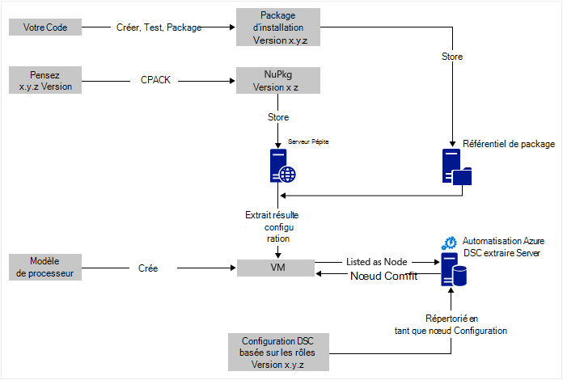
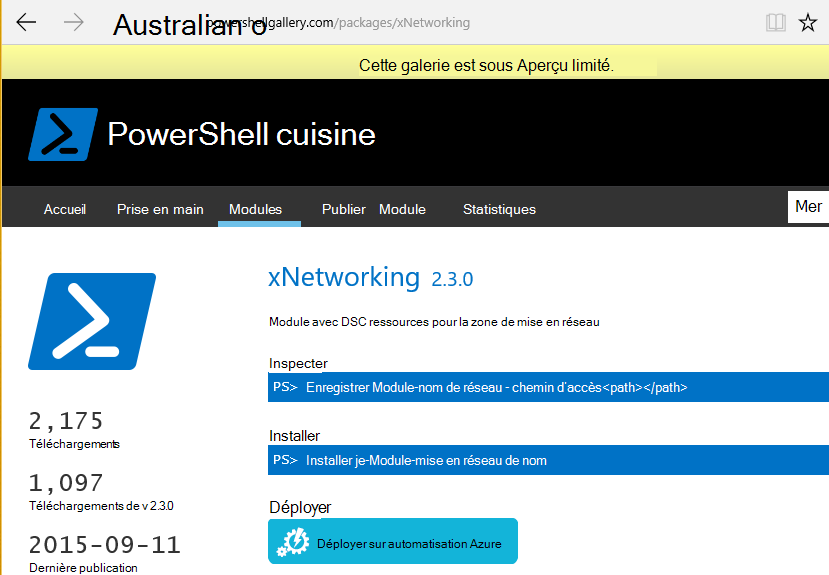

<properties
   pageTitle="Déploiement continue Automation Azure DSC avec Chocolatey | Microsoft Azure"
   description="DevOps déploiement continu à l’aide de Azure Automation DSC et Gestionnaire de package Chocolatey.  Exemple avec modèle JSON processeur complète et PowerShell source."
   services="automation"
   documentationCenter=""
   authors="sebastus"
   manager="stevenka"
   editor=""/>

<tags
   ms.service="automation"
   ms.devlang="na"
   ms.topic="article"
   ms.tgt_pltfrm="vm-windows"
   ms.workload="na"
   ms.date="08/08/2016"
   ms.author="golive"/>

# Exemple d’utilisation : Continu déploiement des machines virtuelles à l’aide de Automation DSC et Chocolatey

Dans un univers DevOps il existe plusieurs outils d’aide à différents points dans le pipeline de l’intégration continue.  Azure Automation souhaité état Configuration (DSC) est une nouveauté Bienvenue dans les options qui permet aux équipes DevOps peut recourir à.  Cet article illustre la définition des déploiement continue (CD) pour un ordinateur Windows.  Vous pouvez facilement étendre la technique pour inclure les ordinateurs Windows autant que nécessaire dans le rôle (par exemple, un site web) et à partir de là, ainsi que des rôles supplémentaires.

## À un niveau élevé

Il est très peu passe-t-il ici, mais peut être effectué en il peut être divisée en deux principaux processus : 

  - Écrire du code tester, puis créer et publier des packages d’installation pour les versions principales et secondaires du système. 
  - Création et la gestion des machines virtuelles qui va installer et exécuter le code dans les packages.  

Une fois ces deux principaux processus en place, il s’agit d’une étape courte à mettre à jour automatiquement le package en cours d’exécution sur n’importe quel ordinateur virtuel particulier comme nouvelles versions sont créées et déployées.

## Présentation des composants

Responsables du lot comme [susceptibles get](https://en.wikipedia.org/wiki/Advanced_Packaging_Tool) sont assez connu dans le monde Linux, mais pas trop dans le monde de Windows.  [Chocolatey](https://chocolatey.org/) est une telle chose et de Scott Hanselman [blog](http://www.hanselman.com/blog/IsTheWindowsUserReadyForAptget.aspx) sur le sujet est une excellente introduction.  En bref, Chocolatey permet d’installer à partir d’un référentiel central des packages dans un système de Windows à l’aide de la ligne de commande.  Vous pouvez créer et gérer votre propre référentiel et Chocolatey pouvez installer les packages à partir de n’importe quel nombre de référentiels que vous désignez.

Configuration d’état souhaité (DSC) ([vue d’ensemble](https://technet.microsoft.com/library/dn249912.aspx)) est un outil PowerShell qui vous permet de déclarer la configuration de votre choix pour une machine.  Par exemple, vous pouvez par exemple, « je veux Chocolatey installé, je veux IIS est installé, je veux port 80 ouvert, je veux version 1.0.0 de mon site Web installée. »  DSC Local Configuration Manager (PPCM) met en œuvre que la configuration. Un serveur extraire DSC contient un référentiel des configurations pour vos ordinateurs. La PPCM sur chaque ordinateur permet d’archiver régulièrement pour voir si sa configuration correspond à la configuration stockée. Il peut signaler l’état ou tenter de ramener l’ordinateur dans alignement sur la configuration stockée. Vous pouvez modifier la configuration stockée sur le serveur extraire à l’origine d’un ordinateur ou un ensemble d’ordinateurs à venir en adéquation avec la configuration a changé.

Automatisation Azure est un service géré dans Microsoft Azure qui vous permet d’automatiser diverses tâches à l’aide des procédures opérationnelles, nœuds, les informations d’identification, des ressources telles que des calendriers et des variables globales. DSC Automation Azure étend cette fonctionnalité automation pour intégrer des outils DSC PowerShell.  Voici une excellente [vue d’ensemble](automation-dsc-overview.md).

Une ressource DSC est un module de code qui présente des fonctionnalités spécifiques, telles que la gestion de mise en réseau, Active Directory ou SQL Server.  La ressource DSC Chocolatey sait comment accéder à un serveur NuGet (entre autres), téléchargez les packages, packages d’installation et ainsi de suite.  Il existe beaucoup d’autres ressources DSC dans la [Galerie de PowerShell](http://www.powershellgallery.com/packages?q=dsc+resources&prerelease=&sortOrder=package-title).  Ces modules sont installés sur votre serveur d’extraire Azure Automation DSC (par vous) afin qu’ils peuvent être utilisées par vos configurations.

PROCESSEUR modèles offrent un moyen déclaratif de génération de votre infrastructure - des éléments tels que les réseaux, sous-réseaux, la sécurité du réseau et routage, télécharger des programmes d’équilibrage, cartes réseau, machines virtuelles et ainsi de suite.  Voici un [article](../resource-manager-deployment-model.md) comparant le modèle de déploiement ARM (déclaratif) avec la gestion des services Azure (ASM ou classique) modèle de déploiement (impératif).  Et Voici un autre [article](../virtual-machines/virtual-machines-windows-compare-deployment-models.md) concernant les fournisseurs de ressources core, cluster, stockage et votre réseau.

Une fonctionnalité clé d’un modèle de processeur est sa capacité à installer une extension machine virtuelle la machine virtuelle comme s’il est configuré.  Une extension de machine virtuelle comporte des fonctionnalités spécifiques, telles qu’exécute un script personnalisé, l’installation d’un logiciel antivirus ou un script de configuration DSC.  Il existe plusieurs autres types d’extensions de machine virtuelle.

## Voyage rapide autour du diagramme

Commençant par le haut, vous écrivez votre code, créer et tester, puis créer un package d’installation.  Chocolatey peut gérer différents types de packages d’installation, tels que MSI, MSU, ZIP.  Et que vous avez la puissance de PowerShell pour effectuer l’installation proprement dite si capacités natives de Chocolatey ne sont pas assez jusqu'à elle.  Placez le package dans un endroit accessible – un référentiel de package.  Cet exemple de l’utilisation utilise un dossier public dans un compte de stockage blob Azure, mais il peut être n’importe où.  Chocolatey fonctionne en mode natif avec les serveurs NuGet et quelques autres pour la gestion des métadonnées de package.  [Cet article](https://github.com/chocolatey/choco/wiki/How-To-Host-Feed) décrit les options.  Cet exemple de l’utilisation utilise NuGet.  Un Nuspec est métadonnées relatives à vos packages.  La Nuspec est « compilé » dans de NuPkg et stockée dans un serveur NuGet.  Lorsque votre configuration nécessite un package par nom et fait référence à un serveur NuGet, la ressource DSC Chocolatey (maintenant sur l’ordinateur virtuel) extrait le package et l’installe pour vous.  Vous pouvez également demander une version spécifique d’un package.

Dans la partie inférieure gauche de l’image, il existe un modèle Azure Resource Manager (ARM).  Dans cet exemple de l’utilisation, l’extension de la mémoire virtuelle enregistre la machine virtuelle avec le serveur d’extraire Azure Automation DSC (autrement dit, un serveur extraire) en tant que nœud.  La configuration est stockée sur le serveur extraire.  En fait, il est stocké à deux reprises : une fois en tant que texte brut et une fois compilé en tant que fichier MOF (pour ceux qui savoir sur ces éléments.)  Dans le portail, le MOF est une configuration « nœuds » (contrairement à simplement « configuration »).  Il s’agit de l’objet associé à un nœud afin que le nœud saurez sa configuration.  Détails ci-dessous montrent comment attribuer la configuration nœuds au nœud.

Sans doute que vous faites déjà le bit en haut, ou la majeure partie.  Création de nuspec, la compilation et le stockage dans un serveur NuGet sont une petite chose.  Et vous gérez déjà machines virtuelles.  Passer à l’étape suivante au déploiement continue requiert la configuration du serveur extraire (une fois), enregistrés vos nœuds avec lui (une fois) et la création et le stockage de la configuration il (initiale).  Actualiser puis packages sont mis à niveau et déployés au référentiel, la Configuration et la Configuration du nœud de serveur extraire (répétition selon vos besoins).

Si vous êtes ne commençant pas par un modèle de processeur, qui est également OK.  Il existe des applets de commande PowerShell conçu pour vous aider à enregistrer vos ordinateurs virtuels avec le serveur extraire et toutes les autres. Pour plus d’informations, voir cet article : [machines d’intégration pour la gestion en Azure Automation DSC](automation-dsc-onboarding.md)

## Étape 1 : Configuration du compte de serveur et automatisation extraire

Dans une ligne de commande PowerShell (ajouter AzureRmAccount) authentifié : (peut prendre quelques minutes pendant que le serveur extraire a été configurée)

    New-AzureRmResourceGroup –Name MY-AUTOMATION-RG –Location MY-RG-LOCATION-IN-QUOTES
    New-AzureRmAutomationAccount –ResourceGroupName MY-AUTOMATION-RG –Location MY-RG-LOCATION-IN-QUOTES –Name MY-AUTOMATION-ACCOUNT 

Vous pouvez placer votre compte automation dans n’importe lequel des régions suivantes (ou emplacement) : US Extrême-Orient 2, Sud, Virginie nous et pour le gouvernement, ouest Europe, Asie du Sud-est, Japon Moyen-Orient, Inde centrale et du Sud-est Australie.

## Étape 2 : Ajustements que l’extension de machine virtuelle le modèle de processeur

Détails de l’enregistrement de la machine virtuelle (à l’aide de l’extension machine virtuelle PowerShell DSC) prévu dans ce [Modèle de démarrage rapide d’Azure](https://github.com/Azure/azure-quickstart-templates/tree/master/dsc-extension-azure-automation-pullserver).  Cette étape enregistre votre nouvelle machine virtuelle avec le serveur extraire dans la liste des nœuds DSC.  Partie de cet enregistrement est spécifiant la configuration des nœuds à appliquer au nœud.  Cette configuration nœud n’existe pas encore sur le serveur extraire, afin qu’elle soit OK étape 4 est l’endroit où il est terminé pour la première fois.  Mais ici à l’étape 2 vous devez avoir décidé le nom du nœud et le nom de la configuration.  Dans cet exemple de l’utilisation, le nœud est « isvbox » et la configuration est « ISVBoxConfig ».  Le nom de configuration de nœud (doit être spécifié dans DeploymentTemplate.json) est « ISVBoxConfig.isvbox ».  

## Étape 3 : Ajout de ressources DSC nécessaires au serveur extraire

La galerie de PowerShell est utilisée pour installer des ressources DSC dans votre compte Azure Automation.  Accédez à la ressource souhaitée, puis cliquez sur le bouton « Déployer à Azure Automation ».

Une autre technique récemment ajoutée au portail Azure vous permet d’extraire dans les nouveaux modules ou mettre à jour des modules existants. Cliquez sur la ressource compte automatisation, la vignette de biens et enfin la vignette Modules.  L’icône Parcourir la galerie vous permet de vous permettent de voir la liste des modules dans la galerie, Explorer les détails et finalement importer dans votre compte Automation. Il s’agit d’un excellent moyen de maintenir à jour de temps à vos modules. Et, la fonction d’importation vérifie dépendances avec d’autres modules pour garantir que rien n’est pas synchronisé.

Ou, il est l’approche manuelle.  La structure de dossier d’un Module d’intégration PowerShell pour un ordinateur Windows est légèrement différente de la structure du dossier attendue par l’automatisation Azure.  Cette fonctionnalité nécessite une légère modification de votre part.  Mais il n’est pas difficile, et il est traité qu’une seule fois par ressource (sauf si vous souhaitez mettre à niveau à l’avenir.)  Pour plus d’informations sur la création de Modules d’intégration PowerShell, consultez cet article : [Modules d’intégration de création pour Azure Automation](https://azure.microsoft.com/blog/authoring-integration-modules-for-azure-automation/)

-   Installez le module dont vous avez besoin sur votre poste de travail, comme suit :
    -   Installez [Windows Management Framework, v5](http://aka.ms/wmf5latest) (ne pas requise pour Windows 10)
    -   `Install-Module –Name MODULE-NAME`< — extrait le module dans la galerie de PowerShell 
-   Copiez le dossier du module à partir de `c:\Program Files\WindowsPowerShell\Modules\MODULE-NAME` dans un dossier temporaire 
-   Supprimer des exemples et la documentation à partir du dossier principal 
-   Compressez le dossier principal, en attribuant au fichier ZIP exactement comme le dossier 
-   Placez le fichier ZIP dans un emplacement HTTP accessible, comme stockage d’objets blob dans un compte de stockage Azure.
-   Cette PowerShell, exécutez :

        New-AzureRmAutomationModule `
            -ResourceGroupName MY-AUTOMATION-RG -AutomationAccountName MY-AUTOMATION-ACCOUNT `
            -Name MODULE-NAME –ContentLink "https://STORAGE-URI/CONTAINERNAME/MODULE-NAME.zip"
        

L’exemple inclus effectue ces étapes pour cChoco et xNetworking. Consultez les [Remarques](#notes) pour un traitement spécial pour cChoco.

## Étape 4 : Ajout de la configuration nœuds au serveur extraire

Il existe rien de spécial sur la première fois que vous importez votre configuration dans le serveur de collecte et la compilation.  Tous les autres importation/compile la même configuration exactement le même aspect.  Chaque fois que vous mettez à jour votre package et que vous devez envoyer aux production vous effectuez cette étape après avoir vérifié que le fichier de configuration est correct, notamment la nouvelle version de votre package.  Voici le fichier de configuration et PowerShell :

ISVBoxConfig.ps1 :

    Configuration ISVBoxConfig 
    { 
        Import-DscResource -ModuleName cChoco 
        Import-DscResource -ModuleName xNetworking
    
        Node "isvbox" {   
    
            cChocoInstaller installChoco 
            { 
                InstallDir = "C:\choco" 
            }
    
            WindowsFeature installIIS 
            { 
                Ensure="Present" 
                Name="Web-Server" 
            }
    
            xFirewall WebFirewallRule 
            { 
                Direction = "Inbound" 
                Name = "Web-Server-TCP-In" 
                DisplayName = "Web Server (TCP-In)" 
                Description = "IIS allow incoming web site traffic." 
                DisplayGroup = "IIS Incoming Traffic" 
                State = "Enabled" 
                Access = "Allow" 
                Protocol = "TCP" 
                LocalPort = "80" 
                Ensure = "Present" 
            }
    
            cChocoPackageInstaller trivialWeb 
            {            
                Name = "trivialweb" 
                Version = "1.0.0" 
                Source = “MY-NUGET-V2-SERVER-ADDRESS” 
                DependsOn = "[cChocoInstaller]installChoco", 
                "[WindowsFeature]installIIS" 
            } 
        }    
    }

Nouvelle-ConfigurationScript.ps1 :

    Import-AzureRmAutomationDscConfiguration ` 
        -ResourceGroupName MY-AUTOMATION-RG –AutomationAccountName MY-AUTOMATION-ACCOUNT ` 
        -SourcePath C:\temp\AzureAutomationDsc\ISVBoxConfig.ps1 ` 
        -Published –Force
    
    $jobData = Start-AzureRmAutomationDscCompilationJob ` 
        -ResourceGroupName MY-AUTOMATION-RG –AutomationAccountName MY-AUTOMATION-ACCOUNT ` 
        -ConfigurationName ISVBoxConfig 
    
    $compilationJobId = $jobData.Id
    
    Get-AzureRmAutomationDscCompilationJob ` 
        -ResourceGroupName MY-AUTOMATION-RG –AutomationAccountName MY-AUTOMATION-ACCOUNT ` 
        -Id $compilationJobId

Résultat de ces étapes dans une nouvelle configuration nœud nommé « ISVBoxConfig.isvbox » est placé sur le serveur extraire.  Le nom de la configuration nœud intégré en tant que « configurationName.nodeName ».

## Étape 5 : Création et la gestion des métadonnées

Pour chaque package que vous insérez dans le référentiel de package, vous avez besoin d’un nuspec qui la décrit à.  Cette nuspec devant être compilé et stockée dans votre serveur NuGet. Ce processus est décrit [ici](http://docs.nuget.org/create/creating-and-publishing-a-package).  Vous pouvez utiliser MyGet.org comme un serveur NuGet.  Ils vendent ce service, mais ont un starter référence (SKU) qui est gratuit.  Sur NuGet.org vous trouverez des instructions sur l’installation de votre propre serveur NuGet pour vos packages privés.

## Étape 6 : Tout relier

Chaque fois qu’une version passe q & a et est approuvée pour le déploiement, le package est créé, nuspec et nupkg mis à jour et déployés sur le serveur NuGet.  En outre, la configuration (étape 4 ci-dessus) doit être mis à jour pour s’accorder avec le nouveau numéro de version.  Il doit être envoyé au serveur extraire et compilé.  À partir de là, c’est pour les ordinateurs virtuels qui dépendent de cette configuration pour extraire la mise à jour et l’installer.  Chacun de ces mises à jour est simple - simplement une ou deux lignes de PowerShell.  Dans le cas de Visual Studio Team Services, certaines d'entre elles sont encapsulés dans créer des tâches qui peuvent être chaînés dans une version.  Cet [article](https://www.visualstudio.com/en-us/docs/alm-devops-feature-index#continuous-delivery) fournit davantage de détails.  Cette [mis en pension GitHub](https://github.com/Microsoft/vso-agent-tasks) en détail les différentes tâches de génération disponibles.

## Notes

Cet exemple de l’utilisation commence par une machine virtuelle à partir d’une image de Windows Server 2012 R2 générique à partir de la galerie Azure.  Vous pouvez démarrer à partir de n’importe quelle image stockée et ensuite affiner à partir de là avec la configuration DSC.  Cependant, il est beaucoup plus difficile à mettre à jour dynamiquement la configuration à l’aide de DSC de modification de configuration est aliments dans une image.

Vous n’êtes pas obligé d’utiliser un modèle de processeur et l’extension machine virtuelle pour utiliser cette technique avec vos ordinateurs virtuels.  Et vos ordinateurs virtuels ne doivent se trouver sur Azure être sous gestion du CD.  Tous les éléments nécessaires est que Chocolatey soit installé et la PPCM configuré sur la machine virtuelle afin qu’il sache où se trouve le serveur extraire.  

Bien entendu, lorsque vous mettez à jour un package sur un ordinateur virtuel qui est en production, vous devez prendre cet ordinateur virtuel se déconnecter de rotation pendant l’installation de la mise à jour.  Comment cela varie largement.  Par exemple, avec une machine virtuelle derrière un équilibrage de charge Azure, vous pouvez ajouter une sonde personnalisée.  Lors de la mise à jour de la machine virtuelle, faites en sorte que le point de terminaison sonde retourne un 400.  L’affinage nécessaire à l’origine de cette modification peut se trouver dans votre configuration, comme l’affinage pour basculer et retourne une 200 une fois terminée la mise à jour.

Source complète de cet exemple de l’utilisation est dans [ce projet Visual Studio](https://github.com/sebastus/ARM/tree/master/CDIaaSVM) sur GitHub.

##Articles connexes##

- [Vue d’ensemble de Automation azure DSC] (automation-dsc-overview.md)
- [Applets de commande azure Automation DSC] (https://msdn.microsoft.com/library/mt244122.aspx)
- [Machines d’intégration pour la gestion en Azure Automation DSC] (automation-dsc-onboarding.md)
