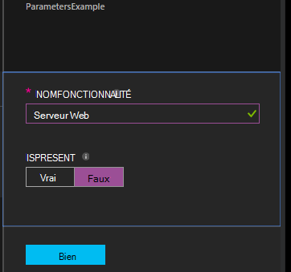

<properties 
   pageTitle="Compilation des configurations dans Azure Automation DSC | Microsoft Azure" 
   description="Vue d’ensemble des deux façons de compiler les configurations Configuration état souhaité (DSC) : dans le portail Azure et avec Windows PowerShell. " 
   services="automation" 
   documentationCenter="na" 
   authors="coreyp-at-msft" 
   manager="stevenka" 
   editor="tysonn"/>

<tags
   ms.service="automation"
   ms.devlang="na"
   ms.topic="article"
   ms.tgt_pltfrm="powershell"
   ms.workload="na" 
   ms.date="01/25/2016"
   ms.author="coreyp"/>
   
#Compilation des configurations dans Azure Automation DSC#

Vous pouvez compiler les configurations Configuration état souhaité (DSC) de deux façons avec Azure Automation : dans le portail Azure et avec Windows PowerShell. Le tableau suivant vous aideront à déterminer quand utiliser la méthode basée sur les caractéristiques de chaque : 

###Portail preview Azure###
- Méthode la plus simple avec interface utilisateur interactive
- Formulaire pour fournir des valeurs de paramètre simple
- Facilement effectuer le suivi d’état du travail
- Accès authentifié auprès d’ouverture de session Azure

###Windows PowerShell###
- Appelez à partir de la ligne de commande avec les applets de commande Windows PowerShell
- Peuvent être incluses dans la solution automatisée avec plusieurs étapes
- Indiquez les valeurs de paramètre simples et complexes
- Effectuer le suivi d’état du travail
- Client doit prendre en charge les applets de commande PowerShell
- Passer ConfigurationData
- Compiler les configurations qui utilisent des informations d’identification

Une fois que vous avez choisi une méthode de compilation, vous pouvez suivre les procédures correspondantes ci-dessous pour commencer la compilation.

##Compilation d’une Configuration DSC grâce au portail Azure##

1.  À partir de votre compte automatisation, cliquez sur **Configurations**.
2.  Cliquez sur une configuration pour ouvrir sa carte.
3.  Cliquez sur **compiler**.
4.  Si la configuration n’a aucun paramètre, vous devrez confirmer si vous souhaitez compiler. Si la configuration possède des paramètres, la carte de **Configuration compiler** s’ouvre pour vous permettre de valeurs de paramètre. Consultez la section <a href="#basic-parameters">**Paramètres de base**</a> ci-dessous pour plus d’informations sur les paramètres.
5.  La carte de **Travail de Compilation** est ouvert afin que vous pouvez suivre l’état de la tâche de la compilation et les configurations de nœud (documents de configuration MOF) elle due à placer sur le serveur d’extraire Azure Automation DSC.

##Compilation d’une Configuration DSC avec Windows PowerShell##

Vous pouvez utiliser [`Start-AzureRmAutomationDscCompilationJob`](https://msdn.microsoft.com/library/mt244118.aspx) pour démarrer la compilation avec Windows PowerShell. Le code suivant démarre compilation d’une configuration DSC appelée **SampleConfig**.

    Start-AzureRmAutomationDscCompilationJob -ResourceGroupName "MyResourceGroup" -AutomationAccountName "MyAutomationAccount" -ConfigurationName "SampleConfig" 
 
`Start-AzureRmAutomationDscCompilationJob`Renvoie un objet de travail de compilation que vous pouvez utiliser pour effectuer le suivi de son statut. Vous pouvez ensuite utiliser cet objet travail compilation avec [`Get-AzureRmAutomationDscCompilationJob`](https://msdn.microsoft.com/library/mt244120.aspx) pour déterminer l’état de la tâche de compilation, et [`Get-AzureRmAutomationDscCompilationJobOutput`](https://msdn.microsoft.com/library/mt244103.aspx) pour afficher son flux (résultat). Le code suivant démarre compilation de la configuration **SampleConfig** , attend jusqu'à ce qu’elle est terminée et puis affiche son flux.
    
    $CompilationJob = Start-AzureRmAutomationDscCompilationJob -ResourceGroupName "MyResourceGroup" -AutomationAccountName "MyAutomationAccount" -ConfigurationName "SampleConfig"
    
    while($CompilationJob.EndTime –eq $null -and $CompilationJob.Exception –eq $null)           
    {
        $CompilationJob = $CompilationJob | Get-AzureRmAutomationDscCompilationJob
        Start-Sleep -Seconds 3
    }
    
    $CompilationJob | Get-AzureRmAutomationDscCompilationJobOutput –Stream Any 

##Paramètres de base##

Déclaration de paramètre dans les configurations DSC, y compris les types de paramètres et propriétés, fonctionne identique à celle de procédures opérationnelles Automation Azure. Consultez [en commençant une procédure opérationnelle dans Azure Automation](automation-starting-a-runbook.md) pour en savoir plus sur les paramètres de procédure opérationnelle.

L’exemple suivant utilise deux paramètres appelés **NomFonctionnalité** et **IsPresent**, pour déterminer les valeurs de propriétés de la configuration du nœud **ParametersExample.sample** , généré lors de la compilation.

    Configuration ParametersExample
    {
        param(
            [Parameter(Mandatory=$true)]
    
            [string] $FeatureName,
    
            [Parameter(Mandatory=$true)]
            [boolean] $IsPresent
        )
    
        $EnsureString = "Present"
        if($IsPresent -eq $false)
        {
            $EnsureString = "Absent"
        }
    
        Node "sample"
        {
            WindowsFeature ($FeatureName + "Feature")
            {
                Ensure = $EnsureString
                Name = $FeatureName
            }
        }
    }

Vous pouvez compiler les Configurations DSC qui utilisent des paramètres de base dans le portail Azure Automation DSC, ou avec Azure PowerShell :

###Portail###

Dans le portail, vous pouvez entrer des valeurs de paramètre après avoir cliqué sur **compiler**.

###PowerShell###

PowerShell nécessite des paramètres dans une [table de hachage](http://technet.microsoft.com/library/hh847780.aspx) où la clé correspond au nom de paramètre et la valeur est égale à la valeur de paramètre.

    $Parameters = @{
            "FeatureName" = "Web-Server"
            "IsPresent" = $False
    }
    
    
    Start-AzureRmAutomationDscCompilationJob -ResourceGroupName "MyResourceGroup" -AutomationAccountName "MyAutomationAccount" -ConfigurationName "ParametersExample" -Parameters $Parameters 
    

Pour plus d’informations sur la transmission de PSCredentials en tant que paramètres, consultez <a href="#credential-assets">**Les informations d’identification actifs**</a> ci-dessous.

##ConfigurationData##

**ConfigurationData** permet de vous permettent de séparer structurelle configuration à partir de n’importe quelle configuration spécifiques environnement lors de l’utilisation de PowerShell DSC. Voir [« Que » séparant « Où » dans DSC PowerShell](http://blogs.msdn.com/b/powershell/archive/2014/01/09/continuous-deployment-using-dsc-with-minimal-change.aspx) pour en savoir plus sur **ConfigurationData**.

>[AZURE.NOTE] Vous pouvez utiliser **ConfigurationData** lors de la compilation dans Azure Automation DSC à l’aide de PowerShell Azure, mais pas dans le portail Azure.

L’exemple de configuration DSC suivant utilise **ConfigurationData** via les mots clés **$ConfigurationData** et **$AllNodes** . Vous devez également le [module **xWebAdministration** ](https://www.powershellgallery.com/packages/xWebAdministration/) dans cet exemple :

     Configuration ConfigurationDataSample
     {
        Import-DscResource -ModuleName xWebAdministration -Name MSFT_xWebsite
    
        Write-Verbose $ConfigurationData.NonNodeData.SomeMessage 
    
        Node $AllNodes.Where{$_.Role -eq "WebServer"}.NodeName
        {
            xWebsite Site
            {
                Name = $Node.SiteName
                PhysicalPath = $Node.SiteContents
                Ensure   = "Present"
            }
        }
    }

Vous pouvez compiler la configuration DSC ci-dessus avec PowerShell. La ci-dessous PowerShell ajoute deux configurations nœud au serveur d’extraire Azure Automation DSC : **ConfigurationDataSample.MyVM1** et **ConfigurationDataSample.MyVM3**:

    $ConfigData = @{
        AllNodes = @(
            @{
                NodeName = "MyVM1"
                Role = "WebServer"
            },
            @{
                NodeName = "MyVM2"
                Role = "SQLServer"
            },
            @{
                NodeName = "MyVM3"
                Role = "WebServer"
    
            }
    
        )
    
        NonNodeData = @{
            SomeMessage = "I love Azure Automation DSC!"
    
        }
    
    } 
    
    Start-AzureRmAutomationDscCompilationJob -ResourceGroupName "MyResourceGroup" -AutomationAccountName "MyAutomationAccount" -ConfigurationName "ConfigurationDataSample" -ConfigurationData $ConfigData

##Actifs##

Références de biens sont les mêmes dans Azure Automation DSC configurations et de procédures opérationnelles. Pour plus d’informations, consultez :

- [Certificats](automation-certificates.md)
- [Connexions](automation-connections.md)
- [Informations d’identification](automation-credentials.md)
- [Variables](automation-variables.md)

###Éléments d’informations d’identification###
Tandis que les configurations DSC dans Azure Automation pour référencer les éléments d’informations d’identification à l’aide de **Get-AzureRmAutomationCredential**, biens d’informations d’identification peuvent également être passés via paramètres, si vous le souhaitez. Si une configuration prend un paramètre de type **PSCredential** , vous devez passer le nom de chaîne d’un bien d’informations d’identification Azure Automation en tant que valeur de ce paramètre, au lieu d’un objet PSCredential. Les coulisses, les biens d’informations d’identification Azure Automation portant le même nom seront récupérées et passé à la configuration.

Tout en conservant les informations d’identification sécurisé dans les configurations de nœud (documents de configuration MOF) nécessite chiffrant les informations d’identification dans le fichier nœud configuration MOF. Automatisation Azure prend une étape supplémentaire et le chiffre l’intégralité du fichier MOF. Toutefois, actuellement vous devez indiquer PowerShell DSC que c’est OK vos informations d’identification à produire au format texte brut pendant la génération de nœud configuration MOF, parce que PowerShell DSC ne sait pas que Azure automatisation seront chiffrant l’intégralité du fichier MOF après sa génération via une tâche de compilation.

Vous pouvez déterminer DSC PowerShell qu’il s’agit OK vos informations d’identification à produire en texte brut dans la configuration de nœuds généré MOF à l’aide de <a href="#configurationdata">**ConfigurationData**</a>. Vous devez passer `PSDscAllowPlainTextPassword = $true` via **ConfigurationData** pour nom du bloc de chaque nœud qui apparaît dans la configuration DSC et utilise les informations d’identification.

L’exemple suivant montre une configuration DSC qui utilise une ressource d’informations d’identification Automation.

    Configuration CredentialSample
    {
       $Cred = Get-AzureRmAutomationCredential -Name "SomeCredentialAsset"
    
        Node $AllNodes.NodeName
        { 
            File ExampleFile
            { 
                SourcePath = "\\Server\share\path\file.ext" 
                DestinationPath = "C:\destinationPath" 
                Credential = $Cred 
            }
        }
    }

Vous pouvez compiler la configuration DSC ci-dessus avec PowerShell. La ci-dessous PowerShell ajoute deux configurations nœud au serveur d’extraire Azure Automation DSC : **CredentialSample.MyVM1** et **CredentialSample.MyVM2**.

    $ConfigData = @{
        AllNodes = @(
            @{
                NodeName = "*"
                PSDscAllowPlainTextPassword = $True
            },
            @{
                NodeName = "MyVM1"
            },
            @{
                NodeName = "MyVM2"
            }
        )
    }
    
    Start-AzureRmAutomationDscCompilationJob -ResourceGroupName "MyResourceGroup" -AutomationAccountName "MyAutomationAccount" -ConfigurationName "CredentialSample" -ConfigurationData $ConfigData
