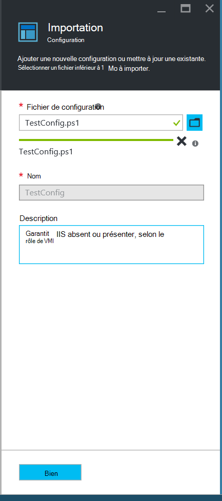
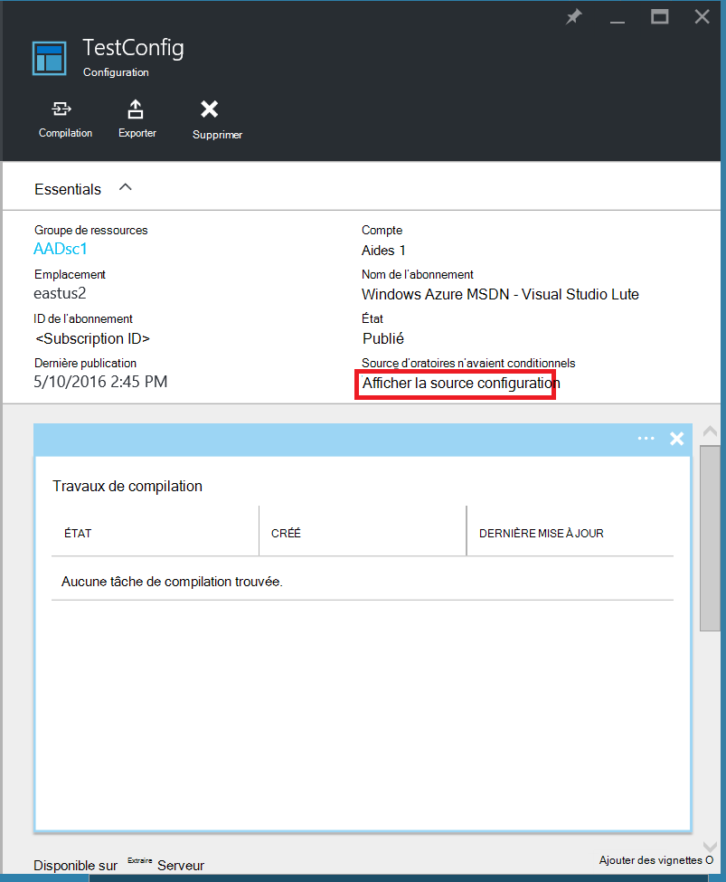
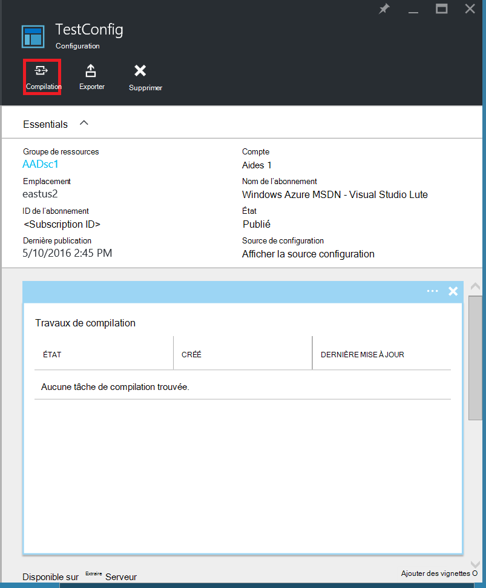
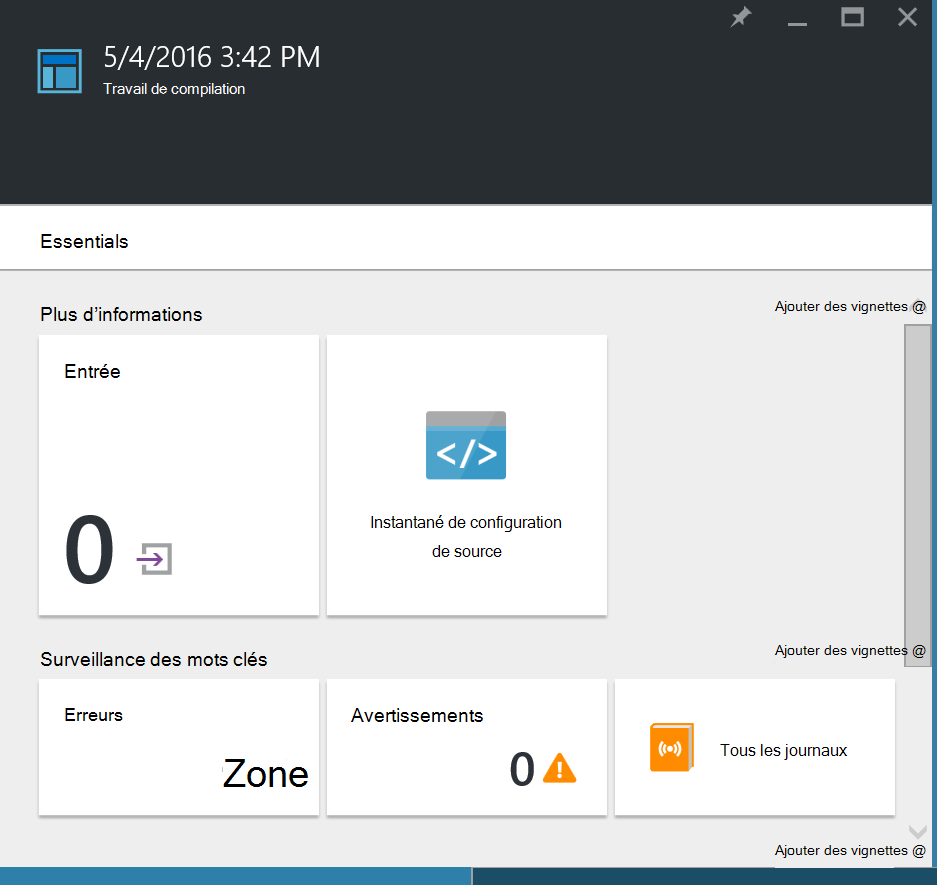
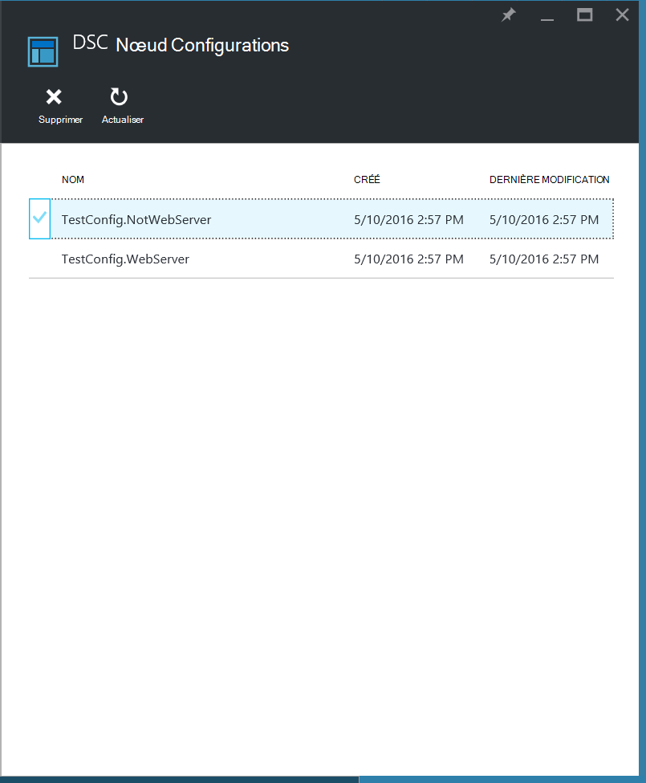
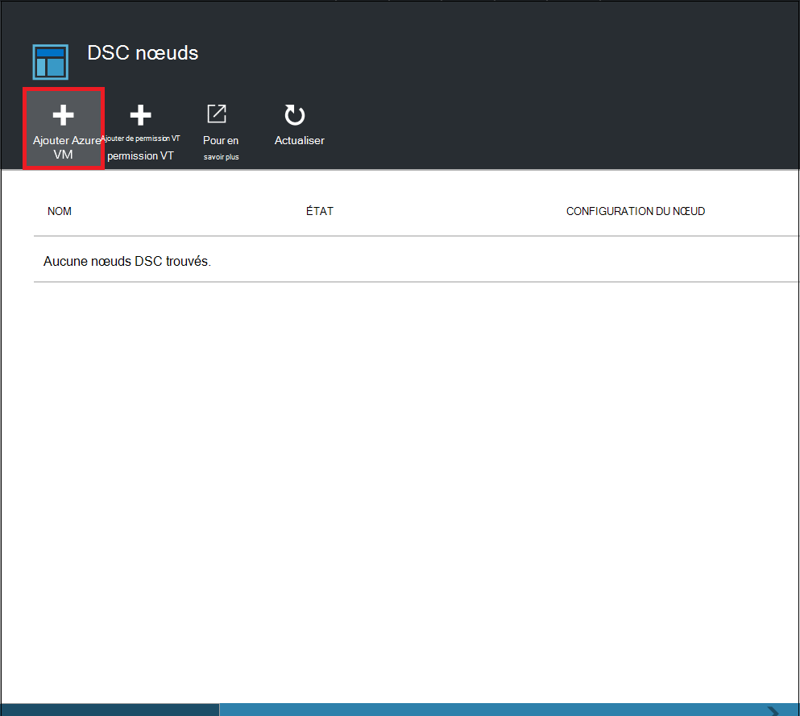
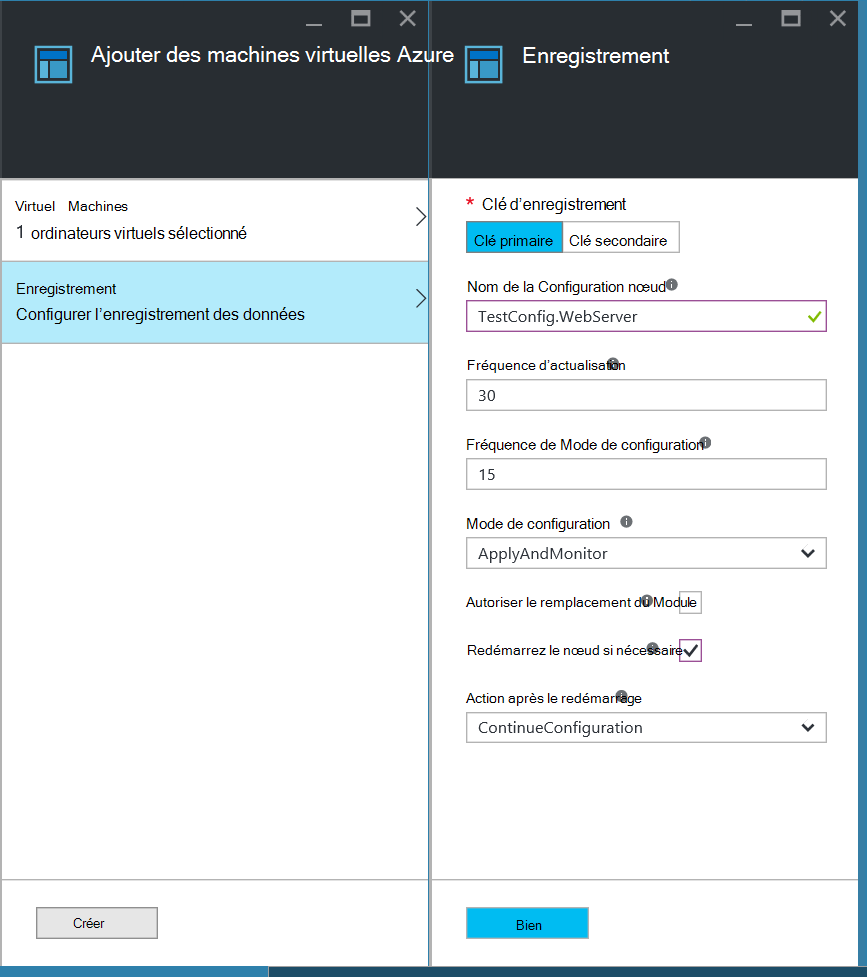
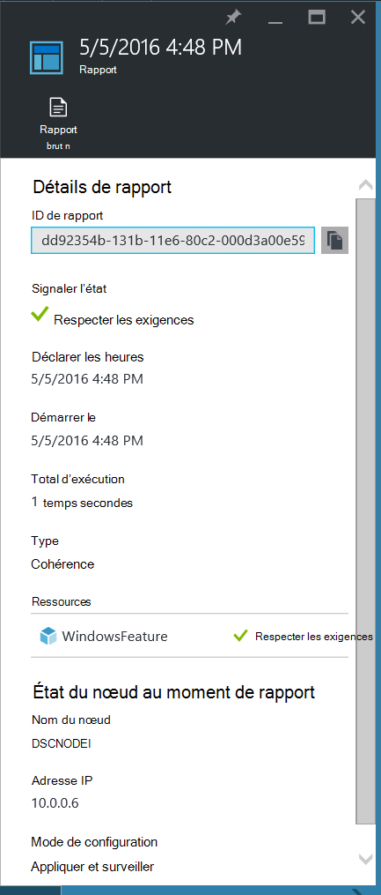
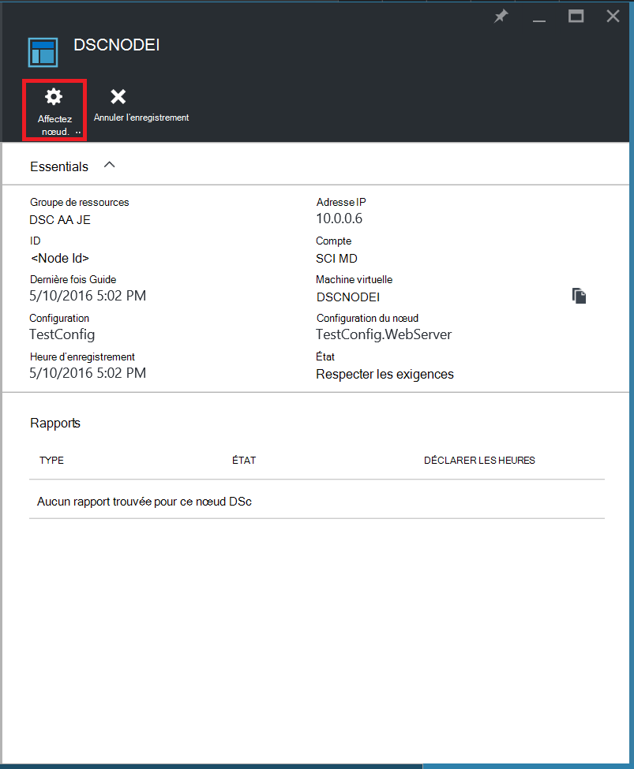
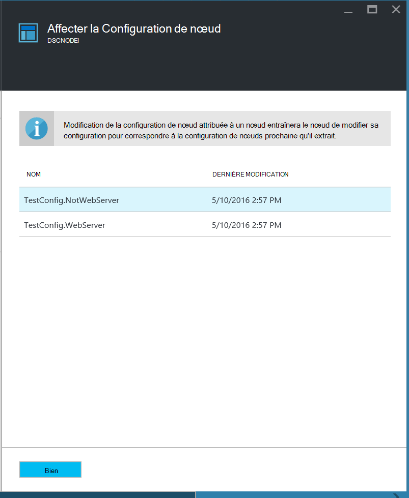

<properties
   pageTitle="Prise en main Azure Automation DSC"
   description="Explication et des exemples de tâches les plus courantes dans le module Azure Automation vous le souhaitez état Configuration (DSC)"
   services="automation" 
   documentationCenter="na" 
   authors="eslesar" 
   manager="dongill" 
   editor="tysonn"/>

<tags
   ms.service="automation"
   ms.devlang="na"
   ms.topic="article"
   ms.tgt_pltfrm="powershell"
   ms.workload="na" 
   ms.date="06/06/2016"
   ms.author="magoedte;eslesar"/>
   

# <a name="getting-started-with-azure-automation-dsc"></a>Prise en main Azure Automation DSC

Cette rubrique explique comment effectuer les tâches les plus courantes avec Azure Automation vous le souhaitez état Configuration (DSC), tels que création, l’importation et compilation des configurations, machines d’intégration à gérer et affichage de rapports. Pour une vue d’ensemble des fonctionnalités Azure Automation DSC, voir [Vue d’ensemble de Azure Automation DSC](automation-dsc-overview.md). Pour obtenir une documentation DSC, voir [Présentation de la Configuration des États Windows PowerShell vous le souhaitez](https://msdn.microsoft.com/PowerShell/dsc/overview).

Cette rubrique fournit des instructions détaillées sur avec Azure Automation DSC. Si vous souhaitez un environnement exemple qui a déjà été configurée sans suivant les étapes décrites dans cette rubrique, vous pouvez utiliser [le modèle de processeur suivant](https://github.com/azureautomation/automation-packs/tree/master/102-sample-automation-setup). Ce modèle définit un environnement Azure Automation DSC terminé, y compris une machine virtuelle Azure géré par Azure Automation DSC.
 
## <a name="prerequisites"></a>Conditions préalables

Pour terminer les exemples dans cette rubrique, les éléments suivants sont requis :

- Un compte Azure Automation. Pour obtenir des instructions sur la création d’un compte Azure Automation exécuter en tant que, voir [Exécuter en tant que compte Azure](automation-sec-configure-azure-runas-account.md).
- Un gestionnaire de ressources Azure VM (pas classique) exécutant Windows Server 2008 R2 ou version ultérieure. Pour obtenir des instructions sur la création d’une machine virtuelle, voir [créer votre première machine virtuelle de Windows dans le portail Azure](../virtual-machines/virtual-machines-windows-hero-tutorial.md)

## <a name="creating-a-dsc-configuration"></a>Création d’une configuration DSC

Nous allons créer une simple [configuration DSC](https://msdn.microsoft.com/powershell/dsc/configurations) qui garantit que la présence ou l’absence du **Serveur Web** Windows fonctionnalité (IIS), en fonction de l’affectation des nœuds.

1. Démarrez Windows PowerShell ISE (ou un éditeur de texte).

2. Tapez le texte suivant :

    ```powershell
    configuration TestConfig
    {
        Node WebServer
        {
            WindowsFeature IIS
            {
                Ensure               = 'Present'
                Name                 = 'Web-Server'
                IncludeAllSubFeature = $true

            }
        }

        Node NotWebServer
        {
            WindowsFeature IIS
            {
                Ensure               = 'Absent'
                Name                 = 'Web-Server'

            }
        }
        }
    ```
3. Enregistrer le fichier en tant que `TestConfig.ps1`.

Cette configuration appelle une ressource dans chaque bloc nœud, la [ressource WindowsFeature](https://msdn.microsoft.com/powershell/dsc/windowsfeatureresource), qui garantit que la présence ou l’absence de la fonctionnalité de **Serveur Web** .

## <a name="importing-a-configuration-into-azure-automation"></a>Importer une configuration dans Azure Automation

Ensuite, nous allons importer la configuration dans le compte d’automatisation.

1. Connectez-vous au [portail Azure](https://portal.azure.com).

2. Dans le menu concentrateur, cliquez sur **toutes les ressources** , puis sur le nom de votre compte Automation.

3. Dans la carte de **compte automatisation** , cliquez sur **Configurations DSC**.

4. Dans la carte de **Configurations DSC** , cliquez sur **Ajouter une configuration**.

5. Sur la carte de **Configuration de l’importation** , accédez à la `TestConfig.ps1` fichier sur votre ordinateur.
    
    
    

6. Cliquez sur **OK**.

## <a name="viewing-a-configuration-in-azure-automation"></a>Affichage d’une configuration dans Azure Automation

Une fois que vous avez importé une configuration, vous pouvez l’afficher dans le portail Azure.

1. Connectez-vous au [portail Azure](https://portal.azure.com).

2. Dans le menu concentrateur, cliquez sur **toutes les ressources** , puis sur le nom de votre compte Automation.

3. Dans la carte de **compte automatisation** , cliquez sur **Configurations DSC**

4. Dans la carte de **Configurations DSC** , cliquez sur **TestConfig** (c’est le nom de la configuration que vous avez importé dans la procédure précédente).

5. Dans la carte **TestConfig Configuration** , cliquez sur **Afficher la source configuration**.

    
    
    Une carte de **Configuration TestConfig source** s’ouvre et affiche le code de PowerShell pour la configuration.
    
## <a name="compiling-a-configuration-in-azure-automation"></a>Compilation d’une configuration dans Azure Automation

Avant d’appliquer un état de votre choix à un nœud, une configuration de DSC définir cet état doit être compilée dans une ou plusieurs configurations nœud (document MOF) et placée sur le serveur d’extraire Automation DSC. Pour une description plus détaillée de la compilation des configurations dans Azure Automation DSC, voir [compilation des configurations dans Azure Automation DSC](automation-dsc-compile.md). Pour plus d’informations sur la compilation des configurations, consultez [Configurations DSC](https://msdn.microsoft.com/PowerShell/DSC/configurations).

1. Connectez-vous au [portail Azure](https://portal.azure.com).

2. Dans le menu concentrateur, cliquez sur **toutes les ressources** , puis sur le nom de votre compte Automation.

3. Dans la carte de **compte automatisation** , cliquez sur **Configurations DSC**

4. Dans la carte de **Configurations DSC** , cliquez sur **TestConfig** (le nom de la configuration précédemment importée).

5. Sur la carte **TestConfig Configuration** , cliquez sur **compiler**, puis sur **Oui**. Cela démarre une tâche de compilation.
    
    
    
> [AZURE.NOTE] Lors de la compilation d’une configuration dans Azure automatisation, elle déploie automatiquement n’importe quelle configuration nœud créé MOF sur le serveur extraire.

## <a name="viewing-a-compilation-job"></a>L’affichage d’une tâche de compilation

Après avoir démarré une compilation, vous pouvez l’afficher dans la vignette de **travaux de Compilation** dans la carte de **Configuration** . La vignette de **travaux de Compilation** indique en cours d’exécution, terminé et échec des travaux. Lorsque vous ouvrez une carte de projet de compilation, il affiche des informations sur cette tâche, y compris les erreurs et les avertissements, les paramètres d’entrée utilisés dans la configuration et la compilation journaux.

1. Connectez-vous au [portail Azure](https://portal.azure.com).

2. Dans le menu concentrateur, cliquez sur **toutes les ressources** , puis sur le nom de votre compte Automation.

3. Dans la carte de **compte automatisation** , cliquez sur **Configurations DSC**.

4. Dans la carte de **Configurations DSC** , cliquez sur **TestConfig** (le nom de la configuration précédemment importée).

5. Sur la vignette de **travaux de Compilation** de la cuillère **TestConfig Configuration** , cliquez sur une des tâches répertoriées. Une carte de **Travail de Compilation** s’ouvre avec la date de début de la tâche de compilation.

    
  
6. Cliquez sur une vignette dans la carte de **Travail de Compilation** pour obtenir plus d’informations sur la tâche.

## <a name="viewing-node-configurations"></a>Configurations des nœuds de l’affichage

Réussite d’un travail de compilation crée une ou plusieurs nouvelles configurations de nœud. Une configuration nœud est un document MOF qui est déployé sur le serveur extraire et prêt à être extrait et appliqués par un ou plusieurs nœuds. Vous pouvez afficher les configurations nœud dans votre compte Automation dans la carte **DSC nœud Configurations** . Une configuration nœud a un nom avec le *nom de configuration*de formulaire. *NodeName*.

1. Connectez-vous au [portail Azure](https://portal.azure.com).

2. Dans le menu concentrateur, cliquez sur **toutes les ressources** , puis sur le nom de votre compte Automation.

3. Dans la carte de **compte automatisation** , cliquez sur **DSC nœud Configurations**.

    
    
## <a name="onboarding-an-azure-vm-for-management-with-azure-automation-dsc"></a>Intégration une machine virtuelle Azure pour la gestion avec Azure Automation DSC

Vous pouvez utiliser Azure Automation DSC pour gérer des machines virtuelles Azure (classique et Gestionnaire de ressources), machines virtuelles en local, machines Linux, machines virtuelles AWS et machines physiques locaux. Dans cette rubrique aborde comment intégré uniquement machines virtuelles de gestionnaire de ressources Azure. Pour plus d’informations à propos d’intégration d’autres types d’ordinateurs, voir [machines d’intégration pour la gestion en Azure Automation DSC](automation-dsc-onboarding.md).

### <a name="to-onboard-an-azure-resource-manager-vm-for-management-by-azure-automation-dsc"></a>Intégré à un gestionnaire de ressources Azure VM géré par Azure Automation DSC

1. Connectez-vous au [portail Azure](https://portal.azure.com).

2. Dans le menu concentrateur, cliquez sur **toutes les ressources** , puis sur le nom de votre compte Automation.

3. Dans la carte de **compte automatisation** , cliquez sur **Nœuds DSC**.

4. Dans la carte **DSC nœuds** , cliquez sur **Ajouter des machine virtuelle Azure**.

    

5. Dans la carte **Ajouter des machines virtuelles Azure** , cliquez sur **Sélectionner des machines virtuelles intégré**.

6. Dans la carte **Sélectionnez machines virtuelles** , sélectionnez la machine virtuelle que vous voulez intégrée, puis cliquez sur **OK**.

    >[AZURE.IMPORTANT] Cela doit être un gestionnaire de ressources Azure VM exécutant Windows Server 2008 R2 ou version ultérieure.
    
7. Dans la carte **Ajouter des machines virtuelles Azure** , cliquez sur **configurer les données d’enregistrement**.

8. Dans la carte de **l’enregistrement** , entrez le nom de la configuration du nœud que vous souhaitez appliquer à la machine virtuelle dans la zone **Nom de la Configuration nœud** . Cela doit correspondre exactement au nom d’une configuration de nœuds dans le compte d’automatisation. Donnez un nom à ce stade est facultative. Vous pouvez modifier la configuration du nœud assignée après d’intégration le nœud.
Vérifier le **Nœud redémarrer si nécessaire**, puis cliquez sur **OK**.
    
    
    
    La configuration de nœud spécifiée est appliquée à la machine virtuelle à intervalles spécifiés par la **Fréquence de Mode de Configuration**et la machine virtuelle vérifie les mises à jour de la configuration des nœuds à des intervalles spécifiés par la **Fréquence d’actualisation**. Pour plus d’informations sur l’utilisation de ces valeurs, voir [configuration du Gestionnaire de Configuration Local](https://msdn.microsoft.com/PowerShell/DSC/metaConfig).
    
9. Dans la carte **Ajouter des machines virtuelles Azure** , cliquez sur **créer**.

Azure démarre le processus de d’intégration la machine virtuelle. Lorsqu’elle est terminée, la machine virtuelle s’afficheront dans la carte **DSC nœuds** dans le compte d’automatisation.

## <a name="viewing-the-list-of-dsc-nodes"></a>Affichez la liste des nœuds DSC

Vous pouvez afficher la liste de tous les ordinateurs qui ont été onboarded pour la gestion de votre compte Automation dans la carte de **Nœuds DSC** .

1. Connectez-vous au [portail Azure](https://portal.azure.com).

2. Dans le menu concentrateur, cliquez sur **toutes les ressources** , puis sur le nom de votre compte Automation.

3. Dans la carte de **compte automatisation** , cliquez sur **Nœuds DSC**.

## <a name="viewing-reports-for-dsc-nodes"></a>Affichage des rapports de nœuds DSC

Chaque fois qu’Azure Automation DSC effectue une vérification de cohérence sur un nœud géré, le nœud envoie un rapport d’état sur le serveur extraire. Vous pouvez afficher ces rapports sur la carte pour ce nœud.

1. Connectez-vous au [portail Azure](https://portal.azure.com).

2. Dans le menu concentrateur, cliquez sur **toutes les ressources** , puis sur le nom de votre compte Automation.

3. Dans la carte de **compte automatisation** , cliquez sur **Nœuds DSC**.

4. Sur la vignette de **rapports** , cliquez sur une des rapports dans la liste.

    

Sur la carte pour un rapport individuel, vous pouvez voir les informations d’état suivantes pour la vérification de cohérence correspondantes :

- L’état du rapport — si le nœud est « Conforme », la configuration « Échec », ou le nœud « N’est pas compatible » (lorsque le nœud est en mode **applyandmonitor** et que l’ordinateur n’est pas dans l’état souhaité).
- Heure de début de la vérification de cohérence.
- Le runtime total pour la vérification de cohérence.
- Le type de vérification de cohérence.
- Des erreurs, y compris le code d’erreur et le message d’erreur. 
- Toutes les ressources DSC utilisées dans la configuration et l’état de chaque ressource (si le nœud est dans l’état souhaité pour cette ressource), vous pouvez cliquer sur chaque ressource pour obtenir des informations plus détaillées pour cette ressource.
- Le nom, adresse IP et le mode de configuration du nœud.

Vous pouvez également cliquer sur **Afficher le rapport brut** pour afficher les données réelles le nœud envoie au serveur. Pour plus d’informations sur l’utilisation de ces données, reportez-vous [à l’aide d’un serveur de rapports DSC](https://msdn.microsoft.com/powershell/dsc/reportserver).

Il peut prendre un certain temps après qu’un nœud est onboarded avant le premier rapport n’est disponible. Vous devrez peut-être patienter jusqu'à 30 minutes pour le premier rapport après avoir intégrée un nœud.

## <a name="reassigning-a-node-to-a-different-node-configuration"></a>Réaffecter une configuration nœud différent d’un nœud

Vous pouvez affecter un nœud pour utiliser une configuration nœud autre que celui que vous avez affecté au départ.

1. Connectez-vous au [portail Azure](https://portal.azure.com).

2. Dans le menu concentrateur, cliquez sur **toutes les ressources** , puis sur le nom de votre compte Automation.

3. Dans la carte de **compte automatisation** , cliquez sur **Nœuds DSC**.

4. Dans la carte **DSC nœuds** , cliquez sur le nom du nœud à réaffecter.

5. Dans la carte pour ce nœud, cliquez sur **attribuer nœud**.

    

6. Sur la carte **Affecter nœud Configuration** , sélectionnez la configuration de nœud auquel vous voulez attribuer le nœud, puis cliquez sur **OK**.

    
    
## <a name="unregistering-a-node"></a>Annuler l’inscription d’un nœud

Si vous n’avez plus besoin d’un nœud devant être gérés par Azure Automation DSC, vous pouvez annuler son inscription.

1. Connectez-vous au [portail Azure](https://portal.azure.com).

2. Dans le menu concentrateur, cliquez sur **toutes les ressources** , puis sur le nom de votre compte Automation.

3. Dans la carte de **compte automatisation** , cliquez sur **Nœuds DSC**.

4. Dans la carte **DSC nœuds** , cliquez sur le nom du nœud que vous voulez annuler l’enregistrement.

5. Dans la carte pour ce nœud, cliquez sur **désinscrire**.

    

## <a name="related-articles"></a>Articles connexes
* [Vue d’ensemble de Automation DSC Azure](automation-dsc-overview.md)
* [Machines d’intégration pour la gestion en Azure Automation DSC](automation-dsc-onboarding.md)
* [Présentation de l’état Configuration vous le souhaitez Windows PowerShell](https://msdn.microsoft.com/powershell/dsc/overview)
* [Applets de commande Automation DSC Azure](https://msdn.microsoft.com/library/mt244122.aspx)
* [Tarifs Automation DSC Azure](https://azure.microsoft.com/pricing/details/automation/)

