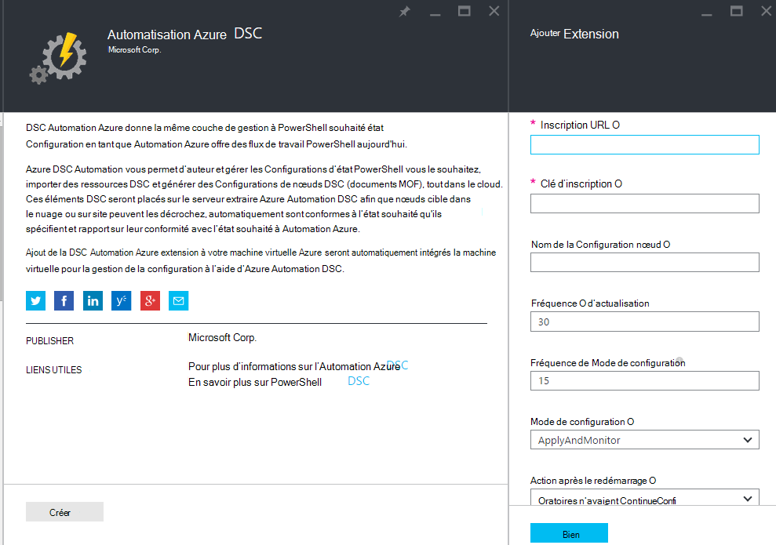
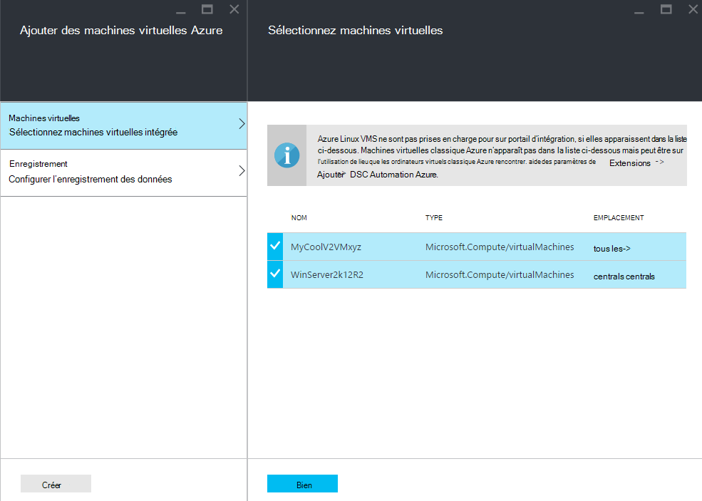
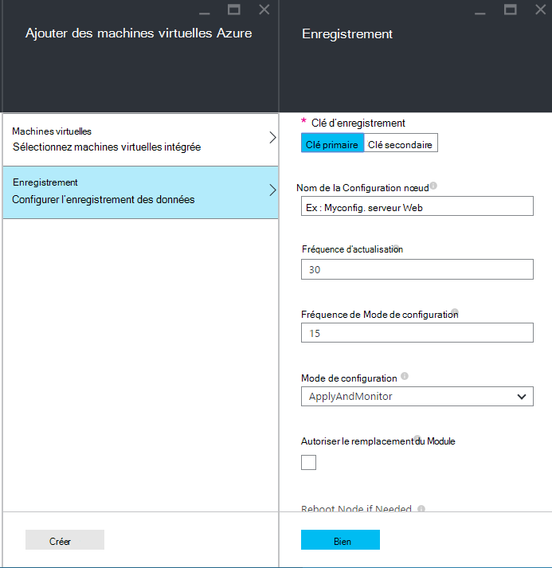
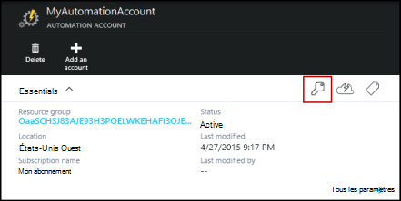
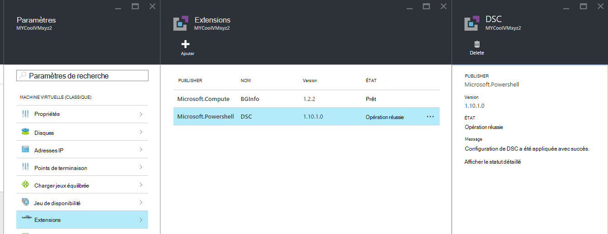

<properties 
   pageTitle="Machines virtuelles et physiques d’intégration pour la gestion en Azure Automation DSC | Microsoft Azure" 
   description="Comment configurer des ordinateurs pour la gestion avec Azure Automation DSC" 
   services="automation" 
   documentationCenter="dev-center-name" 
   authors="coreyp-at-msft" 
   manager="stevenka" 
   editor="tysonn"/>

<tags
   ms.service="automation"
   ms.devlang="NA"
   ms.topic="article"
   ms.tgt_pltfrm="powershell"
   ms.workload="TBD" 
   ms.date="04/22/2016"
   ms.author="coreyp"/>

# Machines d’intégration pour la gestion en Azure Automation DSC

## Pourquoi gérer machines avec Azure Automation DSC ?

Comme la [Configuration de l’état PowerShell vous le souhaitez](https://technet.microsoft.com/library/dn249912.aspx), Configuration de l’état souhaité Azure Automation est un service de gestion de configuration simple mais puissant, pour les nœuds DSC (physiques et virtuels) dans n’importe quel centre de données cloud ou en local. Il permet extensibilité élevées sur des milliers de machines rapidement et facilement à partir d’un emplacement central et sécurisé. Vous pouvez facilement intégrés machines, attribuer les configurations déclaratives et afficher les rapports affichant chaque machine de conformité à l’état de votre choix que vous avez spécifié. La couche de gestion Azure Automation DSC consiste à DSC que la couche de gestion Azure Automation consiste à l’écriture de script PowerShell. En d’autres termes, de la même façon Azure Automation vous permet de gérer des scripts PowerShell, il vous permet également gérer les configurations DSC. Pour en savoir plus sur les avantages de l’utilisation de Azure Automation DSC, voir [vue d’ensemble Azure Automation DSC](automation-dsc-overview.md). 

DSC Automation Azure peuvent servir à gérer un grand nombre d’ordinateurs :

*    Machines virtuelles Azure (classique)
*    Machines virtuelles Azure
*    Machines virtuelles Amazon Web Services (AWS)
*    Windows physique/virtuel machines local, ou dans un nuage différent Azure/AWS
*    Linux physique/virtuel machines en local, dans Azure ou dans un nuage différent Azure

En outre, si vous n’êtes pas prêt à gérer la configuration de l’ordinateur à partir du cloud, Azure Automation DSC peut également être utilisé comme point de terminaison rapport uniquement. Cela vous permet de définir la configuration de votre choix (push) via DSC en local et afficher les détails de création de rapports riches de conformité nœud indiquant l’état de votre choix dans Azure Automation.

Les sections suivantes décrivent comment vous pouvez intégrée chaque type d’ordinateur pour Azure Automation DSC.

## Machines virtuelles Azure (classique)

Avec Azure Automation DSC, vous pouvez facilement intégrés machines virtuelles Azure (classique) pour la gestion de la configuration à l’aide du portail Azure, soit PowerShell. Les paramètres avancés et sans aucun administrateur n’ait à distance la machine virtuelle, l’extension de Configuration de l’état souhaité Azure machine virtuelle enregistre la machine virtuelle avec Azure Automation DSC. Dans la mesure où l’extension de Configuration de l’état souhaité Azure machine virtuelle s’exécute en mode asynchrone, étapes pour effectuer le suivi de sa progression ou résoudre les problèmes il sont fournies dans la section [**résolution des problèmes Azure machine virtuelle arrivant**](#troubleshooting-azure-virtual-machine-onboarding) ci-dessous.

### Portail Azure

Dans le [portail Azure](http://portal.azure.com/), cliquez sur **Parcourir** -> **machines virtuelles (classique)**. Sélectionnez la machine virtuelle Windows que vous voulez intégré. Sur la carte de tableau de bord de la machine virtuelle, cliquez sur **tous les paramètres** -> **Extensions** -> **Ajouter** -> **Azure Automation DSC** -> **créer**. Entrez les [valeurs du Gestionnaire de Configuration de PowerShell DSC Local](https://msdn.microsoft.com/powershell/dsc/metaconfig4) requis pour votre cas d’utilisation, clé d’inscription de votre compte Automation et URL d’enregistrement et éventuellement une configuration nœud à affecter à la machine virtuelle.

Pour rechercher l’enregistrement URL et clé d’automatisation compte intégrée l’ordinateur pour voir la section [**sécuriser l’inscription**](#secure-registration) ci-dessous.

### PowerShell

    # log in to both Azure Service Management and Azure Resource Manager
    Add-AzureAccount
    Add-AzureRmAccount
    
    # fill in correct values for your VM/Automation account here
    $VMName = ""
    $ServiceName = ""
    $AutomationAccountName = ""
    $AutomationAccountResourceGroup = ""

    # fill in the name of a Node Configuration in Azure Automation DSC, for this VM to conform to
    $NodeConfigName = ""

    # get Azure Automation DSC registration info
    $Account = Get-AzureRmAutomationAccount -ResourceGroupName $AutomationAccountResourceGroup -Name $AutomationAccountName
    $RegistrationInfo = $Account | Get-AzureRmAutomationRegistrationInfo

    # use the DSC extension to onboard the VM for management with Azure Automation DSC
    $VM = Get-AzureVM -Name $VMName -ServiceName $ServiceName
    
    $PublicConfiguration = ConvertTo-Json -Depth 8 @{
      SasToken = ""
      ModulesUrl = "https://eus2oaasibizamarketprod1.blob.core.windows.net/automationdscpreview/RegistrationMetaConfigV2.zip"
      ConfigurationFunction = "RegistrationMetaConfigV2.ps1\RegistrationMetaConfigV2"

    # update these PowerShell DSC Local Configuration Manager defaults if they do not match your use case.
    # See https://technet.microsoft.com/library/dn249922.aspx?f=255&MSPPError=-2147217396 for more details
     Properties = @{
        RegistrationKey = @{
          UserName = 'notused'
          Password = 'PrivateSettingsRef:RegistrationKey'
        }
        RegistrationUrl = $RegistrationInfo.Endpoint
        NodeConfigurationName = $NodeConfigName
        ConfigurationMode = "ApplyAndMonitor"
        ConfigurationModeFrequencyMins = 15
        RefreshFrequencyMins = 30
        RebootNodeIfNeeded = $False
        ActionAfterReboot = "ContinueConfiguration"
        AllowModuleOverwrite = $False
      }
    }

    $PrivateConfiguration = ConvertTo-Json -Depth 8 @{
      Items = @{
         RegistrationKey = $RegistrationInfo.PrimaryKey
      }
    }
    
    $VM = Set-AzureVMExtension `
     -VM $vm `
     -Publisher Microsoft.Powershell `
     -ExtensionName DSC `
     -Version 2.19 `
     -PublicConfiguration $PublicConfiguration `
     -PrivateConfiguration $PrivateConfiguration `
     -ForceUpdate

    $VM | Update-AzureVM

## Machines virtuelles Azure

Azure DSC Automation vous permet de facilement intégrés machines virtuelles Azure pour la gestion de la configuration, à l’aide du portail Azure, le Gestionnaire de ressources Azure modèles ou PowerShell. Les paramètres avancés et sans aucun administrateur n’ait à distance la machine virtuelle, l’extension de Configuration de l’état souhaité Azure machine virtuelle enregistre la machine virtuelle avec Azure Automation DSC. Dans la mesure où l’extension de Configuration de l’état souhaité Azure machine virtuelle s’exécute en mode asynchrone, étapes pour effectuer le suivi de sa progression ou résoudre les problèmes il sont fournies dans la section [**résolution des problèmes Azure machine virtuelle arrivant**](#troubleshooting-azure-virtual-machine-onboarding) ci-dessous.

### Portail Azure

Dans le [portail Azure](https://portal.azure.com/), naviguez vers le compte Azure Automation où vous souhaitez machines virtuelles intégrés. Dans le tableau de bord Automation compte, cliquez sur **Nœuds DSC** -> **Ajouter Azure virtuelle**.

Sous **Sélectionnez machines virtuelles intégré**, sélectionnez une ou plusieurs machines virtuelles Azure à intégré.

Sous **configurer les données d’enregistrement**, entrez les [valeurs du Gestionnaire de Configuration de PowerShell DSC Local](https://msdn.microsoft.com/powershell/dsc/metaconfig4) requis pour votre cas d’utilisation et éventuellement une configuration nœud à affecter à la machine virtuelle.

 
### Modèles de gestionnaire de ressources Azure

Machines virtuelles Azure peut être déployées et onboarded à Azure Automation DSC via des modèles Azure le Gestionnaire de ressources. Voir [configurer une machine virtuelle via DSC extension et Azure Automation DSC](https://azure.microsoft.com/documentation/templates/dsc-extension-azure-automation-pullserver/) pour un exemple de modèle qui onboards une machine virtuelle existante pour Azure Automation DSC. Pour rechercher la clé d’enregistrement et l’URL d’inscription prises comme entrée dans ce modèle, consultez la section [**sécuriser l’inscription**](#secure-registration) ci-dessous.

### PowerShell

L’applet de commande [Registre AzureRmAutomationDscNode](https://msdn.microsoft.com/library/mt603833.aspx) peut servir à machines virtuelles intégrés dans le portail via PowerShell Azure.

## Machines virtuelles Amazon Web Services (AWS)

Vous pouvez facilement intégrés machines virtuelles Amazon Web Services pour la gestion de configuration par Azure Automation DSC à l’aide de la boîte à outils de DSC AWS. Vous pouvez en savoir plus sur la boîte à outils [ici](https://blogs.msdn.microsoft.com/powershell/2016/04/20/aws-dsc-toolkit/).

## Windows physique/virtuel machines local, ou dans un nuage différent Azure/AWS

Machines Windows en local et des ordinateurs Windows dans Azure non nuages (par exemple, Amazon Web Services) peuvent également être onboarded à Azure Automation DSC, dans la mesure où ils ont accès sortant à internet, via quelques étapes simples :

1. Assurez-vous que la dernière version de [WMF 5](http://aka.ms/wmf5latest) est installée sur les ordinateurs que vous voulez intégré à Azure Automation DSC.
2. Suivez les instructions de la section [**génération DSC metaconfigurations**](#generating-dsc-metaconfigurations) ci-dessous pour générer un dossier contenant les metaconfigurations DSC nécessaires.
3. Appliquer à distance la metaconfiguration DSC PowerShell pour les ordinateurs que vous voulez intégré. **L’ordinateur que cette commande est exécutée depuis doit avoir la dernière version de [5 WMF](http://aka.ms/wmf5latest) installé**:

    `Set-DscLocalConfigurationManager -Path C:\Users\joe\Desktop\DscMetaConfigs -ComputerName MyServer1, MyServer2`

4. Si vous ne pouvez pas appliquer les metaconfigurations PowerShell DSC à distance, copiez le dossier metaconfigurations à l’étape 2 sur chaque ordinateur sur intégré. Appelez ensuite **Ensemble DscLocalConfigurationManager** localement sur chaque ordinateur pour intégré.
5. Utilisez le portail Azure ou les applets de commande, vérifiez que les ordinateurs intégré maintenant apparaissent sous forme de nœuds DSC enregistrées dans votre compte Azure Automation.

## Linux physique/virtuel machines en local, dans Azure ou dans un nuage différent Azure

Ordinateurs Linux en local, machines Linux dans Azure et ordinateurs Linux dans Azure non nuages peuvent également être onboarded à Azure Automation DSC, dans la mesure où ils ont accès sortant à internet, via quelques étapes simples :

1. Assurez-vous que la dernière version de l' [agent DSC Linux](http://www.microsoft.com/download/details.aspx?id=49150) est installée sur les ordinateurs que vous voulez intégré à Azure Automation DSC.

2. Si le [Gestionnaire de Configuration de PowerShell DSC Local les valeurs par défaut](https://msdn.microsoft.com/powershell/dsc/metaconfig4) correspondent à votre cas d’utilisation, et que vous souhaitez intégré à machines tels qu’ils **extraient et de signaler à Azure Automation DSC** :

    *    Sur chaque ordinateur Linux pour intégré à Azure Automation DSC, utilisez Register.py pour intégré à l’aide des valeurs par défaut du Gestionnaire de Configuration de PowerShell DSC Local :

        `/opt/microsoft/dsc/Scripts/Register.py <Automation account registration key> <Automation account registration URL>`

    *    Pour rechercher la clé d’enregistrement et l’URL de l’enregistrement de votre compte Automation, consultez la section [**sécuriser l’inscription**](#secure-registration) ci-dessous.

    Si le Gestionnaire de Configuration de PowerShell DSC Local utilise par défaut **faire** ne correspondent **pas** votre cas d’utilisation ou si vous voulez les machines intégrés tels qu’ils signaler uniquement à Azure Automation DSC, mais ne pas les configuration extraire ou modules PowerShell à partir de celle-ci, suivez les étapes 3 à 6. Dans le cas contraire, passez directement à l’étape 6.

3.  Suivez les instructions de la section [**génération DSC metaconfigurations**](#generating-dsc-metaconfigurations) ci-dessous pour générer un dossier contenant les metaconfigurations DSC nécessaires.
4.  Appliquer à distance la metaconfiguration DSC PowerShell pour les ordinateurs que vous voulez intégré :
        
        $SecurePass = ConvertTo-SecureString -String "<root password>" -AsPlainText -Force
        $Cred = New-Object System.Management.Automation.PSCredential "root", $SecurePass
        $Opt = New-CimSessionOption -UseSsl -SkipCACheck -SkipCNCheck -SkipRevocationCheck

        # need a CimSession for each Linux machine to onboard
        
        $Session = New-CimSession -Credential $Cred -ComputerName <your Linux machine> -Port 5986 -Authentication basic -SessionOption $Opt
        
        Set-DscLocalConfigurationManager -CimSession $Session –Path C:\Users\joe\Desktop\DscMetaConfigs
    
L’ordinateur que cette commande est exécutée depuis doit avoir la dernière version d' [WMF 5](http://aka.ms/wmf5latest) est installé.

5.  Si vous ne pouvez pas appliquer les metaconfigurations PowerShell DSC à distance, pour chaque machine Linux intégré, copiez la metaconfiguration correspondant à cet ordinateur à partir du dossier à l’étape 5 sur l’ordinateur Linux. Puis appelez `SetDscLocalConfigurationManager.py` localement sur chaque ordinateur Linux souhaité à intégré à Azure Automation DSC :

    `/opt/microsoft/dsc/Scripts/SetDscLocalConfigurationManager.py –configurationmof <path to metaconfiguration file>`

6.  Utilisez le portail Azure ou les applets de commande, vérifiez que les ordinateurs intégré maintenant apparaissent sous forme de nœuds DSC enregistrées dans votre compte Azure Automation.

##Génération DSC metaconfigurations
Générique intégré à n’importe quel ordinateur à Azure Automation DSC, une metaconfiguration DSC peut être générée qui, lorsqu’elle est appliquée, indique à l’agent DSC sur l’ordinateur à extraire et/ou signaler à Azure Automation DSC. DSC metaconfigurations pour Azure Automation DSC peut être générées à l’aide d’une configuration DSC PowerShell ou les applets de commande PowerShell d’automatisation Azure.

**Remarque :** DSC metaconfigurations contiennent les secrets nécessaire intégré à un ordinateur à un objet Automation du compte pour la gestion. Veillez à protéger correctement tout metaconfigurations DSC que vous créez ou supprimez-les après leur utilisation.

###Utilisation d’une Configuration DSC
1.  Ouvrez le PowerShell ISE en tant qu’administrateur sur un ordinateur dans votre environnement local. L’ordinateur doit avoir la dernière version d' [WMF 5](http://aka.ms/wmf5latest) est installé.

2.  Copiez le script suivant localement. Ce script contient une configuration DSC PowerShell pour la création de metaconfigurations et une commande pour démarrer la création de metaconfiguration.
    
        # The DSC configuration that will generate metaconfigurations
        [DscLocalConfigurationManager()]
        Configuration DscMetaConfigs 
        { 
            param 
            ( 
                [Parameter(Mandatory=$True)] 
                [String]$RegistrationUrl,
         
                [Parameter(Mandatory=$True)] 
                [String]$RegistrationKey,

                [Parameter(Mandatory=$True)] 
                [String[]]$ComputerName,

                [Int]$RefreshFrequencyMins = 30, 
            
                [Int]$ConfigurationModeFrequencyMins = 15, 
            
                [String]$ConfigurationMode = "ApplyAndMonitor", 
            
                [String]$NodeConfigurationName,

                [Boolean]$RebootNodeIfNeeded= $False,

                [String]$ActionAfterReboot = "ContinueConfiguration",

                [Boolean]$AllowModuleOverwrite = $False,

                [Boolean]$ReportOnly
            )

    
            if(!$NodeConfigurationName -or $NodeConfigurationName -eq "") 
            { 
                $ConfigurationNames = $null 
            } 
            else 
            { 
                $ConfigurationNames = @($NodeConfigurationName) 
            }

            if($ReportOnly)
            {
               $RefreshMode = "PUSH"
            }
            else
            {
               $RefreshMode = "PULL"
            }

            Node $ComputerName
            {

                Settings 
                { 
                    RefreshFrequencyMins = $RefreshFrequencyMins 
                    RefreshMode = $RefreshMode 
                    ConfigurationMode = $ConfigurationMode 
                    AllowModuleOverwrite = $AllowModuleOverwrite 
                    RebootNodeIfNeeded = $RebootNodeIfNeeded 
                    ActionAfterReboot = $ActionAfterReboot 
                    ConfigurationModeFrequencyMins = $ConfigurationModeFrequencyMins 
                }

                if(!$ReportOnly)
                {
                   ConfigurationRepositoryWeb AzureAutomationDSC 
                    { 
                        ServerUrl = $RegistrationUrl 
                        RegistrationKey = $RegistrationKey 
                        ConfigurationNames = $ConfigurationNames 
                    }

                    ResourceRepositoryWeb AzureAutomationDSC 
                    { 
                       ServerUrl = $RegistrationUrl 
                       RegistrationKey = $RegistrationKey 
                    }
                }

                ReportServerWeb AzureAutomationDSC 
                { 
                    ServerUrl = $RegistrationUrl 
                    RegistrationKey = $RegistrationKey 
                }
            } 
        }
        
        # Create the metaconfigurations
        # TODO: edit the below as needed for your use case
        $Params = @{
             RegistrationUrl = '<fill me in>';
             RegistrationKey = '<fill me in>';
             ComputerName = @('<some VM to onboard>', '<some other VM to onboard>');
             NodeConfigurationName = 'SimpleConfig.webserver';
             RefreshFrequencyMins = 30;
             ConfigurationModeFrequencyMins = 15;
             RebootNodeIfNeeded = $False;
             AllowModuleOverwrite = $False;
             ConfigurationMode = 'ApplyAndMonitor';
             ActionAfterReboot = 'ContinueConfiguration';
             ReportOnly = $False;  # Set to $True to have machines only report to AA DSC but not pull from it
        }
        
        # Use PowerShell splatting to pass parameters to the DSC configuration being invoked
        # For more info about splatting, run: Get-Help -Name about_Splatting
        DscMetaConfigs @Params

3.  Renseignez les clé d’enregistrement et l’URL pour votre compte automatisation, ainsi que les noms des ordinateurs à intégré. Tous les autres paramètres sont facultatifs. Pour rechercher la clé d’enregistrement et l’URL de l’enregistrement de votre compte Automation, consultez la section [**sécuriser l’inscription**](#secure-registration) ci-dessous.

4.  Si vous souhaitez que les ordinateurs indiquent les informations d’état DSC à Azure Automation DSC, mais pas extraire configuration ou modules PowerShell, définissez le paramètre **ReportOnly** sur true.

5.  Exécuter le script. Vous disposez à présent un dossier nommé **DscMetaConfigs** dans votre répertoire de travail, contenant les metaconfigurations DSC PowerShell pour les ordinateurs à intégré.

###À l’aide des applets de commande Automation Azure
Si les valeurs par défaut du Gestionnaire de Configuration de PowerShell DSC Local correspondent à votre cas d’utilisation, et que vous voulez machines intégrés, tel qu’ils extraient et signaler à Azure Automation DSC, les applets de commande Azure Automation fournissent une méthode simplifiée de générer les metaconfigurations DSC nécessitées :

1.  Ouvrez la console PowerShell ou PowerShell ISE en tant qu’administrateur sur un ordinateur dans votre environnement local.

2.  Se connecter au Gestionnaire de ressources Azure à l’aide de **Ajouter AzureRmAccount**

3.  Téléchargez les metaconfigurations DSC PowerShell pour les ordinateurs que vous voulez sur intégré à partir du compte Automation auquel vous souhaitez nœuds intégrés :

        # Define the parameters for Get-AzureRmAutomationDscOnboardingMetaconfig using PowerShell Splatting
        $Params = @{
            ResourceGroupName = 'ContosoResources'; # The name of the ARM Resource Group that contains your Azure Automation Account
            AutomationAccountName = 'ContosoAutomation'; # The name of the Azure Automation Account where you want a node on-boarded to
            ComputerName = @('web01', 'web02', 'sql01'); # The names of the computers that the meta configuration will be generated for
            OutputFolder = "$env:UserProfile\Desktop\";
        }
        
        # Use PowerShell splatting to pass parameters to the Azure Automation cmdlet being invoked
        # For more info about splatting, run: Get-Help -Name about_Splatting
        Get-AzureRmAutomationDscOnboardingMetaconfig @Params

Vous disposez à présent un dossier nommé ***DscMetaConfigs***, qui contient les metaconfigurations DSC PowerShell pour les ordinateurs à intégré.

##Sécuriser l’inscription

Machines peuvent en toute sécurité intégrée à un compte Azure Automation via le protocole WMF 5 DSC d’enregistrement, ce qui permet à un nœud DSC s’authentifier à un serveur PowerShell DSC V2 extraire ou de création de rapports (y compris Azure Automation DSC). Le nœud inscrit sur le serveur à l' **URL de l’enregistrement**, l’authentification en utilisant une **clé d’inscription**. Lors de l’enregistrement, le nœud DSC et le serveur de DSC extraire/Reporting négocient un certificat unique pour ce nœud à utiliser pour l’authentification de l’enregistrement du serveur après. Ce processus empêche les nœuds onboarded à partir d’une qu'autre, par exemple, si un nœud est compromis emprunt d’identité et à des fins malveillantes un comportement anormal. Après l’enregistrement, la clé d’enregistrement n’est pas utilisée pour l’authentification à nouveau et est supprimée à partir du nœud.

Vous pouvez obtenir les informations requises pour le protocole d’inscription DSC à partir de la carte de **Gestion des clés** dans le portail Azure preview. Ouvrez cette carte en cliquant sur l’icône de clé dans le panneau **Essentials** pour le compte d’automatisation.

*    URL de l’enregistrement est le champ URL dans la carte de gestion des clés.
*    Clé d’enregistrement est la touche d’accès principal ou secondaire touche d’accès rapide dans la carte de gestion des clés. Sur les clés peuvent être utilisé.

Pour une sécurité accrue, les touches d’accès principaux et secondaires d’un compte d’automatisation peuvent être actualisées à tout moment (sur la carte de **Gestion des clés** ) pour empêcher les enregistrements de nœud futures à l’aide des touches précédente.

##Résolution des problèmes d’intégration Azure machine virtuelle

Azure DSC Automation vous permet de facilement intégré ordinateurs Windows Azure virtuels pour la gestion de la configuration. Les paramètres avancés, l’extension de Configuration de l’état souhaité Azure machine virtuelle permettant d’enregistrer la machine virtuelle avec Azure Automation DSC. Dans la mesure où l’extension de Configuration de l’état souhaité Azure machine virtuelle s’exécute en mode asynchrone, suivi de sa progression et résolution des problèmes de son exécution peuvent être importants. 

>[AZURE.NOTE] N’importe quelle méthode de d’intégration une machine virtuelle Windows Azure à Azure Automation DSC qui utilise l’extension de Configuration de l’état souhaité Azure machine virtuelle peut prendre jusqu'à une heure pour que le nœud afficher jusqu'à inscrit dans Azure Automation. Il s’agit en raison de l’installation de Windows Management Framework 5.0 sur l’ordinateur virtuel par l’extension Azure machine virtuelle DSC, qui est requise pour intégré la machine virtuelle pour Azure Automation DSC.

Pour résoudre les problèmes ou afficher l’état de l’extension de Configuration de l’état souhaité Azure machine virtuelle, dans le Azure portal accédez à la machine virtuelle en cours onboarded, puis cliquez sur -> **tous les paramètres** -> **Extensions** -> **DSC**. Pour plus d’informations, vous pouvez cliquer sur **Afficher le statut détaillé**.

## Expiration du certificat et réinscription

Après avoir enregistré un ordinateur sous forme de nœud DSC dans Azure Automation DSC, il existe un certain nombre de raisons pourquoi vous devrez peut-être réenregistrer ce nœud à l’avenir :

* Après avoir enregistré, chaque nœud négocie automatiquement un certificat unique pour l’authentification expire après un an. Pour l’instant, le protocole d’inscription DSC PowerShell ne peut pas renouveler automatiquement des certificats lorsqu’ils sont proches d’expiration, vous devez enregistrer de nouveau les nœuds après un an. Avant de réinscription, assurez-vous que chaque nœud exécute Windows Management Framework 5.0 RTM. Si le certificat d’authentification d’un nœud arrive à expiration et que le nœud n’est pas réinscrit, le nœud ne pourra pas à communiquer avec Azure Automation et est marqué « Blocage ». Réinscription effectuée 90 jours ou inférieure à partir de l’heure d’expiration de certificat ou à tout moment après le délai d’expiration du certificat, entraîne un nouveau certificat générée et utilisé.

* Pour modifier toutes les [valeurs du Gestionnaire de Configuration de PowerShell DSC locales](https://msdn.microsoft.com/powershell/dsc/metaconfig4) qui ont été définies lors de l’inscription initiale du nœud, par exemple ConfigurationMode. Pour l’instant, ces valeurs agent DSC peuvent uniquement être modifiés via réinscription. La seule exception est la Configuration de nœuds affecté à l’information : Ceci peut être modifié dans Azure Automation DSC directement.

Réinscription peut être effectuée de la même façon que vous avez enregistré le nœud initiale, à l’aide d’une des méthodes d’intégration décrites dans ce document. Vous n’êtes pas obligé de l’inscription d’un nœud à partir d’Azure Automation DSC avant réinscription il.

## Articles connexes
* [Vue d’ensemble de Automation DSC Azure](automation-dsc-overview.md)
* [Applets de commande Automation DSC Azure](https://msdn.microsoft.com/library/mt244122.aspx)
* [Tarifs Automation DSC Azure](https://azure.microsoft.com/pricing/details/automation/)

