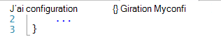
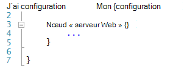
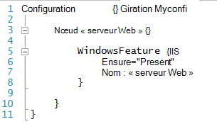
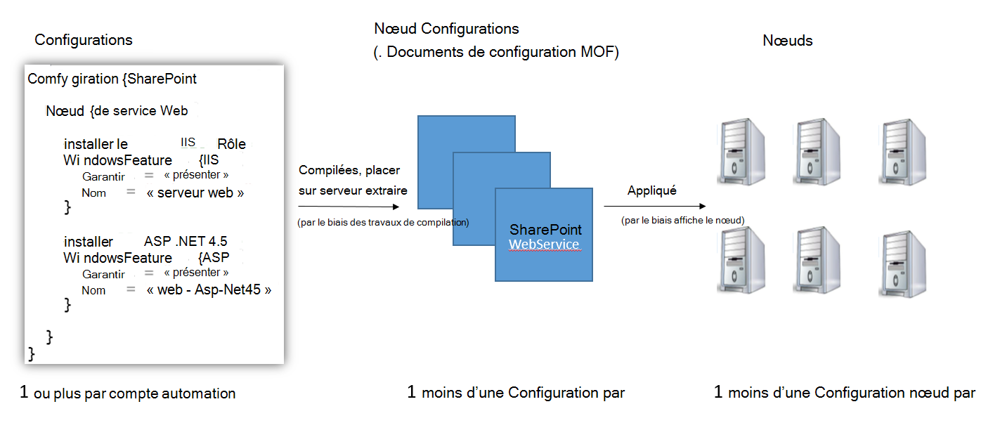
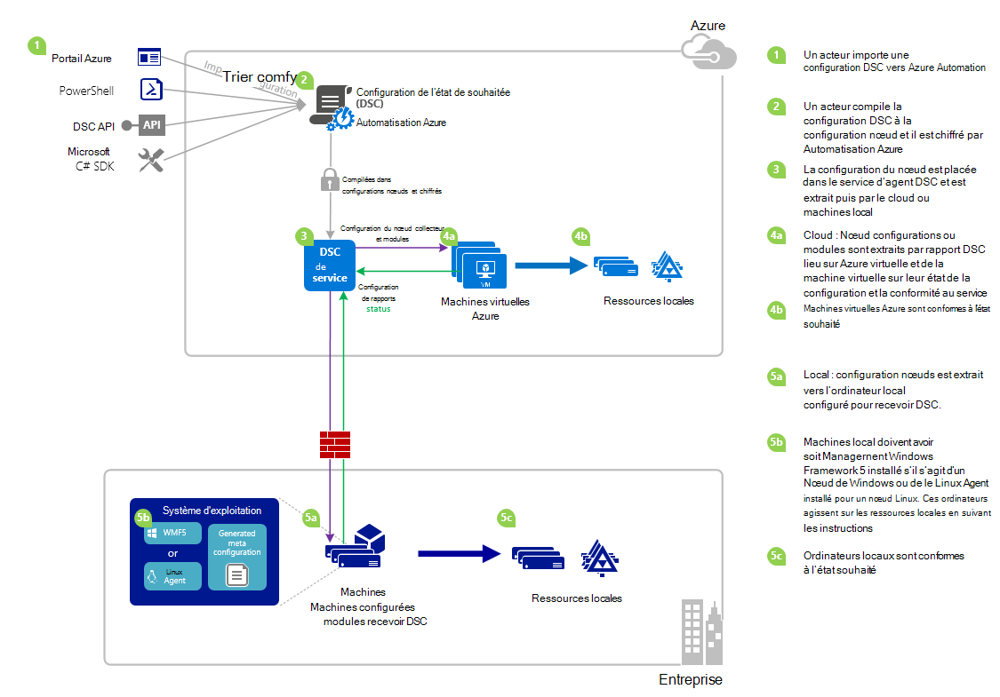

<properties 
   pageTitle="Vue d’ensemble de Automation Azure DSC | Microsoft Azure" 
   description="Une vue d’ensemble de Azure Automation vous le souhaitez état Configuration (DSC), ses termes et problèmes connus" 
   services="automation" 
   documentationCenter="dev-center-name" 
   authors="coreyp-at-msft" 
   manager="stevenka" 
   editor="tysonn"
   keywords="PowerShell dsc, configuration de l’état de votre choix, azure dsc de powershell"/>

<tags
   ms.service="automation"
   ms.devlang="NA"
   ms.topic="article"
   ms.tgt_pltfrm="powershell"
   ms.workload="TBD" 
   ms.date="05/10/2016"
   ms.author="magoedte;coreyp"/>

# Vue d’ensemble de Automation Azure DSC #

##Qu’est Azure Automation DSC ?##
Déploiement et la maintenance de l’état de vos serveurs et les ressources de l’application souhaité peuvent être fastidieuses et source d’erreurs. Avec Azure Automation souhaité état Configuration (DSC), vous pouvez déployer régulièrement, fiable surveiller et mettre à jour automatiquement l’état de toutes vos ressources informatiques, à l’échelle à partir du cloud souhaité. Basé sur PowerShell DSC, Automation DSC aligner configuration avec un état spécifique sur physiques et virtuels (machines virtuelles), à l’aide de Windows ou Linux et dans le nuage ou sur site de l’ordinateur. Vous pouvez activer la remise des services informatiques continue avec contrôle cohérente et gérer les modifications rapides dans votre environnement informatique de hybride hétérogène en toute simplicité.

DSC Automation Azure s’appuie sur les notions de base introduites dans DSC PowerShell pour fournir une expérience de gestion de configuration encore plus facilement. DSC Automation Azure donne la même couche de gestion à [Configuration de l’état PowerShell souhaité](https://msdn.microsoft.com/powershell/dsc/overview) comme Automation Azure offre pour l’écriture de scripts PowerShell aujourd'hui.

Azure DSC Automation vous permet [créer et gérer les Configurations d’état PowerShell vous le souhaitez](https://technet.microsoft.com/library/dn249918.aspx), importer des [Ressources DSC](https://technet.microsoft.com/library/dn282125.aspx)et générer DSC nœud Configurations (documents MOF), dans le cloud. Ces éléments DSC seront placés sur l’Automation Azure [DSC extraire serveur](https://technet.microsoft.com/library/dn249913.aspx) afin que nœuds cible (par exemple, physiques et virtuels) dans le nuage ou sur site peuvent les décrochez, automatiquement sont conformes à l’état souhaité qu'ils spécifient et rapport sur leur conformité avec l’état souhaité à Automation Azure.

Vous préférez regardant à lecture ? Regardez l’en dessous de la vidéo à partir de mai 2015, lors de la première annonce de Azure Automation DSC. **Remarque :** Tandis que les concepts et le cycle de vie mentionnés dans cette vidéo sont corrects, Azure Automation DSC progression souvent dans la mesure où cette vidéo a été enregistrée. Il est désormais disponible, possède une interface utilisateur beaucoup plus étendue dans le portail Azure et prend en charge de nombreuses fonctionnalités supplémentaires.

> [AZURE.VIDEO microsoft-ignite-2015-heterogeneous-configuration-management-using-microsoft-azure-automation]

## Automatisation Azure DSC termes ##
### Configuration ###
DSC PowerShell introduit un nouveau concept appelé configurations. Configurations permettent de définir, via la syntaxe de PowerShell, l’état de votre environnement souhaité. Pour configurer votre environnement DSC, définissez un bloc de script Windows PowerShell en utilisant le mot-clé de configuration, puis suivez avec un identificateur, puis avec entre accolades ({}) pour délimiter le bloc.

Dans le bloc de configuration, vous pouvez définir des blocs de configuration nœud qui spécifient la configuration souhaitée pour un ensemble de nœuds (ordinateurs) dans votre environnement qui doit être configuré exactement. De cette façon, une configuration nœud représente un « rôle » pour un ou plusieurs des nœuds de supposer. Un bloc de configuration nœud commence par le mot-clé nœud. Suivez ce mot clé avec le nom du rôle, qui peut être une variable ou une expression. Après le nom de rôle, utilisez les accolades {} pour délimiter le bloc de configuration nœud.

 
Dans le bloc de configuration nœud, vous pouvez définir des blocs de ressources pour configurer des ressources DSC spécifiques. Un bloc de ressources commence par le nom de la ressource, suivi de l’identificateur que vous souhaitez spécifier pour ce bloc, puis accolades {} pour délimiter le bloc.

Pour plus d’informations sur le mot-clé de configuration, voir : [Comprendre Configuration mot-clé dans Configuration de l’état souhaité](http://blogs.msdn.com/b/powershell/archive/2013/11/05/understanding-configuration-keyword-in-desired-state-configuration.aspx "Comprendre Configuration mot-clé dans Configuration de l’état souhaité")

En cours d’exécution (compilation) une configuration DSC produira une ou plusieurs DSC nœud configurations (documents MOF), qui sont les nœuds DSC s’appliquent à respecter souhaité.

Azure DSC Automation vous permet d’importer, auteur, et compilation DSC configurations dans Azure Automation, similaire à la façon dont les procédures opérationnelles peut être importé, créé et en main d’Azure Automation.

>[AZURE.IMPORTANT] Une configuration doit contenir qu’un seul bloc de configuration, avec le même nom que la configuration, dans Azure Automation DSC. 

###Configuration du nœud###

Lorsqu’une Configuration DSC est compilée, une ou plusieurs configurations de nœud sont produites selon les blocs de nœud dans la configuration. Une configuration nœud est identique à un « MOF » ou « document configuration » (si vous êtes habitué à ces termes PS DSC) et représente un « rôle », tels que le serveur Web ou collaborateur, qui vous le souhaitez état un ou plusieurs nœuds doit part du principe ou vérifier la conformité par rapport à. Les noms de configurations nœud dans Azure Automation DSC prennent la forme « Configuration Name.NodeConfigurationBlockName ».

PS Nœuds DSC eu connaissance des configurations nœud qu’ils doivent appliquer via push DSC ou méthodes extraire. DSC Automation Azure s’appuie sur la méthode d’extraction DSC, où les configurations de nœud de demande de nœuds qu'ils doivent s’appliquer à partir de la DSC Automation Azure chercher server. Étant donné que les nœuds de la demande à Azure Automation DSC, les nœuds peuvent être derrière le pare-feu, que tous les ports fermés, etc. d’entrée. Il leur suffit d’accès sortant à Internet (directement ou via un proxy).

###Nœud###

Un nœud DSC est n’importe quel ordinateur sur lequel sa configuration gérée par DSC. Il peut s’agir Windows ou Linux Azure machine virtuelle, en local machine virtuelle / physique hôte ou machine dans un autre cloud public. Les nœuds appliquer des configurations nœud pour devenir et conserver la compatibilité avec l’état souhaité qu'ils définissent et peuvent également rapport sur un serveur de création de rapports dans leur état de la configuration et la conformité par rapport à l’état souhaité.

DSC Automation Azure facilite d’intégration des nœuds pour la gestion en Azure Automation DSC et permet de changer la configuration de nœuds affectée à chaque nœud côté serveur, prochain que nœud vérifie le serveur pour obtenir des instructions il part du principe un autre rôle et modifier la manière dont il est configuré et l’état de conformité elle doit signaler par rapport à faire pour correspondre.

###Ressource###
DSC ressources sont des blocs de construction que vous pouvez utiliser pour définir une configuration de Windows PowerShell vous le souhaitez état Configuration (DSC). DSC est fourni avec un ensemble de ressources prédéfinis tels que ceux des fichiers et dossiers, fonctionnalités du serveur et les rôles, paramètres du Registre, variables d’environnement et services et processus. Pour en savoir plus sur la liste complète des ressources DSC intégrés et comment les utiliser, voir [Intégrés Windows PowerShell vous le souhaitez Configuration ressources d’état](https://technet.microsoft.com/library/dn249921.aspx).

Ressources DSC peuvent également être importées dans le cadre des Modules PowerShell pour étendre l’ensemble des ressources DSC intégrés. Ressources par défaut non se fera vers le bas par des nœuds DSC à partir du serveur d’extraire DSC, si une configuration nœud que le nœud est destiné à appliquer contient des références à ces ressources. Pour apprendre à créer des ressources personnalisés, voir [Créer Windows PowerShell vous le souhaitez état Configuration ressources personnalisées](https://technet.microsoft.com/library/dn249927.aspx).

Azure DSC Automation est fourni avec les mêmes intégrés ressources DSC comme PS DSC. Ressources supplémentaires peuvent être ajoutés à Azure Automation DSC en important des modules PowerShell contenant les ressources dans Azure Automation.

###Travail de compilation###
Un travail de compilation dans Azure Automation DSC est une instance de la compilation d’une configuration, pour créer une ou plusieurs configurations de nœud. Ils sont similaires aux tâches d’automatisation Azure de runbook, excepté qu’ils n’exécutent pas réellement n’importe quelle tâche à l’exception de to créer des configurations de nœud. Toutes les configurations nœud créées par une tâche de compilation sont placées automatiquement sur le serveur extraire Azure Automation DSC, puis remplacent les versions antérieures des configurations nœud, si elles n’existant pour cette configuration. Le nom d’une configuration nœuds obtenu par une tâche de compilation prend la forme de « ConfigurationName.NodeConfigurationBlockName ». Par exemple, la compilation la configuration ci-dessous, vous obtenez une configuration nœud unique appelée « MyConfiguration.webserver »

>[AZURE.NOTE] À l’instar des procédures opérationnelles, configurations pouvant être publiées. Ceci n’est pas lié à placer les éléments DSC sur le serveur extraire Azure Automation DSC. Travaux de compilation provoque DSC des éléments à placer sur le serveur extraire Azure Automation DSC. Pour plus d’informations sur « publication » dans Azure automatisation, voir [un Runbook de publication](https://msdn.microsoft.com/library/dn903765.aspx).

##Cycle de vie DSC Automation Azure##
Accéder à partir d’un compte automation vide à un ensemble géré de nœuds correctement configurés implique un ensemble de processus pour la définition des configurations, ces configurations dans configurations nœud et d’intégration des nœuds pour Azure Automation DSC et ces configurations nœud l’activation. Le diagramme suivant illustre le cycle de vie Azure Automation DSC :

L’image suivante illustre le processus pas à pas détaillé dans le cycle de vie de DSC. Il inclut les différentes façons une configuration est importée et appliquée à des nœuds dans Azure Automation, composants requis pour un ordinateur local pour prendre en charge DSC et interactions entre les différents composants. 

     

##Pièges / problèmes connus :##

- Lorsque vous passez à la version finale de 5 WMF, si l’ordinateur est déjà enregistré en tant que nœud dans Azure Automation DSC, veuillez unregister à partir d’Azure Automation DSC et l’enregistrer à nouveau après la version finale de 5 WMF mis à niveau.

- DSC Automation Azure ne reconnaît pas les configurations DSC partielles ou composites pour le moment. Toutefois, les ressources composites DSC peuvent être importés et utilisés dans Azure Automation DSC Configurations comme dans PowerShell local, l’activation de réutilisation de configuration.

- La dernière version de WMF 5 doit être installée pour l’agent DSC PowerShell pour Windows afin d’être en mesure de communiquer avec l’Automation Azure. La dernière version de l’agent DSC PowerShell pour Linux doit être installée pour Linux être en mesure de communiquer avec l’Automation Azure.

- Le serveur extraire PowerShell DSC traditionnel attend module compresse pour figurer sur le serveur extraire au format **ModuleName_Version.zip »**. Automatisation Azure attend modules PowerShell à importer les noms dans le formulaire de **ModuleName.zip**. Consultez [ce billet de blog](https://azure.microsoft.com/blog/2014/12/15/authoring-integration-modules-for-azure-automation/) pour plus d’informations sur le format de Module d’intégration nécessaire pour importer le module dans Azure Automation. 

- Modules PowerShell importées dans Azure Automation ne peut pas contenir des fichiers .doc ou .docx. Certains modules PowerShell contenant des ressources DSC contiennent ces fichiers, à des fins de l’aide. Ces fichiers doivent être supprimés à partir des modules, avant d’importer dans Azure Automation.

- Lorsqu’un nœud est tout d’abord enregistré avec un compte Azure Automation ou le nœud est modifié pour être mappée à un autre nœud configuration côté serveur, son état sera « Conforme », même si l’état du nœud n’est pas réellement conforme à la configuration de nœuds qu’il est maintenant mappée à. Une fois que le nœud effectue sa première extraire et envoie son premier rapport, après l’enregistrement ou un mappage de configuration nœud, l’état du nœud peut être approuvé.

- Lorsque arrivant une machine virtuelle Windows Azure pour la gestion en Azure Automation DSC en utilisant l’un de nos méthodes d’intégration directe, peut prendre une heure pour la machine virtuelle s’afficheront sous forme de nœud DSC dans Azure Automation. Il s’agit en raison de l’installation de Windows Management Framework 5.0 sur l’ordinateur virtuel par l’extension Azure machine virtuelle DSC, qui est requise pour intégré la machine virtuelle pour Azure Automation DSC.

- Après avoir enregistré, chaque nœud négocie automatiquement un certificat unique pour l’authentification expire après un an. Pour le moment, le protocole d’inscription DSC PowerShell ne peut pas renouvelé automatiquement les certificats lorsqu’ils sont proches d’expiration, vous devez enregistrer de nouveau les nœuds après un an. Avant de réinscription, assurez-vous que chaque nœud exécute Windows Management Framework 5.0 RTM. Si le certificat d’authentification d’un nœud arrive à expiration et que le nœud n’est pas réinscrit, le nœud ne pourra pas à communiquer avec Azure Automation et est marqué « Blocage ». Réinscription est effectuée de la même façon que vous avez enregistré le nœud initiale. Réinscription effectuée 90 jours ou inférieure à partir de l’heure d’expiration de certificat ou à tout moment après le délai d’expiration du certificat, entraîne un nouveau certificat générée et utilisé.

- Lorsque vous passez à la version finale de 5 WMF, si l’ordinateur est déjà enregistré en tant que nœud dans Azure Automation DSC, veuillez unregister à partir d’Azure Automation DSC et l’enregistrer à nouveau après la version finale de 5 WMF mis à niveau. Avant de réinscription, supprimez le fichier $env:windir\system32\configuration\DSCEngineCache.mof.

- Applets de commande PowerShell DSC peuvent ne pas fonctionner si WMF 5 RTM est installé en haut de l’aperçu de Production WMF 5. Pour résoudre ce problème, exécutez la commande suivante dans une session PowerShell avec élévation de privilèges (exécutée en tant qu’administrateur) :`mofcomp $env:windir\system32\wbem\DscCoreConfProv.mof`
 

##Articles connexes##

- [Machines d’intégration pour la gestion en Azure Automation DSC] (.. /Automation/Automation-DSC-onboarding.MD)
- [Compilation configurations dans Azure Automation DSC] (.. /Automation/Automation-DSC-compile.MD)
- [Applets de commande azure Automation DSC] (https://msdn.microsoft.com/library/mt244122.aspx)
- [Azure Automation DSC tarifs] (https://azure.microsoft.com/pricing/details/automation/)
- [Déploiement continue à IaaS machines virtuelles à l’aide de Automation Azure DSC et Chocolatey] (automation-dsc-cd-chocolatey.md)
