<properties
    pageTitle="Mon runbook graphique première dans Azure automatisation | Microsoft Azure"
    description="Didacticiel qui vous guide tout au long de la création, tests et la publication d’un graphique runbook simple."
    services="automation"
    documentationCenter=""
    authors="mgoedtel"
    manager="jwhit"
    editor=""
    keywords="runbook modèle runbook, runbook, l’automatisation runbook azure"/>
<tags
    ms.service="automation"
    ms.workload="tbd"
    ms.tgt_pltfrm="na"
    ms.devlang="na"
    ms.topic="get-started-article"
    ms.date="07/06/2016"
    ms.author="magoedte;bwren"/>

# <a name="my-first-graphical-runbook"></a>Mon premier runbook de graphique

> [AZURE.SELECTOR] - [Graphique](automation-first-runbook-graphical.md) - [PowerShell](automation-first-runbook-textual-PowerShell.md) - [PowerShell le flux de travail](automation-first-runbook-textual.md)

Ce didacticiel vous guide tout au long de la création d’un [graphique runbook](automation-runbook-types.md#graphical-runbooks) dans Azure Automation.  Nous allons commencer par un simple runbook que nous allons tester et publier tandis que nous indiquent la marche à suivre l’état de la tâche runbook.  Puis nous allons modifier le runbook pour gérer les ressources Azure, dans ce cas en commençant une machine virtuelle Azure.  Nous allons puis renforcer le runbook en ajoutant des paramètres runbook et liens conditionnelle.

## <a name="prerequisites"></a>Conditions préalables

Pour effectuer ce didacticiel, vous devez les éléments suivants.

-   Abonnement Azure.  Si vous n’en avez pas encore, vous pouvez [activer vos avantages d’abonné MSDN](https://azure.microsoft.com/pricing/member-offers/msdn-benefits-details/) ou <a href="/pricing/free-account/" target="_blank"> [s’inscrire à un compte gratuit](https://azure.microsoft.com/free/).
-   [Exécuter en tant que compte azure](automation-sec-configure-azure-runas-account.md) pour maintenir le runbook et authentifier aux ressources Azure.  Ce compte doit être autorisé à démarrer et arrêter la machine virtuelle.
-   Une machine virtuelle Azure.  Nous arrêter et démarrer de cet ordinateur afin qu’il ne doit pas être production.


## <a name="step-1---create-new-runbook"></a>Étape 1 : créer de nouveaux runbook

Nous allons commencer par créer une procédure opérationnelle simple qui extrait le texte *Hello World*.

1.  Dans le portail Azure, ouvrez votre compte Automation.  
    La page de compte Automation vous donne un aperçu rapide des ressources dans ce compte.  Vous devez déjà avoir certains actifs.  La plupart de ces sont les modules sont automatiquement incluses dans un nouveau compte Automation.  Vous devez également les biens d’informations d’identification mentionné dans les [conditions préalables](#prerequisites).
2.  Cliquez sur la vignette de **procédures opérationnelles** pour ouvrir la liste des procédures opérationnelles.<br> 
3.  Créer un nouveau runbook en cliquant sur le bouton **Ajouter une procédure opérationnelle** , puis **créer un nouveau runbook**.
4.  Nommez le runbook la *MyFirstRunbook graphique*.
5.  Dans ce cas, nous allons créer un [graphique runbook](automation-graphical-authoring-intro.md) ainsi sélectionnez **graphique** de **type Runbook**.<br> 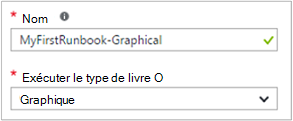<br>
6.  Cliquez sur **créer** pour créer la procédure opérationnelle et ouvrez l’éditeur de graphique.

## <a name="step-2---add-activities-to-the-runbook"></a>Étape 2 : ajouter des activités à la runbook

Le contrôle de la bibliothèque sur le côté gauche de l’éditeur permet de sélectionner les activités à ajouter à votre runbook.  Nous allons ajouter une applet de commande de **Sortie d’écriture** pour le texte à partir du runbook de sortie.

1.  Dans le contrôle de la bibliothèque, cliquez dans la zone de recherche et tapez **Écriture sortie**.  Les résultats de recherche seront affichera en dessous. <br> 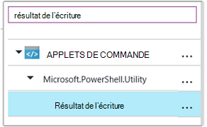
2.  Faites défiler jusqu'à la fin de la liste.  Vous pouvez soit cliquez avec le bouton droit sur **Écriture sortie** et sélectionnez **Ajouter à la zone de dessin** , ou cliquez sur l’ellipse en regard de l’applet de commande et puis sélectionnez **Ajouter à la zone de dessin**.
3.  Cliquez sur l’activité **d’Écriture sortie** dans la zone de dessin.  Cette action ouvre la carte de contrôle de Configuration qui permet de vous permettent de configurer l’activité.
4.  L' **étiquette** par défaut est le nom de l’applet de commande, mais nous pouvons modifiez-le par un nom plus convivial. Définir *d’Écrire Bonjour en sortie*.
5.  Cliquez sur **paramètres** pour fournir des valeurs pour les paramètres de l’applet de commande.  
    Des applets de commande ont plusieurs jeux de paramètres, et vous devez sélectionner que vous allez utiliser. Dans ce cas, **Écriture sortie** ne propose qu’un seul ensemble de paramètre, de sorte que vous n’avez pas besoin de sélectionner une. <br> 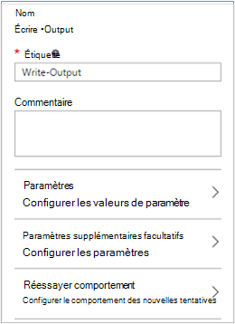
6.  Sélectionnez le paramètre de **l’objet d’entrée** .  Il s’agit le paramètre nous indiquer sur le texte à envoyer au flux de sortie.
7.  Dans la liste déroulante **source de données** , sélectionnez **PowerShell expression**.  La liste déroulante **source de données** fournit différentes sources que vous utilisez pour remplir une valeur de paramètre.  
    Vous pouvez utiliser la sortie de ces sources telles qu’une autre activité, un bien Automation ou une expression de PowerShell.  Dans ce cas, nous voulons simplement le texte *Hello World*de sortie. Nous pouvons utiliser une expression PowerShell et spécifiez une chaîne.
8.  Dans la zone **Expression** , tapez *« Hello World »* , puis sur **OK** à deux reprises pour retourner dans la zone de dessin.<br> 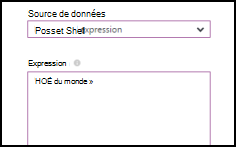
9.  Enregistrer le runbook en cliquant sur **Enregistrer**.<br> 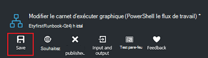

## <a name="step-3---test-the-runbook"></a>Étape 3 : tester le runbook

Avant de nous publier le runbook pour qu’il soit en production, nous voulons tester pour vous assurer qu’il fonctionne correctement.  Lorsque vous testez une procédure opérationnelle, vous exécutez sa version **brouillon** et affichez sa sortie de façon interactive.

1.  Cliquez sur **volet de Test** pour ouvrir la carte de Test.<br> 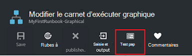
2.  Cliquez sur **Démarrer** pour démarrer le test.  Il s’agit de la seule option activée.
3.  Un [travail runbook](automation-runbook-execution.md) est créé et que son statut est affiché dans le volet.  
    L’état du travail démarre comme *en file d’attente* indiquant qu’il est en attente d’un collaborateur runbook dans le cloud à deviennent disponibles.  Elle passe alors au *départ* lorsqu’un collaborateur revendications la tâche, puis *en cours d’exécution* lorsque la runbook démarre réellement en cours d’exécution.  
4.  Lorsque le travail runbook est terminé, le résultat s’affiche. Dans notre exemple, nous devons voir *Hello World*.<br> 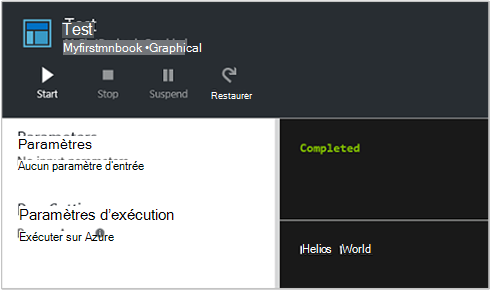
5.  Fermer la carte de Test pour revenir à la zone de dessin.

## <a name="step-4---publish-and-start-the-runbook"></a>Étape 4 : publier et démarrer le runbook

La procédure opérationnelle créée est toujours en mode brouillon. Nous avons besoin de publier avant que nous puissions exécutez-le en production.  Lorsque vous publiez une procédure opérationnelle, vous remplacez la version publiée existante avec la version brouillon.  Dans notre exemple, nous n’avons une version publiée encore car nous avons créé simplement la procédure opérationnelle.

1.  Cliquez sur **Publier** pour publier le runbook, puis sur **Oui** lorsque vous y êtes invité.<br> 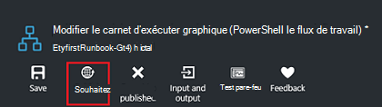
2.  Si vous faites défiler à gauche pour afficher la runbook dans la carte de **procédures opérationnelles** , il apparaît un **État de création** **publié**.
3.  Faites défiler vers la droite pour afficher la carte de **MyFirstRunbook**.  
    Les options dans la partie supérieure permettent de commencer la procédure opérationnelle, planifiez quand il doit commencer à un moment donné à l’avenir ou créer un [webhook](automation-webhooks.md) afin qu’il peut être démarré via un appel HTTP.
4.  Nous voulons simplement démarrer la runbook cliquez sur **Démarrer** , puis sur **Oui** lorsque vous y êtes invité.<br> 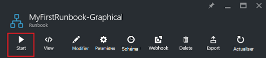
5.  Une carte de projet est ouvert pour le travail runbook que nous venez de créer.  Nous pouvons fermer cette carte, mais dans ce cas nous allons laissez-la ouverte afin que nous puissions regarder la progression du travail.
6.  L’état du travail est présentée dans un **Résumé de la tâche** et correspond aux statuts que nous avons vu quand nous testé la procédure opérationnelle.<br> 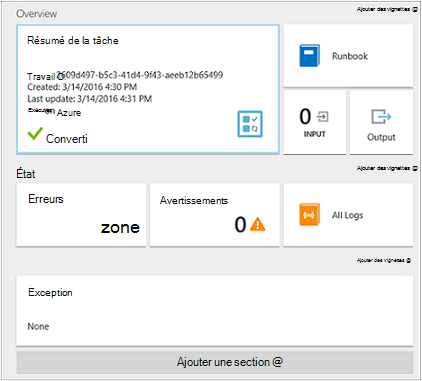
7.  Une fois que l’état runbook indique *terminé*, cliquez sur **sortie**. La carte de **sortie** est ouvert, et nous pouvons voir notre *Bonjour* dans le volet.<br> 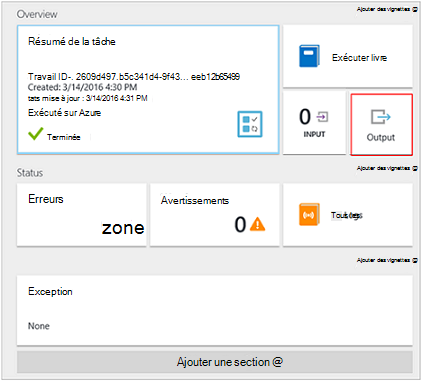  
8.  Fermer la carte de sortie.
9.  Cliquez sur **Tous les journaux** pour ouvrir la carte de flux de données pour le travail runbook.  Nous devons uniquement voir *Hello World* dans le flux de sortie, mais cela peut afficher d’autres flux de données pour une tâche runbook tels que des commentaires et d’erreur si la runbook écrit leur.<br> 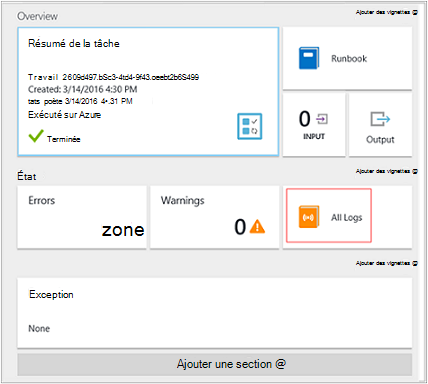
10. Fermer la carte de tous les journaux et la carte de projet pour revenir à la carte MyFirstRunbook.
11. Cliquez sur **tâches** pour ouvrir la carte de tâches pour cette procédure opérationnelle.  Répertorie toutes les tâches créées par cette procédure opérationnelle. Nous devons voir uniquement une tâche figurant dans la mesure où nous exécuté uniquement la tâche une seule fois.<br> 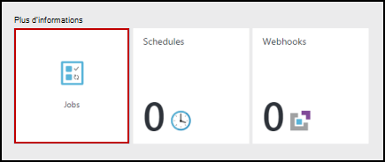
12. Vous pouvez cliquer sur cette tâche pour ouvrir le volet de travail même que nous avons vu lorsque nous avons commencé la procédure opérationnelle.  Cela vous permet de revenir en arrière dans le temps et afficher les détails de n’importe quelle tâche qui a été créée pour un runbook particulier.

## <a name="step-5---create-variable-assets"></a>Étape 5 : créer des variables actifs

Nous avons testé et publié notre runbook, mais jusqu'à présent il ne fait rien utiles. Nous voulons gérer les ressources Azure.  Avant de nous configurer le runbook s’authentifier, nous allons créer une variable pour contenir l’ID de l’abonnement et le référencer une fois que nous configurer l’activité de s’authentifier à l’étape 6 ci-dessous.  Inclusion d’une référence au contexte de l’abonnement vous permet de travailler facilement entre plusieurs abonnements.  Avant de commencer, copiez votre ID de l’abonnement de l’option abonnements fermez le volet de Navigation.  

1. Dans la carte Automation comptes, cliquez sur la vignette de **biens** et la carte de **biens** est ouvert.
2. Dans la carte de biens, cliquez sur la vignette de **Variables** .
3. Dans la carte de Variables, cliquez sur **Ajouter une variable**.<br>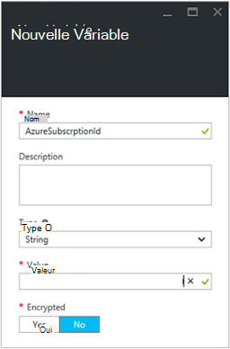
4. Dans la nouvelle carte variable, dans la zone **nom** , entrez **AzureSubscriptionId** , puis dans la zone **valeur** , entrez votre identifiant de l’abonnement.  Conserver la *chaîne* pour le **Type** et la valeur par défaut pour **le chiffrement**.  
5. Cliquez sur **créer** pour créer la variable.  


## <a name="step-6---add-authentication-to-manage-azure-resources"></a>Étape 6 : ajouter une authentification pour gérer les ressources Azure

Maintenant que nous avons une variable qui doit contenir notre ID de l’abonnement, nous pouvons configurer notre runbook s’authentifier à exécuter en tant que celles qui font référence dans les [conditions préalables](#prerequisites).  Nous faire en ajoutant l’Azure exécuter en tant que connexion **actif** et **Ajouter AzureRMAccount** applet de commande dans la zone de dessin.  

1.  Ouvrez l’éditeur graphique en cliquant sur **Modifier** dans la carte MyFirstRunbook.<br> 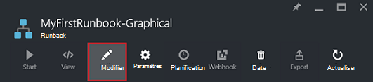
2.  Nous n’avez plus besoin **Écrire Bonjour en sortie** , avec le bouton droit dessus et sélectionnez **Supprimer**.
3.  Dans le contrôle de la bibliothèque, développez **connexions** et ajoutez **AzureRunAsConnection** à la zone de dessin en sélectionnant **Ajouter à la zone de dessin**.
4.  Dans la zone de dessin, sélectionnez **AzureRunAsConnection** et dans le panneau de Configuration, tapez **Obtenir exécuter en tant que connexion** dans la zone de texte **d’étiquette** .  Il s’agit de la connexion 
5.  Dans le contrôle de la bibliothèque, tapez **Ajouter AzureRmAccount** dans la zone de recherche.
6.  Ajouter **AzureRmAccount-ajouter** à la zone de dessin.<br> 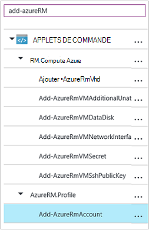
7.  Pointez sur **Obtenir exécuter en tant que connexion** jusqu'à ce qu’un cercle apparaît en bas de la forme. Cliquez sur le cercle et faites glisser la flèche **Ajouter AzureRmAccount**.  La flèche que vous venez de créer est un *lien*.  La procédure opérationnelle démarre avec **Obtenir exécuter en tant que connexion** et puis exécutez **Ajouter AzureRmAccount**.<br> 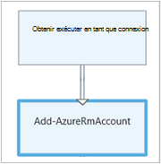
8.  Dans la zone de dessin, sélectionnez **Ajouter AzureRmAccount** et dans la Configuration volet type **Login to Azure** dans la zone de texte **d’étiquette** de contrôle.
9.  Cliquez sur **paramètres** et la Configuration des paramètres activité carte s’affiche. 
10.  **Ajouter AzureRmAccount** propose plusieurs jeux de paramètres, de sorte que nous avons besoin de sélectionner une avant que nous pouvons fournir les valeurs de paramètre.  Cliquez sur **Définir les paramètres** , puis sélectionnez le jeu de paramètres **ServicePrincipalCertificate** . 
11.  Après avoir sélectionné le paramètre défini, les paramètres sont affichés dans la carte de Configuration des paramètres d’activités.  Cliquez sur **APPLICATIONID**.<br> 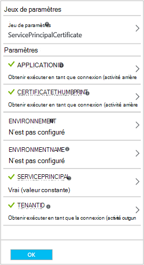
12.  Dans la carte de la valeur de paramètre, sélectionnez **activité sortie** pour la **source de données** et sélectionnez **Obtenir exécuter en tant que connexion** dans la liste, dans la zone de texte le **chemin du champ** type **ApplicationId**, puis cliquez sur **OK**.  Nous allons spécifiant le nom de la propriété pour le chemin d’accès du champ, car l’activité renvoie un objet avec plusieurs propriétés.
13.  Cliquez sur **CERTIFICATETHUMBPRINT**et dans la carte de la valeur de paramètre, sélectionnez **activité sortie** pour la **source de données**.  Sélectionnez **Obtenir exécuter en tant que connexion** dans la liste, dans la zone de texte le **chemin du champ** type **CertificateThumbprint**, puis sur **OK**. 
14.  Cliquez sur **SERVICEPRINCIPAL**et dans la carte de la valeur de paramètre, sélectionnez **ConstantValue** pour la **source de données**, cliquez sur l’option **True**, puis cliquez sur **OK**.
15.  Cliquez sur **TENANTID**, puis dans la carte de la valeur de paramètre, sélectionnez **activité sortie** pour la **source de données**.  Sélectionnez **Obtenir exécuter en tant que connexion** dans la liste, dans le type de zone de texte **chemin du champ** **TenantId**, puis sur **OK** à deux reprises.  
16.  Dans le contrôle de la bibliothèque, tapez **Set-AzureRmContext** dans la zone de recherche.
17.  Ajouter **Jeu AzureRmContext** à la zone de dessin.
18.  Dans la zone de dessin, sélectionnez **Définir AzureRmContext** et dans la Configuration du volet type **Id de l’abonnement spécifier** dans la zone de texte **d’étiquette** de contrôle.
19.  Cliquez sur **paramètres** et la Configuration des paramètres activité carte s’affiche. 
20. **Jeu-AzureRmContext** propose plusieurs jeux de paramètres, de sorte que nous avons besoin de sélectionner une avant que nous pouvons fournir les valeurs de paramètre.  Cliquez sur **Définir les paramètres** , puis sélectionnez le jeu de paramètres **SubscriptionId** .  
21.  Après avoir sélectionné le paramètre défini, les paramètres sont affichés dans la carte de Configuration des paramètres d’activités.  Cliquez sur **SubscriptionID**
22.  Dans la carte de la valeur de paramètre, sélectionnez **Variable actif** pour la **source de données** et sélectionnez **AzureSubscriptionId** dans la liste et cliquez deux fois sur **OK** .   
23.  Pointez sur **se connecter à Azure** jusqu'à ce qu’un cercle apparaît en bas de la forme. Cliquez sur le cercle et faites glisser la flèche pour **Spécifier des Id de l’abonnement**.


Votre runbook doit ressembler à ce stade comme suit : <br>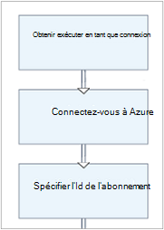

## <a name="step-7---add-activity-to-start-a-virtual-machine"></a>Étape 7 : ajouter une activité pour démarrer une machine virtuelle

Nous allons maintenant ajouter une activité **Début AzureRmVM** pour démarrer une machine virtuelle.  Vous pouvez choisir n’importe quelle machine virtuelle dans votre abonnement Azure, et pour le moment nous allons coder ce nom dans l’applet de commande.

1. Dans le contrôle de la bibliothèque, tapez **AzureRm de démarrage** dans la zone de recherche.
2. Ajouter **AzureRmVM de début** à la zone de dessin et puis cliquez sur et faites-le glisser en dessous de **l’Id de spécifier l’abonnement**.
3. Positionnez la souris sur **Id de l’abonnement spécifier** un cercle apparaît en bas de la forme.  Cliquez sur le cercle et faites glisser la flèche pour **Démarrer AzureRmVM**. 
4.  Sélectionnez **Démarrer AzureRmVM**.  Cliquez sur **paramètres** , puis **Paramètre défini** pour afficher les jeux de **Démarrer AzureRmVM**.  Sélectionnez le jeu de paramètres **ResourceGroupNameParameterSetName** . Remarquez que **ResourceGroupName** et le **nom** contient le point d’exclamation ensuite les.  Cela signifie qu’ils sont paramètres requis.  Notez également que les deux valeurs de chaîne ils doivent s’attendre.
5.  Sélectionnez le **nom**.  Sélectionnez **PowerShell expression** pour la **source de données** et tapez le nom de la machine virtuelle entourée de guillemets doubles que nous allons commencer par cette procédure opérationnelle.  Cliquez sur **OK**.<br>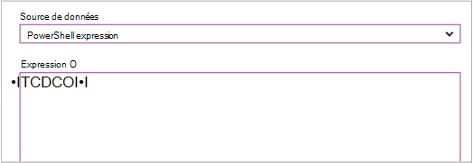
6.  Sélectionnez **ResourceGroupName**. Utiliser **PowerShell expression** pour la **source de données** et tapez le nom du groupe de ressources entouré de guillemets doubles.  Cliquez sur **OK**.<br> 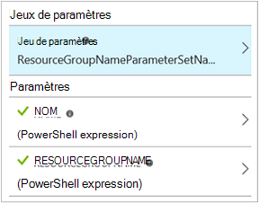
8.  Cliquez sur volet de Test afin que nous puissions tester la procédure opérationnelle.
9.  Cliquez sur **Démarrer** pour démarrer le test.  Une fois qu’elle est terminée, vérifiez que la machine virtuelle a été démarrée.

Votre runbook doit ressembler à ce stade comme suit : <br>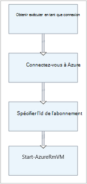

## <a name="step-8---add-additional-input-parameters-to-the-runbook"></a>Étape 8 : ajouter des paramètres d’entrée supplémentaires à la runbook

Notre runbook démarre actuellement la machine virtuelle dans le groupe de ressources que nous avons spécifiée dans l’applet de commande **Démarrer AzureRmVM** , mais notre runbook serait plus utile si nous avons spécifier à la fois quand la runbook est démarré.  Nous allons maintenant ajouter des paramètres d’entrée à la runbook pour fournir ces fonctionnalités.

1. Ouvrez l’éditeur graphique en cliquant sur **Modifier** dans le volet **MyFirstRunbook** .
2. Cliquez sur **entrée et sortie** , puis sur **Ajouter entrée** pour ouvrir le volet Paramètres d’entrée de procédure opérationnelle.<br> 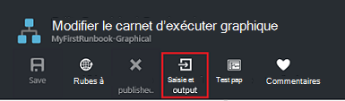
3. Spécifiez *VMName* pour le **nom**.  Conserver la *chaîne* pour le **Type**, mais modifier **obligatoire** sur *Oui*.  Cliquez sur **OK**.
4. Créer un deuxième paramètre d’entrée obligatoire appelé *ResourceGroupName* , puis sur **OK** pour fermer le volet **d’entrée et de sortie** .<br> 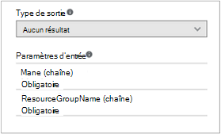
5. Sélectionnez l’activité **Démarrer AzureRmVM** , puis sur **paramètres**.
6. Modifier la **source de données** pour un **nom** à **l’entrée de procédure opérationnelle** , puis sélectionnez **VMName**.<br>
7. Modifier la **source de données** pour **ResourceGroupName** à **l’entrée de procédure opérationnelle** , puis sélectionnez **ResourceGroupName**.<br> 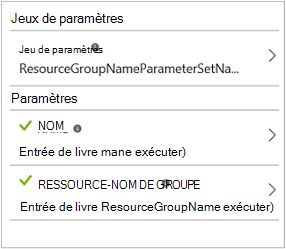
8. Enregistrez la procédure opérationnelle et ouvrir le volet de Test.  Notez que vous pouvez désormais fournir des valeurs pour les deux variables d’entrée qui seront utilisés dans le test.
9. Fermez le volet de Test.
10. Cliquez sur **Publier** pour publier la nouvelle version de la procédure opérationnelle.
11. Arrêter la machine virtuelle que vous avez commencé à l’étape précédente.
12. Cliquez sur **Démarrer** pour démarrer la procédure opérationnelle.  Tapez la **VMName** et **ResourceGroupName** pour la machine virtuelle que vous allez commencer.<br> 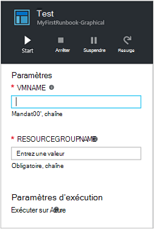
13. Une fois la runbook terminée, vérifiez que la machine virtuelle a été démarrée.

## <a name="step-9---create-a-conditional-link"></a>Étape 9 : créer un lien conditionnelle

Nous allons maintenant modifier le runbook afin qu’il tentera uniquement démarrer la machine virtuelle si elle n’est pas déjà commencé.  Pour cela, nous allons Ajout d’une applet de commande **Get-AzureRmVM** à runbook qui peuvent accéder à l’état de niveau instance de la machine virtuelle. Nous allons ensuite ajouter un module de code de flux de travail PowerShell appelé **Get Status** avec un extrait de code PowerShell pour déterminer si l’état de la machine virtuelle est en cours d’exécution ou arrêté.  Un lien à partir du module **Get Status** conditionnelle ne fonctionne que **Démarrer AzureRmVM** si l’état actuel en cours d’exécution est arrêté.  Pour finir, nous génère un message pour informer vous si la machine virtuelle a été démarrée ou sans utiliser l’applet de commande PowerShell écriture-sortie.

1. Ouvrez **MyFirstRunbook** dans l’éditeur de graphique.
2. Supprimer le lien entre les **Id de l’abonnement spécifier** et **Démarrer AzureRmVM** en cliquant dessus et en appuyant sur la touche *SUPPR* .
3. Dans le contrôle de la bibliothèque, tapez **Get-AzureRm** dans la zone de recherche.
4. Ajouter **Get-AzureRmVM** à la zone de dessin.
5. Sélectionnez **Get-AzureRmVM** puis **Paramètre défini** pour afficher les jeux de **Get-AzureRmVM**.  Sélectionnez le jeu de paramètres **GetVirtualMachineInResourceGroupNameParamSet** .  Remarquez que **ResourceGroupName** et le **nom** contient le point d’exclamation ensuite les.  Cela signifie qu’ils sont paramètres requis.  Notez également que les deux valeurs de chaîne ils doivent s’attendre.
6. Sous **source de données** de **nom**, sélectionnez **l’entrée de procédure opérationnelle** , puis sélectionnez **VMName**.  Cliquez sur **OK**.
7. Sous **source de données** pour **ResourceGroupName**, sélectionnez **l’entrée de procédure opérationnelle** , puis sélectionnez **ResourceGroupName**.  Cliquez sur **OK**.
8. Sous **source de données** d’un **état**, sélectionnez **une valeur constante** , puis cliquez sur **True**.  Cliquez sur **OK**.  
9. Créer un lien à partir de **l’Id de l’abonnement spécifier** à **Get-AzureRmVM**.
10. Dans le contrôle de la bibliothèque, développez **Runbook contrôle** et ajouter du **Code** à la zone de dessin.  
11. Créer un lien de **Get-AzureRmVM** au **Code**.  
12. Cliquez sur **le Code** et dans le volet de Configuration, modifiez étiquette pour **Obtenir l’état**.
13. Paramètre de **Code de** sélection et la carte de **l’Éditeur de Code** s’affiche.  
14. Dans l’éditeur de code, collez l’extrait de code suivant :

     ```
     $StatusesJson = $ActivityOutput['Get-AzureRmVM'].StatusesText 
     $Statuses = ConvertFrom-Json $StatusesJson 
     $StatusOut ="" 
     foreach ($Status in $Statuses){ 
     if($Status.Code -eq "Powerstate/running"){$StatusOut = "running"} 
     elseif ($Status.Code -eq "Powerstate/deallocated") {$StatusOut = "stopped"} 
     } 
     $StatusOut 
     ```

15. Créer un lien à partir **d’Obtenir l’état** à **Démarrer AzureRmVM**.<br> 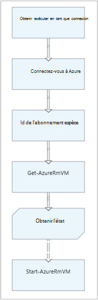  
16. Sélectionnez le lien et dans le volet de Configuration, modifiez la **condition appliquer** sur **Oui**.   Notez le lien se transforme en un trait en pointillés indiquant que l’activité cible uniquement sera exécutée si la condition correspond à vrai.  
17. Pour l' **expression de Condition**, tapez *$ActivityOutput [' obtenir Status'] - eq « Arrêt »*.  **Démarrage AzureRmVM** s’exécute désormais uniquement si la machine virtuelle est arrêtée.
18. Dans le contrôle de la bibliothèque, développez **applets de commande** , puis **Microsoft.PowerShell.Utility**.
19. Ajoutez deux fois **Écriture sortie** à la zone de dessin.<br> 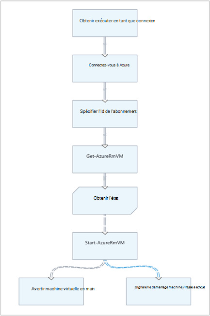
20. Sur le premier contrôle de **Sortie d’écriture** , cliquez sur **paramètres** et modifiez la valeur **d’étiquette** pour *Informer machine virtuelle démarre*.
21. Pour l' **objet d’entrée**, modifier la **source de données** pour **PowerShell expression** , entrez l’expression *« $VMName démarré avec succès. »*.
22. Dans le deuxième contrôle **Écriture sortie** , cliquez sur **paramètres** et changez la valeur **d’étiquette** avec *Avertir machine virtuelle Démarrer a échoué*
23. Pour l' **objet d’entrée**, modifier la **source de données** pour **PowerShell expression** , entrez l’expression *« $VMName ne peut pas démarrer. »*.
24. Créer un lien de **Démarrage AzureRmVM** pour **Signaler la mise en route de la machine virtuelle** et **Avertir machine virtuelle Démarrer a échoué**.
25. Sélectionnez le lien pour **Informer machine virtuelle démarre** et modifiez **Appliquer condition** **true**.
26. Pour l' **expression de Condition**, tapez *$ActivityOutput ['début-AzureRmVM']. IsSuccessStatusCode - eq $true*.  Ce contrôle écriture sortie s’exécute désormais uniquement si la machine virtuelle est démarrée.
27. Sélectionnez le lien pour **Informer machine virtuelle Démarrer a échoué** et modifiez **Appliquer condition** **true**.
28. Pour l' **expression de Condition**, tapez *$ActivityOutput ['début-AzureRmVM']. IsSuccessStatusCode - garanties $true*.  Ce contrôle écriture sortie s’exécute désormais uniquement si la machine virtuelle n’est pas démarrée avec succès.
29. Enregistrez la procédure opérationnelle et ouvrir le volet de Test.
30. Démarrez le runbook avec la machine virtuelle arrêtée et son nom doit commencer.

## <a name="next-steps"></a>Étapes suivantes

-   Pour plus d’informations sur la création de graphiques, voir [la création de graphique dans Azure Automation](automation-graphical-authoring-intro.md)
-   Pour commencer à utiliser les procédures opérationnelles PowerShell, voir [Mon premier runbook PowerShell](automation-first-runbook-textual-powershell.md)
-   Pour commencer à utiliser les procédures opérationnelles de flux de travail de PowerShell, voir [Mon premier runbook de flux de travail PowerShell](automation-first-runbook-textual.md)
