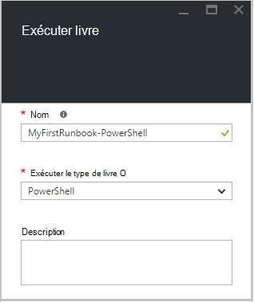
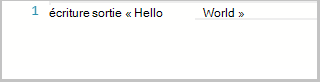
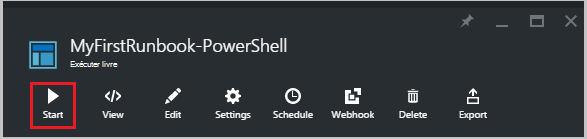
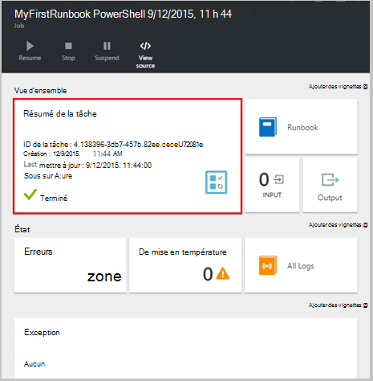
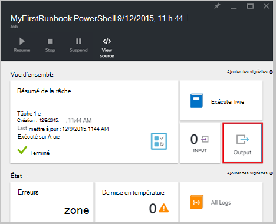
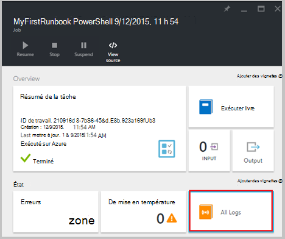
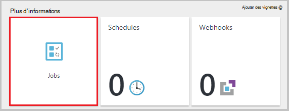
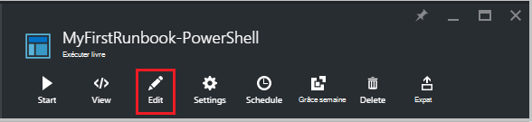
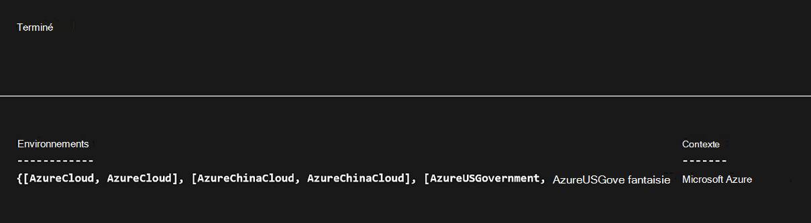
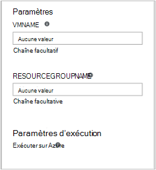

<properties
    pageTitle="Mon runbook PowerShell première dans Azure automatisation | Microsoft Azure"
    description="Didacticiel qui vous guide tout au long de la création, tests et la publication d’un simple runbook PowerShell."
    services="automation"
    documentationCenter=""
    authors="mgoedtel"
    manager="jwhit"
    editor=""
    keywords="powershell Azure, didacticiel de script powershell, automatisation powershell"/>
<tags
    ms.service="automation"
    ms.workload="tbd"
    ms.tgt_pltfrm="na"
    ms.devlang="na"
    ms.topic="get-started-article"
    ms.date="07/19/2016"
    ms.author="magoedte;sngun"/>

# <a name="my-first-powershell-runbook"></a>Mon premier runbook PowerShell

> [AZURE.SELECTOR] - [Graphique](automation-first-runbook-graphical.md) - [PowerShell](automation-first-runbook-textual-PowerShell.md) - [PowerShell le flux de travail](automation-first-runbook-textual.md)  

Ce didacticiel vous guide tout au long de la création d’une [procédure opérationnelle PowerShell](automation-runbook-types.md#powershell-runbooks) dans Azure Automation. Nous allons commencer par un simple runbook que nous allons tester et publier tandis que nous indiquent la marche à suivre l’état de la tâche runbook. Puis nous allons modifier le runbook pour gérer les ressources Azure, dans ce cas en commençant une machine virtuelle Azure. Nous allons puis renforcer le runbook en ajoutant des paramètres runbook.

## <a name="prerequisites"></a>Conditions préalables

Pour effectuer ce didacticiel, vous devez les éléments suivants.

-   Abonnement Azure. Si vous n’en avez pas encore, vous pouvez [activer vos avantages d’abonné MSDN](https://azure.microsoft.com/pricing/member-offers/msdn-benefits-details/) ou <a href="/pricing/free-account/" target="_blank"> [s’inscrire à un compte gratuit](https://azure.microsoft.com/free/).
-   [Compte d’automatisation](automation-security-overview.md) pour maintenir le runbook et authentifier aux ressources Azure.  Ce compte doit être autorisé à démarrer et arrêter la machine virtuelle.
-   Une machine virtuelle Azure. Nous arrêter et démarrer de cet ordinateur afin qu’il ne doit pas être production.

## <a name="step-1---create-new-runbook"></a>Étape 1 : créer de nouveaux runbook

Nous allons commencer par créer une procédure opérationnelle simple qui extrait le texte *Hello World*.

1.  Dans le portail Azure, ouvrez votre compte Automation.  
    La page de compte Automation vous donne un aperçu rapide des ressources dans ce compte. Vous devez déjà avoir certains actifs. La plupart de ces sont les modules sont automatiquement incluses dans un nouveau compte Automation. Vous devez également les biens d’informations d’identification mentionné dans les [conditions préalables](#prerequisites).
2.  Cliquez sur la vignette de **procédures opérationnelles** pour ouvrir la liste des procédures opérationnelles.  
      
3.  Créer un nouveau runbook en cliquant sur le bouton **Ajouter une procédure opérationnelle** , puis **créer un nouveau runbook**.
4.  Nommez le runbook la *MyFirstRunbook PowerShell*.
5.  Dans ce cas, nous allons créer une [procédure opérationnelle PowerShell](automation-runbook-types.md#powershell-runbooks) ainsi sélectionnez **Powershell** pour **Runbook type**.  
      
6.  Cliquez sur **créer** pour créer la procédure opérationnelle et ouvrez l’éditeur de texte.

## <a name="step-2---add-code-to-the-runbook"></a>Étape 2 : ajouter du code à la runbook

Vous pouvez soit code type directement dans la procédure opérationnelle, ou vous pouvez sélectionner des applets de commande, des procédures opérationnelles et des ressources à partir du contrôle de la bibliothèque et demandez-leur ajouté à la runbook avec tous les paramètres associés. Pour cette procédure, nous allons directement tapées dans la procédure opérationnelle.

1.  Notre runbook est vide, type *écriture sortie « Bonjour tout le monde ».*.  
      
2.  Enregistrer le runbook en cliquant sur **Enregistrer**.  
      

## <a name="step-3---test-the-runbook"></a>Étape 3 : tester le runbook

Avant de nous publier le runbook pour qu’il soit en production, nous voulons tester pour vous assurer qu’il fonctionne correctement. Lorsque vous testez une procédure opérationnelle, vous exécutez sa version **brouillon** et affichez sa sortie de façon interactive.

1.  Cliquez sur **volet de Test** pour ouvrir le volet de Test.  
      
2.  Cliquez sur **Démarrer** pour démarrer le test. Il s’agit de la seule option activée.
3.  Un [travail runbook](automation-runbook-execution.md) est créé et son état est affiché.  
    L’état du travail démarre comme *en file d’attente* indiquant qu’il est en attente d’un collaborateur runbook dans le cloud à venir disponibles. Elle passe alors au *départ* lorsqu’un collaborateur revendications la tâche, puis *en cours d’exécution* lorsque la runbook démarre réellement en cours d’exécution.  
4.  Lorsque le travail runbook est terminé, le résultat s’affiche. Dans notre exemple, nous devons voir *Hello World*  
      
5.  Fermez le volet de Test pour revenir à la zone de dessin.

## <a name="step-4---publish-and-start-the-runbook"></a>Étape 4 : publier et démarrer le runbook

La procédure opérationnelle créée est toujours en mode brouillon. Nous avons besoin de publier avant que nous puissions exécutez-le en production. Lorsque vous publiez une procédure opérationnelle, vous remplacez la version publiée existante avec la version brouillon. Dans notre exemple, nous n’avons une version publiée encore car nous avons créé simplement la procédure opérationnelle.

1.  Cliquez sur **Publier** pour publier le runbook, puis sur **Oui** lorsque vous y êtes invité.  
      
2.  Si vous faites défiler à gauche pour afficher la runbook dans le volet de **procédures opérationnelles** maintenant, il apparaît un **État de création** **publié**.
3.  Faites défiler vers la droite pour afficher le volet pour **MyFirstRunbook PowerShell**.  
    Les options dans la partie supérieure permet de commencer la procédure opérationnelle, afficher le runbook, planifiez quand il doit commencer à un moment donné à l’avenir, ou créer un [webhook](automation-webhooks.md) afin qu’il peut être démarré via un appel HTTP.
4.  Nous voulons simplement démarrer la runbook cliquez sur **Démarrer** , puis cliquez sur **Ok** lorsque la carte Runbook démarrer s’ouvre.  
      
5.  Un volet de travail est ouvert pour le travail runbook que nous venez de créer. Nous pouvons fermer ce volet, mais dans ce cas nous allons laissez-la ouverte afin que nous puissions regarder la progression du travail.
6.  L’état du travail est présentée dans un **Résumé de la tâche** et correspond aux statuts que nous avons vu quand nous testé la procédure opérationnelle.  
      
7.  Une fois que l’état runbook indique *terminé*, cliquez sur **sortie**. Pour ouvrir le volet de sortie, et nous pouvons voir notre *Bonjour*.  
    
8.  Fermez le volet de sortie.
9.  Cliquez sur **Tous les journaux** pour ouvrir le volet de flux de données pour le travail runbook. Nous devons uniquement voir *Hello World* dans le flux de sortie, mais cela peut afficher d’autres flux de données pour une tâche runbook tels que des commentaires et d’erreur si la runbook écrit leur.  
      
10. Fermez le volet de flux de données et le volet de travail pour retourner dans le volet MyFirstRunbook PowerShell.
11. Cliquez sur **tâches** pour ouvrir le volet de tâches pour cette procédure opérationnelle. Répertorie toutes les tâches créées par cette procédure opérationnelle. Nous devons voir uniquement une tâche figurant dans la mesure où nous exécuté uniquement la tâche une seule fois.  
      
12. Vous pouvez cliquer sur cette tâche pour ouvrir le volet de travail même que nous avons vu lorsque nous avons commencé la procédure opérationnelle. Cela vous permet de revenir en arrière dans le temps et afficher les détails de n’importe quelle tâche qui a été créée pour un runbook particulier.

## <a name="step-5---add-authentication-to-manage-azure-resources"></a>Étape 5 : ajouter une authentification pour gérer les ressources Azure

Nous avons testé et publié notre runbook, mais jusqu'à présent il ne fait rien utiles. Nous voulons gérer les ressources Azure. Il ne pourrez que faire si, à moins que nous avons il s’authentifier en utilisant les informations d’identification sont appelées dans les [conditions préalables](#prerequisites). Nous faire avec l’applet de commande **Add-AzureRmAccount** .

1.  Ouvrez l’éditeur de texte en cliquant sur **Modifier** dans le volet MyFirstRunbook PowerShell.  
      
2.  Nous n’avez plus besoin la ligne de **Sortie de l’écriture** , continuez et supprimez-le.
3.  Tapez ou copiez et collez le code suivant qui gérera l’authentification avec votre compte Automation exécuter en tant que :

    ```
     $Conn = Get-AutomationConnection -Name AzureRunAsConnection 
     Add-AzureRMAccount -ServicePrincipal -Tenant $Conn.TenantID `
     -ApplicationId $Conn.ApplicationID -CertificateThumbprint $Conn.CertificateThumbprint
    ``` 
<br>
4.  Cliquez sur **tester volet** afin que nous puissions tester la procédure opérationnelle.
5.  Cliquez sur **Démarrer** pour démarrer le test. Une fois qu’elle est terminée, vous devez recevoir ressemblant aux informations de base suivantes, l’affichage de votre compte. Cela permet de confirmer que les informations d’identification sont valide. <br> 

## <a name="step-6---add-code-to-start-a-virtual-machine"></a>Étape 6 : ajouter du code pour démarrer une machine virtuelle

Maintenant que notre runbook s’authentifie à notre abonnement Azure, nous pouvons gérer les ressources. Nous allons ajouter une commande pour démarrer une machine virtuelle. Vous pouvez choisir n’importe quelle machine virtuelle dans votre abonnement Azure, et pour le moment nous allons coder ce nom dans l’applet de commande.

1.  Après *Ajouter AzureRmAccount*, tapez *Démarrer AzureRmVM-nom 'VMName' - ResourceGroupName 'NameofResourceGroup'* fournissant le nom et le nom de groupe de ressources de la machine virtuelle pour démarrer.  
    
    ```
     $Conn = Get-AutomationConnection -Name AzureRunAsConnection 
     Add-AzureRMAccount -ServicePrincipal -Tenant $Conn.TenantID `
     -ApplicationID $Conn.ApplicationID -CertificateThumbprint $Conn.CertificateThumbprint 
     Start-AzureRmVM -Name 'VMName' -ResourceGroupName 'ResourceGroupName'
     ```
<br>
2.  Enregistrer le runbook, puis sur **tester volet** afin que nous puissions la tester.
3.  Cliquez sur **Démarrer** pour démarrer le test. Une fois qu’elle est terminée, vérifiez que la machine virtuelle a été démarrée.

## <a name="step-7---add-an-input-parameter-to-the-runbook"></a>Étape 7 : ajouter un paramètre d’entrée à la runbook

Notre runbook actuellement démarre l’ordinateur virtuel que nous codé en dur dans la procédure opérationnelle, mais il serait plus utile si nous pouvons spécifier la machine virtuelle au démarrage de la procédure opérationnelle. Nous allons maintenant ajouter des paramètres d’entrée à la runbook pour fournir ces fonctionnalités.

1.  Ajouter des paramètres pour *VMName* et *ResourceGroupName* à la runbook et utilisation de ces variables avec l’applet de commande **Démarrer AzureRmVM** comme dans l’exemple ci-dessous.  
    
    ```
    Param(
       [string]$VMName,
       [string]$ResourceGroupName
    )
     $Conn = Get-AutomationConnection -Name AzureRunAsConnection 
     Add-AzureRMAccount -ServicePrincipal -Tenant $Conn.TenantID `
     -ApplicationID $Conn.ApplicationID -CertificateThumbprint $Conn.CertificateThumbprint 
     Start-AzureRmVM -Name $VMName -ResourceGroupName $ResourceGroupName
     ```
<br> 
2.  Enregistrez la procédure opérationnelle et ouvrir le volet de Test. Notez que vous pouvez désormais fournir des valeurs pour les deux variables d’entrée qui seront utilisés dans le test.
3.  Fermez le volet de Test.
4.  Cliquez sur **Publier** pour publier la nouvelle version de la procédure opérationnelle.
5.  Arrêter la machine virtuelle que vous avez commencé à l’étape précédente.
6.  Cliquez sur **Démarrer** pour démarrer la procédure opérationnelle. Tapez la **VMName** et **ResourceGroupName** pour la machine virtuelle que vous allez commencer.  
      
7.  Une fois la runbook terminée, vérifiez que la machine virtuelle a été démarrée.

## <a name="differences-from-powershell-workflow"></a>Différences de flux de travail PowerShell

Procédures opérationnelles PowerShell ont le même cycle de vie, fonctionnalités et gestion des flux de travail PowerShell procédures opérationnelles, mais il existe certaines différences et les limitations :

1.  Procédures opérationnelles PowerShell exécuter rapidement par rapport aux procédures opérationnelles PowerShell le flux de travail qu’elle n’a pas étape de compilation.
2.  Procédures opérationnelles du flux de travail PowerShell prend en charge les points de contrôle, à l’aide des points de contrôle, procédures opérationnelles PowerShell le flux de travail peut reprendre à partir de n’importe quel point dans la procédure opérationnelle alors que les procédures opérationnelles PowerShell peut reprendre uniquement à partir du début.
3.  Procédures opérationnelles du flux de travail PowerShell prend en charge l’exécution de série et parallèle alors que les procédures opérationnelles PowerShell peuvent exécuter uniquement les commandes en série.
4.  Dans un flux de travail PowerShell runbook, une activité, une commande ou un bloc de script peut avoir son propre espace d’exploitation alors que dans une procédure opérationnelle PowerShell, tous les éléments dans un script s’exécute dans un espace d’exploitation unique. Il existe également quelques [différences syntaxiques](https://technet.microsoft.com/magazine/dn151046.aspx) entre un runbook PowerShell native et un flux de travail PowerShell runbook.

## <a name="next-steps"></a>Étapes suivantes

-   Pour commencer à utiliser les procédures opérationnelles graphiques, voir [Mon premier runbook de graphique](automation-first-runbook-graphical.md)
-   Pour commencer à utiliser les procédures opérationnelles de flux de travail de PowerShell, voir [Mon premier runbook de flux de travail PowerShell](automation-first-runbook-textual.md)
-   Pour en savoir plus sur les limitations, leurs avantages et runbook types, voir [types de runbook Automation Azure](automation-runbook-types.md)
-   Pour plus d’informations sur le script PowerShell prend en charge la fonctionnalité, voir [script PowerShell Native prend en charge dans Azure Automation](https://azure.microsoft.com/blog/announcing-powershell-script-support-azure-automation-2/)
