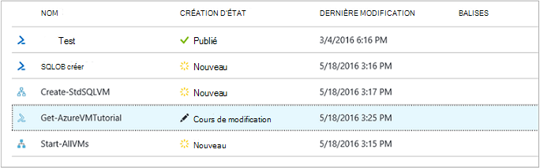

<properties 
    pageTitle="La création de graphiques dans Azure automatisation | Microsoft Azure"
    description="Création de graphiques vous permet de créer des procédures opérationnelles pour Azure Automation sans travailler avec du code. Cet article fournit une introduction à la création de graphiques et toutes les informations nécessaires pour commencer à créer un graphique runbook."
    services="automation"   
    documentationCenter=""
    authors="mgoedtel"
    manager="jwhit"
    editor="tysonn" />
<tags 
    ms.service="automation"
    ms.devlang="na"
    ms.topic="article"
    ms.tgt_pltfrm="na"
    ms.workload="infrastructure-services"
    ms.date="06/03/2016"
    ms.author="magoedte;bwren" />

# Création graphique dans Azure Automation

## Introduction

Création de graphique vous permet de créer des procédures opérationnelles pour Azure Automation sans la complexité du code Windows PowerShell ou de flux de travail PowerShell sous-jacent. Vous ajoutez des activités à la zone de dessin à partir d’une bibliothèque d’applets de commande et procédures opérationnelles, les relier et configurez pour former un flux de travail.  Si vous avez déjà travaillé avec System Center Orchestrator ou Service Automation SMA (Management), cela doit ressembler familière.   

Cet article fournit une introduction à la création de graphiques et les concepts que vous vous avez besoin pour créer un graphique runbook.

## Procédures opérationnelles graphique

Toutes les procédures opérationnelles dans Azure automatisation des flux de travail Windows PowerShell.  Graphique du flux de travail PowerShell et graphique procédures opérationnelles génèrent un code PowerShell qui est exécuté par les travailleurs automatisation, mais vous n’êtes pas en mesure d’afficher ou le modifier directement.  Une runbook graphique peut être converti en un flux de travail PowerShell graphique runbook et vice versa, mais elles ne peuvent pas être converties en une procédure opérationnelle textuelle. Un runbook textuel existant ne peut pas être importée dans l’éditeur de graphique.  

## Vue d’ensemble de l’éditeur de graphique

Vous pouvez ouvrir l’éditeur graphique dans le portail Azure en création ou modification d’un graphique runbook.

Les sections suivantes décrivent les contrôles dans l’éditeur de graphique.

### Zone de dessin
La zone de dessin est l’endroit où vous concevez votre runbook.  Vous pouvez ajouter des activités à partir des nœuds dans le contrôle de la bibliothèque à le runbook et associez-les à des liens pour définir la logique de la procédure opérationnelle.

Vous pouvez utiliser les contrôles en bas de la zone de dessin pour effectuer un zoom avant et arrière.

### Contrôle de la bibliothèque

Le contrôle de la bibliothèque est l’endroit où vous sélectionnez [activités](#activities) à ajouter à votre runbook.  Les ajouter à la zone où vous les connectez à d’autres activités.  Il comprend quatre sections décrites dans le tableau suivant.

| Section | Description |
|:---|:---|
| Applets de commande | Inclut toutes les applets de commande pouvant être utilisées dans votre runbook.  Applets de commande sont organisées par le module.  Tous les modules que vous avez installé dans votre compte d’automatisation seront disponibles.  |
| Procédures opérationnelles |  Inclut les procédures opérationnelles dans votre compte automation. Ces procédures opérationnelles peuvent être ajoutés à la zone de dessin à utiliser comme enfant procédures opérationnelles. Uniquement les procédures opérationnelles du même type core en tant que la runbook en cours de modification sont affichées ; pour graphique procédures opérationnelles uniquement basée sur PowerShell procédures opérationnelles sont indiqués, tandis que pour les procédures opérationnelles du flux de travail PowerShell graphique uniquement PowerShell du flux de travail basés sur des procédures opérationnelles sont affichés.
| Actifs | Inclut les [biens automation](http://msdn.microsoft.com/library/dn939988.aspx) dans votre compte automation pouvant être utilisées dans votre runbook.  Lorsque vous ajoutez un bien pour une procédure opérationnelle, il ajoute une activité de flux de travail qui obtient l’élément sélectionné.  Dans le cas d’éléments variables, vous pouvez sélectionner si vous souhaitez ajouter une activité pour obtenir la variable ou définir la variable.
| Contrôle Runbook | Inclut les activités de contrôle runbook pouvant être utilisées dans votre runbook en cours. Une *jonction* prend plusieurs entrées et attend jusqu'à ce que tout est terminé avant de poursuivre le flux de travail. Une activité *Code* s’exécute une ou plusieurs lignes de code PowerShell ou de flux de travail PowerShell selon le type de graphique runbook.  Vous pouvez utiliser cette activité code personnalisé ou pour une fonctionnalité qui est difficile à obtenir avec d’autres activités.|

### Contrôle de la configuration

Le contrôle de Configuration est l’endroit où vous fournissez des détails pour un objet sélectionné dans la zone de dessin. Les propriétés disponibles dans ce contrôle dépend du type d’objet sélectionné.  Lorsque vous sélectionnez une option dans le contrôle de Configuration, il s’ouvrira cartes supplémentaires afin de fournir des informations supplémentaires.

### Contrôle de test

Le contrôle de Test n’est pas affiché lors du premier démarrage de l’éditeur graphique. Il est ouvert quand vous de façon interactive [tester une runbook graphique](#graphical-runbook-procedures).  

## Procédures runbook graphique 

### Exportation et importation d’un graphique runbook

Vous ne pouvez exporter la version publiée d’un graphique runbook.  Si le runbook n’a pas encore été publiée, le bouton **Exporter publiés** est désactivé.  Lorsque vous cliquez sur le bouton **Exporter publié** , le runbook est téléchargée sur votre ordinateur local.  Le nom du fichier correspond au nom de la procédure opérationnelle avec une extension *graphrunbook* .

Vous pouvez importer un fichier de runbook graphique ou un graphique PowerShell Workflow en sélectionnant l’option **Importer** lors de l’ajout d’une procédure opérationnelle.   Lorsque vous sélectionnez le fichier à importer, vous pouvez conserver le même **nom** ou fournir une nouvelle visualisation.  Le champ Runbook Type affichera le type du runbook une fois qu’il évalue le fichier sélectionné et si vous essayez de sélectionner un autre type n’est pas correct, un message s’affichera noter il existe des conflits potentiels et lors de la conversion, vous pouvez rencontrer des erreurs de syntaxe.  

### Tester une runbook graphique

Vous pouvez tester la version brouillon d’un runbook dans le portail Azure pendant conserver la version publiée de du runbook inchangée, ou vous pouvez tester une nouvelle runbook avant qu’il a été publié. Cela vous permet de vérifier que le runbook fonctionne correctement avant de remplacer la version publiée. Lorsque vous testez une procédure opérationnelle, l’exécution de la procédure opérationnelle brouillon et les actions qu’il exécute sont terminées. Aucun historique de travail n’est créé, mais est affiché dans le volet de sortie de Test. 

Activer le contrôle de Test pour un runbook en ouvrant le runbook pour modifier, puis sur le bouton **volet de Test** .

Le contrôle de Test vous invite à entrer les paramètres d’entrée, et vous pouvez commencer la procédure opérationnelle en cliquant sur le bouton **Démarrer** .

### Publication d’un graphique runbook

Chaque runbook dans Azure Automation comporte un brouillon et une version publiée. Seule la version publiée n’est disponible pour être exécuté, et seule la version brouillon peut être modifiée. La version publiée n’est pas affectée par toute modification apportée à la version brouillon. Lorsque la version brouillon est prête à être disponibles, puis vous publiez qui remplace la version publiée avec la version brouillon.

Vous pouvez publier une runbook graphique en ouvrant le runbook pour modification et puis en cliquant sur le bouton **Publier** .

Lorsqu’un runbook n’a pas encore été publiée, elle a le statut de **Nouveau**.  Lors de sa publication, elle a le statut **publié**.  Si vous modifiez la runbook après qu’il a été publié, et les versions brouillon et Published sont différentes, la runbook a un statut de **modification**.

 

Vous avez également la possibilité pour revenir à la version publiée d’une procédure opérationnelle.  Cela lève absent (e) les modifications apportées depuis la runbook dernière publication et remplace la version brouillon de la runbook avec la version publiée.

## Activités

Les activités sont des blocs de construction d’une procédure opérationnelle.  Une activité peut être une applet de commande PowerShell, un runbook enfant ou une activité de flux de travail.  Vous ajoutez une activité à la runbook en avec le bouton droit en cliquant dessus dans le contrôle de la bibliothèque et en sélectionnant **Ajouter à la zone de dessin**.  Vous pouvez ensuite cliquer et faire glisser l’activité pour placer n’importe où dans la zone de dessin que vous souhaitez.  L’emplacement de la de l’activité dans la zone de dessin n’affecte pas le fonctionnement de la procédure opérationnelle d’aucune manière.  Vous pouvez disposition votre runbook alors que vous recherchez plus appropriée visualiser son fonctionnement. 

Sélectionnez l’activité dans la zone de dessin pour configurer les propriétés et les paramètres dans la carte de Configuration.  Vous pouvez modifier l' **étiquette** de l’activité par un nom descriptif pour vous.  L’applet de commande d’origine est toujours en cours d’exécution, que vous modifiez simplement son nom complet qui est utilisé dans l’éditeur de graphique.  L’étiquette doit être unique au sein de la procédure opérationnelle. 

### Jeux de paramètres

Un jeu de paramètres définit les paramètres obligatoires et facultatifs qui acceptent les valeurs pour une applet de commande particulière.  Toutes les applets de commande ont au moins un paramètre de définir et d’autres encore plusieurs.  Si une applet de commande compte plusieurs jeux de paramètres, vous devez sélectionner celui que vous utiliserez avant que vous pouvez configurer les paramètres.  Les paramètres que vous pouvez configurer varient selon le jeu de paramètres que vous choisissez.  Vous pouvez modifier le jeu de paramètres utilisé par une activité en sélectionnant le **Paramètre défini** un autre jeu.  Dans ce cas, toutes les valeurs de paramètre que vous avez configuré sont perdues.

Dans l’exemple suivant, l’applet de commande Get-AzureRmVM a trois jeux de paramètres.  Vous ne pouvez pas configurer les valeurs de paramètre jusqu'à ce que vous sélectionniez un des ensembles de paramètre.  Le jeu de paramètres ListVirtualMachineInResourceGroupParamSet est pour renvoyer tous les ordinateurs virtuels dans un groupe de ressources et comporte un seul paramètre facultatif.  Le GetVirtualMachineInResourceGroupParamSet est pour la spécification de la machine virtuelle que vous souhaitez revenir et contient deux obligatoires et un paramètre facultatif.

#### Valeurs de paramètre

Lorsque vous spécifiez une valeur pour un paramètre, vous sélectionnez une source de données pour déterminer la façon dont la valeur sera spécifiée.  Les sources de données qui sont disponibles pour un paramètre particulier varient selon les valeurs valides pour ce paramètre.  Par exemple, Null ne sera pas une option disponible pour un paramètre qui n’autorise pas les valeurs null.

| Source de données | Description |
|:---|:---|
|Valeur de la constante|Tapez une valeur pour le paramètre.  Cette fonction est uniquement disponible pour les types de données suivants : Int32, Int64, chaîne, booléen, date/heure, commutateur. |
|Sortie d’activité|Sortie d’une activité qui précède l’activité actuelle du flux de travail.  Toutes les activités valides apparaît.  Sélectionnez simplement l’activité sa sortie destiné à la valeur de paramètre.  Si l’activité renvoie un objet avec plusieurs propriétés, vous pouvez taper le nom de la propriété après avoir sélectionné l’activité.|
|Entrée de procédure opérationnelle |Sélectionnez un paramètre d’entrée de procédure opérationnelle comme entrées dans le paramètre de l’activité.|  
|La variable de biens|Sélectionnez une Variable Automation comme entrée.|  
|Informations d’identification biens|Sélectionnez les informations d’identification Automation comme entrée.|  
|Certificat actif|Sélectionnez un certificat Automation comme entrée.|  
|Connexion biens|Sélectionnez une connexion Automation comme entrée.| 
|PowerShell Expression|Spécifiez simple [PowerShell expression](#powershell-expressions).  L’expression sera évaluée avant l’activité et le résultat utilisé pour la valeur de paramètre.  Vous pouvez utiliser des variables pour faire référence à la sortie d’une activité ou d’un paramètre d’entrée de procédure opérationnelle.|
|N’est pas configuré|Efface toute valeur qui a été configuré précédemment.|

#### Paramètres supplémentaires facultatifs

Toutes les applets de commande aurez la possibilité de fournir des paramètres supplémentaires.  Il s’agit des paramètres communs PowerShell ou autres paramètres personnalisés.  Une zone de texte où vous pouvez fournir les paramètres à l’aide de PowerShell syntaxe s’affiche.  Par exemple, pour utiliser le paramètre courantes **commentaires** , spécifiez **«-commentaires : $True »**.

### Réessayez d’activité

**Comportement réessayer** permet à une activité de s’exécuter plusieurs fois jusqu'à ce qu’une condition est remplie, fonctionne comme une boucle.  Cette fonctionnalité permet d’activités qui doivent s’exécuter plusieurs fois, qui sont source d’erreurs et il est possible que vous avez besoin plusieurs essayer pour réussir ou tester les informations de sortie de l’activité de données valides.    

Lorsque vous activez réessayer d’une activité, vous pouvez définir un délai et une condition.  Le délai est le délai (exprimé en secondes ou en minutes) que le runbook va attendre avant d’exécuter à nouveau l’activité.  Si aucun retard n’est spécifié, l’activité s’exécutera à nouveau immédiatement après avoir terminé. 

La condition réessayer est une expression de PowerShell est évaluée après chaque exécution de l’activité.  Si l’expression est résolue en vrai, l’activité s’exécute à nouveau.  Si l’expression est résolue à False ; puis l’activité ne s’exécute pas à nouveau et la runbook déplace vers l’activité suivante. 

La condition réessayer permet d’une variable appelée $RetryData qui permet d’accéder aux informations sur les tentatives d’activité.  Cette variable possède les propriétés dans le tableau suivant.

| Propriété | Description |
|:--|:--|
| NumberOfAttempts | Nombre de fois que l’activité a été exécutée.              |
| Sortie           | Résultat de la dernière exécution de l’activité.                    |
| TotalDuration    | Minuté qui se sont écoulées depuis l’activité de démarrage de la première fois. |
| StartedAt        | Heure au format UTC que du premier lancement de l’activité.           |

Voici des exemples d’activité réessayer conditions.

    # Run the activity exactly 10 times.
    $RetryData.NumberOfAttempts -ge 10 

    # Run the activity repeatedly until it produces any output.
    $RetryData.Output.Count -ge 1 

    # Run the activity repeatedly until 2 minutes has elapsed. 
    $RetryData.TotalDuration.TotalMinutes -ge 2

Après avoir configuré une condition réessayer d’une activité, l’activité inclut deux aides visuelles pour vous rappeler.  Une est présentée dans l’activité et l’autre lorsque vous passez en revue la configuration de l’activité.

### Contrôle de Script de flux de travail

Un contrôle de Code est une activité spéciale qui accepte script PowerShell ou de flux de travail PowerShell selon le type de graphique runbook créé afin de fournir des fonctionnalités dans le cas contraire peut-être pas disponible.  Il ne peut pas accepter des paramètres, mais il peut utiliser des variables activité sortie et runbook paramètres d’entrée.  Toute sortie de l’activité est ajouté à la databus, à moins ne qu’aucune sortant lier dans ce cas, il est ajouté à la sortie de la procédure opérationnelle.

Par exemple le code suivant effectue des calculs de date à l’aide d’une variable d’entrée de procédure opérationnelle appelée $NumberOfDays.  Il envoie ensuite une heure date calculée sous forme de sortie devant être utilisé par les activités suivantes dans la procédure opérationnelle.

    $DateTimeNow = (Get-Date).ToUniversalTime()
    $DateTimeStart = ($DateTimeNow).AddDays(-$NumberOfDays)}
    $DateTimeStart

## Des liens et des flux de travail

Un **lien** dans un graphique runbook connecte deux activités.  Il est affiché dans la zone de dessin comme une flèche pointant vers l’activité source à l’activité de destination.  Les activités exécutent dans la direction de la flèche avec l’activité de destination en commençant une fois que l’activité source est terminée.  

### Créer un lien

Créer un lien entre les deux activités en sélectionnant l’activité source et en cliquant sur le cercle en bas de la forme.  Faites glisser la flèche vers l’activité de destination et la version finale.

Sélectionnez le lien pour configurer ses propriétés dans la carte de Configuration.  Cela inclut le type de lien qui est décrit dans le tableau suivant.

| Type de liaison | Description |
|:---|:---|
| Pipeline | L’activité de destination est exécutée une seule fois pour chaque objet de sortie à partir de l’activité de source.  L’activité de destination ne fonctionne pas si l’activité source se traduit par aucun résultat.  Résultat de l’activité source est disponible en tant qu’objet.  |
| Séquence | L’activité de destination s’exécute qu’une seule fois.  Il reçoit un tableau d’objets à partir de l’activité de source.  Résultat de l’activité source est disponible sous forme de tableau d’objets. |

### Activité de démarrage

Un graphique runbook commence par toutes les activités qui n’ont pas un lien entrant.  Il s’agit généralement qu’une seule activité qui serait agir en tant que l’activité de départ de la procédure opérationnelle.  Si plusieurs activités ne sont pas un lien entrant, le runbook démarre en exécutant les en parallèle.  Il sera puis suivez les liens pour exécuter d’autres activités que chacune est terminée.

### Conditions

Lorsque vous spécifiez une condition sur un lien, l’activité de destination est exécutée uniquement si la condition correspond à vrai.  Vous utiliserez généralement une variable $ActivityOutput dans une condition pour récupérer la sortie de l’activité de source.  

Pour un lien pipeline, vous spécifiez une condition pour un seul objet, et la condition est évaluée pour chaque sortie objet par l’activité source.  L’activité de destination est alors exécutée pour chaque objet qui répond à la condition.  Par exemple, avec une activité de source de Get-AzureRmVm, la syntaxe suivante peut être utilisée pour un lien conditionnelle pipeline de récupération machines virtuelles uniquement dans le groupe de ressources appelé *groupe 1*.  

    $ActivityOutput['Get Azure VMs'].Name -match "Group1"

Pour un lien de séquence, la condition est évaluée uniquement une fois dans la mesure où un seul tableau est renvoyé contenant tous les objets sortie à partir de l’activité de source.  Pour cette raison, un lien de séquence ne peuvent pas être utilisé pour le filtrage comme un lien pipeline mais déterminera simplement ou non l’activité suivante est exécutée. Prenons l’exemple l’ensemble des activités suivantes dans notre runbook machine virtuelle Démarrer.   
Il existe trois liens séquence différente que Vérifiez valeurs fournies aux deux paramètres d’entrée de procédure opérationnelle représentant le nom de la machine virtuelle et le nom de groupe de ressources afin de déterminer ce qui correspond à l’action appropriée à entreprendre - démarrer une machine virtuelle unique, démarrez tous les ordinateurs virtuels dans le groupe de ressources ou tous les ordinateurs virtuels dans un abonnement.  Pour la liaison de séquence entre se connecter à Azure et Get seule machine virtuelle, voici la logique de condition :

    <# 
    Both VMName and ResourceGroupName runbook input parameters have values 
    #>
    (
    (($VMName -ne $null) -and ($VMName.Length -gt 0))
    ) -and (
    (($ResourceGroupName -ne $null) -and ($ResourceGroupName.Length -gt 0))
    )

Lorsque vous utilisez un lien conditionnelle, les données disponibles à partir de l’activité source vers d’autres activités dans cette branche seront être filtrées par la condition.  Si une activité est la source à plusieurs liens, les données disponibles pour les activités dans chaque branche varient selon la condition dans le lien de connexion à cette branche.

Par exemple, toutes les machines virtuelles démarrage de l’activité **Début AzureRmVm** dans la runbook ci-dessous.  Il comporte deux liens conditionnelle.  Le premier lien conditionnelle utilise l’expression *$ActivityOutput ['début-AzureRmVM']. IsSuccessStatusCode - eq $true* pour filtrer si l’activité Début AzureRmVm a réussi.  La seconde utilise l’expression *$ActivityOutput ['début-AzureRmVM']. IsSuccessStatusCode - garanties $true* pour filtrer si l’activité Début AzureRmVm Échec du démarrage de la machine virtuelle.  

Toutes les activités qui suit le premier lien et utilise le résultat de l’activité de Get-AzureVM obtiendrez uniquement les ordinateurs virtuels qui ont été démarrées au moment où Get-AzureVM a été exécuté.  Toutes les activités qui suit le deuxième lien obtiendrez uniquement les ordinateurs virtuels qui ont été arrêtés au moment où Get-AzureVM a été exécuté.  Toutes les activités suivre le lien troisième peuvent accéder à toutes les machines virtuelles quelle que soit leur état en cours d’exécution.

### Ligne

Une jonction est une activité spéciale qui attend jusqu'à ce que toutes les branches entrants est terminé.  Cela vous permet d’exécuter plusieurs activités en parallèle et assurez-vous que tous les ont terminé avant de passer.

Alors qu’une jonction peut avoir un nombre illimité de liens entrants, pas plusieurs de ces liens peut être un pipeline.  Le nombre de liens entrants de séquence n’est pas limité.  Vous pourrez créer la jonction avec plusieurs liens pipeline entrants et enregistrer la procédure opérationnelle, mais elle échoue lorsqu’elle est exécutée.

L’exemple suivant fait partie d’un runbook qui démarre un ensemble de machines virtuelles lors du téléchargement simultanément correctifs pouvant être appliqués à ces ordinateurs.  Une jonction est utilisée pour garantir que les deux processus sont terminées avant la runbook continue.

### Cycles

Un cycle est quand un destination activité de liens vers son activité source ou vers une autre activité finalement des liens en retour à sa source.  Cycles ne sont actuellement pas autorisées lors de la création de graphiques.  Si votre runbook comporte un cycle, il sera enregistrée correctement mais recevront un message d’erreur lors de son exécution.

### Partage de données entre les activités

Toutes les données de sortie par une activité avec un lien sortant sont écrites dans *databus* pour la procédure opérationnelle.  Les activités dans la runbook peuvent utiliser des données sur la databus pour remplir les valeurs de paramètre ou inclure dans le code de script.  Une activité peut accéder à la sortie d’une activité précédente dans le flux de travail.     

Comment les données soient écrites pour la databus dépendant du type de liaison sur l’activité.  Pour un **pipeline**, les données sont affichée sous forme d’objets multiples.  Pour un lien de **séquence** , les données sont affichée sous forme de tableau.  S’il existe une seule valeur, elle sera sortie sous forme de tableau élément unique.

Vous pouvez accéder aux données la databus à l’aide d’une des deux méthodes.  Tout d’abord utilise une source de données de **Sortie de l’activité** pour remplir un paramètre d’une autre activité.  Si le résultat est un objet, vous pouvez spécifier une propriété unique.

Vous pouvez également récupérer la sortie d’une activité dans une source de données **PowerShell Expression** ou à partir d’une activité de **Script de flux de travail** à une variable ActivityOutput.  Si le résultat est un objet, vous pouvez spécifier une propriété unique.  Variables ActivityOutput utilisent la syntaxe suivante.

    $ActivityOutput['Activity Label']
    $ActivityOutput['Activity Label'].PropertyName 

### Points de contrôle

Vous pouvez définir des [points de contrôle](automation-powershell-workflow.md#checkpoints) dans un flux de travail PowerShell graphique runbook en sélectionnant *runbook de point de contrôle* sur toutes les activités.  Dans ce cas un point de contrôle à définir après l’exécution de l’activité.

Points de contrôle sont activées uniquement dans des flux de travail PowerShell graphique procédures opérationnelles, il n’est pas disponible dans les procédures opérationnelles graphique.  Si la procédure opérationnelle utilise des applets de commande Azure, vous devez suivre toutes les activités avec point de contrôle avec une AzureRMAccount ajouter au cas où le runbook est suspendue et redémarre à partir de ce point de contrôle sur un autre collaborateur. 

## Le couple aux ressources Azure

Procédures opérationnelles dans Azure Automation qui gèrent les ressources Azure nécessite l’authentification Azure.  La nouvelle fonctionnalité [Exécuter en tant que compte](automation-sec-configure-azure-runas-account.md) (également appelée un service principal) est la méthode par défaut pour accéder aux ressources Azure le Gestionnaire de ressources dans votre abonnement avec procédures opérationnelles Automation.  Vous pouvez ajouter cette fonctionnalité à un graphique runbook en ajoutant l’actif de connexion **AzureRunAsConnection** , qui utilise l’applet de commande PowerShell [Get-AutomationConnection](https://technet.microsoft.com/library/dn919922%28v=sc.16%29.aspx) et applet de commande [Add-AzureRmAccount](https://msdn.microsoft.com/library/mt619267.aspx) à la zone de dessin. Ceci est illustré dans l’exemple suivant.  
L’activité obtenir exécuter en tant que connexion (c'est-à-dire Get-AutomationConnection), est configuré avec une source de données de valeur de la constante nommée AzureRunAsConnection.  
L’activité suivante, ajouter-AzureRmAccount, ajoute authentifiés exécuter en tant que compte à utiliser dans la procédure opérationnelle. 
 
Pour les paramètres **APPLICATIONID** **CERTIFICATETHUMBPRINT**et **TENANTID** , vous devez spécifier le nom de la propriété pour le chemin d’accès du champ, car l’activité renvoie un objet avec plusieurs propriétés.  Dans le cas contraire lorsque vous exécutez la procédure opérationnelle, il échouera tentative d’authentification.  Voici ce que vous devez au minimum s’authentifier votre runbook avec le compte Exécuter en tant que.

Pour conserver la compatibilité descendante pour les abonnés qui ont créé un compte d’automatisation à l’aide d’un [compte Azure AD utilisateur](automation-sec-configure-aduser-account.md) pour gérer les ressources Azure Service Gestion automatisée ou Azure le Gestionnaire de ressources, la méthode s’authentifier est l’applet de commande Add-AzureAccount avec une [ressource d’informations d’identification](http://msdn.microsoft.com/library/dn940015.aspx) qui représente un utilisateur Active Directory ayant accès au compte Azure.

Vous pouvez ajouter cette fonctionnalité à un graphique runbook en ajoutant une ressource d’informations d’identification dans la zone de dessin suivi d’une activité ajouter AzureAccount.  AzureAccount ajouter utilise l’activité d’informations d’identification pour son entrée.  Ceci est illustré dans l’exemple suivant.

Vous devez authentifier au début de la procédure opérationnelle et après chaque point de contrôle.  Cela signifie l’ajout d’une activité addition ajouter AzureAccount après une activité de point de contrôle-flux de travail. Vous n’avez pas besoin d’une activité d’informations d’identification addition dans la mesure où vous pouvez utiliser le même 

## Runbook entrée et sortie

### Entrée de procédure opérationnelle

Un runbook peut-être nécessiter d’entrée d’un utilisateur quand elle commence la runbook via le portail Azure ou à partir d’un autre runbook si l’option actuelle est utilisée en tant qu’enfant.
Par exemple, si vous avez un runbook qui crée une machine virtuelle, vous devrez peut-être fournissent des informations telles que le nom de la machine virtuelle et d’autres propriétés de chaque fois que vous démarrez la procédure opérationnelle.  

Vous acceptez d’entrée pour un runbook en définissant une ou plusieurs paramètres d’entrée.  Vous indiquez les valeurs de ces paramètres chaque fois que le runbook est démarré.  Lorsque vous démarrez une procédure opérationnelle grâce au portail Azure, il vous invite à fournir des valeurs pour chacun des paramètres d’entrée du runbook.

Vous pouvez accéder à des paramètres d’entrée pour un runbook en cliquant sur le bouton **entrée et sortie** dans la barre d’outils runbook.  

 

Cette action ouvre le contrôle **d’entrée et sortie** dans laquelle vous pouvez modifier un paramètre d’entrée existant ou créez-en une en cliquant sur **Ajouter entrée**. 

Chaque paramètre d’entrée est défini par les propriétés dans le tableau suivant.

|Propriété|Description|
|:---|:---|
| Nom | Nom unique du paramètre.  Cela peut contenir uniquement des caractères alpha numériques et ne peut pas contenir d’espace. |
| Description | Une description facultative pour le paramètre d’entrée.  |
| Type | Type de données attendu pour la valeur de paramètre.  Le portail Azure constituent un contrôle approprié pour le type de données pour chaque paramètre lors de l’entrée. |
| Obligatoire | Indique si une valeur doit être fournie pour le paramètre.  La procédure opérationnelle ne peut pas être démarré si vous ne fournissez pas une valeur pour chaque paramètre obligatoire qui n’a pas une valeur par défaut définie. |
| Valeur par défaut | Spécifie quelle valeur est utilisé pour le paramètre si n’est fourni.  Cela peut être Null ou une valeur spécifique. |

### Sortie Runbook

Données créées par toutes les activités qui ne dispose pas d’un lien sortant sont ajoutées à la [sortie de la procédure opérationnelle](http://msdn.microsoft.com/library/azure/dn879148.aspx).  Le résultat est enregistré avec le travail runbook et n’est disponible pour un runbook parent lorsque la runbook est utilisée en tant qu’enfant.  

## Expressions PowerShell

Un des avantages de la création de graphiques vous fournit la possibilité de créer un runbook connaissant minimales PowerShell.  Pour l’instant, vous n’avez pas besoin de savoir peu de PowerShell bien que pour remplir certaines [valeurs de paramètre](#activities) et définir les [conditions de lien](#links-and-workflow).  Cette section fournit une brève introduction aux expressions PowerShell pour les utilisateurs qui peuvent ne pas être familiers de ce dernier.  Tous les détails de PowerShell sont disponibles à [l’écriture de scripts avec Windows PowerShell](http://technet.microsoft.com/library/bb978526.aspx). 

### Source de données PowerShell expression

Vous pouvez utiliser une expression PowerShell comme source de données pour remplir la valeur d’un [paramètre de l’activité](#activities) avec les résultats d’un code PowerShell.  Cela peut être une seule ligne de code qui effectue une fonction simple ou plusieurs lignes qui effectuent une logique complexe.  Aucune sortie à partir d’une commande qui n’est pas affectée à une variable est la valeur de paramètre. 

Par exemple, la commande suivante affiche la date du jour. 

    Get-Date

Les commandes suivantes créer une chaîne à partir de la date du jour et affectez-le à une variable.  Le contenu de la variable est ensuite envoyé à la sortie 

    $string = "The current date is " + (Get-Date)
    $string

Les commandes suivantes évaluer la date du jour et renvoient une chaîne indiquant si le jour actuel est un week-end ou jour de la semaine. 

    $date = Get-Date
    if (($date.DayOfWeek = "Saturday") -or ($date.DayOfWeek = "Sunday")) { "Weekend" }
    else { "Weekday" }
    
 
### Sortie d’activité

Pour utiliser la sortie d’une activité précédente dans le runbook, utilisez la variable $ActivityOutput avec la syntaxe suivante.

    $ActivityOutput['Activity Label'].PropertyName

Par exemple, vous devrez une activité avec une propriété qui requiert le nom d’un ordinateur virtuel dans ce cas, vous pouvez utiliser l’expression suivante.

    $ActivityOutput['Get-AzureVm'].Name

Si la propriété nécessitant la machine virtuelle objet au lieu de simplement une propriété, vous devrez retourner la totalité de l’objet à l’aide de la syntaxe suivante.

    $ActivityOutput['Get-AzureVm']

Vous pouvez également utiliser la sortie d’une activité dans une expression plus complexe tels que le suivant concatène le texte pour le nom de la machine virtuelle.

    "The computer name is " + $ActivityOutput['Get-AzureVm'].Name

### Conditions

Utilisez [les opérateurs de comparaison](https://technet.microsoft.com/library/hh847759.aspx) pour comparer les valeurs ou déterminer si une valeur correspond à un modèle spécifié.  Une comparaison renvoie une valeur de $true ou $false.

Par exemple, la condition suivante détermine si la machine virtuelle à partir d’une activité nommée *Get-AzureVM* est actuellement *arrêté*. 

    $ActivityOutput["Get-AzureVM"].PowerState –eq "Stopped"

La condition suivante vérifie si la même machine virtuelle est dans un état autre que *arrêté*.

    $ActivityOutput["Get-AzureVM"].PowerState –ne "Stopped"

Vous pouvez participer à une ou plusieurs conditions en utilisant un [opérateur logique](https://technet.microsoft.com/library/hh847789.aspx) tel que **- et** ou **- ou**.  Par exemple, la condition suivante vérifie si la même machine virtuelle dans l’exemple précédent est dans un état *d’arrêt* ou *d’Arrêter*.

    ($ActivityOutput["Get-AzureVM"].PowerState –eq "Stopped") -or ($ActivityOutput["Get-AzureVM"].PowerState –eq "Stopping") 

### Tables de hachage

[Tables de hachage](http://technet.microsoft.com/library/hh847780.aspx) sont des paires nom/valeur qui sont utiles pour renvoyer une série de valeurs.  Propriétés de certaines activités peuvent vous attendez une table de hachage au lieu d’une valeur simple.  Vous pouvez également voir comme table hachage appelée un dictionnaire. 

Vous créez une table de hachage avec la syntaxe suivante.  Une table de hachage peut contenir tout nombre d’entrées mais chacune est définie par un nom et une valeur.

    @{ <name> = <value>; [<name> = <value> ] ...}

Par exemple, l’expression suivante crée une table de hachage pour être utilisée dans la source de données pour un paramètre de l’activité que prévu une table de hachage avec des valeurs pour une recherche sur internet.

    $query = "Azure Automation"
    $count = 10
    $h = @{'q'=$query; 'lr'='lang_ja';  'count'=$Count}
    $h

L’exemple suivant utilise la sortie d’une activité appelée *Obtenir la connexion Twitter* pour remplir une table de hachage.

    @{'ApiKey'=$ActivityOutput['Get Twitter Connection'].ConsumerAPIKey;
      'ApiSecret'=$ActivityOutput['Get Twitter Connection'].ConsumerAPISecret;
      'AccessToken'=$ActivityOutput['Get Twitter Connection'].AccessToken;
      'AccessTokenSecret'=$ActivityOutput['Get Twitter Connection'].AccessTokenSecret}

## Étapes suivantes

- Pour commencer à utiliser les procédures opérationnelles de flux de travail de PowerShell, voir [Mon premier runbook de flux de travail PowerShell](automation-first-runbook-textual.md) 
- Pour commencer à utiliser les procédures opérationnelles graphiques, voir [Mon premier runbook de graphique](automation-first-runbook-graphical.md)
- Pour en savoir plus sur les limitations, leurs avantages et runbook types, voir [types de runbook Automation Azure](automation-runbook-types.md)
- Pour mieux comprendre comment s’authentifier à l’aide de l’Automation exécuter en tant que compte, voir [Configurer l’exécuter en tant que compte Azure](automation-sec-configure-azure-runas-account.md)
 
