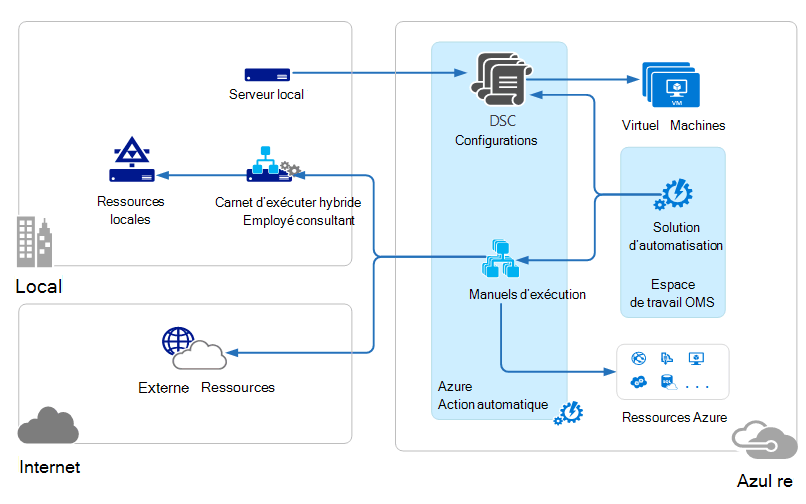
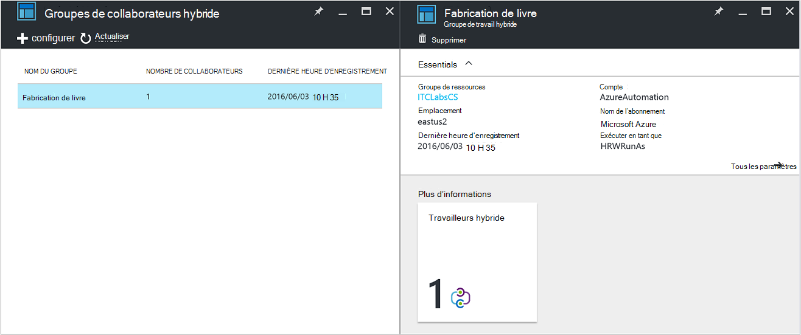
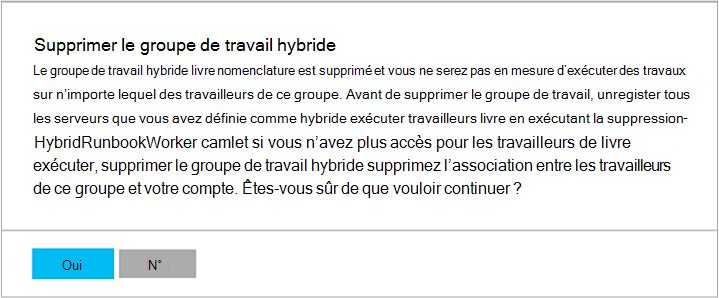

<properties
   pageTitle="Automatisation Azure hybride Runbook travailleurs | Microsoft Azure"
   description="Cet article fournit des informations sur l’installation et l’utilisation hybride Runbook concerné qui est une fonctionnalité d’automatisation Azure qui vous permet d’exécuter des procédures opérationnelles sur les ordinateurs dans votre centre de données locales."
   services="automation"
   documentationCenter=""
   authors="mgoedtel"
   manager="jwhit"
   editor="tysonn" />
<tags
   ms.service="automation"
   ms.devlang="na"
   ms.topic="article"
   ms.tgt_pltfrm="na"
   ms.workload="infrastructure-services"
   ms.date="10/14/2016"
   ms.author="bwren" />

# Automatisation Azure hybride Runbook travailleurs

Procédures opérationnelles dans Azure Automation ne peut pas accéder aux ressources dans votre centre de données locales dans la mesure où ils s’exécutent dans le cloud Azure.  La fonctionnalité hybride Runbook collaborateur d’automatisation Azure vous autorise à exécuter procédures opérationnelles sur des machines situées dans votre centre de données afin de gérer les ressources locales. Les procédures opérationnelles sont stockés et gérés dans Azure Automation et puis remis à un ou plusieurs ordinateurs locaux.  

Cette fonctionnalité est illustrée dans l’image suivante.   

Vous pouvez désigner un ou plusieurs ordinateurs dans votre centre de données ou la définir comme un collaborateur Runbook hybride et exécuter des procédures opérationnelles à partir d’Azure Automation.  Chaque collaborateur nécessite l’Agent de gestion de Microsoft avec une connexion à Microsoft Operations Management Suite et l’environnement runbook Automation Azure.  Opérations Management Suite sert uniquement à l’installation et la maintenance de l’agent de gestion et de surveiller les fonctionnalités du collaborateur.  La remise de procédures opérationnelles et les instructions pour exécuter les sont effectuées par Automation Azure.

Il n’existe aucune exigence pare-feu entrant pour prendre en charge les travailleurs Runbook hybride. L’agent sur l’ordinateur local lance toutes les communications avec Automation Azure dans le cloud. Quand un runbook est démarré, Azure Automation crée une instruction récupérée par agent. L’agent extrait puis vers le bas de la runbook et tous les paramètres avant de l’exécuter.  Il récupère également les [biens](http://msdn.microsoft.com/library/dn939988.aspx) qui sont utilisées par le runbook à partir d’Azure Automation.

>[AZURE.NOTE] Hybride Runbook travailleurs ne prennent pas en charge [Les Configurations DSC](automation-dsc-overview.md).

## Groupes de collaborateurs Runbook de hybride

Chaque collaborateur Runbook hybride fait partie d’un groupe de travail de Runbook hybride que vous spécifiez lorsque vous installez l’agent.  Un groupe peut inclure un agent unique, mais vous pouvez installer plusieurs agents dans un groupe de disponibilité.

Lorsque vous démarrez une procédure opérationnelle sur un collaborateur Runbook hybride, vous spécifiez le groupe qu’elle sera exécutée sur.  Les membres du groupe déterminera quel collaborateur traitera la demande.  Vous ne pouvez pas spécifier un travail donné.

## Configuration requise de travail Runbook hybride

Vous devez désigner au moins un ordinateur local pour exécuter des travaux de runbook hybride.  Cet ordinateur doit disposer des éléments suivants :

- Windows Server 2012 ou version ultérieure
- Windows PowerShell 4.0 ou version ultérieure
- Au moins deux cœurs et 4 Go de RAM

Prenez en compte les recommandations suivantes pour les travailleurs hybride : 

- Désigner plusieurs travailleurs hybride dans chaque groupe de disponibilité.  
- Travailleurs hybride peuvent coexister avec les serveurs runbook Service gestion Automation ou System Center Orchestrator.
- Envisagez d’utiliser un ordinateur physiquement situé à côté de la zone de votre compte Automation ou dans la mesure où les données de projet sont renvoyées à Azure Automation en fin de travail.

>[AZURE.NOTE] Hybride Runbook collaborateur version 7.2.11136.0 prend actuellement en charge la communication via un serveur proxy qu’avec des scripts PowerShell.  Prise en charge des scripts PowerShell le flux de travail seront disponible dans une version ultérieure.  

### Configurer les paramètres de proxy et de pare-feu

Pour le travail sur site hybride Runbook se connecter à et inscrire auprès du service Microsoft Operations Management Suite (OMS), il doit avoir accès au numéro de port et l’URL décrites ci-dessous.  Il s’agit outre les [ports et les URL requises pour l’Agent de surveillance Microsoft](../log-analytics/log-analytics-proxy-firewall.md#configure-proxy-and-firewall-settings-with-the-microsoft-monitoring-agent) pour vous connecter à OMS. Si vous utilisez un serveur proxy pour la communication entre l’agent et le service OMS, vous devez vous assurer que les ressources appropriées sont accessibles. Si vous utilisez un pare-feu pour limiter l’accès à Internet, vous devez configurer votre pare-feu pour autoriser l’accès. 

Les informations suivantes répertorient les ports et les URL requis pour le travail Runbook hybride communiquer avec l’Automation.

- Port : Seul TCP 443 est nécessaire pour accéder à Internet
- URL globales : *.azure-automation.net

Si vous avez un compte d’automatisation défini pour une région spécifique et que vous voulez limiter la communication avec ce centre de données régionaux, le tableau suivant fournit l’enregistrement DNS pour chaque région.

|**Région**|**Enregistrement DNS**|
|--------------|--------------|
|États-Unis centre sud|scus-jobruntimedata-nomenclature-su1.azure-automation.net|
|États-Unis Extrême-Orient 2|automation.net du su1.azure produit eus2 jobruntimedata|
|Europe ouest|Nous-jobruntimedata-produit-su1.azure-automation.net|
|Europe du Nord|garanties-jobruntimedata-produit-su1.azure-automation.net|
|Canada Central|CC-jobruntimedata-produit-su1.azure-automation.net|
|Asie du Sud-est|automation.net du su1.azure produit mer jobruntimedata|
|Inde central|automation.net du su1.azure produit cid jobruntimedata|
|Orient Japon|automation.net du su1.azure produit jpe jobruntimedata|
|Australie sud-est|automation.net du su1.azure nomenclature ASE jobruntimedata|

## L’installation hybride Runbook collaborateur

La procédure suivante décrit comment installer et configurer hybride Runbook concerné.  Effectuer les deux premières étapes pour votre environnement d’automatisation, puis répétez les étapes restantes pour chaque ordinateur concerné.

### 1. créer l’espace de travail opérations Management Suite

Si vous n’avez pas déjà un espace de travail opérations Management Suite, puis créer un à l’aide d’instructions à [configurer votre espace de travail](https://technet.microsoft.com/library/mt484119.aspx). Vous pouvez utiliser un espace de travail existant si vous disposez déjà d’une.

### 2. ajouter une solution automatisation à l’espace de travail opérations Management Suite

Solutions ajoutent des fonctionnalités dans la Suite de gestion des opérations.  La solution automatisation ajoute des fonctionnalités d’automatisation Azure prise en charge de travail du Runbook hybride.  Lorsque vous ajoutez la solution à votre espace de travail, il sera diffuser automatiquement les éléments de travail à l’ordinateur agent que vous installerez à l’étape suivante.

Suivez les instructions sur [pour ajouter une solution à l’aide de la galerie de Solutions](../log-analytics/log-analytics-add-solutions.md) pour ajouter la solution **automatisation** à votre espace de travail opérations Management Suite.

### 3. installation de Microsoft l’Agent de surveillance

L’Agent de surveillance Microsoft se connecte à des ordinateurs dans la Suite de gestion des opérations.  Lorsque vous installez l’agent sur votre ordinateur local et vous connecter à votre espace de travail, il télécharge automatiquement les composants requis pour hybride Runbook concerné.

Suivez les instructions sur les [ordinateurs Windows de se connecter à Analytique journal](../log-analytics/log-analytics-windows-agents.md) pour installer l’agent sur l’ordinateur local.  Vous pouvez répéter ce processus pour plusieurs ordinateurs ajouter plusieurs travailleurs à votre environnement.

Lorsque l’agent a réussi à connecter dans la Suite de gestion des opérations, il doit être répertorié sous l’onglet **Sources connectées** du volet **paramètres** de la Suite de gestion des opérations.  Vous pouvez vérifier que l’agent a téléchargé correctement la solution automatisation lorsqu’il a un dossier nommé **AzureAutomationFiles** dans C:\Program Files\Microsoft surveillance Agent\Agent.  Pour confirmer la version du collaborateur Runbook hybride, vous pouvez accéder à C:\Program Files\Microsoft surveillance Agent\Agent\AzureAutomation\ et notez le \\ *version* sous-dossier.   

### 4. Installez l’environnement runbook et connectez-vous à Azure Automation

Lorsque vous ajoutez un agent dans la Suite de gestion des opérations, la solution automatisation pousse vers le bas du module de PowerShell **HybridRegistration** qui contient l’applet de commande **Add-HybridRunbookWorker** .  Cette applet de commande vous permet d’installer l’environnement runbook sur l’ordinateur et l’enregistrer avec Azure Automation.

Ouvrez une session PowerShell en mode administrateur et exécutez les commandes suivantes pour importer le module.

    cd "C:\Program Files\Microsoft Monitoring Agent\Agent\AzureAutomation\<version>\HybridRegistration"
    Import-Module HybridRegistration.psd1

Ensuite, exécutez l’applet de commande **Add-HybridRunbookWorker** à l’aide de la syntaxe suivante :

    Add-HybridRunbookWorker –Name <String> -EndPoint <Url> -Token <String>

Vous pouvez obtenir les informations requises pour cette applet de commande à partir de la carte de **Gestion des clés** dans le portail Azure.  Ouvrez cette carte en cliquant sur l’icône de clé dans le panneau d’éléments pour le compte d’automatisation.

- **Nom** est le nom du groupe de travail Runbook hybride. Si ce groupe existe déjà dans le compte d’automatisation, puis l’ordinateur actuel est ajouté à celle-ci.  Si elle n’existe pas déjà, il est ajouté.
- **Point de terminaison** est le champ **URL** dans la carte de **Gestion des clés** .
- **Jetons** est la **Principale touche d’accès rapide** dans la carte de **Gestion des clés** .  

Utiliser le **-détaillée** commutateur à **Ajouter HybridRunbookWorker** pour recevoir des informations détaillées sur l’installation.

### 5. préinstaller modules PowerShell

Procédures opérationnelles peut utiliser toutes les activités et les applets de commande définies dans les modules installés dans votre environnement Automation Azure.  Cependant, ces modules ne sont pas déployés automatiquement sur les ordinateurs locaux afin que vous devez les installer manuellement.  L’exception est le module Azure qui est installé par défaut prévoyant accès aux applets de commande pour toutes les activités et les services Azure Azure Automation.

Dans la mesure où l’objectif principal de la fonctionnalité hybride Runbook travail consiste à gérer les ressources locales, vous aurez probablement besoin installer les modules qui prennent en charge ces ressources.  Vous pouvez faire référence à [L’installation des Modules](http://msdn.microsoft.com/library/dd878350.aspx) pour plus d’informations sur l’installation de Windows PowerShell modules.

## Suppression hybride Runbook collaborateur

Vous pouvez supprimer un ou plusieurs travailleurs Runbook hybride d’un groupe ou vous pouvez supprimer le groupe, selon vos besoins.  Pour supprimer un collaborateur Runbook hybride à partir d’un ordinateur local, ouvrez une session PowerShell en mode administrateur et exécutez la commande suivante - applet de commande **Supprimer HybridRunbookWorker** .  Utiliser le **-détaillée** remplacez un journal détaillé du processus de suppression. 

Cela ne supprime pas l’Agent de surveillance Microsoft à partir de l’ordinateur, uniquement les fonctionnalités et la configuration du rôle de collaborateur du Runbook hybride.  

Pour supprimer un groupe, vous devez tout d’abord supprimer le travail Runbook hybride de chaque ordinateur sur lequel est membre du groupe à l’aide de la commande indiquée précédemment, puis puis vous procédez comme suit pour supprimer le groupe.  

1. Ouvrez le compte Automation dans le portail Azure.
2. Sélectionnez la vignette de **Groupes de collaborateurs hybride** et dans la carte de **Groupes de collaborateurs hybride** , sélectionnez le groupe que vous voulez supprimer.  Après avoir sélectionné le groupe spécifique, la carte de propriétés du **groupe de travail hybride** s’affiche.     
3. Dans la carte de propriétés pour le groupe sélectionné, cliquez sur **Supprimer**.  Un message apparaît vous invitant à confirmer cette action et sélectionnez **Oui** si vous êtes sûr de vouloir continuer.    Ce processus peut prendre quelques secondes pour terminer et vous pouvez suivre la progression sous **Notifications** à partir du menu.  

## Procédures opérationnelles départ sur hybride Runbook collaborateur

[Démarrage d’une procédure opérationnelle dans Azure Automation](automation-starting-a-runbook.md) décrit les différentes méthodes pour démarrer une procédure opérationnelle.  Employé consultant hybride Runbook ajoute une option **RunOn** dans laquelle vous pouvez spécifier le nom d’un groupe de travail Runbook hybride.  Si un groupe n’est spécifié, le runbook est récupérée et exécuter par des travailleurs de ce groupe.  Si cette option n’est pas spécifiée, il est exécuté dans Azure Automation comme d’habitude.

Lorsque vous démarrez une procédure opérationnelle dans le portail Azure, s’affiche avec une option de **s’exécuter sur** l’endroit où vous pouvez sélectionner **Azure** ou **Collaborateur hybride**.  Si vous sélectionnez **Hybride concerné**, vous pouvez sélectionner le groupe dans une liste déroulante.

Utilisez le paramètre **RunOn** vous pouvez utiliser la commande suivante pour démarrer une runbook nommé Test-Runbook sur un groupe de travail Runbook hybride nommé MyHybridGroup à l’aide de Windows PowerShell.

    Start-AzureRmAutomationRunbook –AutomationAccountName "MyAutomationAccount" –Name "Test-Runbook" -RunOn "MyHybridGroup"

>[AZURE.NOTE] Le paramètre **RunOn** a été ajouté à l’applet de commande **Démarrer AzureAutomationRunbook** dans la version 0.9.1 de Microsoft Azure PowerShell.  Vous devez [Télécharger la version la plus récente](https://azure.microsoft.com/downloads/) si vous disposez d’une version antérieure une installée.  Vous devez uniquement installer cette version sur un poste de travail où vous commencez le runbook à partir de Windows PowerShell.  Vous n’avez pas besoin pour l’installer sur l’ordinateur concerné, sauf si vous souhaitez démarrer procédures opérationnelles à partir de cet ordinateur.  Vous ne peut pas actuellement démarrer un runbook sur un collaborateur Runbook hybride à partir d’un autre runbook comme cela nécessite la dernière version d’Azure Powershell pour être installée sur votre compte Automation.  La version la plus récente est automatiquement mises à jour dans Azure Automation et automatiquement poussée vers le bas pour les travailleurs plus rapidement.

## Autorisations Runbook

Procédures opérationnelles en cours d’exécution sur un collaborateur Runbook hybride ne peut pas utiliser la même [méthode qui est généralement utilisée pour les procédures opérationnelles couple aux ressources Azure](automation-configuring.md#configuring-authentication-to-azure-resources) dans la mesure où ils ont accès ressources en dehors d’Azure.  La procédure opérationnelle peut fournir sa propre authentification aux ressources locales, ou vous pouvez spécifier un compte RunAs pour offrir un contexte utilisateur pour toutes les procédures opérationnelles.

### Authentification Runbook

Par défaut, les procédures opérationnelles s’exécutera dans le contexte du compte système local sur l’ordinateur local, afin qu’ils doivent fournir leur propre authentification aux ressources d’accès.  

Vous pouvez utiliser [les informations d’identification](http://msdn.microsoft.com/library/dn940015.aspx) et [certificat](http://msdn.microsoft.com/library/dn940013.aspx) immobilisations dans votre runbook avec les applets de commande qui vous permettent de spécifier des informations d’identification afin que vous pouvez authentifier à différentes ressources.  L’exemple suivant montre une partie d’un runbook redémarrage d’un ordinateur.  Il extrait les informations d’identification d’une ressource d’informations d’identification et le nom de l’ordinateur à partir d’un variable actif, puis utilise ces valeurs avec l’applet de commande redémarrer l’ordinateur.

    $Cred = Get-AzureRmAutomationCredential -ResourceGroupName "ResourceGroup01" -Name "MyCredential"
    $Computer = Get-AzureRmAutomationVariable -ResourceGroupName "ResourceGroup01" -Name  "ComputerName"

    Restart-Computer -ComputerName $Computer -Credential $Cred

Vous pouvez également tirer parti [InlineScript](automation-powershell-workflow.md#inline-script) qui vous permet d’exécuter des blocs de code sur un autre ordinateur avec les informations d’identification spécifiées par le [paramètre commun PSCredential](http://technet.microsoft.com/library/jj129719.aspx).

### Compte RunAs

Plutôt que de laisser procédures opérationnelles fournir leur propre authentification aux ressources locales, vous pouvez spécifier un compte **RunAs** pour un groupe de travail hybride.  Vous spécifiez une [ressource d’informations d’identification](automation-credentials.md) qui a accès aux ressources locales, et toutes les procédures opérationnelles seront exécutera sous ces informations d’identification lors de l’exécution sur un collaborateur Runbook hybride dans le groupe.  

Le nom d’utilisateur pour les informations d’identification doit être l’un des formats suivants :

- domaine\nom d’utilisateur 
- username@domain
- nom d’utilisateur (pour les comptes locaux sur l’ordinateur local)

La procédure suivante permet de spécifier un compte RunAs pour un groupe de travail hybride :

1. Créer une [ressource d’informations d’identification](automation-credentials.md) avec l’accès aux ressources locales.
2. Ouvrez le compte Automation dans le portail Azure.
2. Sélectionnez la vignette de **Groupes de collaborateurs hybride** et sélectionnez le groupe.
3. Sélectionnez **tous les paramètres** , puis sur **paramètres du groupe Collaborateur hybride**.
4. Remplacez **Exécuter en tant que** **par défaut** sur **personnalisé**.
5. Sélectionnez les informations d’identification, puis cliquez sur **Enregistrer**.

## Création de procédures opérationnelles pour hybride Runbook collaborateur

Il n’existe aucune différence dans la structure des procédures opérationnelles qui s’exécutent dans Azure Automation et celles qui s’exécutent sur un collaborateur Runbook hybride. Procédures opérationnelles que vous utilisez avec chaque probablement diffèrent considérablement cependant dans la mesure où les procédures opérationnelles pour hybride Runbook collaborateur généralement gère les ressources locales dans votre centre de données pendant que les procédures opérationnelles dans Azure Automation généralement gérer les ressources dans le cloud Azure. 

Vous pouvez modifier une procédure opérationnelle pour hybride Runbook collaborateur dans Azure automatisation, mais vous pouvez rencontrer des difficultés si vous essayez de tester le runbook dans l’éditeur.  Les modules PowerShell qui accèdent aux ressources locales ne soient pas installés dans votre environnement d’Azure automatisation dans ce cas, le test échoue.  Si vous installez les modules requis, exécutez ensuite la procédure opérationnelle, mais elle ne sera pas en mesure d’accéder aux ressources locales pour un test complet.

## Résolution des problèmes de procédures opérationnelles sur hybride Runbook collaborateur

[Messages et sortie Runbook](automation-runbook-output-and-messages.md) sont envoyés à Azure Automation à partir de hybride travailleurs comme runbook travaux s’exécutent dans le cloud.  Vous pouvez également activer les flux de commentaires et la progression de la même façon que vous le feriez pour d’autres procédures opérationnelles.  

Les journaux sont stockées localement sur chaque collaborateur hybride en C:\ProgramData\Microsoft\System Center\Orchestrator\7.2\SMA\Sandboxes.

Si les procédures opérationnelles ne sont pas correctement completeing et que la tâche récapitulative affiche l’état **suspendu**, consultez l’article dépannage [hybride Runbook collaborateur : un travail runbook se termine avec l’état suspendu](automation-troubleshooting-hrw-runbook-terminates-suspended.md).   

## Relation à l’Automation de gestion de Service

[Service gestion Automation (SMA)](https://technet.microsoft.com/library/dn469260.aspx) vous autorise à exécuter les procédures opérationnelles même prises en charge par Automation Azure dans votre centre de données locales. SMA est généralement déployée avec Windows Azure Pack, comme Windows Azure Pack contient une interface graphique pour la gestion des SMA. Contrairement à Azure automatisation, SMA nécessite une installation locale qui regroupe les serveurs web pour héberger l’API, une base de données contenant des procédures opérationnelles et configuration SMA et travailleurs Runbook pour exécuter les travaux runbook. Automatisation Azure fournit ces services dans le nuage et vous devez mettre à jour les travailleurs Runbook hybride dans votre environnement local.

Si vous êtes un utilisateur SMA existant, vous pouvez déplacer les procédures opérationnelles à Automation Azure pour être utilisée avec hybride Runbook travail sans aucune modification, en supposant qu’ils effectuent leur propre authentification aux ressources comme décrit dans [Création de procédures opérationnelles pour hybride Runbook collaborateur](#creating-runbooks-for-hybrid-runbook-worker).  Procédures opérationnelles dans SMA s’exécutent dans le contexte du compte de service sur le serveur de travail qui peut-être fournir une que l’authentification pour les procédures opérationnelles.

Vous pouvez utiliser les critères suivants pour déterminer si Automation Azure avec hybride Runbook collaborateur ou Service gestion Automation est plus adaptée à vos besoins.

- SMA nécessite une installation locale de ses composants sous-jacents qui sont connectés à Windows Azure Pack si une interface de gestion graphique est requise. Autres ressources locales seront nécessaires avec des coûts de maintenance plus élevés que l’automatisation Azure, qui ne nécessite un agent installé sur travailleurs runbook local. Les agents sont gérés par opérations Management Suite, davantage de réduire les coûts de maintenance.
- Automatisation Azure stocke ses procédures opérationnelles dans le nuage et offre les pour les travailleurs de Runbook hybride local. Si votre stratégie de sécurité n’autorise pas ce problème, vous devez utiliser SMA.
- SMA est inclus avec System Center. et par conséquent, nécessite une licence de System Center 2012 R2. Automatisation Azure est basée sur un modèle hiérarchisé abonnement.
- Automatisation Azure incluant des fonctionnalités telles que les procédures opérationnelles graphiques qui ne sont pas disponibles dans SMA avancés.

## Étapes suivantes

- Pour en savoir plus sur les différentes méthodes qui peuvent être utilisées pour démarrer une procédure opérationnelle, voir [démarrage d’un Runbook dans Azure Automation](automation-starting-a-runbook.md)
- Pour mieux comprendre les différentes procédures pour l’utilisation de PowerShell et flux de travail PowerShell procédures opérationnelles dans Automation Azure à l’aide de l’éditeur de texte, voir [Modifier un Runbook dans Azure Automation](automation-edit-textual-runbook.md)

 
