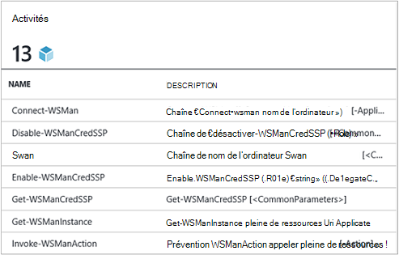
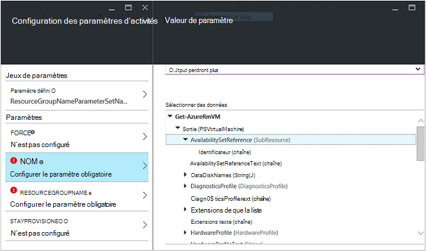
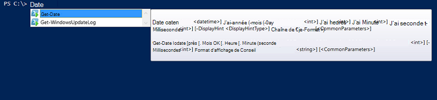

<properties
   pageTitle="Créer un Module d’intégration Automation Azure | Microsoft Azure"
   description="Didacticiels qui vous guide dans l’utilisation de la création, de test et exemple des modules d’intégration dans Azure Automation."
   services="automation"
   documentationCenter=""
   authors="mgoedtel"
   manager="jwhit"
   editor="" />

<tags
   ms.service="automation"
   ms.workload="tbd"
   ms.tgt_pltfrm="na"
   ms.devlang="na"
   ms.topic="get-started-article"
   ms.date="09/12/2016"
   ms.author="magoedte" />

# <a name="azure-automation-integration-modules"></a>Modules d’intégration Automation Azure

PowerShell est la technologie fondamentale derrière Automation Azure. Dans la mesure où Azure Automation est basée sur PowerShell, modules PowerShell sont essentiels pour l’extensibilité d’automatisation Azure. Dans cet article, nous vous guidera les caractéristiques d’utilisation de Azure automatisation des modules PowerShell, appelées « Modules d’intégration » et des pratiques recommandées pour créer vos propres modules PowerShell pour vérifier qu’ils fonctionnent comme Modules d’intégration dans Azure Automation. 

## <a name="what-is-a-powershell-module"></a>Qu’est un PowerShell Module ?

Un module PowerShell est un groupe d’applets de commande PowerShell, tels que **Get-Date** ou **Élément de copie**, qui peut servir à partir de la console PowerShell, les scripts, flux de travail, procédures opérationnelles et ressources DSC PowerShell comme WindowsFeature ou un fichier, ce qui peut servir à partir de configurations DSC PowerShell. Toutes les fonctionnalités de PowerShell est exposé par le biais applets de commande et ressources DSC et chaque ressource applet de commande/DSC est sauvegardée par un module PowerShell, un grand nombre de qui accompagnent PowerShell lui-même. Par exemple, l’applet de commande **Get-Date** fait partie du module Microsoft.PowerShell.Utility PowerShell et applet de commande **Copier un élément** fait partie du module Microsoft.PowerShell.Management PowerShell et la ressource de Package DSC fait partie du module PSDesiredStateConfiguration PowerShell. Les deux de ces modules sont fournis avec PowerShell. Mais plusieurs modules PowerShell ne figurent pas dans le cadre de PowerShell et sont réparties à la place avec les produits tiers ou premières comme gestionnaire de Configuration de System Center 2012 ou de la Communauté PowerShell vaste sur emplacements, tels que PowerShell galerie.  Les modules sont utiles, car ils simplifient les tâches complexes via la fonctionnalité encapsulée.  Vous pouvez en savoir plus sur les [modules PowerShell sur MSDN](https://msdn.microsoft.com/library/dd878324%28v=vs.85%29.aspx). 

## <a name="what-is-an-azure-automation-integration-module"></a>Qu’est un Module d’intégration Automation Azure ?

Un Module d’intégration n’est pas très différent à partir d’un module PowerShell. Son simplement un module PowerShell qui contient éventuellement un fichier supplémentaire - un fichier de métadonnées spécifiant un type de connexion Azure Automation à utiliser avec les applets de commande du module dans procédures opérationnelles. Facultatif fichier ou non, ces PowerShell modules peuvent être importées dans Azure Automation afin de rendre les applets de commande disponibles pour une utilisation dans les procédures opérationnelles et leurs ressources DSC disponibles pour une utilisation dans les configurations DSC. Les coulisses, Automation Azure stocke ces modules et au travail runbook et temps d’exécution DSC compiliation travail les charger dans les sandbox Azure Automation où procédures opérationnelles sont exécutées et configurations DSC sont compilées.  Toutes les ressources DSC dans les modules sont placés également automatiquement sur le serveur extraire DSC automatisation, afin qu’ils peuvent être extraits par machines essayez d’appliquer des configurations DSC.  Nous envoyer un certain nombre de modules PowerShell Azure prêts à l’emploi dans Azure Automation pour pouvoir utiliser afin que vous puissiez commencer automatisation gestion Azure immédiatement, mais vous pouvez facilement importer modules PowerShell pour un autre système, service ou outil que vous souhaitez intégrer. 

>[AZURE.NOTE] Certains modules sont fournis comme « modules globaux » dans le service d’automatisation. Ces modules globales sont disponibles pour vous déconnecter de la zone lorsque vous créez un compte d’automatisation, et nous les mettre à jour parfois qui envoie automatiquement les à votre compte automation. Si vous ne voulez leur mise à jour automatique, vous pouvez toujours importer le même module vous-même et qui est prioritaire sur la version du module global de ce module nous fournis dans le service. 

Le format dans lequel vous importez un package Integration Module est un fichier compressé avec le même nom que le module et une extension .zip. Il contient le module Windows PowerShell et les fichiers pris en charge, y compris un fichier manifeste (.psd1) si le module possède une.

Si le module doit contenir un type de connexion Automation Azure, il doit également contenir un fichier avec le nom *<ModuleName>*-Automation.json qui spécifie les propriétés de type de connexion. Il s’agit d’un fichier json placé dans le dossier des modules de votre fichier .zip compressé et contient les champs d’une connexion » » qui est nécessaire pour se connecter au système ou au service représente le module. Ceci mettra fin à la création d’un type de connexion dans Azure Automation. À l’aide de ce fichier que vous pouvez définir les noms de champs, les types, et indique si les champs doivent être facultatif, pour le type de connexion du module ou chiffré et /. Voici un modèle dans le format de fichier json :

```
{ 
   "ConnectionFields": [
   {
      "IsEncrypted":  false,
      "IsOptional":  false,
      "Name":  "ComputerName",
      "TypeName":  "System.String"
   },
   {
      "IsEncrypted":  false,
      "IsOptional":  true,
      "Name":  "Username",
      "TypeName":  "System.String"
   },
   {
      "IsEncrypted":  true,
      "IsOptional":  false,
      "Name":  "Password",
   "TypeName":  "System.String"
   }],
   "ConnectionTypeName":  "DataProtectionManager",
   "IntegrationModuleName":  "DataProtectionManager"
}
```

Si vous avez déployé automatisation de la gestion Service et créé des lots de Modules d’intégration pour les procédures opérationnelles automatisation, cela doit ressembler très familier. 


## <a name="authoring-best-practices"></a>Meilleures pratiques de création

Modules d’intégration sont essentiellement les modules PowerShell, qui ne parce que nous n’avons pas un ensemble de pratiques autour de leur création. Il est toujours un nombre d’éléments, que nous vous recommandons de que prendre en compte lors de la création d’un module PowerShell, pour le rendre plus utilisable dans Azure Automation. Certaines d'entre elles sont Azure Automation spécifiques, et certaines d'entre elles sont utiles afin que vos modules fonctionnent correctement dans les flux de travail PowerShell, quelle que soit ou non vous utilisez Automation. 

1. Inclure un résumé, description et aident les URI pour chaque applet de commande dans le module. Dans PowerShell, vous pouvez définir certaines informations d’aide pour les applets de commande permettre à l’utilisateur obtenir de l’aide sur leur utilisation avec l’applet de commande **Get-Help** . Par exemple, voici comment vous pouvez définir un résumé et aider URI pour un module PowerShell écrit dans un fichier .psm1.<br>  

    ```
    <#
        .SYNOPSIS
         Gets all outgoing phone numbers for this Twilio account 
    #>
    function Get-TwilioPhoneNumbers {
    [CmdletBinding(DefaultParameterSetName='SpecifyConnectionFields', `
    HelpUri='http://www.twilio.com/docs/api/rest/outgoing-caller-ids')]
    param(
       [Parameter(ParameterSetName='SpecifyConnectionFields', Mandatory=$true)]
       [ValidateNotNullOrEmpty()]
       [string]
       $AccountSid,

       [Parameter(ParameterSetName='SpecifyConnectionFields', Mandatory=$true)]
       [ValidateNotNullOrEmpty()]
       [string]
       $AuthToken,

       [Parameter(ParameterSetName='UseConnectionObject', Mandatory=$true)]
       [ValidateNotNullOrEmpty()]
       [Hashtable]
       $Connection
    )

    $cred = CreateTwilioCredential -Connection $Connection -AccountSid $AccountSid -AuthToken $AuthToken

    $uri = "$TWILIO_BASE_URL/Accounts/" + $cred.UserName + "/IncomingPhoneNumbers"
    
    $response = Invoke-RestMethod -Method Get -Uri $uri -Credential $cred

    $response.TwilioResponse.IncomingPhoneNumbers.IncomingPhoneNumber
    }
    ```
<br> 
Fournir les informations sur ce affichera pas uniquement cette aide à l’aide de l’applet de commande **Get-Help** dans la console PowerShell, il va également exposer cette fonctionnalité de l’aide dans Azure automatisation, par exemple lors de l’insertion d’activités lors de la programmation runbook. Cliquer sur « Afficher une aide détaillée » s’ouvre l’aide URI dans un autre onglet du navigateur web que vous utilisez pour accéder à l’Automation Azure.<br>
2. Si le module est exécuté sur un système distant, un. Il doit contenir un fichier de métadonnées de Module d’intégration qui définit les informations nécessaires pour vous connecter à ce système distant, ce qui signifie que le type de connexion. b. Chaque applet de commande dans le module doit être en mesure de prendre dans un objet de connexion (une instance de ce type de connexion) en tant que paramètre.  
    Applets de commande dans le module deviennent plus faciles à utiliser dans Azure Automation si vous autorisez le passage d’un objet avec les champs de type de connexion en tant que paramètre à l’applet de commande. Ainsi, les utilisateurs n’êtes pas obligé de mapper des paramètres de la ressource de connexion aux paramètres correspondants de l’applet de commande chaque fois qu’ils appellent une applet de commande. En fonction de l’exemple runbook ci-dessus, elle utilise une ressource de connexion Twilio appelée CorpTwilio pour accéder à Twilio et renvoyer tous les numéros de téléphone dans le compte.  Notez la manière dont il est mappage les champs de la connexion aux paramètres de l’applet de commande ?<br>

    ```
    workflow Get-CorpTwilioPhones
    {
      $CorpTwilio = Get-AutomationConnection -Name 'CorpTwilio'
    
      Get-TwilioPhoneNumbers 
        -AccountSid $CorpTwilio.AccountSid  
        -AuthToken $CorptTwilio.AuthToken
    }
    ```
<br>
Une manière plus simple et une meilleure cette approche est passer directement l’objet de connexion à l’applet de commande-

    ```
    workflow Get-CorpTwilioPhones
    {
      $CorpTwilio = Get-AutomationConnection -Name 'CorpTwilio'

      Get-TwilioPhoneNumbers -Connection $CorpTwilio
    }
    ```
<br>
Vous pouvez activer le comportement comme suit pour vos applets de commande en marquant accepter un objet de connexion directement en tant que paramètre, au lieu de simplement les champs de connexion pour les paramètres. En règle générale, vous souhaiterez un paramètre défini pour chacun, afin qu’un utilisateur n’utilise ne pas Automation Azure peut appeler vos applets de commande sans construire une table de hachage pour agir en tant que l’objet de connexion. Jeu de paramètres **SpecifyConnectionFields** ci-dessous est utilisé pour passer à la connexion propriétés des champs un par un. **UseConnectionObject** vous permet de passer de la connexion câble direct. Comme vous pouvez le voir, l’applet de commande Envoyer TwilioSMS dans le [module Twilio PowerShell](https://gallery.technet.microsoft.com/scriptcenter/Twilio-PowerShell-Module-8a8bfef8) permet de passer de l’autre façon : 

    ```
    function Send-TwilioSMS {
      [CmdletBinding(DefaultParameterSetName='SpecifyConnectionFields', `
      HelpUri='http://www.twilio.com/docs/api/rest/sending-sms')]
      param(
         [Parameter(ParameterSetName='SpecifyConnectionFields', Mandatory=$true)]
         [ValidateNotNullOrEmpty()]
         [string]
         $AccountSid,

         [Parameter(ParameterSetName='SpecifyConnectionFields', Mandatory=$true)]
         [ValidateNotNullOrEmpty()]
         [string]
         $AuthToken,

         [Parameter(ParameterSetName='UseConnectionObject', Mandatory=$true)]
         [ValidateNotNullOrEmpty()]
         [Hashtable]
         $Connection

       )
    }
    ```
<br>
3. Définir le type de sortie pour toutes les applets de commande dans le module. Définition d’un type de sortie pour une applet de commande permet de conception IntelliSense pour vous aider à déterminer les propriétés de sortie de l’applet de commande, pour une utilisation pendant la programmation. Il est particulièrement utile pendant la Automation runbook graphique programmation, où création heure connaissances est crucial pour une expérience utilisateur simple avec votre module.<br> <br> Ceci est similaire à la fonctionnalité « Entrez en avance » de la sortie d’une applet de commande dans PowerShell ISE sans avoir à exécuter.<br> <br>
4. Applets de commande dans le module doit prendre pas les types d’objets complexes pour les paramètres. Flux de travail PowerShell est différent de PowerShell dans la mesure où il stocke les types complexes dans un format désérialisé. Types primitifs restera en tant que primitives, mais les types complexes sont converties en leurs versions désérialisées, qui sont essentiellement les conteneurs de propriétés. Par exemple, si vous avez utilisé l’applet de commande **Get-Process** dans une procédure opérationnelle (ou un flux de travail PowerShell dans notre exemple), elle retourne un objet de type [Deserialized.System.Diagnostic.Process], pas celui attendu [System.Diagnostic.Process]. Ce type a les mêmes propriétés que le type non désérialisé, mais aucune de ces méthodes. Et si vous essayez de passer cette valeur en tant que paramètre à une applet de commande, où l’applet de commande attend une valeur [System.Diagnostic.Process] pour ce paramètre, vous recevez l’erreur suivante : *ne peut plus traiter transformation argument sur le paramètre « le processus ». Erreur : « Impossible de convertir la valeur « System.Diagnostics.Process (CcmExec) » de type « Deserialized.System.Diagnostics.Process » pour taper « System.Diagnostics.Process ».*   Il s’agit, car il existe une incompatibilité de type entre le type attendu [System.Diagnostic.Process] et le type de [Deserialized.System.Diagnostic.Process] donné. Ce problème consiste à vérifier que les applets de commande de votre module ne prennent pas de types complexes pour les paramètres. Voici une méthode incorrecte de le faire.

    ```
    function Get-ProcessDescription {
      param (
            [System.Diagnostic.Process] $process
      )
      $process.Description
    }
    ``` 
<br>
Et Voici une méthode droite, en tenant une primitive qui peut être utilisée en interne par l’applet de commande pour récupérer l’objet complexe et utilisez-le. Dans la mesure où les applets de commande exécutent dans le contexte de PowerShell, pas PowerShell flux de travail, à l’intérieur de l’applet de commande $process devient le type correct [System.Diagnostic.Process].  

    ```
    function Get-ProcessDescription {
      param (
            [String] $processName
      )
      $process = Get-Process -Name $processName

      $process.Description
    }
    ```
<br>
Connexion actifs dans procédures opérationnelles sont des tables de hachage, qui sont un type complexe, et encore ces tables de hachage semblent puissent être passé dans les applets de commande pour leur – paramètre de connexion parfaitement, avec aucune exception cast. Techniquement, certains types de PowerShell sont en mesure de convertir correctement à partir de son écran série à leur formulaire désérialisé et peuvent donc être passés dans les applets de commande pour accepter le type désérialisé non - les paramètres. Table de hachage est une des offres. Il est possible pour les types définis de l’auteur d’un module à mettre en œuvre de façon à ce qu’ils peuvent désérialiser correctement ainsi, mais il existe certains compromis pour vérifier. Le type doit avoir un constructeur par défaut, que toutes ses propriétés publiques et disposez d’un PSTypeConverter. Toutefois, pour les types déjà défini qui ne possède pas de l’auteur du module, il n’existe aucun moyen « corriger », par conséquent, la recommandation afin d’éviter des types complexes pour les paramètres ensemble. Conseil Runbook de création : si pour une raison quelconque, votre nécessité applets de commande de prendre un paramètre de type complexes, ou que vous utilisez un module d’une autre personne qui requiert un paramètre de type complexe, la solution de contournement dans le flux de travail PowerShel dans PowerShell local et de flux de travail PowerShell procédures opérationnelles consiste à renvoyer à la ligne de l’applet de commande qui génère le type complexe et l’applet de commande qui utilise le type dans la même activité InlineScript complexe. Dans la mesure où InlineScript exécute son contenu comme PowerShell au lieu de flux de travail PowerShell, l’applet de commande Générer le type complexe génère ce type correct, pas le type complexe désérialisé.
5. Apportez toutes les applets de commande dans le module sans état. Flux de travail PowerShell s’exécute chaque applet de commande appelé dans le flux de travail dans une session différente. Cela signifie que les applets de commande dépendant de l’état de session créés / modifiés par d’autres applets de commande dans le même module ne fonctionnent pas dans les procédures opérationnelles PowerShell le flux de travail.  Voici un exemple de procédure ne pas à suivre.

    ```
    $globalNum = 0
    function Set-GlobalNum {
       param(
           [int] $num
       )
      
       $globalNum = $num
    }
    function Get-GlobalNumTimesTwo {
       $output = $globalNum * 2
     
       $output
    }
    ```
<br>
6. Le module doit être entièrement contenu dans un package en mesure de Xcopy. Modules d’automatisation Azure sont distribués aux sandbox Automation lorsque procédures opérationnelles doivent s’exécuter, il est nécessaire de travailler indépendamment de celles qu’ils sont en cours d’exécution sur l’hôte de. Cela signifie que vous devriez pouvoir vers code postal le package module, déplacez-le vers un autre hôte avec la version de PowerShell même ou version ultérieure, et qu’il fonctionne normalement lors de l’importation en environnement PowerShell de cet hôte. Afin que cela se produise, le module doit dépendent pas tous les fichiers en dehors du dossier module (le dossier qui obtient compressé lorsque vous importez dans Azure Automation), ou sur tous les paramètres du Registre unique sur un hôte, tels que ceux définis par l’installation d’un produit. Si cette pratique recommandée n’est pas suivie, le module ne sera pas utilisable dans Azure Automation.  

## <a name="next-steps"></a>Étapes suivantes

- Pour commencer à utiliser les procédures opérationnelles de flux de travail de PowerShell, voir [Mon premier runbook de flux de travail PowerShell](automation-first-runbook-textual.md)
- Pour en savoir plus sur la création de Modules PowerShell, consultez [écriture d’un Module Windows PowerShell](https://msdn.microsoft.com/library/dd878310%28v=vs.85%29.aspx)