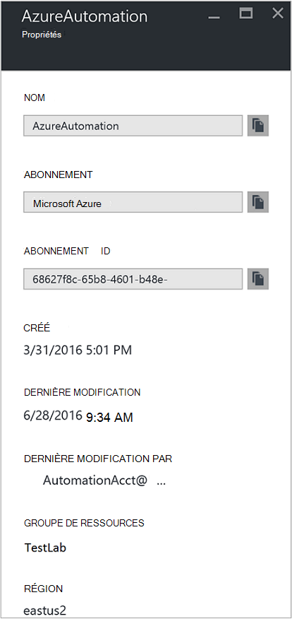
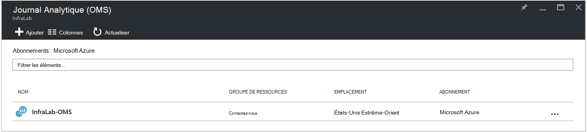
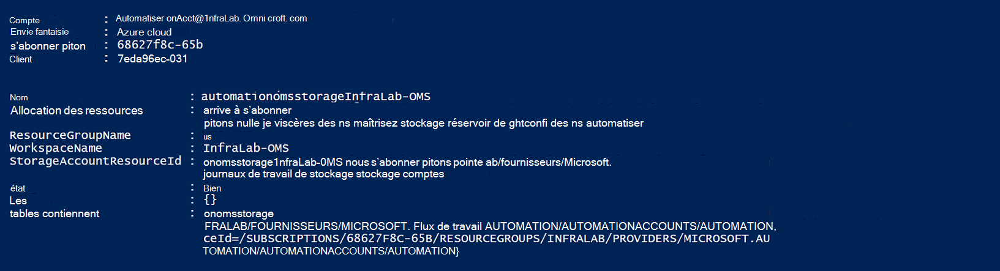
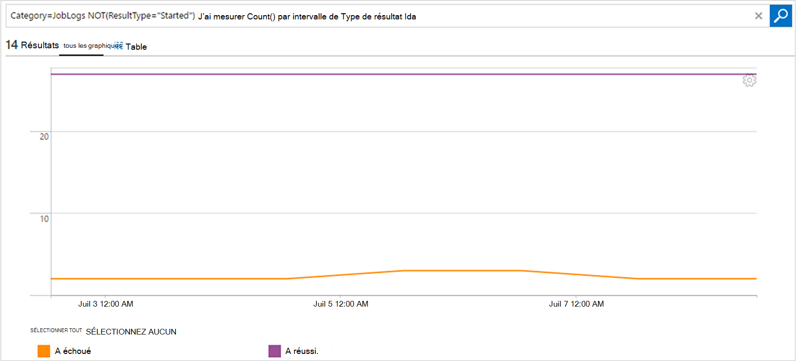

<properties
    pageTitle="Transférer l’état des travaux et flux de travail à partir d’automatisation au journal Analytique (OMS) | Microsoft Azure"
    description="Cet article montre comment envoyer runbook et l’état des travaux flux de travail à Microsoft Operations Management Suite journal Analytique à renseignent supplémentaires et la gestion."
    services="automation"
    documentationCenter=""
    authors="MGoedtel"
    manager="jwhit"
    editor="tysonn" />
<tags
    ms.service="automation"
    ms.devlang="na"
    ms.topic="article"
    ms.tgt_pltfrm="na"
    ms.workload="infrastructure-services"
    ms.date="09/22/2016"
    ms.author="magoedte" />

# Transférer l’état des travaux et flux de travail à partir d’automatisation au journal Analytique (OMS)

Automatisation peut envoyer runbook flux de statut et de travail des tâches à votre espace de travail Microsoft Operations Management Suite (OMS) journal Analytique.  Pendant que vous pouvez afficher ces informations dans le portail Azure ou avec PowerShell par état du travail individuels ou toutes les tâches d’un compte d’automatisation particulier, rien avancées pour prendre en charge vos exigences opérationnelles nécessite vous permet de créer des scripts PowerShell personnalisés.  Maintenant avec Anaytics journal, vous pouvez :

- Obtenez un aperçu de vos tâches d’automatisation 
- Déclencher un e-mail ou une alerte en fonction de votre statut de travail runbook (par exemple, a échoué ou suspendue) 
- Écrire des requêtes avancées au sein de votre flux de travail 
- Faire correspondre les travaux entre les comptes Automation 
- Visualiser l’historique du travail dans le temps     

## Conditions préalables et considérations relatives au déploiement

Pour commencer à envoyer les journaux d’automatisation au journal Analytique, vous devez disposer des éléments suivants :

1. Un abonnement OMS. Pour plus d’informations, voir [prise en main journal Analytique](../log-analytics/log-analytics-get-started.md).  

    >[AZURE.NOTE]L’espace de travail OMS et compte Automation doivent être dans le même abonnement Azure afin que cette configuration fonctionne correctement. 
  
2. Un [compte de stockage Azure](../storage/storage-create-storage-account.md).  
   
    >[AZURE.NOTE]Le compte de stockage *doit* être dans la même région que le compte d’automatisation. 
 
3. Azure PowerShell avec la version 1.0.8 ou version ultérieure des applets de commande Insights opérationnel. Pour plus d’informations sur cette version et apprendre à installer, voir [comment installer et configurer Azure PowerShell](../powershell-install-configure.md).
4. Azure Diagnostics and journal Analytique PowerShell.  Pour plus d’informations sur cette version et apprendre à installer, voir [Azure Diagnostic et journal Analytique](https://www.powershellgallery.com/packages/AzureDiagnosticsAndLogAnalytics/0.1).  
5. Téléchargez le script PowerShell **Enable-AzureDiagnostics.ps1** à partir de la [Galerie de PowerShell](https://www.powershellgallery.com/packages/Enable-AzureDiagnostics/1.0/DisplayScript). Ce script configure les éléments suivants :
 - Un compte de stockage pour contenir les runbook état et flux de données de projet pour un compte d’automatisation que vous spécifiez.
 - Activer la collecte de ces données à partir de votre compte Automation pour stocker dans un compte de stockage Blob Azure au format JSON.
 - Configurer la collecte des données à partir de votre compte de stockage Blob OMS journal Analytique.
 - Activer la solution automatisation journal Analytique votre espace de travail OMS.   

Le script **Activer AzureDiagnostics.ps1** requiert les paramètres suivants lors de l’exécution :

- *AutomationAccountName* - le nom de votre compte Automation
- *LogAnalyticsWorkspaceName* - le nom de votre espace de travail OMS

Pour rechercher les valeurs de *AutomationAccountName*, dans le portail Azure, sélectionnez votre compte Automation à partir de la carte de **compte Automation** et sélectionnez **tous les paramètres**.  Dans la carte de **tous les paramètres** , sous **Paramètres du compte** , sélectionnez **Propriétés**.  Dans la carte de **Propriétés** , vous pouvez l’indiquer ces valeurs.  .

## Configurer l’intégration avec journal Analytique

1. Sur votre ordinateur, démarrez **Windows PowerShell** à partir de l’écran de **démarrage** .  
2. À partir du shell de ligne de commande PowerShell, accédez au dossier qui contient le script que vous avez téléchargé et exécutez la modification des valeurs pour les paramètres *- AutomationAccountName* et *- LogAnalyticsWorkspaceName*.

    >[AZURE.NOTE] Vous devrez vous authentifier avec Azure lorsque vous avez exécuté le script.  Vous **devez** vous connecter avec un compte qui est membre du rôle Administrateurs d’abonnement et co-création administrateur de l’abonnement.   
    
        .\Enable-AzureDiagnostics -AutomationAccountName <NameofAutomationAccount> `
        -LogAnalyticsWorkspaceName <NameofOMSWorkspace> `

3. Après avoir exécuté ce script, vous devriez voir enregistrements dans le journal Analytique environ 30 minutes une fois les nouvelles données Diagnostics écrites au stockage.  Si les enregistrements ne sont pas disponibles une fois que cette fois reportez-vous à la section Dépannage dans [les fichiers JSON au stockage d’objets blob](../log-analytics/log-analytics-azure-storage-json.md#troubleshooting-configuration-for-azure-diagnostics-written-to-blob-in-json).

### Vérifier la configuration

Pour vérifier que le script configuré votre compte Automation et OMS wokspace avec succès, vous pouvez effectuer les opérations suivantes dans PowerShell.  Avant de procéder qui, pour rechercher que les valeurs de votre nom d’espace de travail OMS et le nom de groupe de ressources, à partir du portail Azure, naviguez jusqu’au journal Analytique (OMS) et dans la carte de journal Analytique (OMS), notez la valeur de **nom** et le **Groupe de ressources**.   nous utiliserons ces deux valeurs quand nous vérifier la configuration de votre espace de travail OMS à l’aide de l’applet de commande PowerShell [Get-AzureRmOperationalInsightsStorageInsight](https://msdn.microsoft.com/library/mt603567.aspx).

1.  À partir du portail Azure, accédez à comptes de stockage et de recherche pour le compte de stockage suivants, qui utilise la convention d’appellation - *AutomationAccountNameomsstorage*.  Après une runbook tâche est terminée, peu de temps par la suite, vous devriez voir deux conteneurs d’objets Blob créés - **perspectives-journaux-joblogs** et **perspectives-journaux-jobstreams**.  

2.  À partir de PowerShell, exécutez le code PowerShell suivant, la modification des valeurs pour les paramètres **ResourceGroupName** et **WorkspaceName** que vous avez copié ou indiqué précédemment.  

    Connexion AzureRmAccount Get-AzureRmSubscription - SubscriptionName 'SubscriptionName' | Jeu AzureRmContext Get-AzureRmOperationalInsightsStorageInsight - ResourceGroupName « OMSResourceGroupName » «-« OMSWorkspaceName » de l’espace de travail 

    Cette opération retourne l’aperçu de stockage pour l’espace de travail OMS spécifié.  Nous voulons vérifier l’aperçu de stockage pour le compte d’automatisation que nous spécifiés précédemment existe et l’objet **d’état** affiche la valeur **OK**.  .

## Les enregistrements Analytique de journal

Automatisation crée deux types d’enregistrements dans le référentiel OMS.

### Journaux de travail

Propriété | Description|
----------|----------|
Heure | Date et heure lorsque la tâche runbook exécutée.|
resourceId | Spécifie le type de ressource dans Azure.  Pour l’automatisation, la valeur est le compte Automation associé à la procédure opérationnelle.|
NomOpération | Spécifie le type d’opération effectuée dans Azure.  Pour l’automatisation, la valeur sera travail.|
resultType | L’état de la tâche runbook.  Les valeurs possibles sont : -Mise en route -Arrêté -Suspendue -A échoué -A réussi.|
resultDescription | Décrit l’état de résultat de travail runbook.  Les valeurs possibles sont : -Travail est démarré : Échoué de la tâche -Fin du travail|
ID de corrélation | GUID qui est l’Id de corrélation de la tâche runbook.|
Catégorie | Classification du type de données.  Pour l’automatisation, la valeur est JobLogs.|
RunbookName | Le nom de la procédure opérationnelle.|
ID de travail | GUID qui correspond à l’Id de la tâche runbook.|
Appelant |  Qui a initié l’opération.  Valeurs possibles sont une adresse de messagerie ou un système pour les tâches planifiées.|

### Flux de travail
Propriété | Description|
----------|----------|
Heure | Date et heure lorsque la tâche runbook exécutée.|
resourceId | Spécifie le type de ressource dans Azure.  Pour l’automatisation, la valeur est le compte Automation associé à la procédure opérationnelle.|
NomOpération | Spécifie le type d’opération effectuée dans Azure.  Pour l’automatisation, la valeur sera travail.|
resultType | L’état de la tâche runbook.  Les valeurs possibles sont : -InProgress|
resultDescription | Inclut le flux de sortie à partir de la procédure opérationnelle.|
ID de corrélation | GUID qui est l’Id de corrélation de la tâche runbook.|
Catégorie | Classification du type de données.  Pour l’automatisation, la valeur est JobStreams.|
RunbookName | Le nom de la procédure opérationnelle.|
ID de travail | GUID qui correspond à l’Id de la tâche runbook.|
Appelant | Qui a initié l’opération.  Valeurs possibles sont une adresse de messagerie ou un système pour les tâches planifiées.| 
StreamType | Le type de flux de travail. Les valeurs possibles sont : -Progression -Sortie -Avertissement -Erreur -Débogage -Détaillée|

## L’affichage Automation se connecte Analytique de journal 

À présent que vous avez commencé à envoyer les journaux de travail Automation à journal Analytique, voyons ce que vous pouvez faire avec ces journaux à l’intérieur OMS.   

### Envoyer un message électronique lorsqu’une tâche runbook échoue ou interrompt 

Un de nos clients supérieure vous invite à indiquer concerne la possibilité d’envoyer un message électronique ou un texte lorsque des problèmes liés à une tâche runbook.   

Pour créer une règle d’alerte, vous commencez par créer une recherche de journal pour les enregistrements de tâche runbook qui doit appeler l’alerte.  Le bouton **alerte** sera puis disponible afin de pouvoir créer et configurer la règle d’alerte.

1.  Dans la page Vue d’ensemble OMS, cliquez sur **Recherche de journal**.
2.  Créer une requête de recherche de journal pour votre alerte en tapant dans ce qui suit dans le champ de requête : `Category=JobLogs (ResultType=Failed || ResultType=Suspended)`.  Vous pouvez également regrouper par la RunbookName à l’aide de : `Category=JobLogs (ResultType=Failed || ResultType=Suspended) | measure Count() by RunbookName_s`.   
  
    Si vous avez configuré les journaux à partir de plusieurs comptes Automation ou d’abonnement à votre espace de travail, peut également vous intéresser dans regrouper vos alertes par l’abonnement ou le compte d’automatisation.  Nom du compte Automation peut être dérivé du champ de ressources dans la recherche de JobLogs.  

3.  Cliquez sur l' **alerte** dans la partie supérieure de la page pour ouvrir l’écran **Ajouter une règle d’alerte** .  Pour plus d’informations sur les options pour configurer l’alerte, voir [alertes dans le journal Analytique](../log-analytics/log-analytics-alerts.md#creating-an-alert-rule).

### Rechercher toutes les tâches terminées avec des erreurs 

En plus des alertes en fonction des échecs, que vous voulez probablement savoir quand une tâche runbook a rencontré une erreur ne se terminant pas (PowerShell génère un erreur lors du flux, mais ne se terminant pas les erreurs n’entraînent pas votre travail suspendre ou l’échec).    

1. Dans le portail OMS, cliquez sur **Recherche de journal**.
2. Dans le champ de requête, tapez `Category=JobStreams StreamType_s=Error | measure count() by JobId_g` , puis cliquez sur **recherche**.

### Affichage des flux de travail pour une tâche  

Lors du débogage d’une tâche, vous pouvez également rechercher dans les flux de travail.  La requête ci-dessous montre tous les flux de données pour une seule tâche avec GUID 2ebd22ea-e05e-4eb9 - 9d 76-d73cbd4356e0 :   

`Category=JobStreams JobId_g="2ebd22ea-e05e-4eb9-9d76-d73cbd4356e0" | sort TimeGenerated | select ResultDescription` 

### Afficher l’état de travail historique 

Enfin, vous souhaiterez peut-être visualiser l’historique du travail dans le temps.  Vous pouvez utiliser cette requête pour rechercher l’état de vos projets au fil du temps. 

`Category=JobLogs NOT(ResultType="started") | measure Count() by ResultType interval 1day`  
   

## Résumé

En envoyant vos données de statut et flux de travail Automation au journal Analytique, vous pouvez obtenir plus claires sur l’état de vos tâches d’automatisation en configurant des alertes pour vous avertir lorsqu’il y a un problème et tableaux de bord personnalisés à l’aide de requêtes avancées pour visualiser vos résultats runbook, état du travail runbook et autres indicateurs clés associés ou indicateurs.  Cela vous aidera fournir une plus grande visibilité opérationnelle et incidents adresse plus rapides.  

## Étapes suivantes

- Pour plus d’informations sur la création de requêtes de recherche différente et passez en revue les journaux de travail Automation avec journal Analytique, voir [journal des recherches dans journal Analytique](../log-analytics/log-analytics-log-searches.md)
- Pour mieux comprendre comment créer et récupérer des messages d’erreur et de sortie à partir de procédures opérationnelles, voir [messages et sortie Runbook](automation-runbook-output-and-messages.md) 
- Pour en savoir plus sur l’exécution du runbook, comment faire pour surveiller runbook des travaux et d’autres détails techniques, voir [suivi un travail runbook](automation-runbook-execution.md)
- Pour en savoir plus sur OMS journal Analytique et des sources de données collection de sites, voir [Azure collecte des données de stockage en vue d’ensemble du journal Analytique](../log-analytics/log-analytics-azure-storage.md)