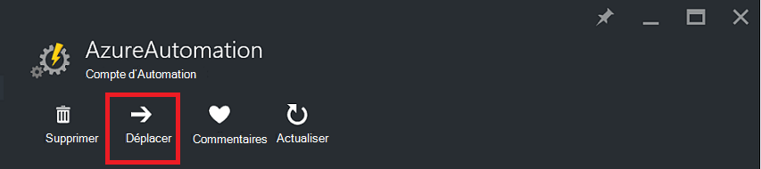
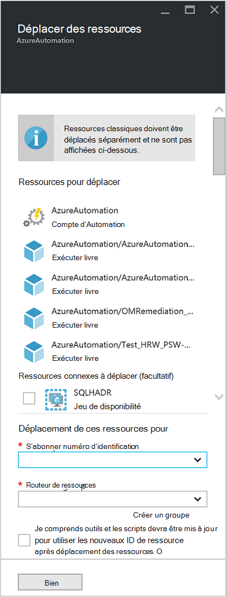

<properties
   pageTitle="Migrer Automation compte et ressources | Microsoft Azure"
   description="Cet article décrit comment déplacer un compte Automation dans Azure Automation et les ressources associées à partir d’un abonnement à un autre."
   services="automation"
   documentationCenter=""
   authors="MGoedtel"
   manager="jwhit"
   editor="tysonn" />
<tags
   ms.service="automation"
   ms.devlang="na"
   ms.topic="article"
   ms.tgt_pltfrm="na"
   ms.workload="infrastructure-services"
   ms.date="07/07/2016"
   ms.author="magoedte" />

# <a name="migrate-automation-account-and-resources"></a>Migrer compte Automation et des ressources

Pour les comptes Automation et ses ressources associées (c'est-à-dire biens, procédures opérationnelles, modules, etc.) que vous avez créé dans le portail Azure et que vous voulez migrer à partir d’un groupe de ressources à un autre ou d’un abonnement à un autre, vous pouvez accomplir facilement ceci avec la fonctionnalité de [déplacer les ressources](../resource-group-move-resources.md) disponible dans le portail Azure. Toutefois, avant d’effectuer cette action, vous devez tout d’abord examiner l' suivant [liste de vérification avant de déplacer des ressources](../resource-group-move-resources.md#Checklist-before-moving-resources) et en outre, la liste ci-dessous qui correspondent à Automation.   

1.  Le groupe d’abonnement/ressource destination doit être placé dans la même région comme source.  Cela signifie que les comptes Automation ne peut pas être déplacés au sein de régions.
2.  Lorsque vous déplacez des ressources (par exemple, procédures opérationnelles, tâches, etc.), le groupe source et le groupe cible sont verrouillés pendant la durée de l’opération. Écrire et supprimer des opérations sont bloqués sur les groupes que le déplacement soit terminée.  
3.  Les procédures opérationnelles ou les variables qui font référence à un ID de ressource ou d’abonnement de l’abonnement existant devra être mise à jour une fois la migration terminée.   


>[AZURE.NOTE] Cette fonctionnalité ne reconnaît pas les ressources automation classique.

## <a name="to-move-the-automation-account-using-the-portal"></a>Pour déplacer le compte d’automatisation à l’aide du portail

1. À partir de votre compte automatisation, cliquez sur **déplacer** en haut de la carte.<br> <br> 
2. Sur la carte **déplacer des ressources** , notez qu’il présente les ressources associées à votre compte Automation et vos groupes de ressources.  Sélectionnez **l’abonnement** et le **groupe de ressources** dans les listes déroulantes, ou sélectionnez l’option **créer un nouveau groupe de ressources** et entrez un nouveau nom de groupe de ressources dans le champ approprié.  
3. Passez en revue et activez la case à cocher pour confirmer que vous *comprendre les outils et les scripts devra être mis à jour pour utiliser la nouvelle ressource ID après déplacement des ressources* , puis cliquez sur **OK**.<br> <br>   

Cette action prendra quelques minutes.  Dans **les Notifications**, vous verrez afficher dont l’état de chaque action exécutée - validation, la migration, puis enfin lorsqu’il est terminé.     

## <a name="to-move-the-automation-account-using-powershell"></a>Pour déplacer le compte d’automatisation à l’aide de PowerShell

Pour déplacer les ressources Automation existantes d’un autre groupe de ressources ou d’abonnement, utilisez l’applet de commande **Get-AzureRmResource** pour obtenir le compte Automation spécifique, puis applet de commande de **Déplacement AzureRmResource** pour effectuer le déplacement.

Le premier exemple montre comment déplacer un compte d’automatisation à un nouveau groupe de ressources.

   ```
    $resource = Get-AzureRmResource -ResourceName "TestAutomationAccount" -ResourceGroupName "ResourceGroup01"
    Move-AzureRmResource -ResourceId $resource.ResourceId -DestinationResourceGroupName "NewResourceGroup"
   ``` 

Après avoir exécuté l’exemple ci-dessus, vous devrez vérifier que vous souhaitez effectuer cette action.  Une fois que vous cliquez sur **Oui** et autorisez le script continuer, vous ne recevrez pas les notifications pendant qu’il procède à la migration.  

Pour déplacer vers un nouvel abonnement, inclure une valeur pour le paramètre *DestinationSubscriptionId* .

   ```
    $resource = Get-AzureRmResource -ResourceName "TestAutomationAccount" -ResourceGroupName "ResourceGroup01"
    Move-AzureRmResource -ResourceId $resource.ResourceId -DestinationResourceGroupName "NewResourceGroup" -DestinationSubscriptionId "SubscriptionId"
   ``` 

Comme avec l’exemple précédent, vous devrez confirmer le déplacement.  

## <a name="next-steps"></a>Étapes suivantes

- Pour plus d’informations sur le déplacement des ressources vers le nouveau groupe de ressources ou d’abonnement, voir [déplacer des ressources à nouveau groupe de ressources ou d’abonnement](../resource-group-move-resources.md)
- Pour plus d’informations sur le contrôle d’accès basé sur un rôle dans Azure Automation, reportez-vous au [contrôle d’accès basé sur un rôle dans Azure Automation](../automation/automation-role-based-access-control.md).
- Pour en savoir plus sur les applets de commande PowerShell pour gérer votre abonnement, voir [Utilisation de PowerShell Azure avec le Gestionnaire de ressources](../powershell-azure-resource-manager.md)
- Pour en savoir plus sur les fonctionnalités du portail de gestion de votre abonnement, voir [l’aide du portail Azure pour gérer les ressources](../azure-portal/resource-group-portal.md). 
