<properties 
   pageTitle="Contrôle d’accès basé sur un rôle dans Azure automatisation | Microsoft Azure"
   description="Contrôle d’accès basé sur un rôle (RBAC) permet de gestion des accès pour les ressources Azure. Cet article décrit comment configurer RBAC dans Azure Automation."
   services="automation"
   documentationCenter=""
   authors="mgoedtel"
   manager="jwhit"
   editor="tysonn"
   keywords="automatisation rbac, contrôle d’accès, rbac azure basé sur un rôle" />
<tags 
   ms.service="automation"
   ms.devlang="na"
   ms.topic="get-started-article"
   ms.tgt_pltfrm="na"
   ms.workload="infrastructure-services"
   ms.date="09/12/2016"
   ms.author="magoedte;sngun"/>

# Contrôle d’accès basé sur un rôle dans Azure Automation

## Contrôle d’accès basé sur un rôle

Contrôle d’accès basé sur un rôle (RBAC) permet de gestion des accès pour les ressources Azure. L’utilisation de [RBAC](../active-directory/role-based-access-control-configure.md), vous pouvez séparer les droits au sein de votre équipe et accorder uniquement la quantité d’accès aux utilisateurs, groupes et aux applications dont ils ont besoin pour effectuer leur travail. Accès par rôle peuvent être accordées aux utilisateurs à l’aide du portail Azure, des outils de ligne de commande Azure ou des API de gestion des Azure.

## RBAC dans comptes Automation

Dans Azure Automation, l’accès en affectant le rôle RBAC approprié à des utilisateurs, des groupes et des applications à la portée de compte Automation. Voici les rôles intégrés pris en charge par un compte d’automatisation :  

|**Rôle** | **Description** |
|:--- |:---|
| Propriétaire | Le rôle de propriétaire permet d’accéder à toutes les ressources et les actions au sein d’un compte d’automatisation notamment fournir un accès à d’autres utilisateurs, les groupes et les applications pour gérer le compte d’automatisation. |
| Collaboration | Le rôle de collaborateur permet de gérer tout sauf la modification des autorisations d’accès d’un autre utilisateur à un compte Automation. |
| Reader | Le rôle de lecteur vous permet d’afficher toutes les ressources dans un compte Automation mais ne peut pas le modifier.|
| Opérateur d’Automation | Le rôle opérateur Automation permet à effectuer des tâches opérationnelles comme Démarrer, arrêter, suspendre, reprendre et planifier des tâches. Ce rôle est utile si vous voulez protéger vos ressources compte Automation tels que les informations d’identification actifs et procédures opérationnelles d’affichage ou la modification, mais toujours autoriser les membres de votre organisation à exécuter ces procédures opérationnelles. |
| Administrateur de l’accès utilisateur | Le rôle d’administrateur de l’accès utilisateur permet de gérer l’accès utilisateur aux comptes d’automatisation Azure. |

>[AZURE.NOTE] Vous ne peut pas accorder des droits d’accès à un runbook spécifique ou les procédures opérationnelles, uniquement pour les ressources et les actions dans le compte Automation.  

Dans cet article, nous vous guidera comment configurer RBAC dans Azure Automation. Mais tout d’abord, jetons observer les autorisations individuelles accordées aux collaborateurs, Reader, opérateur Automation et utilisateur accès administrateur afin que nous avons une bonne connaissance avant tout le monde octroi droits au compte Automation.  Sinon, il peut entraîner des conséquences inattendues ou indésirables.     

## Autorisations de rôle de collaborateur

Le tableau suivant présente les actions spécifiques qui peuvent être effectuées par le rôle de collaborateur dans Automation.

| **Type de ressource** | **Lecture** | **Écriture** | **Supprimer** | **Autres Actions** |
|:--- |:---|:--- |:---|:--- |
| Compte Azure Automation |  |  |  | | 
| Automatisation certificat actif |  |  |  | |
| Automatisation connexion biens |  |  |  | | 
| Ressource de Type de connexion Automation |  |  |  | | 
| Automatisation d’informations d’identification biens |  |  |  | |
| Automatisation échéancier biens |  |  |  | |
| Automatisation des biens Variable |  |  |  | |
| État Configuration vous le souhaitez Automation | | | |  |
| Type de ressource de travail Runbook hybride |  | |  | | 
| Travail Automation Azure |  |  | |  | 
| Flux de travail Automation |  | | | | 
| Planification des travaux Automation |  |  |  | |
| Module d’automatisation |  |  |  | |
| Automatisation Azure Runbook |  |  |  |  |
| Automatisation Runbook brouillon |  | | |  |
| Travail de Test Automation Runbook brouillon |  |  | |  | 
| Automatisation Webhook |  |  |  |  |

## Autorisations des rôles du lecteur

Le tableau suivant présente les actions spécifiques qui peuvent être effectuées par le rôle de lecteur dans Automation.

| **Type de ressource** | **Lecture** | **Écriture** | **Supprimer** | **Autres Actions** |
|:--- |:---|:--- |:---|:--- |
| Administrateur d’abonnement classique |  | | | 
| Verrouillage de gestion |  | | | 
| Autorisation |  | | |
| Opérations des fournisseurs |  | | | 
| Attribution de rôle |  | | | 
| Définition de rôle |  | | | 

## Autorisations des rôles opérateur Automation

Le tableau suivant présente les actions spécifiques qui peuvent être effectuées par le rôle d’automatisation opérateur dans Automation.

| **Type de ressource** | **Lecture** | **Écriture** | **Supprimer** | **Autres Actions** |
|:--- |:---|:--- |:---|:--- |
| Compte Azure Automation |  | | | 
| Automatisation certificat actif | | | |
| Automatisation connexion biens | | | |
| Ressource de Type de connexion Automation | | | |
| Automatisation d’informations d’identification biens | | | |
| Automatisation échéancier biens |  |  | | |
| Automatisation des biens Variable | | | |
| État Configuration vous le souhaitez Automation | | | | |
| Type de ressource de travail Runbook hybride | | | | | 
| Travail Automation Azure |  |  | |  | 
| Flux de travail Automation |  | | |  
| Planification des travaux Automation |  |  | | |
| Module d’automatisation | | | |
| Automatisation Azure Runbook |  | | | |
| Automatisation Runbook brouillon | | | |
| Travail de Test Automation Runbook brouillon | | | |  
| Automatisation Webhook | | | |

Pour plus d’informations, les [actions de l’opérateur Automation](../active-directory/role-based-access-built-in-roles.md#automation-operator) répertorie les actions prises en charge par le rôle d’opérateur Automation sur le compte Automation et ses ressources.

## Autorisations des rôles utilisateur accès administrateur

Le tableau suivant présente les actions spécifiques qui peuvent être effectuées par le rôle d’administrateur d’accès utilisateur dans Automation.

| **Type de ressource** | **Lecture** | **Écriture** | **Supprimer** | **Autres Actions** |
|:--- |:---|:--- |:---|:--- |
| Compte Azure Automation |  | | | |
| Automatisation certificat actif |  | | | |
| Automatisation connexion biens |  | | | |
| Ressource de Type de connexion Automation |  | | | |
| Automatisation d’informations d’identification biens |  | | | |
| Automatisation échéancier biens |  | | | |
| Automatisation des biens Variable |  | | | |
| État Configuration vous le souhaitez Automation | | | | |
| Type de ressource de travail Runbook hybride |  | | | | 
| Travail Automation Azure |  | | | | 
| Flux de travail Automation |  | | | | 
| Planification des travaux Automation |  | | | |
| Module d’automatisation |  | | | |
| Automatisation Azure Runbook |  | | | |
| Automatisation Runbook brouillon |  | | | |
| Travail de Test Automation Runbook brouillon |  | | | | 
| Automatisation Webhook |  | | |

## Configurer RBAC pour votre compte d’automatisation à l’aide du portail Azure

1.  Connectez-vous au [Portail Azure](https://portal.azure.com/) et ouvrir votre compte Automation à partir de la carte de comptes Automation.  

2.  Cliquez sur le contrôle **d’accès** dans le coin supérieur droit. Cette action ouvre la carte **utilisateurs** où vous pouvez ajouter de nouveaux utilisateurs, des groupes et des applications pour gérer votre compte Automation et afficher les rôles existants qui peuvent être configurés pour le compte d’automatisation.  

      

>[AZURE.NOTE] **Administrateurs de l’abonnement** existe déjà en tant que l’utilisateur par défaut. Le groupe abonnement administrateurs active directory inclut les administrateurs de service et co-administrator(s) pour votre abonnement Azure. L’administrateur de Service est le propriétaire de votre abonnement Azure et ses ressources et est ont le rôle de propriétaire héritées pour les comptes d’automatisation trop. Cela signifie que le niveau d’accès est **hérité** pour **les administrateurs de service et coadministrateurs** un abonnement, il est **affecté** pour tous les autres utilisateurs. Cliquez sur **administrateurs de l’abonnement** pour afficher plus d’informations sur les autorisations.  

### Ajouter un nouvel utilisateur et attribuer un rôle

1.  À partir de la carte d’utilisateurs, cliquez sur **Ajouter** pour ouvrir la **carte d’accès Ajouter** l’endroit où vous pouvez ajouter un utilisateur, un groupe ou une application et leur attribuer un rôle.  

    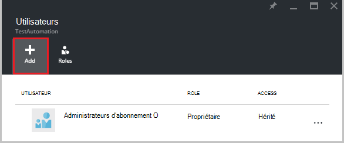  

2.  Sélectionnez un rôle dans la liste des rôles disponibles. Nous allons choisir le rôle de **lecteur** , mais vous pouvez choisir un des rôles disponibles intégrées qui prend en charge l’Automation compte ou n’importe quel rôle personnalisée que peut avoir défini.  

    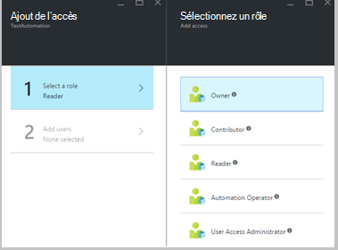  

3.  Cliquez sur **Ajouter des utilisateurs** pour ouvrir la carte **d’Ajouter des utilisateurs** . Si vous avez ajouté tous les utilisateurs, groupes, ou applications pour gérer vos abonnements puis ces utilisateurs sont répertoriés et vous pouvez les sélectionner pour ajouter l’accès. Si ne contient pas d’utilisateurs répertoriés, ou si l’utilisateur qui vous intéresse ajout n’est pas répertorié puis cliquez sur **inviter** pour ouvrir la carte **inviter un invité** , où vous pouvez inviter un utilisateur avec une adresse de messagerie de compte Microsoft valide tel que Outlook.com, OneDrive ou Xbox Live ID. Une fois que vous avez entré l’adresse de messagerie de l’utilisateur, cliquez sur **Sélectionner** pour ajouter l’utilisateur, puis cliquez sur **OK**. 

    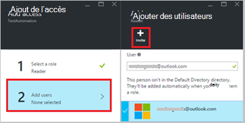  
 
    Maintenant, vous devriez voir l’utilisateur est ajouté à la carte **utilisateurs** avec le rôle de **lecteur** affecté.  

      

    Vous pouvez également attribuer un rôle à l’utilisateur à partir de la carte de **rôles** . 

1. Cliquez sur **les rôles** de la carte utilisateurs pour ouvrir la **carte de rôles**. À partir de cette carte, vous pouvez afficher le nom de rôle, le nombre d’utilisateurs et groupes affectés à ce rôle.

    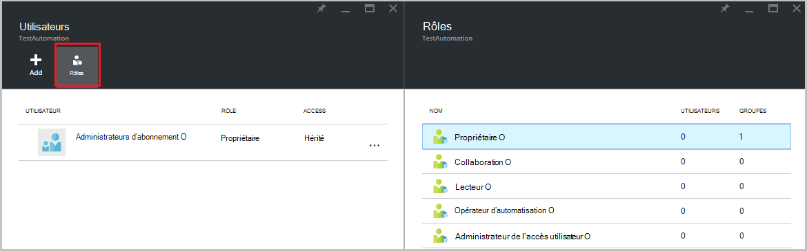  
   
    >[AZURE.NOTE] Contrôle d’accès basé sur un rôle peut uniquement être défini au niveau des comptes d’automatisation et non à toutes les ressources sous le compte Automation.

    Vous pouvez affecter plus d’un rôle à un utilisateur, un groupe ou une application. Par exemple, si nous ajoutons le rôle **Opérateur Automation** ainsi que le **rôle de lecteur** à l’utilisateur, puis qu’ils peuvent afficher toutes les ressources d’automatisation, correspondants peuvent exécuter les tâches runbook. Vous pouvez développer la liste déroulante pour afficher une liste des rôles attribués à l’utilisateur.  

    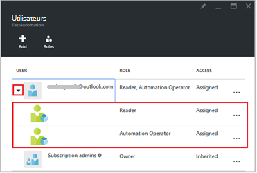  
 
### Supprimer un utilisateur

Vous pouvez supprimer l’autorisation d’accès pour un utilisateur qui n’est pas gestion du compte de Automation, ou qui ne fonctionne plus pour l’organisation. Voici les étapes pour supprimer un utilisateur : 

1.  À partir de la carte **d’utilisateurs** , sélectionnez l’attribution de rôle que vous souhaitez supprimer.

2.  Cliquez sur le bouton **Supprimer** dans la carte de détails d’affectation.

3.  Cliquez sur **Oui** pour confirmer la suppression. 

    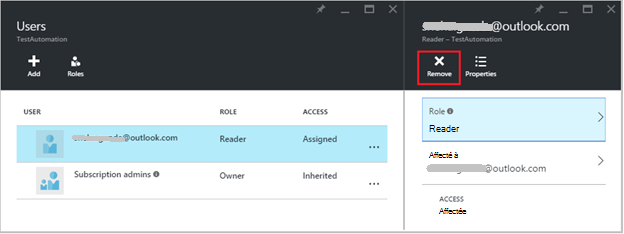  

## Rôle utilisateur

Lorsqu’un utilisateur affecté à un rôle se connecte à leur propre compte automatisation, ils peuvent désormais voir liste des comptes du propriétaire de la dans la liste des **Répertoires par défaut**. Pour afficher le compte Automation qu’ils ont été ajoutés au, ils doivent faire basculer le répertoire par défaut au répertoire par défaut du propriétaire.  

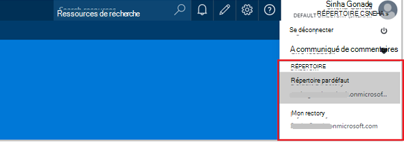  

### Expérience utilisateur pour le rôle d’opérateur Automation

Lorsqu’un utilisateur, qui est affecté aux vues rôle opérateur Automation au compte Automation qu'elles sont affectées, ils peuvent uniquement afficher la liste des procédures opérationnelles, les travaux runbook et les calendriers créés dans le compte d’automatisation, mais ne peut pas afficher leur définition. Vous pouvez démarrer, arrêter, suspendre, reprendre ou planifier le travail runbook. L’utilisateur n’ont pas accès à d’autres ressources Automation tels que les configurations, les groupes de collaborateurs hybride ou nœuds DSC.  

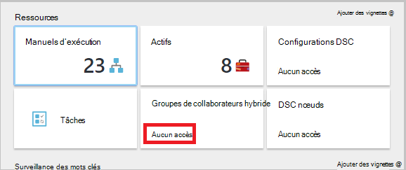  

Lorsque l’utilisateur clique sur la procédure opérationnelle, les commandes pour afficher la source ou modifier la runbook ne sont pas fournis comme le rôle d’opérateur Automation ne permet pas accès à ces derniers.  

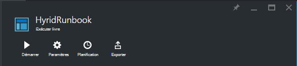  

L’utilisateur a accès permet d’afficher et créer des calendriers, mais n’ont pas accès à un autre type de biens.  

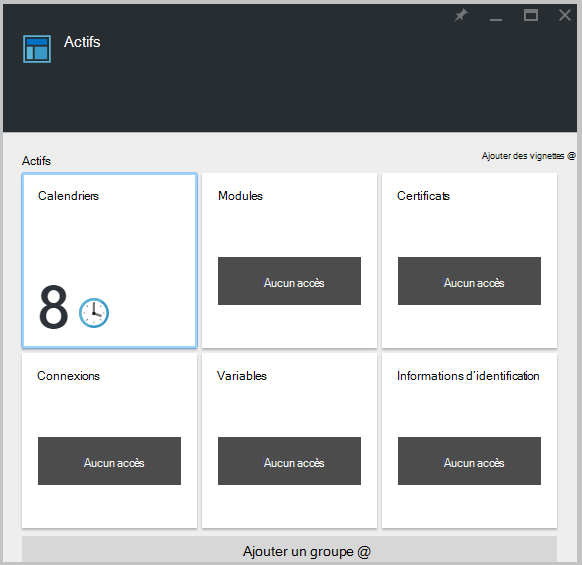  

Également cet utilisateur n’a pas accès à afficher le webhooks associé à un runbook

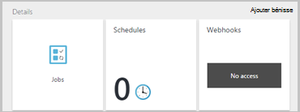  

## Configurer RBAC pour votre compte d’automatisation à l’aide de PowerShell Azure

Accès par rôle peut également être configuré pour un compte Automation en utilisant les [applets de commande PowerShell Azure](../active-directory/role-based-access-control-manage-access-powershell.md)suivant.

• [Get-AzureRmRoleDefinition](https://msdn.microsoft.com/library/mt603792.aspx) répertorie tous les rôles RBAC disponibles dans Azure Active Directory. Vous pouvez utiliser cette commande en même temps que la propriété **Name** pour répertorier toutes les actions pouvant être effectuées par un rôle spécifique.  
    **Exemple :**  
      

• [Get-AzureRmRoleAssignment](https://msdn.microsoft.com/library/mt619413.aspx) répertorie les attributions de rôle Azure AD RBAC à la portée spécifiée. Sans paramètres, cette commande renvoie toutes les attributions de rôle au titre de l’abonnement. Utilisez le paramètre **ExpandPrincipalGroups** aux affectations d’access liste pour l’utilisateur spécifié, ainsi que les groupes de que l’utilisateur est membre.  
    **Exemple :** La commande suivante permet de répertorier tous les utilisateurs et leurs rôles au sein d’un compte d’automatisation.

    Get-AzureRMRoleAssignment -scope “/subscriptions/<SubscriptionID>/resourcegroups/<Resource Group Name>/Providers/Microsoft.Automation/automationAccounts/<Automation Account Name>” 

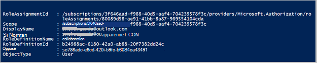

• [Nouveau AzureRmRoleAssignment](https://msdn.microsoft.com/library/mt603580.aspx) devant être accessibles aux utilisateurs, les groupes et les applications à une zone en particulier.  
    **Exemple :** Utilisez la commande suivante pour attribuer le rôle « Automatisation opérateur » pour un utilisateur dans l’étendue d’automatisation compte.

    New-AzureRmRoleAssignment -SignInName <sign-in Id of a user you wish to grant access> -RoleDefinitionName "Automation operator" -Scope “/subscriptions/<SubscriptionID>/resourcegroups/<Resource Group Name>/Providers/Microsoft.Automation/automationAccounts/<Automation Account Name>”  

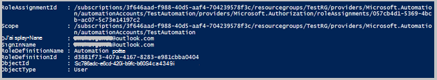

• Utilisez [AzureRmRoleAssignment-supprimer](https://msdn.microsoft.com/library/mt603781.aspx) pour supprimer l’accès d’un utilisateur spécifié, le groupe ou l’application à partir d’une zone en particulier.  
    **Exemple :** Utilisez la commande suivante pour supprimer l’utilisateur du rôle « Automatisation opérateur » dans l’étendue d’automatisation compte.

    Remove-AzureRmRoleAssignment -SignInName <sign-in Id of a user you wish to remove> -RoleDefinitionName "Automation Operator" -Scope “/subscriptions/<SubscriptionID>/resourcegroups/<Resource Group Name>/Providers/Microsoft.Automation/automationAccounts/<Automation Account Name>”

Dans les exemples ci-dessus, remplacez **se connecter Id**, **Id de l’abonnement**, **nom de groupe de ressources** et **nom de compte Automation** avec vos informations de compte. Cliquez sur **Oui** lorsque vous êtes invité à confirmer avant de poursuivre le retrait d’attribution de rôle utilisateur.   

## Étapes suivantes
-  Pour plus d’informations sur les différentes façons de configurer RBAC Azure automatisation, consultez [Gérer RBAC avec Azure PowerShell](../active-directory/role-based-access-control-manage-access-powershell.md).
- Pour plus d’informations sur les différentes façons de démarrer une procédure opérationnelle, voir [démarrage d’un runbook](automation-starting-a-runbook.md)
- Pour plus d’informations sur les types de runbook différentes, voir [types de runbook Automation Azure](automation-runbook-types.md)

