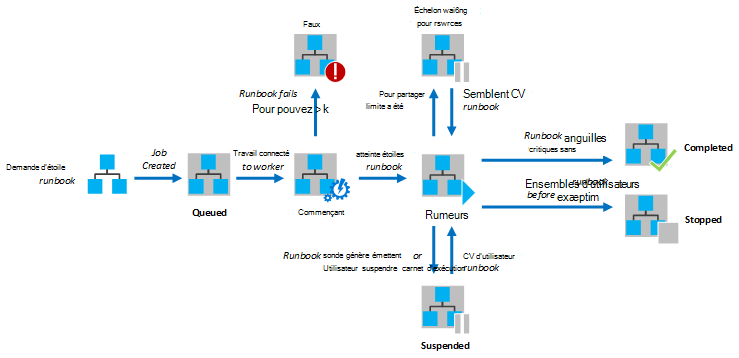
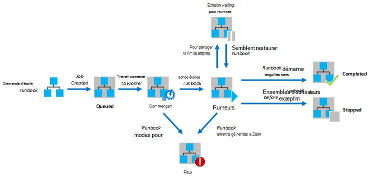

<properties
   pageTitle="Exécution du Runbook dans Azure Automation"
   description="Décrit les détails de la façon dont un runbook dans Azure Automation est traité."
   services="automation"
   documentationCenter=""
   authors="mgoedtel"
   manager="stevenka"
   editor="tysonn" />
<tags
   ms.service="automation"
   ms.devlang="na"
   ms.topic="article"
   ms.tgt_pltfrm="na"
   ms.workload="infrastructure-services"
   ms.date="03/21/2016"
   ms.author="bwren" />

# Exécution du Runbook dans Azure Automation

Lorsque vous démarrez une procédure opérationnelle dans Azure Automation, une tâche est créée. Une tâche est une instance d’exécution unique d’une procédure opérationnelle. Un collaborateur Azure Automation est affecté à exécuter chaque tâche. Bien que les travailleurs sont partagées par plusieurs comptes Azure, tâches à partir de différents comptes Automation sont isolées entre elles. Il est inutile de contrôle sur les travailleurs seront service la demande de votre travail.  Un seul runbook peut avoir plusieurs tâches en cours d’exécution en même temps. Lorsque vous affichez la liste des procédures opérationnelles dans le portail Azure, elle indique l’état de la dernière tâche qui a été démarrée pour chaque runbook. Vous pouvez afficher la liste des tâches pour chaque runbook afin d’effectuer le suivi de l’état de chacun. Pour obtenir une description des statuts de travail différent, voir [Statuts de traitement](#job-statuses).

Le diagramme suivant illustre le cycle de vie d’un travail runbook pour les [procédures opérationnelles graphique](automation-runbook-types.md#graphical-runbooks) et [procédures opérationnelles PowerShell le flux de travail](automation-runbook-types.md#powershell-workflow-runbooks).

Le diagramme suivant illustre le cycle de vie d’un travail runbook de [procédures opérationnelles PowerShell](automation-runbook-types.md#powershell-runbooks).

Vos projets auront accès à vos ressources Azure à l’aide d’une connexion à votre abonnement Azure. Ils auront uniquement accès aux ressources dans votre centre de données si ces ressources sont accessibles à partir du cloud public.

## Statuts de traitement

Le tableau suivant décrit les différents statuts sont possibles pour une tâche.

| État| Description|
|:---|:---|
|Terminé|La tâche est terminée avec succès.|
|A échoué| Pour les [procédures opérationnelles PowerShell le flux de travail et de graphique](automation-runbook-types.md), la runbook la compilation a échoué.  Pour les [procédures opérationnelles PowerShell Script](automation-runbook-types.md), la runbook n’a pas pu démarrer ou le travail a rencontré une exception. |
|Échec, en attente de ressources|La tâche a échoué car il a atteint la limite de [partager juste](#fairshare) trois fois et mise en route du point de contrôle même ou à partir du début de la procédure opérationnelle chaque fois.|
|En file d’attente|La tâche est en attente pour les ressources sur un collaborateur Automation à venir disponible afin qu’il peut être démarré.|
|Démarrage|La tâche a été affectée à un collaborateur, et le système est en cours de démarrage.|
|Reprise|Le système est en train de reprendre le travail une fois qu’il a été suspendue.|
|En cours d’exécution|La tâche est en cours d’exécution.|
|En cours d’exécution, en attente de ressources|La tâche a été décharger car il a atteint la limite [juste partager](#fairshare) . Il va reprendre peu de temps à partir de son dernier point de contrôle.|
|Arrêté|Le travail a été arrêté par l’utilisateur avant qu’elle a été terminée.|
|Arrêt|Le système est en train d’arrêt de la tâche.|
|Suspendue|La tâche a été suspendue par l’utilisateur, par le système ou par une commande dans la procédure opérationnelle. Un travail est suspendu peut être démarré à nouveau et reprend à partir de son dernier point de contrôle ou à partir du début de la procédure opérationnelle si elle n’a aucun point de contrôle. La procédure opérationnelle est uniquement suspendu par le système dans le cas d’une exception. Par défaut, ErrorActionPreference est définie sur **Continue** ce qui signifie que le travail continueront à s’exécuter sur un message d’erreur. Si cette variable de préférence est définie sur **Arrêter** le travail sera suspendre sur un message d’erreur.  S’applique uniquement aux [procédures opérationnelles PowerShell le flux de travail et de graphique](automation-runbook-types.md) .|
|La suspension|Le système essaie de suspendre la tâche à la demande de l’utilisateur. La procédure opérationnelle doit atteindre son point de contrôle suivant avant d’être suspendu. Si elle est déjà passée son dernier point de contrôle, il se termine avant d’être suspendu.  S’applique uniquement aux [procédures opérationnelles PowerShell le flux de travail et de graphique](automation-runbook-types.md) .|

## Affichage de l’état de projet à l’aide du portail de gestion Azure

### Tableau de bord Automation

Le tableau de bord Automation affiche un résumé de toutes les procédures opérationnelles pour un compte d’automatisation particulier. Il inclut également une vue d’ensemble de l’utilisation du compte. Le graphique de synthèse affiche le nombre de total de tâches pour toutes les procédures opérationnelles entré chaque état sur un certain nombre de jours ou d’heures. Vous pouvez sélectionner la plage horaire dans le coin supérieur droit du graphique. L’axe du temps du graphique remplacera selon le type de plage horaire que vous sélectionnez. Vous pouvez choisir d’afficher la ligne correspondant à un certain état en cliquant dessus dans la partie supérieure de l’écran.

Vous pouvez utiliser les étapes suivantes pour afficher le tableau de bord Automation.

1. Dans le portail de gestion Azure, sélectionnez **Automation** et puis cliquez sur le nom d’un compte d’automatisation.
1. Sélectionnez l’onglet **tableau de bord** .

### Tableau de bord Runbook

Le tableau de bord Runbook affiche un résumé pour un seul runbook. Le graphique de synthèse affiche le nombre de total de tâches pour la runbook qui entré chaque état sur un certain nombre de jours ou d’heures. Vous pouvez sélectionner la plage horaire dans le coin supérieur droit du graphique. L’axe du temps du graphique remplacera selon le type de plage horaire que vous sélectionnez. Vous pouvez choisir d’afficher la ligne correspondant à un certain état en cliquant dessus dans la partie supérieure de l’écran.

Vous pouvez utiliser les étapes suivantes pour afficher le tableau de bord Runbook.

1. Dans le portail de gestion Azure, sélectionnez **Automation** et puis cliquez sur le nom d’un compte d’automatisation.
1. Cliquez sur le nom d’une procédure opérationnelle.
1. Sélectionnez l’onglet **tableau de bord** .

### Résumé de la tâche

Vous pouvez afficher une liste de toutes les tâches qui ont été créés pour un runbook particulier et leur statut le plus récent. Vous pouvez filtrer cette liste par état du travail et la plage de dates pour la dernière modification de la tâche. Cliquez sur le nom d’une tâche pour afficher des informations détaillées et son résultat. La vue détaillée de la tâche comprend les valeurs pour les paramètres runbook qui ont été fournis à cette tâche.

Vous pouvez utiliser les étapes suivantes pour afficher les tâches pour une procédure opérationnelle.

1. Dans le portail de gestion Azure, sélectionnez **Automation** et puis cliquez sur le nom d’un compte d’automatisation.
1. Cliquez sur le nom d’une procédure opérationnelle.
1. Sélectionnez l’onglet **tâches** .
1. Cliquez sur la colonne **Travail créé** pour une tâche afficher ses détails et sortie.

## Récupération d’état du travail à l’aide de Windows PowerShell

Vous pouvez utiliser [Get-AzureAutomationJob](http://msdn.microsoft.com/library/azure/dn690263.aspx) pour récupérer des travaux créés pour un runbook et les détails d’une tâche spécifique. Si vous démarrez une procédure opérationnelle avec Windows PowerShell à l’aide de [Démarrer AzureAutomationRunbook](http://msdn.microsoft.com/library/azure/dn690259.aspx), elle renvoie la tâche résultante. [Get-AzureAutomationJob](http://msdn.microsoft.com/library/azure/dn690263.aspx)sortie permet d’obtenir un résultat d’un travail.

Les exemples de commandes suivant extrait la dernière tâche pour un exemple de procédure opérationnelle et affiche son état, fournissent les valeurs pour les paramètres runbook et le résultat de la tâche.

    $job = (Get-AzureAutomationJob –AutomationAccountName "MyAutomationAccount" –Name "Test-Runbook" | sort LastModifiedDate –desc)[0]
    $job.Status
    $job.JobParameters
    Get-AzureAutomationJobOutput –AutomationAccountName "MyAutomationAccount" -Id $job.Id –Stream Output

## Exposition partager

Pour partager les ressources entre tous les procédures opérationnelles dans le cloud, Automation Azure va décharger temporairement n’importe quelle tâche après qu’il a fonctionné pendant 3 heures.    [Flux de travail PowerShell](automation-runbook-types.md#powershell-workflow-runbooks) et [graphique](automation-runbook-types.md#graphical-runbooks) procédures opérationnelles reprend à partir de leur dernier [point de contrôle](http://technet.microsoft.com/library/dn469257.aspx#bk_Checkpoints). Pendant ce temps, le travail affiche un état en cours d’exécution, en attente de ressources. Si le runbook ne comporte aucun point de contrôle ou la tâche n’a pas atteint le premier point de contrôle avant en cours de chargement, il sera redémarré à partir du début.  Procédures opérationnelles [PowerShell](automation-runbook-types.md#powershell-runbooks) sont toujours redémarrés à partir du début dans la mesure où ils ne prennent pas en charge les points de contrôle.

>[AZURE.NOTE] La limite de partager juste n’est pas applicable aux projets runbook s’exécutant sur hybride Runbook travailleurs.

Si la procédure opérationnelle redémarre à partir du point de contrôle même ou à partir du début de la procédure opérationnelle trois fois consécutives, il va se terminer avec le statut Échec, en attente de ressources. Il s’agit de protéger contre les procédures opérationnelles en cours d’exécution indéfiniment sans terminer, qu’ils ne sont pas en mesure d’établir au point de contrôle suivant sans rupture de charge à nouveau. Dans ce cas, vous recevrez l’exception suivante avec l’erreur.

*La tâche ne peut pas continuer en cours d’exécution, car il a été supprimé à plusieurs reprises le même point de contrôle. Assurez-vous que votre Runbook n’effectue pas les opérations longues sans conserver son état.*

Lorsque vous créez une procédure opérationnelle, vous devez vous assurer que l’heure d’exécution de toutes les activités entre deux points de contrôle ne dépasse pas 3 heures. Vous devrez peut-être ajouter des points de contrôle pour votre runbook pour vous assurer qu’il ne pas atteigne cette limite 3 heures ou décomposer long opérations en cours d’exécution. Par exemple, votre runbook peut-être effectuer un réindexer le sur une base de données SQL volumineuse. Si cette opération unique ne se termine pas dans la limite de partager juste, le travail sera décharger et redémarré à partir du début. Dans ce cas, vous devez décomposer l’opération réindexer l’en plusieurs étapes, telles que la réindexation d’une table à la fois et insérez un point de contrôle après chaque opération afin que le travail peut reprendre après la dernière opération pour terminer.

## Étapes suivantes

- [Démarrage d’un runbook dans Azure Automation](automation-starting-a-runbook.md)
