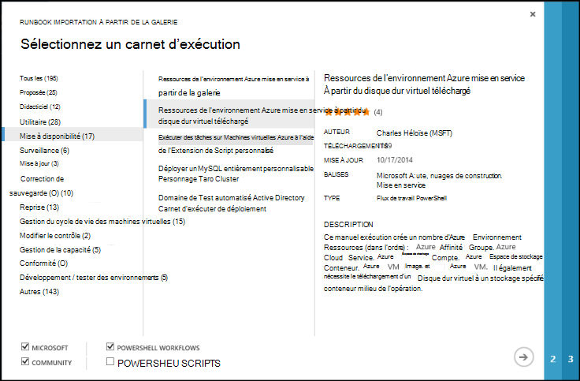
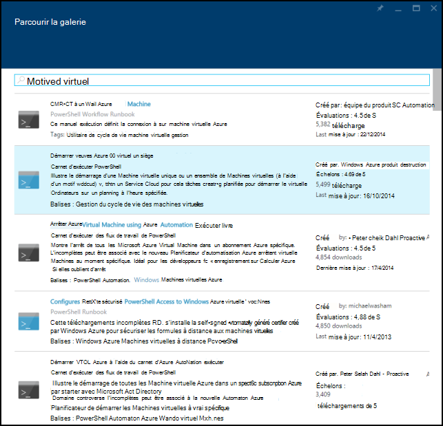
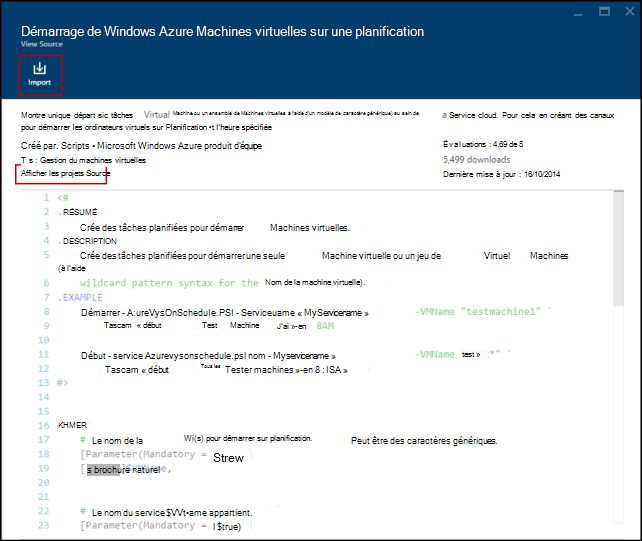
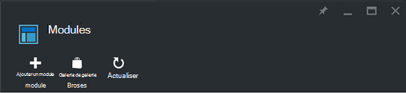
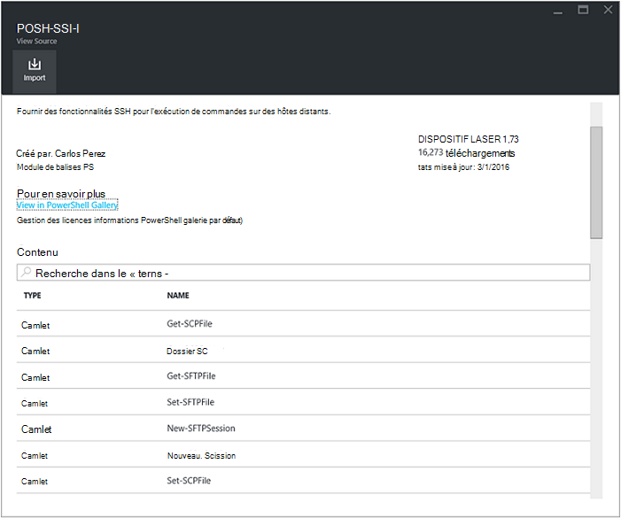
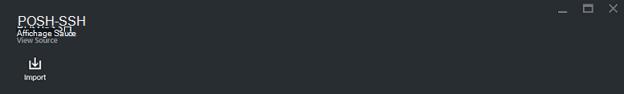
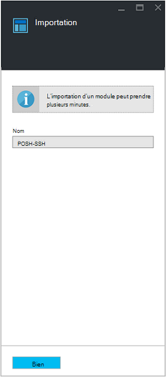

<properties
    pageTitle="Galeries Runbook et module Azure automatisation | Microsoft Azure"
    description="Procédures opérationnelles modules Microsoft et de la Communauté sont disponibles et vous pouvez installer et utiliser dans votre environnement Automation Azure.  Cet article décrit comment vous pouvez accéder à ces ressources et de contribuer les procédures opérationnelles dans la galerie."
    services="automation"
    documentationCenter=""
    authors="mgoedtel"
    manager="jwhit"
    editor="tysonn" />
<tags
    ms.service="automation"
    ms.devlang="na"
    ms.topic="article"
    ms.tgt_pltfrm="na"
    ms.workload="infrastructure-services"
    ms.date="09/18/2016"
    ms.author="magoedte;bwren" />

# Galeries Runbook et module Azure Automation

Au lieu de créer vos propres modules et procédures opérationnelles dans Azure Automation, vous pouvez accéder à une variété de scénarios qui ont déjà été générés par Microsoft et de la Communauté.  Vous pouvez utiliser ces scénarios sans modification ou vous pouvez les utiliser comme point de départ et à les modifier pour vos besoins spécifiques.

Vous pouvez obtenir des procédures opérationnelles à partir de la [Galerie de Runbook](#runbooks-in-runbook-gallery) et les modules à partir de la [Galerie de PowerShell](#modules-in-powerShell-gallery).  Vous pouvez également participer à la Communauté en partageant des scénarios que vous développez.

## Procédures opérationnelles dans la galerie de Runbook

La [Galerie Runbook](http://gallery.technet.microsoft.com/scriptcenter/site/search?f[0].Type=RootCategory&f[0].Value=WindowsAzure&f[1].Type=SubCategory&f[1].Value=WindowsAzure_automation&f[1].Text=Automation) fournit une variété de procédures opérationnelles Microsoft et de la Communauté que vous pouvez importer dans Azure Automation. Vous pouvez soit télécharger un runbook à partir de la galerie qui est hébergée dans le [Centre de scripts TechNet](http://gallery.technet.microsoft.com/), ou vous pouvez importer directement des procédures opérationnelles dans la galerie à partir du portail classique Azure ou un portail Azure.

Vous ne pouvez importer directement à partir de la galerie Runbook à l’aide du portail classique Azure ou portail Azure. Vous ne pouvez pas effectuer cette fonction à l’aide de Windows PowerShell.

>[AZURE.NOTE] Vous devez valider le contenu de n’importe quel procédures opérationnelles depuis la galerie Runbook et d’utiliser prudent en installant et en exécutant les dans un environnement de production. |

### Pour importer un runbook à partir de la galerie Runbook grâce au portail classique Azure

1. Dans le portail Azure, cliquez sur, **Nouveau**, **Services d’application**, **automatisation**, **Runbook**, **De la galerie**.
2. Sélectionnez une catégorie pour afficher les procédures connexes opérationnelles, puis sélectionnez un runbook pour afficher les détails. Lorsque vous sélectionnez le runbook souhaité, cliquez sur la flèche droite.

    

3. Examinez le contenu de la runbook et notez les spécifications requises dans la description. Lorsque vous avez terminé, cliquez sur la flèche droite.
4. Entrez les détails runbook, puis sur le bouton de coche. Le nom runbook est déjà renseigné.
5. La procédure opérationnelle s’affichent sous l’onglet **procédures opérationnelles** pour le compte d’automatisation.

### Pour importer un runbook à partir de la galerie Runbook grâce au portail Azure

1. Dans le portail Azure, ouvrez votre compte Automation.
2. Cliquez sur la vignette de **procédures opérationnelles** pour ouvrir la liste des procédures opérationnelles.
3. Cliquez sur bouton **parcourez la galerie** .

    

4. Recherchez l’élément de la galerie souhaitée, puis sélectionnez-la pour afficher les détails.

    

4. Cliquez sur **Afficher les projets source** pour afficher l’élément dans le [Centre de scripts TechNet](http://gallery.technet.microsoft.com/).
5. Pour importer un élément, cliquez dessus pour afficher les détails, puis cliquez sur le bouton **Importer** .

    

6. Vous pouvez également modifier le nom de la procédure opérationnelle et puis cliquez sur **OK** pour importer la procédure opérationnelle.
5. La procédure opérationnelle s’affichent sous l’onglet **procédures opérationnelles** pour le compte d’automatisation.

### Ajouter un runbook dans la galerie runbook

Microsoft recommande d’ajouter des procédures opérationnelles dans la galerie de Runbook que vous pensez que peuvent être utiles à d’autres utilisateurs.  Vous pouvez ajouter un runbook en le [téléchargeant au centre de scripts](http://gallery.technet.microsoft.com/site/upload) en prenant en compte les détails suivants.

- Vous devez spécifier *Windows Azure* pour la **catégorie** et *Automation* pour la **sous-catégorie** pour la runbook à afficher dans l’Assistant.  

- Le téléchargement doit être un seul fichier .ps1 ou .graphrunbook.  Si la runbook requiert les modules, procédures opérationnelles enfant ou des ressources, vous devez indiquer ceux dans la description de la présentation et dans la section commentaires de le runbook.  Si vous avez un scénario nécessitant plusieurs procédures opérationnelles, puis téléchargez chacune séparément et répertorier les noms des procédures connexes opérationnelles dans chacune de leur description. Assurez-vous que vous utilisez les mêmes balises afin qu’ils seront affichent dans la même catégorie. Pour consulter la description pour connaître les autres procédures opérationnelles requis les utilisateurs auront le scénario pour l’utiliser.

- Ajoutez la balise « GraphicalPS » si vous publiez un **graphique runbook** (pas un flux de travail graphique). 

- Insérer un PowerShell ou un flux de travail PowerShell extrait de code dans la description à l’aide de la **section de code de Insérer** une icône.

- Résumé pour le téléchargement s’affichera dans les résultats de la galerie Runbook afin que vous devez fournir des informations détaillées qui vous aidera à un utilisateur les fonctionnalités de la procédure opérationnelle.

- Vous devez affecter un à trois des balises suivantes à son téléchargement.  La procédure opérationnelle apparaîtront dans l’Assistant sous les catégories qui correspondent à ses balises.  Les balises se trouvent pas sur cette liste seront ignorés par l’Assistant. Si vous ne spécifiez pas les balises correspondantes, la runbook apparaîtront dans la catégorie autre.

 - Sauvegarde
 - Gestion de la capacité
 - Modifier le contrôle
 - Conformité
 - Développement / environnements de Test
 - Récupération d’urgence
 - Surveillance des mots clés
 - Correctifs
 - Mise en service
 - Mise à jour
 - Gestion du cycle de vie des machines virtuelles

- Automatisation met à jour la galerie une fois par heure, afin que vous ne verrez pas votre contribution immédiatement.

## Modules dans la galerie de PowerShell

Modules PowerShell contiennent les applets de commande que vous pouvez utiliser dans les procédures opérationnelles, et des modules existants que vous pouvez installer dans Azure Automation sont disponibles dans la [Galerie de PowerShell](http://www.powershellgallery.com).  Vous pouvez lancer cette galerie à partir du portail Azure et installez-les directement dans Azure Automation ou vous pouvez télécharger et les installer manuellement.  Vous ne pouvez pas installer les modules directement à partir du portail classique Azure, mais vous pouvez les télécharger afin de les installer comme vous le feriez pour tout autre module.

### Pour importer un module à partir de la galerie de Module automatisation grâce au portail Azure

1. Dans le portail Azure, ouvrez votre compte Automation.
2. Cliquez sur la vignette de **biens** pour ouvrir la liste des ressources.
3. Cliquez sur la vignette de **Modules** pour ouvrir la liste des modules.
4. Cliquez sur le bouton **parcourez la galerie** et la carte de galerie Parcourir est lancée.

      
5. Une fois que vous avez lancé la carte de galerie de parcourir, vous pouvez rechercher dans les champs suivants :

   - Nom du module
   - Balises
   - Auteur
   - Nom de la ressource applet de commande/DSC

6. Recherchez un module qui vous intéresse et sélectionnez-la pour afficher les détails.  
Lorsque vous extraire vers un module spécifique, vous pouvez afficher des informations à propos du module, y compris un lien vers la galerie de PowerShell, toute requise dépendances et toutes les applets de commande et/ou les ressources DSC qui contient le module.

      

7. Pour installer le module directement dans Azure automatisation, cliquez sur le bouton **Importer** .

    

8. Lorsque vous cliquez sur le bouton Importer, vous verrez le nom du module que vous souhaitez importer. Si toutes les dépendances sont installés, le bouton **OK** est actif. Si vous ne disposez pas des dépendances, vous devez importer ceux que vous puissiez importer ce module.
9. Cliquez sur **OK** pour importer le module, et la carte de module s’ouvre. Lorsque l’Automation Azure importe un module à votre compte, il extrait les métadonnées sur le module et les applets de commande.

    

    Cela peut prendre quelques minutes dans la mesure où chaque activité doive être extraits.
10. Vous recevrez une notification que le module est déployé et une notification lorsqu’elle est terminée.
11. Une fois que le module est importé, vous verrez les activités disponibles, et vous pouvez utiliser ses ressources dans vos procédures opérationnelles et la Configuration de l’état souhaité.

## Demander un runbook ou un module

Vous pouvez envoyer des demandes à [Voix utilisateur](https://feedback.azure.com/forums/246290-azure-automation/).  Si vous avez besoin d’aider à écrire un runbook ou avez une question sur PowerShell, publiez une question à notre [forum](http://social.msdn.microsoft.com/Forums/windowsazure/en-US/home?forum=azureautomation&filter=alltypes&sort=lastpostdesc).

## Étapes suivantes

- Pour commencer à utiliser les procédures opérationnelles, voir [Création ou en important un runbook dans Azure Automation](automation-creating-importing-runbook.md)
- Pour mieux comprendre les différences entre PowerShell et flux de travail PowerShell avec procédures opérationnelles, voir [flux de travail apprentissage PowerShell](automation-powershell-workflow.md)
