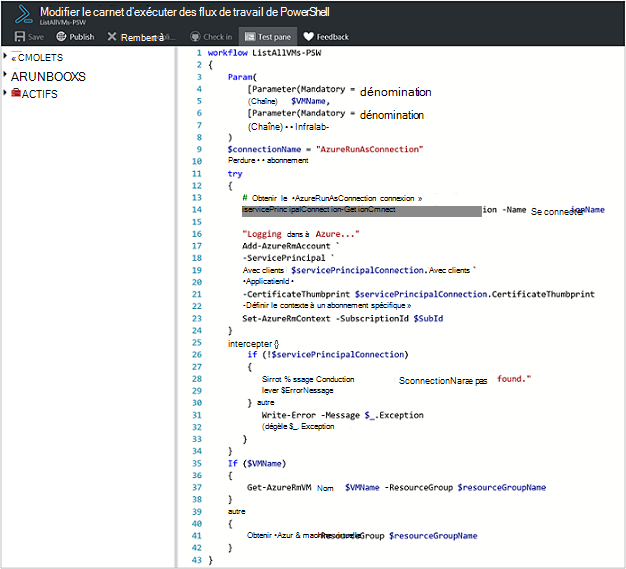
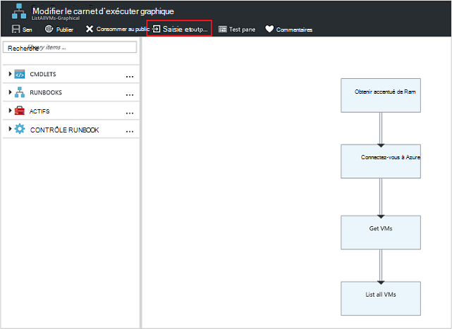
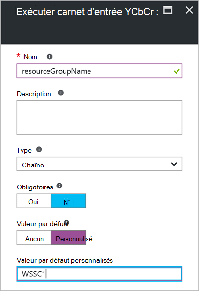
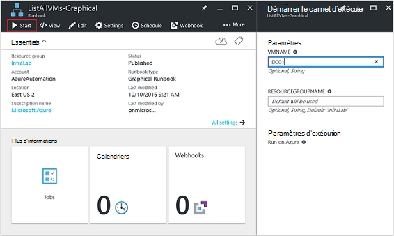
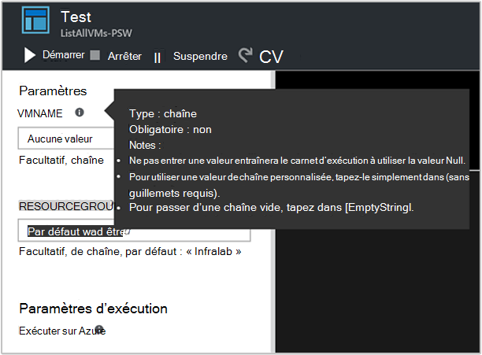
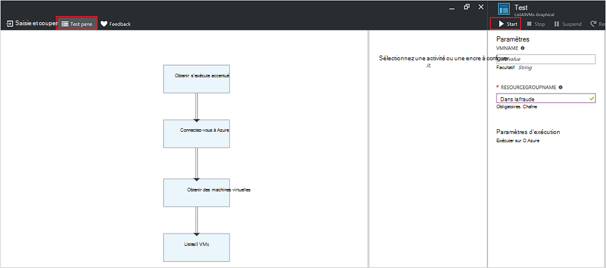
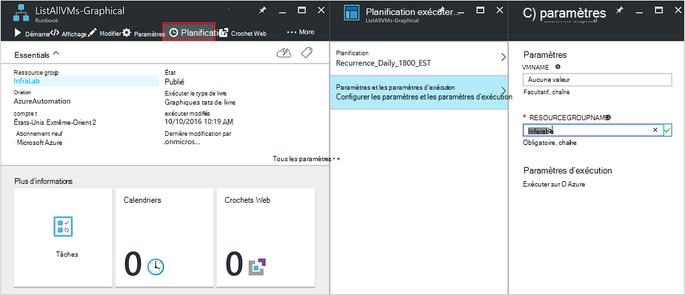
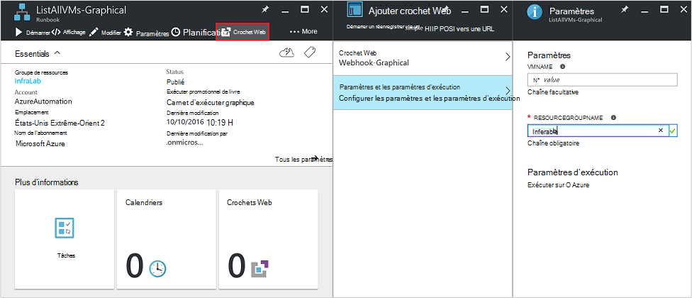
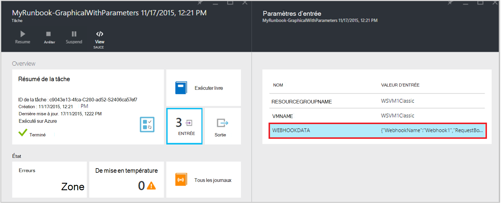

<properties
   pageTitle="Paramètres d’entrée Runbook | Microsoft Azure"
   description="Paramètres d’entrée de procédure opérationnelle augmentent la flexibilité des procédures opérationnelles vous permettant de passer des données à un runbook lorsqu’il est démarré. Cet article décrit les différents scénarios où les paramètres d’entrée sont utilisées dans les procédures opérationnelles."
   services="automation"
   documentationCenter=""
   authors="MGoedtel"
   manager="jwhit"
   editor="tysonn" />
<tags
   ms.service="automation"
   ms.devlang="na"
   ms.topic="article"
   ms.tgt_pltfrm="na"
   ms.workload="infrastructure-services"
   ms.date="10/11/2016"
   ms.author="sngun"/>

# <a name="runbook-input-parameters"></a>Paramètres d’entrée de procédure opérationnelle

Paramètres d’entrée de procédure opérationnelle augmentent la flexibilité des procédures opérationnelles vous permettant de lui passer des données lorsqu’il est démarré. Les paramètres permettent les actions runbook devant être ciblées pour les environnements et des scénarios spécifiques. Dans cet article, nous vous guidera différents scénarios où les paramètres d’entrée sont utilisées dans les procédures opérationnelles.

## <a name="configure-input-parameters"></a>Configurer les paramètres d’entrée

Paramètres d’entrée peuvent être configurées de PowerShell PowerShell le flux de travail et des procédures opérationnelles graphique. Un runbook ne peut avoir plusieurs paramètres avec différents types de données, ou aucune du tout. Paramètres d’entrée peuvent être obligatoire ou facultatif, et vous pouvez affecter une valeur par défaut pour les paramètres facultatifs. Vous pouvez affecter des valeurs pour les paramètres d’entrée pour un runbook lorsque vous démarrez via l’une des méthodes disponibles. Ces méthodes incluent démarrant une runbook à partir du portail ou un service web. Vous pouvez également démarrer une comme un runbook enfant qui est appelé incluse dans une autre procédure opérationnelle.

## <a name="configure-input-parameters-in-powershell-and-powershell-workflow-runbooks"></a>Configurer les paramètres d’entrée dans les procédures opérationnelles PowerShell et flux de travail PowerShell

PowerShell et [flux de travail PowerShell procédures opérationnelles](automation-first-runbook-textual.md) dans Azure Automation prend en charge les paramètres d’entrée définis via les attributs suivants.  

| **Propriété** | **Description** |
|:--- |:---|
| Type | Obligatoire. Le type de données prévu pour la valeur de paramètre. N’importe quel type .NET valide. |
| Nom | Obligatoire. Le nom du paramètre. Il doit être unique au sein de la procédure opérationnelle et peut contenir uniquement des lettres, nombres ou caractères de soulignement. Il doit commencer par une lettre. |
| Obligatoire | Facultatif. Indique si une valeur doit être fournie pour le paramètre. Si vous affectez **$true**, une valeur doit être fournie quand la runbook est démarré. Si vous affectez **$false**, une valeur est facultative. |
| Valeur par défaut | Facultatif.  Spécifie une valeur qui sera utilisée pour le paramètre si une valeur n’est passée au démarrage de la procédure opérationnelle. Une valeur par défaut peut être définie pour n’importe quel paramètre et rendre automatiquement le paramètre facultatif quel que soit le paramètre obligatoire. |

Windows PowerShell prend en charge davantage d’attributs que ceux répertoriés ici, comme validation, alias, et paramètre définit des paramètres d’entrée. Toutefois, Azure Automation prend actuellement en charge uniquement les paramètres d’entrée répertoriés ci-dessus.

Une définition de paramètre dans le flux de travail PowerShell procédures opérationnelles présente comme suit général, dans laquelle plusieurs paramètres sont séparés par des virgules.

   ```
     Param
     (
         [Parameter (Mandatory= $true/$false)]
         [Type] Name1 = <Default value>,

         [Parameter (Mandatory= $true/$false)]
         [Type] Name2 = <Default value>
     )
   ```

>[AZURE.NOTE] Lorsque vous définissez les paramètres, si vous ne spécifiez pas l’attribut **obligatoire** , puis par défaut, le paramètre est considéré comme facultatif. En outre, si vous définissez une valeur par défaut pour un paramètre dans le flux de travail PowerShell procédures opérationnelles, il sera traité par PowerShell comme paramètre facultatif, quelle que soit la valeur de l’attribut **obligatoire** .

Par exemple, nous allons configurer les paramètres d’entrée pour une runbook de flux de travail PowerShell qui affiche plus d’informations sur machines virtuelles, une machine virtuelle unique ou tous les ordinateurs virtuels au sein d’un groupe de ressources. Cette procédure opérationnelle comporte deux paramètres, comme le montre la capture d’écran suivante : le nom de la machine virtuelle et le nom du groupe de ressources.



Dans ce paramètre définition, les paramètres **$VMName** et **$resourceGroupName** sont des paramètres de type string simples. Toutefois, procédures opérationnelles PowerShell et flux de travail PowerShell prend en charge tous les types simples et complexes, tels que **l’objet** ou **PSCredential** paramètres d’entrée.

Si votre runbook comporte un paramètre d’entrée type d’objet, puis utiliser une table de hachage PowerShell de (nom, valeur) paires à passer une valeur. Par exemple, si vous avez le paramètre suivant dans une procédure opérationnelle :

     [Parameter (Mandatory = $true)]
     [object] $FullName

Vous pouvez passer ensuite la valeur suivante pour le paramètre :

    @{"FirstName"="Joe";"MiddleName"="Bob";"LastName"="Smith"}


## <a name="configure-input-parameters-in-graphical-runbooks"></a>Configurer les paramètres d’entrée dans les procédures opérationnelles graphique

Pour [configurer un graphique runbook](automation-first-runbook-graphical.md) avec les paramètres d’entrée, nous allons créer un graphique runbook qui affiche plus d’informations sur machines virtuelles, une machine virtuelle unique ou tous les ordinateurs virtuels au sein d’un groupe de ressources. Configuration d’un runbook se compose de deux principales activités, comme décrit ci-dessous.

[**Procédures opérationnelles authentifier avec Azure exécuter en tant que compte**](automation-sec-configure-azure-runas-account.md) pour vous authentifier avec Azure.

[**Get-AzureRmVm**](https://msdn.microsoft.com/library/mt603718.aspx) pour obtenir les propriétés d’un machines virtuelles.

Vous pouvez utiliser l’activité [**d’Écriture sortie**](https://technet.microsoft.com/library/hh849921.aspx) pour les noms des machines virtuelles de sortie. L’activité **Get-AzureRmVm** accepte les deux paramètres, le **nom de la machine virtuelle** et le **nom de groupe de ressources**. Dans la mesure où ces paramètres peuvent nécessiter différentes valeurs chaque fois que vous démarrez le runbook, vous pouvez ajouter des paramètres d’entrée à votre runbook. Voici les étapes pour ajouter des paramètres d’entrée :

1. Sélectionnez le graphique runbook à partir de la carte de **procédures opérationnelles** , puis sur [**Modifier**](automation-graphical-authoring-intro.md) celle-ci.

2. Dans l’éditeur runbook, cliquez sur **entrée et sortie** pour ouvrir la carte **d’entrée et de sortie** .

    

3. La carte **d’entrée et sortie** affiche une liste des paramètres d’entrée qui sont définis pour la procédure opérationnelle. Dans cette carte, vous pouvez ajouter un paramètre d’entrée ou modifier la configuration d’un paramètre d’entrée existante. Pour ajouter un paramètre pour la procédure opérationnelle, cliquez sur **Ajouter entrée** pour ouvrir la carte de **paramètre d’entrée de procédure opérationnelle** . Là, vous pouvez configurer les paramètres suivants :

  	| **Propriété** | **Description** |
  	|:--- |:---|
  	| Nom | Obligatoire.  Le nom du paramètre. Il doit être unique au sein de la procédure opérationnelle et peut contenir uniquement des lettres, nombres ou caractères de soulignement. Il doit commencer par une lettre. |
  	| Description | Facultatif. Description de l’objectif du paramètre d’entrée. |
  	| Type | Facultatif. Le type de données est prévu pour la valeur de paramètre. Types de paramètres pris en charge sont **chaîne**, **Int32**, **Int64**, **Decimal**, **booléenne**, **DateTime**et **objet**. Si un type de données n’est pas sélectionné, **chaîne**par défaut. |
  	| Obligatoire | Facultatif. Indique si une valeur doit être fournie pour le paramètre. Si vous choisissez **Oui**, une valeur doit être fournie lorsque le runbook est démarré. Si vous choisissez **Aucune**, puis une valeur n’est pas requise lorsque la runbook est démarré et une valeur par défaut peut être définie. |
  	| Valeur par défaut | Facultatif. Spécifie une valeur qui sera utilisée pour le paramètre si une valeur n’est passée au démarrage de la procédure opérationnelle. Une valeur par défaut peut être définie pour un paramètre qui n’est pas obligatoire. Pour définir une valeur par défaut, sélectionnez **personnalisée**. Cette valeur est utilisée à moins d’avoir une autre valeur est fournie lorsque le runbook est démarré. Sélectionnez **Aucun** si vous ne voulez pas fournir une valeur par défaut. |  

    

4. Créez deux paramètres avec les propriétés suivantes qui seront utilisées par l’activité **Get-AzureRmVm** :

    - **Paramètre 1 :**
      - Nom - VMName
      - Type - chaîne
      - Obligatoire : non

    - **Paramètre 2 :**
      - Nom - resourceGroupName
      - Type - chaîne
      - Obligatoire : non
      - Valeur par défaut - personnalisé
      - Valeur par défaut personnalisé - \<nom du groupe de ressources qui contient les machines virtuelles >

5. Une fois que vous ajoutez les paramètres, cliquez sur **OK**.  Vous pouvez maintenant les afficher dans la **entrée et sortie**. Cliquez à nouveau sur **OK** , puis cliquez sur **Enregistrer** et **Publier** votre runbook.

## <a name="assign-values-to-input-parameters-in-runbooks"></a>Affecter des valeurs d’entrer des paramètres dans les procédures opérationnelles

Vous pouvez passer des valeurs pour entrer des paramètres dans les procédures opérationnelles dans les scénarios suivants.

### <a name="start-a-runbook-and-assign-parameters"></a>Démarrer un runbook et affecter des paramètres

Un runbook peut être démarré de plusieurs façons : à partir du portail Azure, avec un webhook, applets de commande PowerShell, avec l’API REST ou avec le Kit de développement. Ci-dessous abordent différentes méthodes de démarrage d’un runbook et d’affecter des paramètres.

#### <a name="start-a-published-runbook-by-using-the-azure-portal-and-assign-parameters"></a>Démarrer un runbook publié à l’aide du portail Azure et affecter des paramètres

Lorsque vous [Démarrez le runbook](automation-starting-a-runbook.md#starting-a-runbook-with-the-azure-portal), la carte **Runbook démarrer** s’ouvre et vous pouvez configurer les valeurs pour les paramètres que vous venez de créer.



Dans l’étiquette située sous la zone d’entrée, vous pouvez voir les attributs qui ont été définies pour le paramètre. Les attributs incluent type obligatoire ou facultatif et la valeur par défaut. Dans l’aide de l’info-bulle en regard du nom du paramètre, vous pouvez voir toutes les informations clés que vous devez prendre des décisions sur les valeurs d’entrée de paramètre. Ces informations comprennent si un paramètre est obligatoire ou facultatif. Il inclut également le type et la valeur par défaut (le cas échéant) et autres notes utiles.



>[AZURE.NOTE] Paramètres de type chaîne prend en charge les valeurs de chaîne **vide** .  Entrer **[chaîne vide]** dans la boîte de paramètre d’entrée passera une chaîne vide pour le paramètre. En outre, les paramètres de type chaîne ne prend en charge les valeurs **Null** passés. Si vous ne passez n’importe quelle valeur pour le paramètre de chaîne, puis PowerShell interprète comme null.

#### <a name="start-a-published-runbook-by-using-powershell-cmdlets-and-assign-parameters"></a>Démarrer un runbook publié à l’aide des applets de commande PowerShell et affecter des paramètres

  - **Applets de commande Gestionnaire de Ressources azure :** Vous pouvez démarrer un runbook Automation qui a été créé dans un groupe de ressources à l’aide de [Démarrer AzureRmAutomationRunbook](https://msdn.microsoft.com/library/mt603661.aspx).

    **Exemple :**

   ```
    $params = @{“VMName”=”WSVMClassic”;”resourceGroupeName”=”WSVMClassicSG”}
 
    Start-AzureRmAutomationRunbook -AutomationAccountName “TestAutomation” -Name “Get-AzureVMGraphical” –ResourceGroupName $resourceGroupName -Parameters $params
   ```

  - **Applets de commande de gestion des services azure :** Vous pouvez démarrer un runbook automation qui a été créé dans un groupe de ressources par défaut à l’aide de [Démarrer AzureAutomationRunbook](https://msdn.microsoft.com/library/dn690259.aspx).

    **Exemple :**

   ```
    $params = @{“VMName”=”WSVMClassic”; ”ServiceName”=”WSVMClassicSG”}

    Start-AzureAutomationRunbook -AutomationAccountName “TestAutomation” -Name “Get-AzureVMGraphical” -Parameters $params
   ```

>[AZURE.NOTE] Lorsque vous démarrez une procédure opérationnelle à l’aide des applets de commande PowerShell, un paramètre par défaut, **MicrosoftApplicationManagementStartedBy** est créé avec la valeur **PowerShell**. Vous pouvez afficher ce paramètre dans la carte de **Détails de la tâche** .  

#### <a name="start-a-runbook-by-using-an-sdk-and-assign-parameters"></a>Démarrer un runbook à l’aide d’un kit de développement et affecter des paramètres

  - **Méthode azure le Gestionnaire de ressources :** Vous pouvez démarrer un runbook à l’aide du Kit de développement d’un langage de programmation. Voici un extrait de code c# pour démarrer une procédure opérationnelle dans votre compte Automation. Vous pouvez afficher tout le code auprès de notre [référentiel GitHub](https://github.com/Azure/azure-sdk-for-net/blob/master/src/ResourceManagement/Automation/Automation.Tests/TestSupport/AutomationTestBase.cs).  

   ```
     public Job StartRunbook(string runbookName, IDictionary<string, string> parameters = null)
        {
          var response = AutomationClient.Jobs.Create(resourceGroupName, automationAccount, new JobCreateParameters
           {
              Properties = new JobCreateProperties
               {
                  Runbook = new RunbookAssociationProperty
                   {
                     Name = runbookName
                   },
                     Parameters = parameters
               }
           });
        return response.Job;
        }
   ```

  - **Méthode de gestion des services azure :** Vous pouvez démarrer un runbook à l’aide du Kit de développement d’un langage de programmation. Voici un extrait de code c# pour démarrer une procédure opérationnelle dans votre compte Automation. Vous pouvez afficher tout le code auprès de notre [référentiel GitHub](https://github.com/Azure/azure-sdk-for-net/blob/master/src/ServiceManagement/Automation/Automation.Tests/TestSupport/AutomationTestBase.cs).

   ```      
    public Job StartRunbook(string runbookName, IDictionary<string, string> parameters = null)
      {
        var response = AutomationClient.Jobs.Create(automationAccount, new JobCreateParameters
      {
        Properties = new JobCreateProperties
           {
             Runbook = new RunbookAssociationProperty
           {
             Name = runbookName
                },
                  Parameters = parameters
                }
         });
        return response.Job;
      }
   ```

  Pour commencer à cette méthode, créez un dictionnaire pour stocker les paramètres runbook, **VMName** **resourceGroupName**et des valeurs correspondantes. Démarrez ensuite la procédure opérationnelle. Voici l’extrait de code c# pour appeler la méthode qui est définie ci-dessus.

   ```
    IDictionary<string, string> RunbookParameters = new Dictionary<string, string>();

    // Add parameters to the dictionary.
    RunbookParameters.Add("VMName", "WSVMClassic");
    RunbookParameters.Add("resourceGroupName", "WSSC1");

    //Call the StartRunbook method with parameters
    StartRunbook(“Get-AzureVMGraphical”, RunbookParameters);
   ```

#### <a name="start-a-runbook-by-using-the-rest-api-and-assign-parameters"></a>Démarrer un runbook à l’aide de l’API REST et affecter des paramètres

Un travail runbook peut être créé et en main de l’API REST de Automation Azure en utilisant la méthode **placer** avec la requête suivante URI.

    https://management.core.windows.net/<subscription-id>/cloudServices/<cloud-service-name>/resources/automation/~/automationAccounts/<automation-account-name>/jobs/<job-id>?api-version=2014-12-08`

Dans la demande URI, remplacez les paramètres suivants :

  - **id de l’abonnement :** Votre ID d’abonnement Azure.  
  - **nom du service cloud :** Le nom du service cloud auquel la demande doit être envoyée.  
  - **nom du compte d’automatisation :** Le nom de votre compte d’automation est hébergé au sein du service de nuage spécifié.  
  - **id de travail :** GUID de la tâche. GUID de PowerShell pouvant être créées à l’aide de la **[GUID]::NewGuid(). ToString()** commande.

Pour passer des paramètres de la tâche runbook, utilisez le corps de la requête. Il accepte les fournies au format JSON deux propriétés suivantes :

  - **Runbook nom :** Obligatoire. Le nom de la procédure opérationnelle pour la tâche démarre.  
  - **Paramètres Runbook :** Facultatif. Un dictionnaire de la liste de (nom, valeur) paramètres en forme où nom doit être de type chaîne et valeur peut être n’importe quelle valeur JSON.

Si vous voulez commencer la runbook **Get-AzureVMTextual** qui a été créée avec **VMName** et **resourceGroupName** en tant que paramètres, utilisez le format JSON suivant pour le corps de la requête.

   ```
    {
      "properties":{
        "runbook":{
        "name":"Get-AzureVMTextual"},
      "parameters":{
         "VMName":"WSVMClassic",
         "resourceGroupName":”WSCS1”}
        }
    }
   ```

Un code d’état HTTP 201 est renvoyé si le travail est créé avec succès. Pour plus d’informations sur les en-têtes de réponse et le corps de réponse, reportez-vous à l’article sur la façon [créer une tâche runbook à l’aide de l’API REST.](https://msdn.microsoft.com/library/azure/mt163849.aspx)

### <a name="test-a-runbook-and-assign-parameters"></a>Tester une procédure opérationnelle et affecter des paramètres

Lorsque vous [Testez la version brouillon de votre runbook](automation-testing-runbook.md) à l’aide de l’option de test, la carte **de Test** s’ouvre et vous pouvez configurer les valeurs pour les paramètres que vous venez de créer.



### <a name="link-a-schedule-to-a-runbook-and-assign-parameters"></a>Lier un calendrier à un runbook et affecter des paramètres

Vous pouvez [attacher une planification](automation-schedules.md) à votre runbook afin que le runbook commence à un moment donné. Affecter des paramètres d’entrée lorsque vous avez créé l’Échéancier, et le runbook utilisera ces valeurs lorsqu’il est démarré par la planification. Vous ne pouvez pas enregistrer l’échéancier jusqu'à ce que toutes les valeurs de paramètre obligatoire sont fournis.



### <a name="create-a-webhook-for-a-runbook-and-assign-parameters"></a>Créer un webhook pour une procédure opérationnelle et affecter des paramètres

Vous pouvez créer un [webhook](automation-webhooks.md) pour votre runbook et configurer les paramètres d’entrée de procédure opérationnelle. Vous ne pouvez pas enregistrer le webhook jusqu'à ce que toutes les valeurs de paramètre obligatoire sont fournis.



Lorsque vous exécutez une procédure opérationnelle à l’aide d’un webhook, le paramètre d’entrée prédéfini **[Webhookdata](automation-webhooks.md#details-of-a-webhook)** est envoyé, ainsi que les paramètres d’entrée que vous avez défini. Vous pouvez cliquer pour développer le paramètre **WebhookData** pour plus d’informations.




## <a name="next-steps"></a>Étapes suivantes

- Pour plus d’informations sur runbook entrée et sortie, voir [Azure automatisation : runbook d’entrée, de sortie et procédures opérationnelles imbriquées](https://azure.microsoft.com/blog/azure-automation-runbook-input-output-and-nested-runbooks/).
- Pour plus d’informations sur les différentes façons de démarrer une procédure opérationnelle, voir [démarrage d’un runbook](automation-starting-a-runbook.md).
- Pour modifier un runbook textuel, reportez-vous à [procédures opérationnelles textuel édition](automation-edit-textual-runbook.md).
- Pour modifier un graphique runbook, reportez-vous à [la création de graphique dans Azure Automation](automation-graphical-authoring-intro.md).
