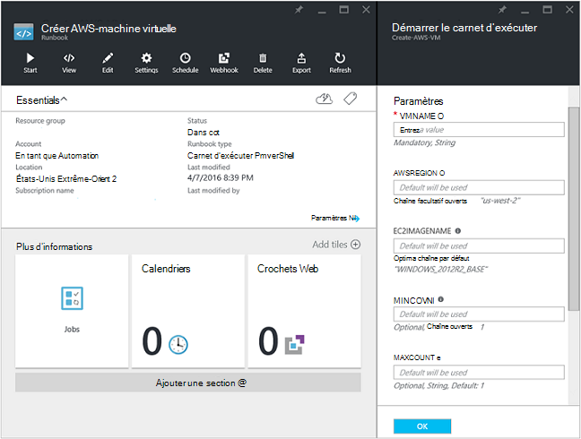

<properties
   pageTitle="Automatisation du déploiement d’un ordinateur virtuel dans les Services Web Amazon | Microsoft Azure"
   description="Cet article explique comment utiliser Automation Azure pour automatiser la création d’un Service de Web Amazon machine virtuelle"
   services="automation"
   documentationCenter=""
   authors="mgoedtel"
   manager="jwhit"
   editor="" />
<tags
   ms.service="automation"
   ms.devlang="na"
   ms.topic="article"
   ms.tgt_pltfrm="na"
   ms.workload="na"
   ms.date="08/17/2016"
   ms.author="tiandert; bwren" />

# <a name="azure-automation-scenario---provision-an-aws-virtual-machine"></a>Scénario d’automatisation Azure - disposition une machine virtuelle AWS 

Dans cet article, nous vous montrer comment vous pouvez tirer parti d’automatisation Azure afin de configurer une machine virtuelle dans votre abonnement Amazon Web Service (AWS), puis nommez ce machine virtuelle spécifique – qui AWS fait référence à la machine virtuelle « balisage ».

## <a name="prerequisites"></a>Conditions préalables

Aux fins de cet article, vous devez disposer d’un compte Azure Automation et un abonnement AWS. Pour plus d’informations sur la configuration d’un compte Azure Automation et configurez-le avec vos informations d’identification d’abonnement AWS, consultez [Configurer l’authentification avec les Services Web Amazon](../automation/automation-sec-configure-aws-account.md).  Ce compte doit être créé ou mis à jour avec vos informations d’identification AWS abonnement avant de poursuivre, comme nous font référence à ce compte dans les étapes ci-dessous.


## <a name="deploy-amazon-web-services-powershell-module"></a>Déployer Amazon Web Services PowerShell Module

Notre machine virtuelle runbook de mise en service exploiter les le module AWS PowerShell pour effectuer son travail. Procédez comme suit pour ajouter le module à votre compte de Automation est configuré avec vos informations d’identification AWS abonnement.  

1. Ouvrez votre navigateur web et accédez à la [Galerie de PowerShell](http://www.powershellgallery.com/packages/AWSPowerShell/) et cliquez sur la **déployer au bouton automatisation Azure**.<br> 

2. Vous accédez à la page de connexion Azure et après l’authentification, vous sont routés vers le portail Azure et présentés avec la carte suivante.<br> 

3. Sélectionnez le groupe de ressources à partir de la liste déroulante **Groupe de ressources** et sur la carte de paramètres, entrez les informations suivantes :
   * Dans la liste déroulante **Nouveau ou existant Automation compte (chaîne)** sélectionnez **existant**.  
   * Dans la zone **Nom de compte Automation (chaîne)** , tapez le nom du compte Automation qui inclut les informations d’identification pour votre abonnement AWS exact.  Par exemple, si vous avez créé un compte dédié nommé **AWSAutomation**, qui est ce que vous tapez dans la zone.
   * Sélectionnez la région appropriée dans la liste déroulante **Automation compte** .

4. Lorsque vous avez terminé d’entrer les informations requises, cliquez sur **créer**.

    >[AZURE.NOTE]Bien que l’importation un module PowerShell dans Azure automatisation, il est également extraire les applets de commande et ces activités n’apparaîtront pas tant que le module soit complètement terminé l’importation et extraire les applets de commande. Ce processus peut prendre quelques minutes.  
<br>
5. Dans le portail Azure, ouvrez votre compte Automation référencée à l’étape 3.
6. Cliquez sur la vignette de **biens** , sur la carte **actifs** , sélectionnez la vignette de **Modules** .
7. Sur la carte de **Modules** , vous verrez le module **AWSPowerShell** dans la liste.

## <a name="create-aws-deploy-vm-runbook"></a>Créer AWS déployer runbook machine virtuelle

Une fois que le PowerShell Module AWS a été déployé, nous pouvons maintenant créer un runbook pour automatiser une machine virtuelle dans AWS à l’aide d’un script PowerShell. Les étapes ci-dessous va vous montrer comment tirer parti de script PowerShell natif dans Azure Automation.  

>[AZURE.NOTE] Pour plus d’options et d’informations sur ce script, visitez la [Galerie de PowerShell](https://www.powershellgallery.com/packages/New-AwsVM/DisplayScript).


1. Téléchargez le script PowerShell New-AwsVM à partir de la galerie de PowerShell en ouvrant une session PowerShell et en tapant ce qui suit :<br>
   ```
   Save-Script -Name New-AwsVM -Path \<path\>
   ```
<br>
2. À partir du portail Azure, ouvrez votre compte Automation et cliquez sur la vignette de **procédures opérationnelles** .  
3. À partir de la carte de **procédures opérationnelles** , sélectionnez **Ajouter une procédure opérationnelle**.
4. Dans la carte **Ajouter une procédure opérationnelle** , sélectionnez **Création rapide** (créer un nouveau runbook).
5. Sur la carte de propriétés **Runbook** , tapez un nom dans la zone nom pour votre runbook et du **Runbook type** de liste déroulante, sélectionnez **PowerShell**, puis cliquez sur **créer**.<br> 
6. Lorsque la carte modifier PowerShell Runbook s’affiche, copiez et collez le script PowerShell dans la runbook de zone de dessin.<br> <br>

    >[AZURE.NOTE] Notez les points suivants lorsque vous travaillez avec l’exemple de script PowerShell :
    >
    > - La procédure opérationnelle contient un nombre de valeurs de paramètre par défaut. Veuillez évaluer toutes les valeurs par défaut et mettre à jour le cas échéant.
    > - Si vous avez enregistré vos informations d’identification AWS comme une ressource d’informations d’identification de la même façon que **AWScred**, vous devrez mettre à jour le script de ligne 57 pour mettre en correspondance en conséquence.  
    > - Lorsque vous travaillez avec les commandes AWS CLI dans PowerShell, en particulier avec runbook de cet exemple, vous devez spécifier la région AWS. Dans le cas contraire, les applets de commande échouera.  Afficher la rubrique AWS [Spécifier AWS région](http://docs.aws.amazon.com/powershell/latest/userguide/pstools-installing-specifying-region.html) dans les outils AWS pour document PowerShell pour plus d’informations.  
<br>
7. Pour récupérer une liste de noms d’images de votre abonnement AWS, lancez PowerShell ISE et importer le PowerShell Module AWS.  S’authentifier AWS en remplaçant **Get-AutomationPSCredential** dans votre environnement ISE **AWScred = Get-Credential**.  Cela vous invite à entrer vos informations d’identification et vous pouvez fournir votre **ID de touche d’accès** pour le nom d’utilisateur et une **Touche d’accès rapide Secret** pour le mot de passe.  Voir l’exemple ci-dessous :

        #Sample to get the AWS VM available images
        #Please provide the path where you have downloaded the AWS PowerShell module
        Import-Module AWSPowerShell
        $AwsRegion = "us-west-2"
        $AwsCred = Get-Credential
        $AwsAccessKeyId = $AwsCred.UserName
        $AwsSecretKey = $AwsCred.GetNetworkCredential().Password

        # Set up the environment to access AWS
        Set-AwsCredentials -AccessKey $AwsAccessKeyId -SecretKey $AwsSecretKey -StoreAs AWSProfile
        Set-DefaultAWSRegion -Region $AwsRegion

        Get-EC2ImageByName -ProfileName AWSProfile
   Le résultat suivant :<br>
     
8. Copiez et collez l’un des noms d’images dans une variable Automation comme indiqué dans la procédure opérationnelle en tant que **$InstanceType**. Étant donné que dans cet exemple, nous sommes à l’aide de l’AWS gratuit hiérarchisé abonnement, nous allons utiliser **t2.micro** dans notre exemple runbook.
9. Enregistrer le runbook, puis cliquez sur **Publier** pour publier le runbook, puis sur **Oui** lorsque vous y êtes invité.


### <a name="testing-the-aws-vm-runbook"></a>Test de la procédure opérationnelle AWS VM
Avant de poursuivre avec la runbook des tests, nous avons besoin de vérifier les points suivants. Plus précisément :

   -  Un bien pour l’authentification par rapport à AWS a été créé appelé **AWScred** ou le script a été mis à jour pour faire référence au nom de vos ressources les informations d’identification.  
   -  Le module PowerShell AWS a été importé dans Azure Automation
   -  Un nouveau runbook a été créée et valeurs de paramètre ont été vérifiés et mis à jour le cas échéant
   -  **Enregistrements détaillées du journal** et éventuellement des **enregistrements du journal de l’avancement** sous la runbook définition de **journalisation et le suivi** ont été définies sur **activé**.<br> 

1. Nous voulons démarrer la procédure opérationnelle, cliquez sur **Démarrer** , puis sur **OK** lorsque la carte Runbook démarrer s’ouvre.
2. Sur la carte Runbook Démarrer, fournissent une **VMname**.  Acceptez les valeurs par défaut pour les autres paramètres que vous avez préconfiguré dans le script.  Cliquez sur **OK** pour démarrer le travail runbook.<br> 
3. Un volet de travail est ouvert pour le travail runbook que nous venez de créer. Fermer ce volet.
4. Nous pouvons visualiser l’avancement de la tâche et affichage de sortie **flux** en sélectionnant la vignette de **Tous les journaux** à partir de la carte de projet runbook.<br> 
5. Pour confirmer que la machine virtuelle est en cours de mise en service, connectez-vous à la Console de gestion AWS si vous n’êtes pas actuellement connecté.<br> 

## <a name="next-steps"></a>Étapes suivantes
-   Pour commencer à utiliser les procédures opérationnelles graphiques, voir [Mon premier runbook de graphique](automation-first-runbook-graphical.md)
-   Pour commencer à utiliser les procédures opérationnelles de flux de travail de PowerShell, voir [Mon premier runbook de flux de travail PowerShell](automation-first-runbook-textual.md)
-   Pour en savoir plus sur les limitations, leurs avantages et runbook types, voir [types de runbook Automation Azure](automation-runbook-types.md)
-   Pour plus d’informations sur le script PowerShell prend en charge la fonctionnalité, voir [script PowerShell Native prend en charge dans Azure Automation](https://azure.microsoft.com/blog/announcing-powershell-script-support-azure-automation-2/)
