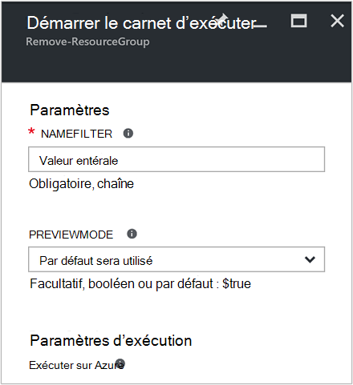
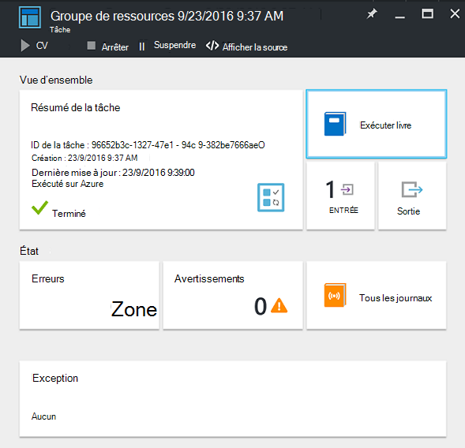
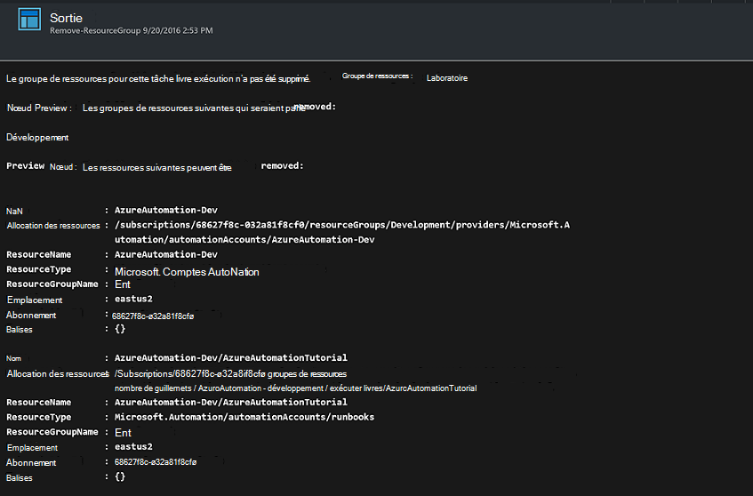

<properties
    pageTitle="Automatiser la suppression des groupes de ressources | Microsoft Azure"
    description="Version du flux de travail PowerShell d’un scénario Automatisation Azure, y compris les procédures opérationnelles pour supprimer tous les groupes de ressources dans votre abonnement."
    services="automation"
    documentationCenter=""
    authors="MGoedtel"
    manager="jwhit"
    editor=""
    />
<tags
    ms.service="automation"
    ms.workload="tbd"
    ms.tgt_pltfrm="na"
    ms.devlang="na"
    ms.topic="get-started-article"
    ms.date="09/26/2016"
    ms.author="magoedte"/>

# Scénario d’automatisation Azure - automatiser suppression des groupes de ressources

De nombreux clients créent plus d’un groupe de ressources. Certaines peuvent être utilisées pour gérer les applications de production, et d’autres personnes peuvent être utilisées comme développement, test et mise en environnements. Automatiser le déploiement de ces ressources est le seul endroit, mais ne pourrez plus retirer un groupe de ressources avec un clic sur le bouton est une autre. Vous pouvez simplifier cette tâche de gestion courantes à l’aide de Automation Azure. Cette opération est utile si vous travaillez avec un abonnement Azure qui a une limite de dépense une offre membre comme MSDN ou le programme Microsoft Partner Network Cloud Essentials.

Ce scénario est basé sur un runbook PowerShell et est conçu pour supprimer un ou plusieurs groupes de ressources que vous spécifiez à partir de votre abonnement. Le paramètre par défaut de la procédure opérationnelle consiste à tester avant de poursuivre. Cela garantit que vous ne supprimiez accidentellement le groupe de ressources avant que vous êtes prêt à effectuer cette procédure.   

## Prise le scénario

Ce scénario est constitué par un runbook PowerShell que vous pouvez télécharger à partir de la [Galerie de PowerShell](https://www.powershellgallery.com/packages/Remove-ResourceGroup/1.0/DisplayScript). Vous pouvez également importer directement à partir de la [Galerie de Runbook](automation-runbook-gallery.md) dans le portail Azure.  

Runbook | Description|
----------|------------|
Supprimer ResourceGroup | Supprime un ou plusieurs groupes de ressources Azure et ressources associées de l’abonnement.  
 
Les paramètres d’entrée suivants sont définis pour cette runbook :

Paramètre | Description|
----------|------------|
NameFilter (obligatoire) | Spécifie un filtre de nom pour limiter les groupes de ressources que vous prévoyez de suppression. Vous pouvez passer plusieurs valeurs à l’aide d’une liste séparée par des virgules. Le filtre n’est pas sensible à la casse et correspondra à n’importe quel groupe de ressources qui contient la chaîne.|
PreviewMode (facultatif) | Exécute la procédure opérationnelle pour afficher les groupes de ressources seraient être supprimés, mais n’effectue aucune action. La valeur par défaut est **Vrai** afin d’éviter toute suppression accidentelle d’un ou plusieurs groupes de ressources passé à la procédure opérationnelle.  

## Installer et configurer ce scénario

### Conditions préalables

Cette procédure opérationnelle authentifie [Azure exécuter en tant que compte](automation-sec-configure-azure-runas-account.md).    

### Installer et publier les procédures opérationnelles

Après avoir téléchargé le runbook, vous pouvez l’importer à l’aide de la procédure dans [les procédures runbook importation](automation-creating-importing-runbook.md#importing-a-runbook-from-a-file-into-Azure-Automation). Publier le runbook après que qu’il a été importé avec succès dans votre compte Automation.

## À l’aide de la procédure opérationnelle

Les étapes suivantes vous guidera tout au long de l’exécution de cette procédure opérationnelle et vous familiariser avec le fonctionnement de l’aide. Vous sera uniquement tester la runbook dans cet exemple, ne sont pas supprimer le groupe de ressources.  

1. À partir du portail Azure, ouvrez votre compte automatisation, puis cliquez sur **procédures opérationnelles**.
2. Sélectionnez le runbook **ResourceGroup de supprimer** , puis cliquez sur **Démarrer**.
3. Lorsque vous démarrez le runbook, la carte **Runbook démarrer** s’ouvre et vous pouvez configurer les paramètres. Entrez les noms des groupes de ressources dans votre abonnement que vous pouvez utiliser pour tester et entraîne sans incidence si accidentellement supprimé.  

    >[AZURE.NOTE] Vérifiez que **Previewmode** est défini sur **true** pour éviter de supprimer les groupes de ressources sélectionné.  **Notez** que cette procédure opérationnelle ne supprime pas le groupe de ressources qui contient le compte d’automatisation qui exécute cette procédure opérationnelle.  

4. Après avoir configuré le paramètre toutes les valeurs, cliquez sur **OK**et la runbook file d’attente pour l’exécution.  

Pour afficher les détails de la tâche runbook **Supprimer ResourceGroup** dans le portail Azure, sélectionnez **tâches** dans la procédure opérationnelle. La tâche récapitulative affiche les paramètres d’entrée et le flux de sortie en plus des informations générales sur la tâche et les exceptions qui se sont produites.  .

**Résumé de la tâche** inclut les messages à partir de la sortie, d’avertissement et erreur flux de données. Sélectionnez **sortie** pour afficher les résultats détaillés à partir de l’exécution de runbook.  

## Étapes suivantes

- Pour commencer à créer votre propre runbook, voir [Création ou en important un runbook dans Azure Automation](automation-creating-importing-runbook.md).
- Pour commencer à utiliser les procédures opérationnelles de flux de travail PowerShell, voir [Mon premier runbook de flux de travail PowerShell](automation-first-runbook-textual.md).
