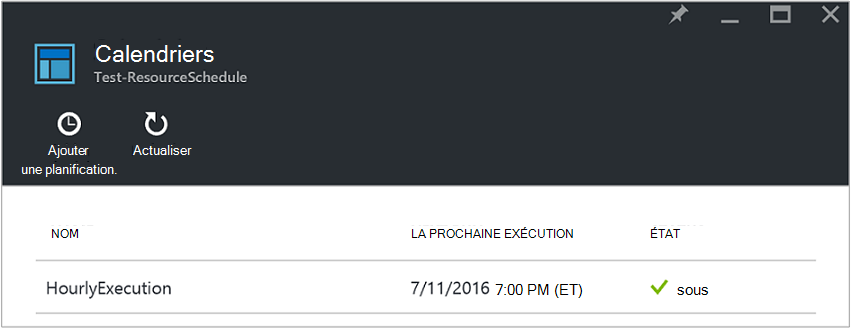
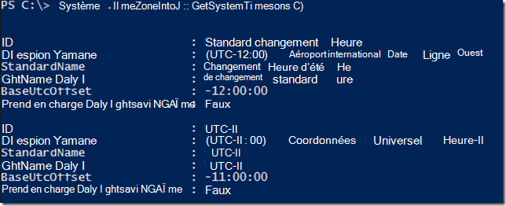
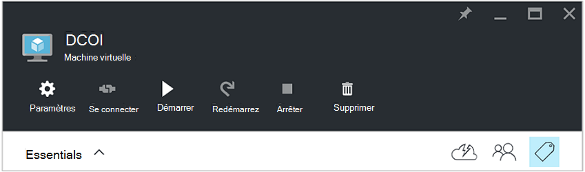
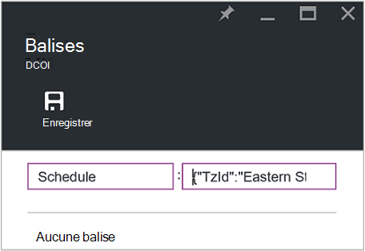
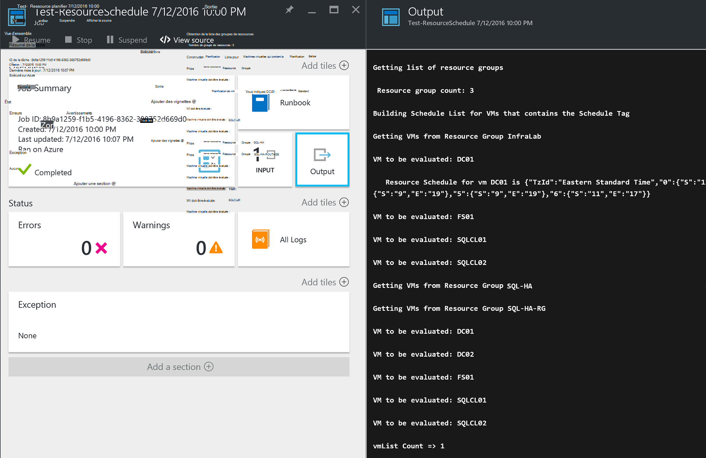

<properties
   pageTitle="Utilisation de balises au format JSON pour créer une planification pour machine virtuelle Azure démarrage et d’arrêt | Microsoft Azure"
   description="Cet article explique comment utiliser des chaînes JSON balises pour automatiser la planification de la machine virtuelle démarrage et l’arrêt."
   services="automation"
   documentationCenter=""
   authors="MGoedtel"
   manager="jwhit"
   editor="tysonn" />
<tags
   ms.service="automation"
   ms.devlang="na"
   ms.topic="article"
   ms.tgt_pltfrm="na"
   ms.workload="infrastructure-services"
   ms.date="07/18/2016"
   ms.author="magoedte;paulomarquesc" />

# Scénario d’automatisation Azure : utilisation de balises au format JSON pour créer une planification pour machine virtuelle Azure démarrage et d’arrêt

Les clients souhaitent planifier le démarrage et arrêt des machines virtuelles afin de réduire les coûts d’abonnement ou une assistance technique impératifs commerciaux et techniques.  

Le scénario suivant vous permet de configurer de démarrage automatique et d’arrêt de vos ordinateurs virtuels en utilisant une balise appelée planification à un niveau de groupe de ressources ou machine virtuelle dans Azure. Ce calendrier peut être configuré avec un démarrage et un temps d’arrêt du dimanche à samedi.  

Nous avons certaines options de l’emploi. Parmi lesquels :
-  [Machine virtuelle échelle définit](../virtual-machine-scale-sets/virtual-machine-scale-sets-overview.md) les paramètres d’échelle automatique qui vous permettent de mettre à l’échelle ou l’arrière.
- [Ateliers DevTest](../devtest-lab/devtest-lab-overview.md) service, qui comporte la fonctionnalité intégrée de la planification des opérations de démarrage et d’arrêt.

Toutefois, ces options ne prennent en charge des scénarios spécifiques et ne peuvent pas être appliqués aux machines virtuelles infrastructure-as-a-service (IaaS).   

Lorsque la balise de planification est appliquée à un groupe de ressources, il est également appliqué à toutes les machines virtuelles à l’intérieur de ce groupe de ressources. Si une planification est également directement appliquée à une machine virtuelle, l’échéancier dernière est prioritaire dans l’ordre suivant :

1.  Planification appliquée à un groupe de ressources
2.  Planification appliquée à un groupe de ressources et machine virtuelle dans le groupe de ressources
3.  Planification appliquée à une machine virtuelle

Ce scénario essentiellement prend une chaîne JSON avec une mise en forme spécifiée et l’ajoute comme la valeur d’une balise appelée planification. Ensuite un runbook répertorie tous les groupes de ressources et machines virtuelles et identifie les planifications pour chaque machine virtuelle basée sur les scénarios répertoriés ci-dessus. Ensuite, il parcourt les ordinateurs virtuels qui ont des planifications jointes et évalue les actions à entreprendre. Par exemple, elle détermine les machines virtuelles doivent être arrêté, arrêter ou ignorées.

Ces procédures opérationnelles s’authentifier à l’aide du [compte Azure exécuter en tant que](../automation/automation-sec-configure-azure-runas-account.md).

## Télécharger les procédures opérationnelles pour le scénario

Ce scénario est constitué de quatre procédures opérationnelles PowerShell le flux de travail que vous pouvez télécharger à partir de la [Galerie TechNet](https://gallery.technet.microsoft.com/Azure-Automation-Runbooks-84f0efc7) ou le référentiel [GitHub](https://github.com/paulomarquesdacosta/azure-automation-scheduled-shutdown-and-startup) pour ce projet.

Runbook | Description
----------|----------
Test-ResourceSchedule | Vérifie chaque tableau machine virtuelle et effectue arrêt ou démarrage selon l’échéancier.
ResourceSchedule ajouter | Ajoute la balise de planification à un groupe machine virtuelle ou une ressource.
Mise à jour ResourceSchedule | Modifie la balise de planification existante en le remplaçant par une nouvelle.
Supprimer ResourceSchedule | Supprime la balise de planification d’un groupe machine virtuelle ou une ressource.

## Installer et configurer ce scénario

### Installer et publier les procédures opérationnelles

Après avoir téléchargé les procédures opérationnelles, vous pouvez les importer à l’aide de la procédure de [Création ou importer un runbook dans Azure Automation](automation-creating-importing-runbook.md#importing-a-runbook-from-a-file-into-Azure-Automation).  Publier chaque runbook après que qu’il a été importé avec succès dans votre compte Automation.

### Ajouter un calendrier à le runbook de Test ResourceSchedule

Procédez comme suit pour activer la planification de la procédure de Test ResourceSchedule opérationnelle. Il s’agit du runbook qui vérifie les machines virtuelles doivent être démarrés, arrêter ou laissés tel quel.

1. À partir du portail Azure, ouvrez votre compte automatisation, puis cliquez sur la vignette de **procédures opérationnelles** .
2. Dans la carte de **Test ResourceSchedule** , cliquez sur la vignette **planifications** .
3. Dans la carte de **calendriers** , cliquez sur **Ajouter un calendrier**.
4. Dans la carte de **calendriers** , sélectionnez **lien une planification pour votre runbook**. Sélectionnez **créer un planning**.
5.  Sur la carte de **planning** , tapez le nom de ce calendrier, par exemple : *HourlyExecution*.
6. Pour la planification de **début**, définir l’heure de début un incrément heure.
7. Sélectionnez **périodicité**, puis pour **se répète chaque intervalle**, **1 heure**.
8. Vérifiez que **l’expiration du jeu** est définie sur **non**, puis cliquez sur **créer** pour enregistrer votre planning.
9. Dans la carte d’options **Runbook de planification** , sélectionnez **paramètres et les paramètres d’exécution**. Dans la carte de Test ResourceSchedule **paramètres** , entrez le nom de votre abonnement dans le champ **SubscriptionName** .  Il s’agit du seul paramètre requis pour la runbook.  Lorsque vous avez terminé, cliquez sur **OK**.  

L’échéancier runbook doit ressembler à ce qui suit lorsqu’elle est terminée :

 

## Mettre en forme de la chaîne JSON

Cette solution fondamentalement prend une JSON de chaîne avec une mise en forme spécifiée et l’ajoute comme la valeur d’une balise appelé planification. Puis un runbook répertorie tous les groupes de ressources et des machines virtuelles et identifie les planifications pour chaque machine virtuelle.

La procédure opérationnelle effectue une boucle sur les ordinateurs virtuels qui ont des planifications jointes et vérifie les actions à effectuer. Voici un exemple de la façon dont les solutions doivent être mis en forme :

    {
       "TzId": "Eastern Standard Time",
        "0": {  
           "S": "11",
           "E": "17"
        },
        "1": {
           "S": "9",
           "E": "19"
        },
        "2": {
           "S": "9",
           "E": "19"
        },
    }

Voici certains des informations détaillées sur cette structure :

1. Le format de cette structure JSON est optimisé pour contourner la limite de 256 caractères d’une valeur unique balise dans Azure.

2. *TzId* représente le fuseau horaire de la machine virtuelle. Cet identifiant peut être obtenu à l’aide de la classe TimeZoneInfo .NET dans une session PowerShell--**[System.TimeZoneInfo] :: GetSystemTimeZones()**.

    

    - Les jours ouvrés sont représentés par une valeur numérique zéro à six. La valeur zéro est égale à dimanche.
    - L’heure de début est représenté avec l’attribut **S** , et sa valeur est dans un format 24 heures.
    - L’heure de fin ou arrêt est représenté avec l’attribut **E** et sa valeur est dans un format 24 heures.

    Si les attributs **d** et **E** ont une valeur zéro (0), la machine virtuelle restera dans son état actuel au moment de l’évaluation.   

3. Si vous souhaitez ignorer l’évaluation pour un jour spécifique de la semaine, ne pas ajouter une section pour ce jour de la semaine. Dans l’exemple suivant, lundi uniquement est évaluée et les autres jours de la semaine sont ignorés :

        {
          "TzId": "Eastern Standard Time",
           "1": {
             "S": "11",
             "E": "17"
           }
        }

## Groupes de ressources de balise ou machines virtuelles

Pour arrêter machines virtuelles, vous devez baliser les ordinateurs virtuels ou les groupes de ressources dans lequel ils se trouvent. Machines virtuelles qui n’ont pas un indicateur de planification ne sont pas évaluées. Par conséquent, ils ne sont pas démarrés ou arrêtés.

Il existe deux façons de groupes de ressources de balise ou machines virtuelles grâce à cette solution. Vous pouvez le faire directement à partir du portail. Ou vous pouvez utiliser les ajouter ResourceSchedule, ResourceSchedule de mise à jour et supprimer ResourceSchedule procédures opérationnelles.

### Ajouter des balises à partir du portail

Suivez ces étapes pour ajouter des balises à un ordinateur virtuel ou le groupe de ressources dans le portail :

1. Fusionner la chaîne JSON et vérifiez qu’il n’existe pas d’espace.  Votre chaîne JSON doit ressembler à ceci :

        {"TzId":"Eastern Standard Time","0":{"S":"11","E":"17"},"1":{"S":"9","E":"19"},"2": {"S":"9","E":"19"},"3":{"S":"9","E":"19"},"4":{"S":"9","E":"19"},"5":{"S":"9","E":"19"},"6":{"S":"11","E":"17"}}

2. Sélectionnez l’icône **balise** pour un groupe machine virtuelle ou une ressource à appliquer ce calendrier.

    
3. Suivre une paire clé/valeur sont définies les balises. Tapez **Échéancier** dans le champ de **clé** , puis collez la chaîne JSON dans le champ de **valeur** . Cliquez sur **Enregistrer**. Votre nouvelle balise doit maintenant apparaître dans la liste des indicateurs pour la ressource.

### Balise à partir de PowerShell

Toutes les procédures opérationnelles importés contiennent des informations d’aide au début du script qui décrit comment exécuter les procédures opérationnelles directement à partir de PowerShell. Vous pouvez appeler les procédures opérationnelles ajouter ScheduleResource et ScheduleResource de mise à jour à partir de PowerShell. Pour cela, en passant les paramètres requis qui vous permettent de créer ou mettre à jour de la balise de planning sur un groupe machine virtuelle ou ressources en dehors du portail.  

Pour créer, ajouter et supprimer des balises via PowerShell, vous devez tout d’abord [configurer votre environnement PowerShell pour Azure](../powershell-install-configure.md). Une fois l’installation terminée, vous pouvez procéder aux étapes suivantes.

### Créer un indicateur de planning avec PowerShell

1. Ouvrez une session PowerShell. Utilisez ensuite l’exemple suivant pour vous authentifier avec votre compte Exécuter en tant qu’et pour spécifier un abonnement :   

        Conn = Get-AutomationConnection -Name AzureRunAsConnection
        Add-AzureRMAccount -ServicePrincipal -Tenant $Conn.TenantID `
        -ApplicationId $Conn.ApplicationID -CertificateThumbprint $Conn.CertificateThumbprint
        Select-AzureRmSubscription -SubscriptionName "MySubscription"

2. Définir une table de hachage Échéancier. Voici un exemple de la manière dont elle doit être créée :

        $schedule= @{ "TzId"="Eastern Standard Time"; "0"= @{"S"="11";"E"="17"};"1"= @{"S"="9";"E"="19"};"2"= @{"S"="9";"E"="19"};"3"= @{"S"="9";"E"="19"};"4"= @{"S"="9";"E"="19"};"5"= @{"S"="9";"E"="19"};"6"= @{"S"="11";"E"="17"}}

3. Définir les paramètres qui sont requis par la procédure opérationnelle. Dans l’exemple suivant, nous prévoyons une machine virtuelle :

        $params = @{"SubscriptionName"="MySubscription";"ResourceGroupName"="ResourceGroup01"; `
        "VmName"="VM01";"Schedule"=$schedule}

    Si vous êtes balisage d’un groupe de ressources, supprimez le paramètre *VMName* à partir de la table de hachage $params comme suit :

        $params = @{"SubscriptionName"="MySubscription";"ResourceGroupName"="ResourceGroup01"; `
        "Schedule"=$schedule}

4. Exécuter la procédure Ajouter ResourceSchedule opérationnelle avec les paramètres suivants pour créer la balise de planification :

        Start-AzureRmAutomationRunbook -Name "Add-ResourceSchedule" -Parameters $params `
        -AutomationAccountName "AutomationAccount" -ResourceGroupName "ResourceGroup01"

5. Pour mettre à jour un groupe de ressources ou une balise de machine virtuelle, exécutez la procédure de **Mise à jour ResourceSchedule** opérationnelle avec les paramètres suivants :

        Start-AzureRmAutomationRunbook -Name "Update-ResourceSchedule" -Parameters $params `
        -AutomationAccountName "AutomationAccount" -ResourceGroupName "ResourceGroup01"

### Supprimer un indicateur de planning avec PowerShell

1. Ouvrez une session PowerShell et exécutez la procédure suivante pour vous authentifier avec votre compte Exécuter en tant qu’et pour sélectionner et spécifier un abonnement :

        Conn = Get-AutomationConnection -Name AzureRunAsConnection
        Add-AzureRMAccount -ServicePrincipal -Tenant $Conn.TenantID `
        -ApplicationId $Conn.ApplicationID -CertificateThumbprint $Conn.CertificateThumbprint
        Select-AzureRmSubscription -SubscriptionName "MySubscription"

2. Définir les paramètres qui sont requis par la procédure opérationnelle. Dans l’exemple suivant, nous prévoyons une machine virtuelle :

        $params = @{"SubscriptionName"="MySubscription";"ResourceGroupName"="ResourceGroup01" `
        ;"VmName"="VM01"}

    Si vous supprimez une balise à partir d’un groupe de ressources, supprimez le paramètre *VMName* à partir de la table de hachage $params comme suit :

        $params = @{"SubscriptionName"="MySubscription";"ResourceGroupName"="ResourceGroup01"}

3. Exécuter la runbook ResourceSchedule-supprimer pour supprimer l’indicateur de planification :

        Start-AzureRmAutomationRunbook -Name "Remove-ResourceSchedule" -Parameters $params `
        -AutomationAccountName "AutomationAccount" -ResourceGroupName "ResourceGroup01"

4. Pour mettre à jour un groupe de ressources ou une balise de machine virtuelle, exécutez la procédure de suppression ResourceSchedule opérationnelle avec les paramètres suivants :

        Start-AzureRmAutomationRunbook -Name "Remove-ResourceSchedule" -Parameters $params `
        -AutomationAccountName "AutomationAccount" -ResourceGroupName "ResourceGroup01"

>[AZURE.NOTE] Nous vous recommandons surveiller le fait ces procédures opérationnelles (et les États machine virtuelle) pour vérifier que vos ordinateurs virtuels sont en cours d’arrêt vers le bas et mise en route en conséquence.  

Pour afficher les détails de la tâche runbook Test ResourceSchedule dans le portail Azure, sélectionnez la vignette de **travaux** de la procédure opérationnelle. La tâche récapitulative affiche les paramètres d’entrée et le flux de sortie, en plus des informations générales sur la tâche et les exceptions si elles se sont produites.  

**Résumé de la tâche** inclut les messages à partir de la sortie, d’avertissement et erreur flux de données. Sélectionnez la vignette de **sortie** pour afficher les résultats détaillés à partir de l’exécution de runbook.

  

## Étapes suivantes

-  Pour commencer à utiliser les procédures opérationnelles de flux de travail de PowerShell, voir [Mon premier runbook de flux de travail de PowerShell](automation-first-runbook-textual.md).
-  Pour en savoir plus sur les types de runbook et des avantages et des limitations, voir [types de runbook Automation Azure](automation-runbook-types.md).
-  Pour plus d’informations sur le script PowerShell prend en charge des fonctionnalités, voir [script PowerShell Native prend en charge dans Azure Automation](https://azure.microsoft.com/blog/announcing-powershell-script-support-azure-automation-2/).
-  Pour en savoir plus sur l’enregistrement de runbook et de sortie, voir [Runbook sortie et messages dans Azure Automation](automation-runbook-output-and-messages.md).
-  Pour en savoir plus sur un compte Azure exécuter en tant qu’et la manière de s’authentifier les procédures opérationnelles à l’aide de celui-ci, consultez [procédures opérationnelles authentifier avec Azure exécuter en tant que compte](../automation/automation-sec-configure-azure-runas-account.md).
