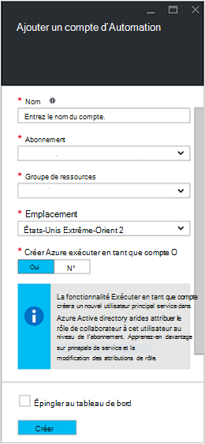
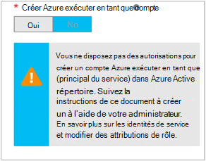

<properties
   pageTitle="Configurer le compte d’utilisateur AD Azure | Microsoft Azure"
   description="Cet article décrit comment configurer les informations d’identification de compte Azure AD utilisateur pour procédures opérationnelles dans Automation Azure à processeur et ASM s’authentifier."
   services="automation"
   documentationCenter=""
   authors="MGoedtel"
   manager="jwhit"
   editor="tysonn"
   keywords="compte d’utilisateur service gestion, azure ad Azure AD utilisateur, azure" />
<tags
   ms.service="automation"
   ms.devlang="na"
   ms.topic="get-started-article"
   ms.tgt_pltfrm="na"
   ms.workload="infrastructure-services"
   ms.date="09/12/2016"
   ms.author="magoedte" />

# Authentifier procédures opérationnelles avec la gestion des services Azure et le Gestionnaire de ressources

Cet article décrit les étapes à suivre pour configurer un compte d’utilisateur AD Azure pour Azure Automation procédures opérationnelles en cours d’exécution par rapport aux ressources Azure Service Gestion automatisée ou Azure Resource Manager (ARM).  Tandis que le problème persiste une identité d’authentification pris en charge pour votre processeur en fonction des procédures opérationnelles, nous vous recommandons utilise le nouveau compte Azure exécuter en tant que.       

## Créer un nouvel utilisateur Azure Active Directory

1. Connectez-vous au portail classique Azure en tant qu’un administrateur de service pour l’abonnement Azure que vous voulez gérer.
2. Sélectionnez **Active Directory**, puis le nom de l’annuaire de votre organisation.
3. Sélectionnez l’onglet **utilisateurs** et puis, dans la zone commande, sélectionnez **Ajouter un utilisateur**.
4. Dans la page **dites-nous sur cet utilisateur** , sous **Type d’utilisateur**, sélectionnez **nouvel utilisateur de votre organisation**.
5. Entrez un nom d’utilisateur.  
6. Sélectionnez le nom du répertoire associé à votre abonnement Azure dans la page Active Directory.
7. Dans la page **profil utilisateur** , fournissent un prénom et nom, un nom convivial et utilisateur dans la liste des **rôles** .  Effectuez pas **Activer l’authentification multifacteur**.
8. Notez le nom complet de l’utilisateur et mot de passe temporaire.
9. Sélectionnez **Paramètres > administrateurs > Ajouter**.
10. Tapez le nom d’utilisateur complet de l’utilisateur que vous avez créé.
11. Sélectionnez l’abonnement auquel vous souhaitez que l’utilisateur à gérer.
12. Déconnectez-vous d’Azure et connectez-vous avec le compte que vous venez de créer. Vous devrez modifier le mot de passe.

## Créer un compte Automation portail classique Azure
Dans cette section, vous allez effectuer les étapes suivantes pour créer un nouveau compte Azure Automation dans le portail Azure qui seront utilisés avec les procédures opérationnelles gestion des ressources en mode ASM et processeur.  

>[AZURE.NOTE] Comptes d’automatisation créés avec le portail classique Azure peuvent être gérés par le classique Azure et Azure portail et des options définir des applets de commande. Une fois le compte créé, il importe peu comment créer et gérer les ressources dans le compte. Si vous envisagez de continuer à utiliser le portail classique Azure, puis utilisez-le au lieu du portail Azure pour créer tous les comptes d’automatisation.

1. Connectez-vous au portail classique Azure en tant qu’un administrateur de service pour l’abonnement Azure que vous voulez gérer.
2. Sélectionnez **Automation**.
3. Dans la page **automatisation** , sélectionnez **créer un compte d’automatisation**.
4. Dans la zone **créer un compte d’automatisation** , tapez un nom pour votre nouveau compte Automation et sélectionnez une **région** dans la liste déroulante.  
5. Cliquez sur **OK** pour accepter les paramètres et créer le compte.
6. Après sa création il doit être répertorié dans la page **Automation** .
7. Cliquez sur le compte, il s’ouvre la page tableau de bord.  
8. Dans la page tableau de bord automatisation, sélectionnez **actifs**.
9. Dans la page **éléments** , sélectionnez **Ajouter des paramètres** qui se trouvent dans la partie inférieure de la page.
10. Dans la page **Ajouter des paramètres** , sélectionnez **Ajouter les informations d’identification**.
11. Dans la page **Définir les informations d’identification** , sélectionnez **Les informations d’identification Windows PowerShell** dans la liste déroulante **Type d’informations d’identification** et fournissez un nom pour les informations d’identification.
12. Sur le type de page suivant **Définir les informations d’identification** dans le nom d’utilisateur du compte d’utilisateur AD créé précédemment dans le champ **Nom d’utilisateur** et le mot de passe dans les champs de **mot de passe** et **Confirmer le mot de passe** . Cliquez sur **OK** pour enregistrer vos modifications.

## Créer un compte d’automatisation dans le portail d’Azure

Dans cette section, vous allez effectuer les étapes suivantes pour créer un nouveau compte Azure Automation dans le portail Azure qui seront utilisés avec vos ressources de gestion des procédures opérationnelles en mode processeur.  

1. Connectez-vous au portail Azure en tant qu’un administrateur de service pour l’abonnement Azure que vous voulez gérer.
2. Sélectionnez **comptes Automation**.
3. Dans la carte Automation comptes, cliquez sur **Ajouter**. 
2. Dans la carte **Ajouter un compte Automation** , dans la zone **nom** , tapez un nom pour votre nouveau compte Automation.
5. Si vous avez plusieurs abonnements, spécifiez l’option pour le nouveau compte, mais aussi un existant ou nouveau **groupe de ressources** et un centre de données Azure **emplacement**.
3. Sélectionnez la valeur **non** pour que l’option **créer Azure exécuter en tant que compte** , puis cliquez sur le bouton **créer** .  

    >[AZURE.NOTE] Si vous choisissez ne pas créer le compte Exécuter en tant qu’en sélectionnant l’option **non**, un message d’avertissement dans la carte **Ajouter un compte Automation** s’affiche.  Tandis que le compte est créé et attribué au rôle de **collaborateur** dans l’abonnement, il n’ont pas une identité de l’authentification correspondant au sein de votre service d’annuaire abonnements et par conséquent, sans accéder aux ressources dans votre abonnement.  Cela empêchera les procédures opérationnelles faisant référence à ce compte ne soient en mesure de s’authentifier et effectuer des tâches par rapport aux ressources processeur.

    

4. Pendant que Azure crée le compte d’automatisation, vous pouvez suivre la progression sous **Notifications** à partir du menu.

Lorsque la création de l’information d’identification est terminée, vous devrez puis créer une ressource d’informations d’identification pour associer le compte Automation avec le compte d’utilisateur AD créé précédemment.  N’oubliez pas que nous avons créé uniquement le compte d’automatisation et il n’est pas associé à une identité d’authentification.  Effectuer les étapes décrites dans les [éléments d’informations d’identification dans l’article Azure Automation](../automation/automation-credentials.md#creating-a-new-credential) et entrez la valeur **nom d’utilisateur** au format **domaine\utilisateur**.

## Utiliser les informations d’identification dans un runbook

Vous pouvez récupérer les informations d’identification dans un runbook à l’aide de l’activité [Get-AutomationPSCredential](http://msdn.microsoft.com/library/dn940015.aspx) et puis utilisez-le avec [Ajouter AzureAccount](http://msdn.microsoft.com/library/azure/dn722528.aspx) pour vous connecter à votre abonnement Azure. Si les informations d’identification sont un administrateur de plusieurs abonnements Azure, vous devez également utiliser [Sélectionnez AzureSubscription](http://msdn.microsoft.com/library/dn495203.aspx) pour spécifier l’option correcte. Cela est indiqué dans l’échantillon Windows PowerShell ci-dessous s’affichant en général en haut de la plupart des procédures opérationnelles Automation Azure.

    $cred = Get-AutomationPSCredential –Name "myuseraccount.onmicrosoft.com"
    Add-AzureAccount –Credential $cred
    Select-AzureSubscription –SubscriptionName "My Subscription"

Vous devez répéter ces lignes après les [points de contrôle](http://technet.microsoft.com/library/dn469257.aspx#bk_Checkpoints) dans votre runbook. Si la runbook est suspendue et reprenne à une autre collaborateur, il devrez effectuer l’authentification à nouveau.

## Étapes suivantes
* Passez en revue les runbook différents types et les étapes pour créer vos propres procédures opérationnelles à partir de l’article suivant [des types de runbook Automation Azure](../automation/automation-runbook-types.md)
