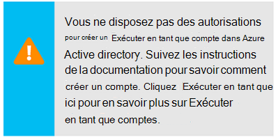

<properties
    pageTitle="Configurer Azure exécuter en tant que compte | Microsoft Azure"
    description="Didacticiels qui vous guide dans l’utilisation de la création, de test et exemple principal d’authentification de sécurité dans Azure Automation."
    services="automation"
    documentationCenter=""
    authors="mgoedtel"
    manager="jwhit"
    editor=""
    keywords="nom principal de service, setspn, authentification azure"/>
<tags
    ms.service="automation"
    ms.workload="tbd"
    ms.tgt_pltfrm="na"
    ms.devlang="na"
    ms.topic="get-started-article"
    ms.date="08/17/2016"
    ms.author="magoedte"/>

# Authentifier procédures opérationnelles avec Azure exécuter en tant que compte

Cette rubrique vous montrent comment configurer un compte d’automatisation à partir du portail Azure à l’aide de la fonctionnalité Exécuter en tant que compte s’authentifier procédures opérationnelles de gestion des ressources dans le Gestionnaire de ressources Azure ou gestion des services Azure.

Lorsque vous créez un nouveau compte Automation dans le portail Azure, qu’il crée automatiquement :

- Exécuter en tant que compte qui crée une nouvelle entité service dans Azure Active Directory, un certificat et affecte le contrôle d’accès basé sur un rôle Collaborateur (RBAC), qui sera utilisé pour gérer les ressources du Gestionnaire de ressources à l’aide de procédures opérationnelles.   
- Exécuter en tant que compte classique en téléchargeant un certificat de gestion, qui sera utilisé pour gérer les gestion des services Azure ou ressources classiques à l’aide des procédures opérationnelles.  

Cela simplifie le processus pour vous et vous aide à vous commencez rapidement créer et déployer des procédures opérationnelles pour répondre à vos besoins d’automatisation.      

En utilisant un compte Exécuter en tant qu’et classique exécuter en tant que, vous pouvez :

- Fournir une méthode normalisée pour vous authentifier avec Azure lors de la gestion du Gestionnaire de ressources Azure ou Azure Service de gestion des ressources à partir de procédures opérationnelles dans le portail Azure.  
- Automatiser l’utilisation des procédures opérationnelles global configuré dans Azure alertes.

>[AZURE.NOTE] La [fonctionnalité alerte intégration](../monitoring-and-diagnostics/insights-receive-alert-notifications.md) Azure avec Automation Global procédures opérationnelles requiert un compte Automation est configuré avec un exécuter en tant qu’et le classique exécuter en tant que compte. Vous pouvez sélectionner un compte Automation qui possède déjà un compte Exécuter en tant qu’et classique exécuter en tant que défini ou choisissez de créer un nouveau.

Nous vous montrer comment créer le compte d’automatisation à partir du portail Azure, mettre à jour d’un compte d’automatisation à l’aide de PowerShell et vous montrer comment authentifier dans les procédures opérationnelles.

Avant cela, il existe plusieurs choses que vous devez comprendre et prendre en compte avant de poursuivre.

1. Cela n’influe pas sur les comptes Automation existants déjà créés dans le classique ou modèle de déploiement Gestionnaire de ressources.  
2. Cela ne fonctionne que pour les comptes d’automatisation créés via le portail d’Azure.  Essayez de créer un compte à partir du portail classique, la configuration du compte Exécuter en tant que n’est pas répliquées.
3. Si vous avez actuellement procédures opérationnelles et des ressources (par exemple, plannings, variables, etc.) créés précédemment pour gérer les ressources classiques, et vous souhaitez que ces procédures opérationnelles pour vous authentifier avec le nouveau compte classique exécuter en tant que, vous devez les migrer vers le nouveau compte Automation ou mettre à jour de votre compte existant en utilisant le script PowerShell ci-dessous.  
4. Pour s’authentifier en utilisant le nouveau compte Exécuter en tant que compte classique exécuter en tant que Automation, vous devez modifier les procédures opérationnelles existants avec l’exemple de code ci-dessous.  **Veuillez noter** que le compte Exécuter en tant qu’est pour l’authentification par rapport aux ressources du Gestionnaire de ressources à l’aide du service basée sur certificats principal et le compte classique exécuter en tant qu’est d’authentification auprès de ressources de gestion des services avec le certificat de gestion.     

## Créer un nouveau compte Automation à partir du portail Azure

Dans cette section, vous allez effectuer les étapes suivantes pour créer un nouveau compte Azure Automation à partir du portail Azure.  Cela crée les exécuter en tant qu’et classique exécuter en tant que compte.  

>[AZURE.NOTE] L’utilisateur qui effectue ces étapes *doit* être membre du rôle Admins abonnement et co-création administrateur de l’abonnement qui accorde l’accès à l’abonnement pour l’utilisateur.  L’utilisateur doit également être ajouté en tant qu’utilisateur à celle abonnements par défaut Active Directory ; le compte n’a pas besoin être assignée à un rôle dotés de privilèges.

1. Connectez-vous au portail Azure avec un compte qui est membre du rôle Administrateurs d’abonnement et co-création administrateur de l’abonnement.
2. Sélectionnez **comptes Automation**.
3. Dans la carte Automation comptes, cliquez sur **Ajouter**. 

    >[AZURE.NOTE]Si vous voyez le message d’avertissement suivant dans la carte **Ajouter un compte Automation** , il s’agit car votre compte n’est pas un membre du rôle Administrateurs d’abonnement et co-création-admin de l’abonnement. 

4. Dans la carte **Ajouter un compte Automation** , dans la zone **nom** , tapez un nom pour votre nouveau compte Automation.
5. Si vous avez plusieurs abonnements, spécifiez une pour le nouveau compte, mais aussi un existant ou nouveau **groupe de ressources** et un centre de données Azure **emplacement**.
6. Vérifiez que la valeur **Qu'oui** est sélectionné pour l’option **créer Azure exécuter en tant que compte** , puis cliquez sur le bouton **créer** .  

    >[AZURE.NOTE] Si vous choisissez ne pas créer le compte Exécuter en tant qu’en sélectionnant l’option **non**, un message d’avertissement dans la carte **Ajouter un compte Automation** s’affiche.  Tandis que le compte est créé dans le portail Azure, il n’ont pas une identité de l’authentification correspondant au sein de votre classique ou un service d’annuaire abonnement Gestionnaire de ressources et par conséquent, pas de l’accès aux ressources dans votre abonnement.  Cela empêchera les procédures opérationnelles faisant référence à ce compte ne soient en mesure de s’authentifier et effectuer des tâches par rapport aux ressources dans ces modèles de déploiement.

    > 
Lorsque l’entité de service n’est pas créée le rôle de collaborateur ne doivent pas être affecté.

7. Pendant que Azure crée le compte d’automatisation, vous pouvez suivre la progression sous **Notifications** à partir du menu.

### Ressources incluses

Lorsque le compte Automation est créé avec succès, plusieurs ressources sont créées automatiquement pour vous.  Le tableau suivant résume les ressources du compte Exécuter en tant que. 

Ressource|Description
--------|-----------
AzureAutomationTutorial Runbook|Procédure opérationnelle PowerShell exemple qui montre comment pour s’authentifier à l’aide du compte Exécuter en tant qu’et obtient toutes les ressources du Gestionnaire de ressources.
AzureAutomationTutorialScript Runbook|Procédure opérationnelle PowerShell exemple qui montre comment pour s’authentifier à l’aide du compte Exécuter en tant qu’et obtient toutes les ressources du Gestionnaire de ressources.
AzureRunAsCertificate|Bien certificat automatiquement créé lors de la création de comptes Automation ou en utilisant le script PowerShell en dessous d’un compte existant.  Il vous permet de s’authentifier avec Azure afin que vous pouvez gérer les ressources du Gestionnaire de ressources Azure à partir de procédures opérationnelles.  Ce certificat a une durée de vie d’un an.
AzureRunAsConnection|Bien connexion automatiquement créé lors de la création de comptes Automation ou en utilisant le script PowerShell en dessous d’un compte existant.

Le tableau suivant résume les ressources pour le compte classique exécuter en tant que. 

Ressource|Description
--------|-----------
AzureClassicAutomationTutorial Runbook|Runbook un exemple qui obtient tous les ordinateurs virtuels classique un abonnement à l’aide de l’exécuter en tant que compte classique (certificat), puis renvoie le nom de la machine virtuelle et l’état.
Script de AzureClassicAutomationTutorial Runbook|Runbook un exemple qui obtient tous les ordinateurs virtuels classique un abonnement à l’aide de l’exécuter en tant que compte classique (certificat), puis renvoie le nom de la machine virtuelle et l’état.
AzureClassicRunAsCertificate|Certificat bien créé automatiquement utilisé pour vous authentifier avec Azure afin que vous pouvez gérer les ressources classiques Azure à partir de procédures opérationnelles.  Ce certificat a une durée de vie d’un an.
AzureClassicRunAsConnection|Connexion bien créé automatiquement utilisé pour vous authentifier avec Azure afin que vous pouvez gérer les ressources classiques Azure à partir de procédures opérationnelles.  

## Vérifier l’exécuter en tant qu’authentification

Ensuite, nous effectue un petit test pour confirmer que vous sont pas correctement s’authentifier à l’aide du nouveau compte Exécuter en tant que.     

1. Dans le portail Azure, ouvrez le compte Automation créé précédemment.  
2. Cliquez sur la vignette de **procédures opérationnelles** pour ouvrir la liste des procédures opérationnelles.
3. Sélectionnez le runbook **AzureAutomationTutorialScript** , puis sur **Démarrer** pour démarrer la procédure opérationnelle.  Vous recevrez une invite de vérifier que vous souhaitez démarrer la procédure opérationnelle.
4. Une [tâche runbook](automation-runbook-execution.md) est créé, la tâche carte s’affiche et l’état du travail affichées dans la mosaïque de **Résumé de la tâche** .  
5. L’état du travail démarre comme *en file d’attente* indiquant qu’il est en attente d’un collaborateur runbook dans le cloud à deviennent disponibles. Elle passe alors au *départ* lorsqu’un collaborateur revendications la tâche, puis *en cours d’exécution* lorsque la runbook démarre réellement en cours d’exécution.  
6. Le travail runbook terminé, nous devons voir état **est terminé**.   
7. Pour afficher les résultats de la procédure opérationnelle détaillés, cliquez sur la vignette de **sortie** .
8. Dans la carte de **sortie** , vous devriez voir il a été authentifié et ont renvoyé une liste de toutes les ressources disponibles dans le groupe de ressources.
9. Fermer la carte de **sortie** pour revenir à la carte de **Résumé de la tâche** .
13. Fermez le **Résumé de la tâche** et la carte de runbook **AzureAutomationTutorialScript** correspondante.

## Vérifier l’authentification classique exécuter en tant que

Ensuite, nous effectue un petit test pour vérifier que vous sont pas correctement s’authentifier à l’aide du nouveau compte classique exécuter en tant que.     

1. Dans le portail Azure, ouvrez le compte Automation créé précédemment.  
2. Cliquez sur la vignette de **procédures opérationnelles** pour ouvrir la liste des procédures opérationnelles.
3. Sélectionnez le runbook **AzureClassicAutomationTutorialScript** , puis sur **Démarrer** pour démarrer la procédure opérationnelle.  Vous recevrez une invite de vérifier que vous souhaitez démarrer la procédure opérationnelle.
4. Une [tâche runbook](automation-runbook-execution.md) est créé, la tâche carte s’affiche et l’état du travail affichées dans la mosaïque de **Résumé de la tâche** .  
5. L’état du travail démarre comme *en file d’attente* indiquant qu’il est en attente d’un collaborateur runbook dans le cloud à deviennent disponibles. Elle passe alors au *départ* lorsqu’un collaborateur revendications la tâche, puis *en cours d’exécution* lorsque la runbook démarre réellement en cours d’exécution.  
6. Le travail runbook terminé, nous devons voir état **est terminé**.   
7. Pour afficher les résultats de la procédure opérationnelle détaillés, cliquez sur la vignette de **sortie** .
8. Dans la carte de **sortie** , vous devriez voir il a été authentifié et renvoyé une liste de tous les machine virtuelle classique se trouvent dans l’abonnement.
9. Fermer la carte de **sortie** pour revenir à la carte de **Résumé de la tâche** .
13. Fermez le **Résumé de la tâche** et la carte de runbook **AzureClassicAutomationTutorialScript** correspondante.

## Mettre à jour un compte Automation à l’aide de PowerShell

Ici nous vous fournissons avec l’option Utiliser PowerShell pour mettre à jour votre compte Automation existant si :

1. Vous avez créé un compte d’automatisation, mais refusé créer le compte Exécuter en tant que
2. Vous avez déjà un compte Automation pour gérer les ressources du Gestionnaire de ressources et que vous voulez mettre à jour pour inclure le compte Exécuter en tant que pour l’authentification runbook
2. Vous avez déjà un compte Automation pour gérer les ressources classiques et que vous voulez mettre à jour pour utiliser le classique exécuter en tant qu’au lieu de créer un compte et la migration des procédures opérationnelles et actifs lui   

Avant de commencer, vérifiez que les éléments suivants :

1. Vous avez téléchargé et installé [Windows Management Framework (WMF) 4.0](https://www.microsoft.com/download/details.aspx?id=40855) si vous exécutez Windows 7.   
    Si vous exécutez Windows Server 2012 R2, Windows Server 2012, Windows 2008 R2, Windows 8.1 et Windows 7 SP1, [Windows Management Framework 5.0](https://www.microsoft.com/download/details.aspx?id=50395) est disponible pour l’installation.
2. Azure PowerShell 1.0. Pour plus d’informations sur cette version et apprendre à installer, voir [comment installer et configurer Azure PowerShell](../powershell-install-configure.md).
3. Vous avez créé un compte automation.  Ce compte sera référencé comme la valeur pour les paramètres – AutomationAccountName et - ApplicationDisplayName dans les deux scripts ci-dessous.

Pour obtenir les valeurs pour *SubscriptionID* *ResourceGroup*et *AutomationAccountName*, qui sont des paramètres requis pour les scripts, dans le portail Azure Sélectionnez votre compte Automation à partir de la carte de **compte automatisation** , **tous les paramètres**.  Dans la carte de **tous les paramètres** , sous **Paramètres du compte** , sélectionnez **Propriétés**.  Dans la carte de **Propriétés** , vous pouvez l’indiquer ces valeurs.    

### Créer un script exécuter en tant que compte PowerShell

Le script PowerShell ci-dessous configure les éléments suivants :

- Une application Azure AD qui est authentifiée avec le certificat auto-signé, créez un compte principal de service pour cette application dans Azure AD et voient attribuer le rôle de collaborateur (vous pouvez le modifier au propriétaire ou à un autre rôle) pour ce compte dans votre abonnement actuel.  Pour plus d’informations, consultez l’article de [contrôle d’accès basé sur un rôle dans Azure Automation](../automation/automation-role-based-access-control.md) .
- Un bien certificat Automation dans le compte automation spécifié nommé **AzureRunAsCertificate**, qui contient le certificat utilisé par le service principal.
- Un bien connexion Automation dans le compte automation spécifié nommé **AzureRunAsConnection**qui contient l’applicationId tenantId, subscriptionId et empreinte numérique du certificat.    

Les étapes ci-dessous vous guidera tout au long du processus de l’exécution du script.

1. Enregistrez le script suivant sur votre ordinateur.  Dans cet exemple, vous devez l’enregistrer sous le nom de fichier **AzureServicePrincipal.ps1 de nouveau**.  

        #Requires -RunAsAdministrator
        Param (
        [Parameter(Mandatory=$true)]
        [String] $ResourceGroup,

        [Parameter(Mandatory=$true)]
        [String] $AutomationAccountName,

        [Parameter(Mandatory=$true)]
        [String] $ApplicationDisplayName,

        [Parameter(Mandatory=$true)]
        [String] $SubscriptionId,

        [Parameter(Mandatory=$true)]
        [String] $CertPlainPassword,

        [Parameter(Mandatory=$false)]
        [int] $NoOfMonthsUntilExpired = 12
        )

        Login-AzureRmAccount
        Import-Module AzureRM.Resources
        Select-AzureRmSubscription -SubscriptionId $SubscriptionId

        $CurrentDate = Get-Date
        $EndDate = $CurrentDate.AddMonths($NoOfMonthsUntilExpired)
        $KeyId = (New-Guid).Guid
        $CertPath = Join-Path $env:TEMP ($ApplicationDisplayName + ".pfx")

        $Cert = New-SelfSignedCertificate -DnsName $ApplicationDisplayName -CertStoreLocation cert:\LocalMachine\My -KeyExportPolicy Exportable -Provider "Microsoft Enhanced RSA and AES Cryptographic Provider"

        $CertPassword = ConvertTo-SecureString $CertPlainPassword -AsPlainText -Force
        Export-PfxCertificate -Cert ("Cert:\localmachine\my\" + $Cert.Thumbprint) -FilePath $CertPath -Password $CertPassword -Force | Write-Verbose

        $PFXCert = New-Object -TypeName System.Security.Cryptography.X509Certificates.X509Certificate -ArgumentList @($CertPath, $CertPlainPassword)
        $KeyValue = [System.Convert]::ToBase64String($PFXCert.GetRawCertData())

        $KeyCredential = New-Object  Microsoft.Azure.Commands.Resources.Models.ActiveDirectory.PSADKeyCredential
        $KeyCredential.StartDate = $CurrentDate
        $KeyCredential.EndDate= $EndDate
        $KeyCredential.KeyId = $KeyId
        $KeyCredential.Type = "AsymmetricX509Cert"
        $KeyCredential.Usage = "Verify"
        $KeyCredential.Value = $KeyValue

        # Use Key credentials
        $Application = New-AzureRmADApplication -DisplayName $ApplicationDisplayName -HomePage ("http://" + $ApplicationDisplayName) -IdentifierUris ("http://" + $KeyId) -KeyCredentials $keyCredential

        New-AzureRMADServicePrincipal -ApplicationId $Application.ApplicationId | Write-Verbose
        Get-AzureRmADServicePrincipal | Where {$_.ApplicationId -eq $Application.ApplicationId} | Write-Verbose

        $NewRole = $null
        $Retries = 0;
        While ($NewRole -eq $null -and $Retries -le 6)
        {
           # Sleep here for a few seconds to allow the service principal application to become active (should only take a couple of seconds normally)
           Sleep 5
           New-AzureRMRoleAssignment -RoleDefinitionName Contributor -ServicePrincipalName $Application.ApplicationId | Write-Verbose -ErrorAction SilentlyContinue
           Sleep 10
           $NewRole = Get-AzureRMRoleAssignment -ServicePrincipalName $Application.ApplicationId -ErrorAction SilentlyContinue
           $Retries++;
        }

        # Get the tenant id for this subscription
        $SubscriptionInfo = Get-AzureRmSubscription -SubscriptionId $SubscriptionId
        $TenantID = $SubscriptionInfo | Select TenantId -First 1

        # Create the automation resources
        New-AzureRmAutomationCertificate -ResourceGroupName $ResourceGroup -AutomationAccountName $AutomationAccountName -Path $CertPath -Name AzureRunAsCertificate -Password $CertPassword -Exportable | write-verbose

        # Create a Automation connection asset named AzureRunAsConnection in the Automation account. This connection uses the service principal.
        $ConnectionAssetName = "AzureRunAsConnection"
        Remove-AzureRmAutomationConnection -ResourceGroupName $ResourceGroup -AutomationAccountName $AutomationAccountName -Name $ConnectionAssetName -Force -ErrorAction SilentlyContinue
        $ConnectionFieldValues = @{"ApplicationId" = $Application.ApplicationId; "TenantId" = $TenantID.TenantId; "CertificateThumbprint" = $Cert.Thumbprint; "SubscriptionId" = $SubscriptionId}
        New-AzureRmAutomationConnection -ResourceGroupName $ResourceGroup -AutomationAccountName $AutomationAccountName -Name $ConnectionAssetName -ConnectionTypeName AzureServicePrincipal -ConnectionFieldValues $ConnectionFieldValues

2. Sur votre ordinateur, démarrez **Windows PowerShell** à partir de l’écran de **démarrage** avec des droits d’utilisateur élevés.
3. À partir du shell de ligne de commande PowerShell avec élévation de privilèges, accédez au dossier qui contient le script créé à l’étape 1 et exécute le script de modification des valeurs pour les paramètres *– ResourceGroup*, *- AutomationAccountName*, *- ApplicationDisplayName*, *SubscriptionId -*et *- CertPlainPassword*. 

    >[AZURE.NOTE] Vous devrez vous authentifier avec Azure lorsque vous avez exécuté le script. Vous devez vous connecter avec un compte qui est membre du rôle Admins abonnement et co-création-admin de l’abonnement.

        .\New-AzureServicePrincipal.ps1 -ResourceGroup <ResourceGroupName>
        -AutomationAccountName <NameofAutomationAccount> `
        -ApplicationDisplayName <DisplayNameofAutomationAccount> `
        -SubscriptionId <SubscriptionId> `
        -CertPlainPassword "<StrongPassword>"  
 

Une fois le script terminé avec succès, reportez-vous à l' [exemple de code](#sample-code-to-authenticate-with-resource-manager-resources) ci-dessous pour vous authentifier avec le Gestionnaire de ressources ressources et valider la configuration d’informations d’identification.

### Créer classique exécuter en tant que compte script PowerShell

Le script PowerShell ci-dessous configure les éléments suivants :

- Un bien certificat Automation dans le compte automation spécifié nommé **AzureClassicRunAsCertificate**, qui contient le certificat utilisé pour authentifier les procédures opérationnelles.
- Un bien connexion Automation dans le compte automation spécifié nommé **AzureClassicRunAsConnection**, qui contient le nom de l’abonnement, le nom de biens subscriptionId et le certificat.

Le script créer un certificat auto-signé gestion et enregistrez-le dans le dossier de fichiers temporaires sur votre ordinateur sous le profil utilisateur utilisé pour exécuter la session PowerShell - *%USERPROFILE%\AppData\Local\Temp*.  Après l’exécution de scripts, vous devrez télécharger le certificat de gestion Azure dans le magasin de gestion de l’abonnement dans que le compte Automation a été créé.  Les étapes ci-dessous vous guidera tout au long de la procédure de l’exécution du script et télécharger le certificat.  

1. Enregistrez le script suivant sur votre ordinateur.  Dans cet exemple, vous devez l’enregistrer sous le nom de fichier **AzureClassicRunAsAccount.ps1 de nouveau**.

        #Requires -RunAsAdministrator
        Param (
        [Parameter(Mandatory=$true)]
        [String] $ResourceGroup,

        [Parameter(Mandatory=$true)]
        [String] $AutomationAccountName,

        [Parameter(Mandatory=$true)]
        [String] $ApplicationDisplayName,

        [Parameter(Mandatory=$true)]
        [String] $SubscriptionId,

        [Parameter(Mandatory=$true)]
        [String] $CertPlainPassword,

        [Parameter(Mandatory=$false)]
        [int] $NoOfMonthsUntilExpired = 12
        )

        Login-AzureRmAccount
        Import-Module AzureRM.Resources
        $Subscription = Select-AzureRmSubscription -SubscriptionId $SubscriptionId
        $SubscriptionName = $subscription.Subscription.SubscriptionName

        $CurrentDate = Get-Date
        $EndDate = $CurrentDate.AddMonths($NoOfMonthsUntilExpired)
        $KeyId = (New-Guid).Guid
        $CertPath = Join-Path $env:TEMP ($ApplicationDisplayName + ".pfx")
        $CertPathCer = Join-Path $env:TEMP ($ApplicationDisplayName + ".cer")

        $Cert = New-SelfSignedCertificate -DnsName $ApplicationDisplayName -CertStoreLocation cert:\LocalMachine\My -KeyExportPolicy Exportable -Provider "Microsoft Enhanced RSA and AES Cryptographic Provider"

        $CertPassword = ConvertTo-SecureString $CertPlainPassword -AsPlainText -Force
        Export-PfxCertificate -Cert ("Cert:\localmachine\my\" + $Cert.Thumbprint) -FilePath $CertPath -Password $CertPassword -Force | Write-Verbose
        Export-Certificate -Cert ("Cert:\localmachine\my\" + $Cert.Thumbprint) -FilePath $CertPathCer -Type CERT | Write-Verbose

        # Create the automation resources
        $ClassicCertificateAssetName = "AzureClassicRunAsCertificate"
        New-AzureRmAutomationCertificate -ResourceGroupName $ResourceGroup -AutomationAccountName $AutomationAccountName -Path $CertPath -Name $ClassicCertificateAssetName  -Password $CertPassword -Exportable | write-verbose

        # Create a Automation connection asset named AzureClassicRunAsConnection in the Automation account. This connection uses the ClassicCertificateAssetName.
        $ConnectionAssetName = "AzureClassicRunAsConnection"
        Remove-AzureRmAutomationConnection -ResourceGroupName $ResourceGroup -AutomationAccountName $AutomationAccountName -Name $ConnectionAssetName -Force -ErrorAction SilentlyContinue
        $ConnectionFieldValues = @{"SubscriptionName" = $SubscriptionName; "SubscriptionId" = $SubscriptionId; "CertificateAssetName" = $ClassicCertificateAssetName}
        New-AzureRmAutomationConnection -ResourceGroupName $ResourceGroup -AutomationAccountName $AutomationAccountName -Name $ConnectionAssetName -ConnectionTypeName AzureClassicCertificate -ConnectionFieldValues $ConnectionFieldValues

        Write-Host -ForegroundColor red "Please upload the cert $CertPathCer to the Management store by following the steps below."
        Write-Host -ForegroundColor red "Log in to the Microsoft Azure Management portal (https://manage.windowsazure.com) and select Settings -> Management Certificates."
        Write-Host -ForegroundColor red "Then click Upload and upload the certificate $CertPathCer"

2. Sur votre ordinateur, démarrez **Windows PowerShell** à partir de l’écran de **démarrage** avec des droits d’utilisateur élevés.  
3. À partir du shell de ligne de commande PowerShell avec élévation de privilèges, accédez au dossier qui contient le script créé à l’étape 1 et exécute le script de modification des valeurs pour les paramètres *– ResourceGroup*, *- AutomationAccountName*, *- ApplicationDisplayName*, *SubscriptionId -*et *- CertPlainPassword*. 

    >[AZURE.NOTE] Vous devrez vous authentifier avec Azure lorsque vous avez exécuté le script. Vous devez vous connecter avec un compte qui est membre du rôle Admins abonnement et co-création-admin de l’abonnement.

        .\New-AzureClassicRunAsAccount.ps1 -ResourceGroup <ResourceGroupName>
        -AutomationAccountName <NameofAutomationAccount> `
        -ApplicationDisplayName <DisplayNameofAutomationAccount> `
        -SubscriptionId <SubscriptionId> `
        -CertPlainPassword "<StrongPassword>"

Une fois le script terminé avec succès, vous devez copier le certificat créé dans votre dossier **Temp** du profil utilisateur.  Suivez les étapes pour le [téléchargement d’un certificat de gestion de l’API](../azure-api-management-certs.md) au portail classique Azure, puis reportez-vous à l' [exemple de code](#sample-code-to-authenticate-with-service-management-resources) pour valider la configuration d’informations d’identification avec les ressources de gestion des services.

## Exemples de code pour vous authentifier avec les ressources du Gestionnaire de ressources

Vous pouvez utiliser l’exemple de mise à jour de code ci-dessous, extraite du runbook exemple **AzureAutomationTutorialScript** , s’authentifier à l’aide du compte Exécuter en tant que pour gérer les ressources du Gestionnaire de ressources avec les procédures opérationnelles.   

    $connectionName = "AzureRunAsConnection"
    $SubId = Get-AutomationVariable -Name 'SubscriptionId'
    try
    {
       # Get the connection "AzureRunAsConnection "
       $servicePrincipalConnection=Get-AutomationConnection -Name $connectionName         

       "Logging in to Azure..."
       Add-AzureRmAccount `
         -ServicePrincipal `
         -TenantId $servicePrincipalConnection.TenantId `
         -ApplicationId $servicePrincipalConnection.ApplicationId `
         -CertificateThumbprint $servicePrincipalConnection.CertificateThumbprint
       "Setting context to a specific subscription"  
       Set-AzureRmContext -SubscriptionId $SubId             
    }
    catch {
        if (!$servicePrincipalConnection)
        {
           $ErrorMessage = "Connection $connectionName not found."
           throw $ErrorMessage
         } else{
            Write-Error -Message $_.Exception
            throw $_.Exception
         }
    }

Le script comprend deux lignes de code pour prendre en charge faisant référence à un contexte abonnement afin que vous puissiez travailler facilement entre plusieurs abonnements supplémentaires. Un variable bien nommé SubscriptionId contient l’ID de l’abonnement, et après l’instruction applet de commande Add-AzureRmAccount, l' [applet de commande Set-AzureRmContext](https://msdn.microsoft.com/library/mt619263.aspx) est précisé avec le paramètre défini *- SubscriptionId*. Si le nom de la variable est trop générique, vous pouvez modifier le nom de la variable à inclure un préfixe ou autres convention d’appellation pour faciliter leur identification à vos besoins. Vous pouvez également utiliser le paramètre défini - SubscriptionName au lieu de-SubscriptionId avec une variable actifs correspondants.  

Notez l’applet de commande utilisé pour l’authentification dans la runbook - **Ajouter AzureRmAccount**, utilise le jeu de paramètres *ServicePrincipalCertificate* .  Il s’authentifie à l’aide de certificat principal du service, pas les informations d’identification.  

## Exemples de code pour vous authentifier avec les ressources de gestion des services

Vous pouvez utiliser l’exemple de mise à jour de code ci-dessous, extraite du runbook exemple **AzureClassicAutomationTutorialScript** , s’authentifier à l’aide du compte classique exécuter en tant que pour gérer les ressources classiques avec les procédures opérationnelles.

    $ConnectionAssetName = "AzureClassicRunAsConnection"
    # Get the connection
    $connection = Get-AutomationConnection -Name $connectionAssetName        

    # Authenticate to Azure with certificate
    Write-Verbose "Get connection asset: $ConnectionAssetName" -Verbose
    $Conn = Get-AutomationConnection -Name $ConnectionAssetName
    if ($Conn -eq $null)
    {
       throw "Could not retrieve connection asset: $ConnectionAssetName. Assure that this asset exists in the Automation account."
    }

    $CertificateAssetName = $Conn.CertificateAssetName
    Write-Verbose "Getting the certificate: $CertificateAssetName" -Verbose
    $AzureCert = Get-AutomationCertificate -Name $CertificateAssetName
    if ($AzureCert -eq $null)
    {
       throw "Could not retrieve certificate asset: $CertificateAssetName. Assure that this asset exists in the Automation account."
    }

    Write-Verbose "Authenticating to Azure with certificate." -Verbose
    Set-AzureSubscription -SubscriptionName $Conn.SubscriptionName -SubscriptionId $Conn.SubscriptionID -Certificate $AzureCert
    Select-AzureSubscription -SubscriptionId $Conn.SubscriptionID

## Étapes suivantes

- Pour plus d’informations sur les entités de Service, reportez-vous à [objets d’Application et objets Principal du Service](../active-directory/active-directory-application-objects.md).
- Pour plus d’informations sur le contrôle d’accès basé sur un rôle dans Azure Automation, reportez-vous au [contrôle d’accès basé sur un rôle dans Azure Automation](../automation/automation-role-based-access-control.md).
- Pour plus d’informations sur les certificats et services Azure, voir [Présentation de certificats pour les Services en nuage Azure](../cloud-services/cloud-services-certs-create.md)
