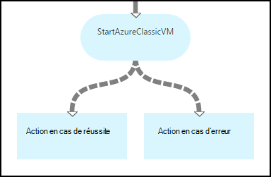
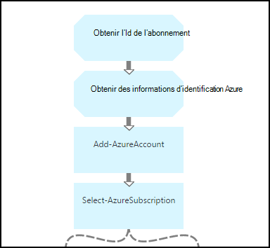
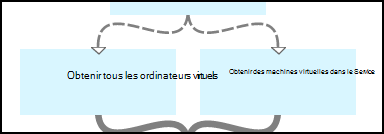
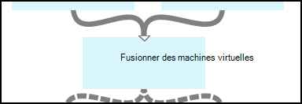
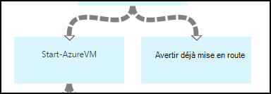
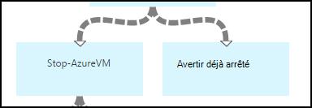
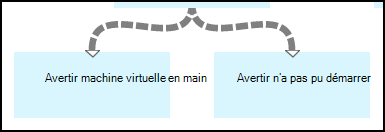
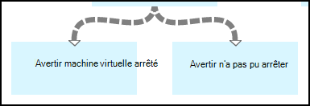

<properties 
    pageTitle="Démarrer et arrêter machines virtuelles - Graph | Microsoft Azure"
    description="Version du flux de travail PowerShell de scénario Automatisation Azure, y compris les procédures opérationnelles pour démarrer et arrêter machines virtuelles classiques."
    services="automation"
    documentationCenter=""
    authors="mgoedtel"
    manager="jwhit"
    editor="tysonn" />
<tags 
    ms.service="automation"
    ms.devlang="na"
    ms.topic="article"
    ms.tgt_pltfrm="na"
    ms.workload="infrastructure-services"
    ms.date="07/06/2016"
    ms.author="bwren" />

# Scénario d’automatisation Azure - de démarrage et d’arrêt machines virtuelles

Ce scénario Automatisation Azure inclut les procédures opérationnelles pour démarrer et arrêter machines virtuelles classiques.  Vous pouvez utiliser ce scénario pour une des opérations suivantes :  

- Utilisez les procédures opérationnelles sans modification dans votre environnement. 
- Modifier les procédures opérationnelles pour effectuer la fonctionnalité personnalisée.  
- Appelez les procédures opérationnelles à partir d’un autre runbook dans le cadre d’une solution globale. 
- Utilisez les procédures opérationnelles sous forme de didacticiels pour découvrir runbook concepts de création. 

> [AZURE.SELECTOR]
- [Graphique](automation-solution-startstopvm-graphical.md)
- [Flux de travail PowerShell](automation-solution-startstopvm-psworkflow.md)

Il s’agit de la version graphique runbook de ce scénario. Il est également disponible à l’aide de [flux de travail PowerShell procédures opérationnelles](automation-solution-startstopvm-psworkflow.md).

## Prise le scénario

Ce scénario se compose de deux deux procédures opérationnelles graphiques que vous pouvez télécharger les liens suivants.  Afficher la [version du flux de travail PowerShell](automation-solution-startstopvm-psworkflow.md) de ce scénario, les liens vers les procédures opérationnelles PowerShell le flux de travail.

| Runbook | Lien | Type | Description |
|:---|:---|:---|:---|
| StartAzureClassicVM | [Démarrer Runbook graphique Azure machine virtuelle classique](https://gallery.technet.microsoft.com/scriptcenter/Start-Azure-Classic-VM-c6067b3d) | Graphique | Démarre toutes les machines virtuelles classiques dans un abonnement Azure ou tous les ordinateurs virtuels avec un nom de service particulier. |
| StopAzureClassicVM | [Arrêter Runbook graphique Azure machine virtuelle classique](https://gallery.technet.microsoft.com/scriptcenter/Stop-Azure-Classic-VM-397819bd) | Graphique | Arrête tous les ordinateurs virtuels dans un compte automation ou tous les ordinateurs virtuels avec un nom de service particulier.  |

## Installer et configurer le scénario

### 1. installer les procédures opérationnelles

Après avoir téléchargé les procédures opérationnelles, vous pouvez les importer à l’aide de la procédure dans les [procédures runbook graphique](automation-graphical-authoring-intro.md#graphical-runbook-procedures).

### 2. consultez la description et la configuration requise
Les procédures opérationnelles incluent une activité appelée **Lisez-moi** qui inclut une description et éléments requis.  Vous pouvez afficher ces informations en sélectionnant l’activité **Lisez-moi** , puis sur le paramètre de **Script de flux de travail** .  Vous pouvez également ouvrir les mêmes informations à partir de cet article. 

### 3. configurer les actifs
Les procédures opérationnelles nécessitent les ressources suivantes que vous devez créer et remplir avec les valeurs appropriées.  Les noms sont par défaut.  Vous pouvez utiliser actifs avec des noms différents si vous spécifiez les noms dans les [paramètres d’entrée](#using-the-runbooks) lorsque vous démarrez la procédure opérationnelle.

| Type d’élément | Nom par défaut | Description |
|:---|:---|:---|:---|
| [Informations d’identification](automation-credentials.md) | AzureCredential | Contient des informations d’identification d’un compte qui a autorité pour démarrer et arrêter machines virtuelles dans l’abonnement Azure.  |
| [Variable](automation-variables.md) | AzureSubscriptionId | Contient l’ID de l’abonnement de votre abonnement Azure. |

## À l’aide du scénario

### Paramètres

Les procédures opérationnelles chaque ont les [paramètres d’entrée](automation-starting-a-runbook.md#runbook-parameters)suivants.  Vous devez fournir des valeurs pour tous les paramètres obligatoires et pouvez éventuellement fournir des valeurs pour d’autres paramètres selon vos besoins.

| Paramètre | Type | Obligatoire | Description |
|:---|:---|:---|:---|
| ServiceName | chaîne | N° | Si une valeur est fournie, toutes les machines virtuelles portant le même nom services sont démarrés ou arrêtés.  Si aucune valeur n’est fourni, tous les ordinateurs virtuels classiques de l’abonnement Azure sont démarrés ou arrêtés. |
| AzureSubscriptionIdAssetName | chaîne | N° | Contient le nom de la [variable de biens](#installing-and-configuring-the-scenario) qui contient l’ID de l’abonnement de votre abonnement Azure.  Si vous ne spécifiez pas une valeur, *AzureSubscriptionId* est utilisé.  |
| AzureCredentialAssetName | chaîne | N° | Indique le nom de l' [actif d’informations d’identification](#installing-and-configuring-the-scenario) qui contient les informations d’identification pour la procédure opérationnelle à utiliser.  Si vous ne spécifiez pas une valeur, *AzureCredential* est utilisé.  |

### Démarrage les procédures opérationnelles

Vous pouvez utiliser une des méthodes lors du [démarrage d’un runbook dans Azure Automation](automation-starting-a-runbook.md) pour démarrer une des procédures l’opérationnelles dans cet article.

Les exemples de commandes suivante utilise Windows PowerShell pour exécuter **StartAzureClassicVM** pour démarrer tous les ordinateurs virtuels avec le nom du service *MyVMService*.

    $params = @{"ServiceName"="MyVMService"}
    Start-AzureAutomationRunbook –AutomationAccountName "MyAutomationAccount" –Name "StartAzureClassicVM" –Parameters $params

### Sortie

Les procédures opérationnelles automatiquement [un message de sortie](automation-runbook-output-and-messages.md) pour chaque machine virtuelle indiquant que le démarrer ou arrêter l’instruction a été envoyé ou non.  Vous pouvez rechercher une chaîne spécifique dans le résultat pour déterminer le résultat pour chaque runbook.  Les chaînes de sortie possibles sont répertoriées dans le tableau suivant.

| Runbook | Condition | Message |
|:---|:---|:---|
| StartAzureClassicVM | Machine virtuelle est en cours d’exécution  | MyVM est en cours d’exécution |
| StartAzureClassicVM | Demande de démarrage pour machine virtuelle envoyé avec succès | MyVM a été démarré |
| StartAzureClassicVM | Échec de la demande de démarrage de machine virtuelle  | MyVM n’a pas pu démarrer |
| StopAzureClassicVM | Machine virtuelle est en cours d’exécution  | MyVM est déjà arrêté |
| StopAzureClassicVM | Demande de démarrage pour machine virtuelle envoyé avec succès | MyVM a été démarré |
| StopAzureClassicVM | Échec de la demande de démarrage de machine virtuelle  | MyVM n’a pas pu démarrer |

Voici une image de l’utilisation de la **StartAzureClassicVM** comme une [procédure opérationnelle enfant](automation-child-runbooks.md) dans un exemple de procédure graphique opérationnelle.  Il utilise les liens conditionnelle dans le tableau suivant.

| Lien | Critères |
|:---|:---|
| Lien de réussite | $ActivityOutput ['StartAzureClassicVM']-comme «\* a été démarré »    |
| Lien vers les erreurs   | $ActivityOutput ['StartAzureClassicVM']-notlike «\* a été démarré » |

## Description détaillée

Voici une description détaillée de la procédures opérationnelles dans ce scénario.  Vous pouvez utiliser ces informations pour personnaliser les procédures opérationnelles ou tout simplement pour apprendre à partir de ceux-ci pour la création de votre propre scénarios d’automatisation.
 

### Authentification

La procédure opérationnelle commence par activités pour définir les [informations d’identification](automation-configuring.md#configuring-authentication-to-azure-resources) et d’abonnement Azure qui sera utilisé pour le reste de la procédure opérationnelle.

Les deux premières activités, **Id de l’abonnement obtenir** et **Obtenir des informations d’identification Azure**, récupérer les [éléments](#installing-the-runbook) qui sont utilisés par les deux activités.  Les activités pourraient spécifier directement les biens, mais dont elles ont besoin les noms de biens.  Étant donné que nous apportions permettant à l’utilisateur spécifier les noms dans les [paramètres d’entrée](#using-the-runbooks), nous avons besoin de ces activités pour récupérer les éléments avec un nom spécifié par un paramètre d’entrée.

**Ajouter AzureAccount** définit les informations d’identification qui seront utilisées pour le reste de la procédure opérationnelle.  La ressource d’informations d’identification qu’il récupère **d’Obtenir les informations d’identification Azure** doit avoir accès pour démarrer et arrêter machines virtuelles dans l’abonnement Azure.  L’abonnement est utilisée est sélectionnée par **Select AzureSubscription** qui utilise l’Id **d’Id de l’abonnement obtenir**de l’abonnement.

### Obtenir des machines virtuelles

La procédure opérationnelle doit déterminer quelles machines virtuelles travailleront avec et qu’ils soient déjà démarrés ou arrêtés (selon la procédure opérationnelle).   Une des deux activités récupère les ordinateurs virtuels.  **Machines virtuelles obtenir dans le Service** s’exécutera si le paramètre d’entrée *ServiceName%* pour la runbook contient une valeur.  **Obtenir tous les ordinateurs virtuels** s’exécutera si le paramètre d’entrée *ServiceName%* pour la runbook ne contient pas une valeur.  Cette logique est effectuée par les liens conditionnelle précédant chaque activité.

Les deux activités utiliser l’applet de commande **Get-AzureVM** .  **Obtenir tous les ordinateurs virtuels** utilise le paramètre **ListAllVMs** configuré pour renvoyer toutes les machines virtuelles.  **Machines virtuelles obtenir dans le Service** utilise le jeu de paramètres **GetVMByServiceAndVMName** et fournit le paramètre d’entrée **ServiceName%** pour le paramètre **ServiceName** .  

### Fusionner des machines virtuelles

L’activité **Fusionner machines virtuelles** est requise pour fournir entrée pour **Démarrer AzureVM** qui doit le nom et le nom de service de la vm(s) pour démarrer.  Cette entrée peut provenir **d’Obtenir tous les ordinateurs virtuels** ou **Obtenir machines virtuelles dans le Service**, mais **Démarrer AzureVM** ne pouvez spécifier une activité par son entrée.   

Le scénario consiste à créer des **Machines virtuelles fusionner** qui s’exécute l’applet de commande **Écriture sortie** .  Le paramètre de **l’objet d’entrée** pour cette cmdlet est une Expression PowerShell qui combine l’entrée de deux activités précédentes.  Un seul de ces activités exécutera uniquement un ensemble de sortie est prévu.  **Démarrage AzureVM** puissiez utiliser ce résultat pour ses paramètres d’entrée. 

### Machines virtuelles début/fin

 

Selon la procédure opérationnelle, essaient des activités suivantes démarrer ou arrêter le runbook à l’aide de **AzureVM de démarrer** ou **Arrêter AzureVM**.  Dans la mesure où l’activité est précédée d’un lien pipeline, il est exécuté une seule fois pour chaque objet retourné par **Machines virtuelles fusionner**.  Le lien est conditionnelle afin que l’activité s’exécutera uniquement si la *RunningState* de la machine virtuelle est *arrêté* pour **Démarrer AzureVM** et *mise en route* pour **Arrêter AzureVM**. Si cette condition n’est pas remplie, **Avertir déjà commencé** ou **Avertir déjà arrêté** est exécuté pour envoyer un message à l’aide **d’Écriture sortie**.

### Envoyer la sortie

 

La dernière étape de la procédure opérationnelle consiste à envoyer des données de sortie si la demande de démarrer ou arrêter pour chaque machine virtuelle a été envoyée avec succès. Il y a un distinct activité **Écriture sortie** pour chacun, et nous déterminer l’objet à exécuter avec les liens conditionnelle.  **Signaler la mise en route de la machine virtuelle** ou **Avertir machine virtuelle arrêté** est exécuté si *OperationStatus* est *terminé*.  *OperationStatus* une autre valeur, puis **Avertir a échoué à démarrer** ou **Avertir n’a pas pu arrêter** s’exécute.

## Étapes suivantes

- [Création graphique dans Azure Automation](automation-graphical-authoring-intro.md)
- [Procédures opérationnelles enfant dans Azure Automation](automation-child-runbooks.md) 
- [Sortie Runbook et les messages dans Azure Automation](automation-runbook-output-and-messages.md)