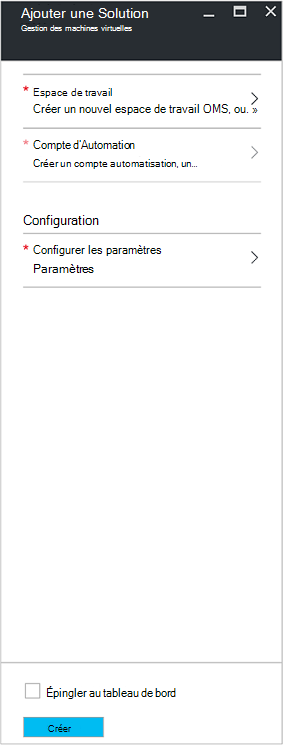
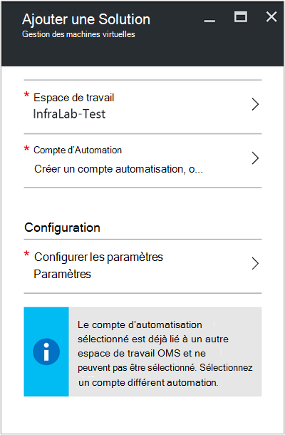
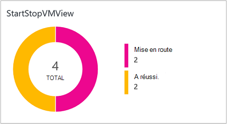
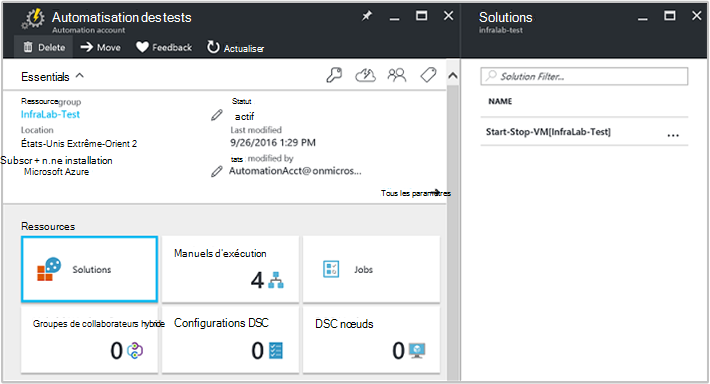
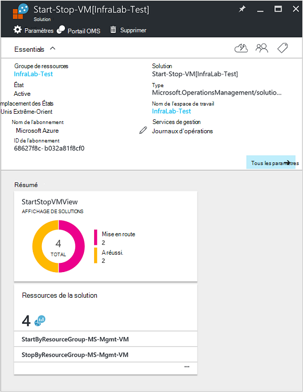

<properties
    pageTitle="Machines virtuelles début/fin au cours de la Solution dehors [Aperçu] | Microsoft Azure"
    description="Les solutions de gestion de la machine virtuelle démarre et arrête vos Machines virtuelles de gestionnaire de ressources Azure sur une planification et surveiller le fait de journal Analytique."
    services="automation"
    documentationCenter=""
    authors="MGoedtel"
    manager="jwhit"
    editor=""
    />
<tags
    ms.service="automation"
    ms.workload="tbd"
    ms.tgt_pltfrm="na"
    ms.devlang="na"
    ms.topic="get-started-article"
    ms.date="10/07/2016"
    ms.author="magoedte"/>

# Machines virtuelles début/fin au cours de la solution dehors [Aperçu] dans Automation

Les ordinateurs virtuels début/fin au cours de la solution dehors [Aperçu] démarre et arrête vos machines virtuelles Azure le Gestionnaire de ressources sur une planification définie par l’utilisateur et offre un aperçu du succès des tâches Automation start et stop vos machines virtuelles avec OMS journal Analytique.  

## Conditions préalables

- Les procédures opérationnelles travailler avec un [compte Azure exécuter en tant que](automation-sec-configure-azure-runas-account.md).  Le compte Exécuter en tant qu’est la méthode d’authentification préférée car elle utilise l’authentification par certificat au lieu d’un mot de passe peut arriver à expiration ou changent fréquemment.  

- Cette solution peut gérer uniquement des ordinateurs virtuels qui se trouvent dans le même abonnement et le groupe de ressources qu’où réside le compte d’automatisation.  

- Cette solution déploie uniquement sur les régions Azure suivantes - Australie sud-est, États-Unis Extrême-Orient, Asie du Sud-est et Europe ouest.  Les procédures opérationnelles gérer la planification de machine virtuelle pouvez cibler machines virtuelles dans n’importe quelle région.  

- Pour envoyer des notifications par courrier électronique lorsque les procédures opérationnelles machine virtuelle start et stop terminer, un abonnement d’échelle de l’entreprise Office 365 est requis.  

## Composants de la solution

Cette solution se compose des ressources suivantes qui seront importés et ajoutés à votre compte Automation.

### Procédures opérationnelles

Runbook | Description|
--------|------------|
CleanSolution MS-gestion de la mémoire virtuelle | Cette procédure opérationnelle entraîne la suppression des ressources tout le contenu et les prévisions lorsque vous accédez à supprimer de la solution de votre abonnement.|  
Gestion de MS SendMailO365 | Cette procédure opérationnelle envoie un message électronique via Office 365 Exchange.|
StartByResourceGroup MS-gestion de la mémoire virtuelle | Cette procédure opérationnelle est destiné à démarrer machines virtuelles (les deux classique et machines virtuelles basés sur ARM) qui se trouve dans une liste de groupes auxquels les ressources Azure donnée.
StopByResourceGroup MS-gestion de la mémoire virtuelle | Cette procédure opérationnelle est destiné à arrêter machines virtuelles (les deux classique et machines virtuelles basés sur ARM) qui se trouve dans une liste de groupes auxquels les ressources Azure donnée.|
 

### Variables

Variable | Description|
---------|------------|
**Gestion de MS SendMailO365** Runbook ||
Données de gestion des IsSendEmail SendMailO365 MS | Spécifie si StartByResourceGroup MS-gestion de la mémoire virtuelle et procédures opérationnelles StopByResourceGroup MS-gestion de la machine virtuelle peuvent envoyer notification par courrier électronique à la fin.  Sélectionnez **Vrai** pour activer et **faux** pour désactiver les alertes de messagerie. Valeur par défaut est **False**.| 
**StartByResourceGroup MS-gestion de la mémoire virtuelle** Runbook ||
StartByResourceGroup-ExcludeList-MS-gestion-machine virtuelle | Entrez les noms de machine virtuelle à exclure de l’opération de gestion ; Séparez les noms à l’aide de point-virgule ( ;). Valeurs respectent la casse et génériques (astérisque) est pris en charge.|
Gestion du MS EmailBodyPreFix StartByResourceGroup SendMailO365 | Texte qui peut être ajouté au début du corps du message électronique.|
Gestion du MS EmailRunBookAccount StartByResourceGroup SendMailO365 | Spécifie le nom du compte Automation qui contient le runbook de messagerie.  **Ne modifiez pas cette variable.**|
Gestion du MS EmailRunbookName StartByResourceGroup SendMailO365 | Spécifie le nom du runbook de la messagerie électronique.  Cela est utilisé par les StartByResourceGroup MS-gestion de la mémoire virtuelle et les procédures opérationnelles StopByResourceGroup MS-gestion de la mémoire virtuelle pour envoyer des messages électroniques.  **Ne modifiez pas cette variable.**|
Gestion du MS EmailRunbookResourceGroup StartByResourceGroup SendMailO365 | Spécifie le nom du groupe de ressources qui contient le runbook de messagerie.  **Ne modifiez pas cette variable.**|
Gestion du MS EmailSubject StartByResourceGroup SendMailO365 | Spécifie le texte de la ligne d’objet du message.|  
Gestion du MS EmailToAddress StartByResourceGroup SendMailO365 | Spécifie l’ou les destinataires du message.  Entrez des noms différents à l’aide de point-virgule ( ;).|
StartByResourceGroup-TargetResourceGroups-MS-gestion-machine virtuelle | Entrez les noms de machine virtuelle à exclure de l’opération de gestion ; Séparez les noms à l’aide de point-virgule ( ;). Valeurs respectent la casse et génériques (astérisque) est pris en charge.  Valeur par défaut (astérisque) inclut tous les groupes de ressources de l’abonnement.|
StartByResourceGroup-TargetSubscriptionID-MS-gestion-machine virtuelle | Spécifie l’abonnement qui contient des machines virtuelles devant être gérés par cette solution.  Il doit être le même abonnement où réside le compte d’automatisation de cette solution.|
**StopByResourceGroup MS-gestion de la mémoire virtuelle** Runbook ||
StopByResourceGroup-ExcludeList-MS-gestion-machine virtuelle | Entrez les noms de machine virtuelle à exclure de l’opération de gestion ; Séparez les noms à l’aide de point-virgule ( ;). Valeurs respectent la casse et génériques (astérisque) est pris en charge.|
Gestion du MS EmailBodyPreFix StopByResourceGroup SendMailO365 | Texte qui peut être ajouté au début du corps du message électronique.|
Gestion du MS EmailRunBookAccount StopByResourceGroup SendMailO365 | Spécifie le nom du compte Automation qui contient le runbook de messagerie.  **Ne modifiez pas cette variable.**|
Gestion du MS EmailRunbookResourceGroup StopByResourceGroup SendMailO365 | Spécifie le nom du groupe de ressources qui contient le runbook de messagerie.  **Ne modifiez pas cette variable.**|
Gestion du MS EmailSubject StopByResourceGroup SendMailO365 | Spécifie le texte de la ligne d’objet du message.|  
Gestion du MS EmailToAddress StopByResourceGroup SendMailO365 | Spécifie l’ou les destinataires du message.  Entrez des noms différents à l’aide de point-virgule ( ;).|
StopByResourceGroup-TargetResourceGroups-MS-gestion-machine virtuelle | Entrez les noms de machine virtuelle à exclure de l’opération de gestion ; Séparez les noms à l’aide de point-virgule ( ;). Valeurs respectent la casse et génériques (astérisque) est pris en charge.  Valeur par défaut (astérisque) inclut tous les groupes de ressources de l’abonnement.|
StopByResourceGroup-TargetSubscriptionID-MS-gestion-machine virtuelle | Spécifie l’abonnement qui contient des machines virtuelles devant être gérés par cette solution.  Il doit être le même abonnement où réside le compte d’automatisation de cette solution.|  
 

### Calendriers

Planification | Description|
---------|------------|
Données de gestion des planning StartByResourceGroup MS | Planification de runbook StartByResourceGroup, qui effectue le démarrage de machines virtuelles gérées par cette solution.|
Données de gestion des planning StopByResourceGroup MS | Planification de runbook StopByResourceGroup, qui effectue l’arrêt de machines virtuelles gérées par cette solution.|

### Informations d’identification

Informations d’identification | Description|
-----------|------------|
O365Credential | Spécifie un compte d’utilisateur Office 365 valide pour envoyer des messages électroniques.  Obligatoire uniquement si la variable SendMailO365-IsSendEmail-MS-gestion des sont défini sur **True**.

## Configuration

Procédez comme suit pour ajouter les ordinateurs virtuels début/fin au cours de la solution dehors [Aperçu] à votre compte automatisation, puis configurez les variables pour personnaliser la solution.

1. À partir de l’écran Accueil dans le portail Azure, sélectionnez la vignette **Marketplace** .  Si la vignette n’est plus épinglée à votre écran d’accueil dans le volet de navigation de gauche, sélectionnez **Nouveau**.  
2. Dans la carte Marketplace, tapez **Machine virtuelle commencer** dans la zone de recherche et puis sélectionnez la solution **Machines virtuelles début/fin pendant dehors [Aperçu]** dans les résultats de recherche.  
3. Dans la carte de **Début/fin machines virtuelles pendant dehors [Aperçu]** pour la solution sélectionnée, passez en revue les informations de synthèse, puis sur **créer**.  
4. La carte **d’Ajouter la Solution** s’affiche lorsque vous êtes invité à configurer la solution avant que vous pouvez l’importer dans votre abonnement Automation.     
5.  Sur la carte **Ajouter la Solution** , sélectionnez **l’espace de travail** et ici un espace de travail OMS qui est lié à la même abonnement Azure figurant dans le compte Automation ou créer un nouvel espace de travail OMS.  Si vous ne disposez pas d’un espace de travail OMS, vous pouvez sélectionner **Créer un nouvel espace de travail** et sur la carte de **l’Espace de travail OMS** , effectuez les opérations suivantes : 
   - Spécifiez un nom pour le nouvel **Espace de travail OMS**.
   - Sélectionnez un **abonnement** à attacher en sélectionnant dans la liste déroulante si la valeur par défaut sélectionnée n’est pas appropriée.
   - **Groupe de ressources**, vous pouvez créer un nouveau groupe de ressources ou sélectionner un groupe de ressources existant.  
   - Sélectionnez un **emplacement**.  Actuellement les seuls emplacements fournies pour la sélection sont **Australie sud-est**, **États-Unis Extrême-Orient**, **Asie du Sud-est**et **Europe ouest**.
   - Sélectionnez un **niveau de prix**.  La solution est proposée en deux versions : libre et OMS payé niveau.  La couche libre a une limite de la quantité de données collectées tous les jours, période de rétention et runbook travail runtime minutes.  La couche OMS payé n’a pas une limite sur la quantité de données collectées quotidiennement.  

        > [AZURE.NOTE]
        > Lorsque la version autonome de payé couche est affiché en tant qu’option, il n’est pas applicable.  Si vous sélectionnez il et poursuivez la création de cette solution dans votre abonnement, il échouera.  Cela sera résolu lors de la sortie officielle cette solution. Si vous utilisez cette solution, il uniquement utiliser des minutes de travail automation et ouvrez une session réception.  La solution n’ajoute pas des nœuds OMS supplémentaires à votre environnement.  

6. Après avoir fourni les informations requises sur la carte de **l’espace de travail OMS** , cliquez sur **créer**.  Tandis que les informations sont vérifiées et l’espace de travail est créé, vous pouvez suivre la progression sous **Notifications** à partir du menu.  Vous revenez à la carte **d’Ajouter la Solution** .  
7. Dans la carte **Ajouter la Solution** , sélectionnez **Compte Automation**.  Si vous créez un nouvel espace de travail OMS, vous serez obligé de créer également un nouveau compte Automation qui sera associé avec le nouvel OMS espace de travail spécifié précédemment, y compris votre abonnement Azure, le groupe de ressources et la région.  Vous pouvez sélectionner **créer un compte d’automatisation** et sur la carte **compte Ajouter automatisation** , fournir les éléments suivants : 
  - Dans le champ **nom** , entrez le nom du compte Automation.

    Toutes les autres options sont automatiquement renseignées en fonction de l’espace de travail OMS sélectionné et ces options ne peut pas être modifiées.  Un compte Azure exécuter en tant qu’est la méthode d’authentification par défaut pour les procédures opérationnelles incluses dans cette solution.  Une fois que vous cliquez sur **OK**, les options de configuration sont validées et le compte Automation est créé.  Vous pouvez effectuer le suivi de sa progression sous **Notifications** à partir du menu. 

    Dans le cas contraire, vous pouvez sélectionner un compte existant Automation exécuter en tant que.  Notez que le compte que vous choisissez ne peuvent pas déjà être lié à un autre espace de travail OMS, dans le cas contraire un message s’affiche dans la carte pour vous informer.  S’il est déjà lié, vous devrez sélectionner un autre compte Automation exécuter en tant qu’ou créez-en une.    

8. Pour finir, sur la carte **Ajouter la Solution** , sélectionnez **Configuration** et la carte de **paramètres** s’affiche.  Sur la carte de **paramètres** , vous êtes invité à :  
   - Spécifier les **Noms de ResourceGroup cible**, qui est un nom de groupe de ressources qui contient des machines virtuelles devant être gérés par cette solution.  Vous pouvez entrer plusieurs noms et séparez-les par un point-virgule (valeurs respectent la casse).  À l’aide d’un caractère générique est prise en charge si vous voulez cible machines virtuelles dans tous les groupes de ressources de l’abonnement.
   - Sélectionnez un **calendrier** qui est une date et une heure pour démarrer et arrêter la virtuelle dans les groupes auxquels ressource cible périodique.  

10. Une fois que vous avez terminé la configuration des paramètres initiaux requis pour la solution, sélectionnez **créer**.  Tous les paramètres sont validées et puis il tentera de déployer la solution dans votre abonnement.  Ce processus peut prendre quelques secondes pour terminer et vous pouvez suivre la progression sous **Notifications** à partir du menu. 

## Fréquence de collection de sites

Automatisation travail journal et une tâche de flux des données sont intégrées dans le référentiel OMS toutes les cinq minutes.  

## À l’aide de la solution

Lorsque vous ajoutez la solution de gestion de la mémoire virtuelle, dans votre espace de travail OMS la **Vue StartStopVM** vignette est ajoutée à votre tableau de bord OMS.  Cette vignette affiche un nombre et une représentation graphique des procédures opérationnelles tâches pour la solution ont commencé et sont terminées avec succès.     

Dans votre compte Automation, vous pouvez accéder et gérer la solution en sélectionnant la vignette de **Solutions** , puis de la carte de **Solutions** , en sélectionnant la solution **Début-arrêt-machine virtuelle [Workspace]** dans la liste.     

Activer la solution permet d’afficher la carte de solution **Début-arrêt-machine virtuelle [Workspace]** , dans laquelle vous pouvez consulter des informations importantes telles que la vignette **StartStopVM** , comme dans votre espace de travail OMS, qui affiche un nombre et une représentation graphique des procédures opérationnelles tâches pour la solution ont commencé et sont terminées avec succès.     

À partir de là, vous pouvez également ouvrir votre espace de travail OMS et analyser plus en détail les enregistrements de tâche.  Simplement sur **tous les paramètres**et dans la carte de **paramètres** , sélectionnez **Démarrage rapide** , puis dans la carte de **Démarrage rapide** **OMS portail**.   Vous ouvrez un nouvel onglet ou une nouvelle session de navigateur et présenter votre espace de travail OMS associé à votre compte d’automatisation et d’abonnement.  

### Configuration des notifications par courrier électronique

Pour activer les notifications par courrier électronique lorsque les début et arrêt machine virtuelle procédures opérationnelles terminées, que vous devez modifier **O365Credential** des informations d’identification et au minimum, les variables suivantes :

 - Données de gestion des IsSendEmail SendMailO365 MS
 - Gestion du MS EmailToAddress StartByResourceGroup SendMailO365
 - Gestion du MS EmailToAddress StopByResourceGroup SendMailO365

Pour configurer les informations d’identification **O365Credential** , effectuez les opérations suivantes :

1. À partir de votre compte automatisation, cliquez sur **Tous les paramètres** en haut de la fenêtre. 
2. Dans la carte de **paramètres** sous la section **Automatisation ressources**, sélectionnez **actifs**. 
3. Sur la carte **actifs** , sélectionnez la vignette **d’informations d’identification** et à partir de la carte **d’informations d’identification** , sélectionnez **O365Credential**.  
4. Entrez un nom d’utilisateur Office 365 valide et un mot de passe, puis sur **Enregistrer** pour enregistrer vos modifications.  

Pour configurer les variables mises en évidence précédemment, procédez comme suit :

1. À partir de votre compte automatisation, cliquez sur **Tous les paramètres** en haut de la fenêtre. 
2. Dans la carte de **paramètres** sous la section **Automatisation ressources**, sélectionnez **actifs**. 
3. Sur la carte **actifs** , sélectionnez la vignette de **Variables** et à partir de la carte de **Variables** , sélectionnez la variable répertoriée ci-dessus, puis modifiez son suivantes valeur la description pour qu’elle spécifiée dans la section [variable](##variables) précédemment.  
4. Cliquez sur **Enregistrer** pour enregistrer les modifications apportées à la variable.   

### Modification de la planification de démarrage et d’arrêt

Gestion de la planification de démarrage et d’arrêt dans cette solution suit la même procédure comme indiqué dans la [planification d’une procédure opérationnelle dans Azure Automation](automation-scheduling-a-runbook.md).  N’oubliez pas, vous ne pouvez pas modifier la configuration de la planification.  Vous devez désactiver la planification existante et créez un nouvel enregistrement, puis lier à la **StartByResourceGroup MS-gestion de la mémoire virtuelle** ou runbook **StopByResourceGroup MS-gestion de la machine virtuelle** que vous souhaitez appliquer à la planification.   

## Les enregistrements Analytique de journal

Automatisation crée deux types d’enregistrements dans le référentiel OMS.

### Journaux de travail

Propriété | Description|
----------|----------|
Appelant |  Qui a initié l’opération.  Valeurs possibles sont une adresse de messagerie ou un système pour les tâches planifiées.|
Catégorie | Classification du type de données.  Pour l’automatisation, la valeur est JobLogs.|
ID de corrélation | GUID qui est l’Id de corrélation de la tâche runbook.|
ID de travail | GUID qui correspond à l’Id de la tâche runbook.|
NomOpération | Spécifie le type d’opération effectuée dans Azure.  Pour l’automatisation, la valeur sera travail.|
resourceId | Spécifie le type de ressource dans Azure.  Pour l’automatisation, la valeur est le compte Automation associé à la procédure opérationnelle.|
ResourceGroup | Spécifie le nom du groupe de ressources de la tâche runbook.|
ResourceProvider | Spécifie le service Azure qui fournit les ressources, vous pouvez déployer et gérer.  Pour l’automatisation, la valeur est Automation Azure.|
Type de ressource | Spécifie le type de ressource dans Azure.  Pour l’automatisation, la valeur est le compte Automation associé à la procédure opérationnelle.|
resultType | L’état de la tâche runbook.  Les valeurs possibles sont : -Mise en route -Arrêté -Suspendue -A échoué -A réussi.|
resultDescription | Décrit l’état de résultat de travail runbook.  Les valeurs possibles sont : -Travail est démarré : Échoué de la tâche -Fin du travail|
RunbookName | Spécifie le nom de la procédure opérationnelle.|
SourceSystem | Spécifie le système source pour les données envoyées.  Pour l’automatisation, la valeur sera : OpsManager|
StreamType | Spécifie le type d’événement. Les valeurs possibles sont : -Détaillée -Sortie -Erreur -Avertissement|
SubscriptionId | Spécifie l’ID de l’abonnement de la tâche.
Heure | Date et heure lorsque la tâche runbook exécutée.|

### Flux de travail

Propriété | Description|
----------|----------|
Appelant |  Qui a initié l’opération.  Valeurs possibles sont une adresse de messagerie ou un système pour les tâches planifiées.|
Catégorie | Classification du type de données.  Pour l’automatisation, la valeur est JobStreams.|
ID de travail | GUID qui correspond à l’Id de la tâche runbook.|
NomOpération | Spécifie le type d’opération effectuée dans Azure.  Pour l’automatisation, la valeur sera travail.|
ResourceGroup | Spécifie le nom du groupe de ressources de la tâche runbook.|
resourceId | Spécifie la ressource Id dans Azure.  Pour l’automatisation, la valeur est le compte Automation associé à la procédure opérationnelle.|
ResourceProvider | Spécifie le service Azure qui fournit les ressources, vous pouvez déployer et gérer.  Pour l’automatisation, la valeur est Automation Azure.|
Type de ressource | Spécifie le type de ressource dans Azure.  Pour l’automatisation, la valeur est le compte Automation associé à la procédure opérationnelle.|
resultType | Le résultat de la tâche runbook au moment de que la génération de l’événement.  Les valeurs possibles sont : -InProgress|
resultDescription | Inclut le flux de sortie à partir de la procédure opérationnelle.|
RunbookName | Le nom de la procédure opérationnelle.|
SourceSystem | Spécifie le système source pour les données envoyées.  Pour l’automatisation, la valeur sera OpsManager|
StreamType | Le type de flux de travail. Les valeurs possibles sont : -Progression -Sortie -Avertissement -Erreur -Débogage -Détaillée|
Heure | Date et heure lorsque la tâche runbook exécutée.|

Lorsque vous effectuez une recherche de journal qui renvoie les enregistrements de la catégorie de **JobLogs** ou **JobStreams**, vous pouvez sélectionner l’affichage **JobLogs** ou **JobStreams** qui affiche une série de vignettes synthétiser les mises à jour renvoyés par la recherche.

## Exemple journal des recherches

Le tableau suivant fournit des exemples journal recherches pour les enregistrements tâche collectées par cette solution. 

Requête | Description|
----------|----------|
Rechercher des travaux de runbook StartVM qui ont été achevées | Catégorie = JobLogs RunbookName_s = ResultType « StartByResourceGroup-MS-gestion-machine virtuelle » = a réussi & #124 ; mesurer Nb() par JobId_g|
Rechercher des travaux de runbook StopVM qui ont été achevées | Catégorie = JobLogs RunbookName_s = « StartByResourceGroup-MS-gestion-machine virtuelle » ResultType = échec & #124 ; mesurer Nb() par JobId_g
Afficher le statut de la tâche au fil du temps pour les procédures opérationnelles StartVM et StopVM | Catégorie = JobLogs RunbookName_s = NOT(ResultType="started") « StartByResourceGroup-MS-gestion-machine virtuelle » ou « StopByResourceGroup-MS-gestion-machine virtuelle » | mesurer Count() par intervalle ResultType 1 jour|

## Étapes suivantes

- Pour plus d’informations sur la création de requêtes de recherche différente et passez en revue les journaux de travail Automation avec journal Analytique, voir [journal des recherches dans journal Analytique](../log-analytics/log-analytics-log-searches.md)
- Pour en savoir plus sur l’exécution du runbook, comment faire pour surveiller runbook des travaux et d’autres détails techniques, voir [suivi un travail runbook](automation-runbook-execution.md)
- Pour en savoir plus sur OMS journal Analytique et des sources de données collection de sites, voir [Azure collecte des données de stockage en vue d’ensemble du journal Analytique](../log-analytics/log-analytics-azure-storage.md)

   

