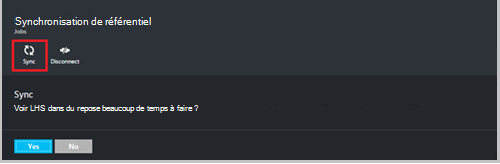
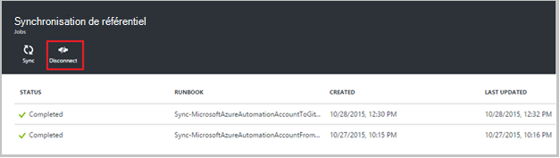

<properties 
    pageTitle=" Intégration de commande dans Azure Automation source | Microsoft Azure"
    description="Cet article décrit l’intégration de contrôle de source avec GitHub dans Azure Automation."
    services="automation"
    documentationCenter=""
    authors="mgoedtel"
    manager="jwhit"
    editor="tysonn" />    
<tags 
    ms.service="automation"
    ms.devlang="na"
    ms.topic="article"
    ms.tgt_pltfrm="na"
    ms.workload="infrastructure-services"
    ms.date="09/12/2016"
    ms.author="magoedte;sngun" />

# Intégration du contrôle de source dans Azure Automation

Intégration du contrôle de source permet d’associer des procédures opérationnelles dans votre compte Automation à un référentiel de contrôle de source GitHub. Contrôle de code source vous permet de collaborer avec votre équipe, suivi des modifications et revenir à des versions antérieures des procédures opérationnelles facilement. Par exemple, contrôle de code source vous permet de synchroniser les différentes branches dans le contrôle de source à vos comptes Automation développement, de test ou de production, ce qui facilite la promouvoir code qui a été testé dans votre environnement de développement pour votre compte d’automatisation de production.

Contrôle de code source permet de code à partir d’Azure Automation au contrôle de source extraction ou les procédures opérationnelles du contrôle de source à l’Automation Azure. Cet article décrit comment configurer le contrôle de code source dans votre environnement Automation Azure. Nous allons commencer en configurant Azure Automation pour accéder à votre référentiel GitHub et passez en revue les différentes opérations qui peuvent être effectuées à l’aide d’intégration du contrôle de source. 

>[AZURE.NOTE]Contrôle de code source prend en charge tirant et reçue [du flux de travail PowerShell procédures opérationnelles](automation-runbook-types.md#powershell-workflow-runbooks) , ainsi que les [procédures opérationnelles PowerShell](automation-runbook-types.md#powershell-runbooks). [Procédures opérationnelles graphique](automation-runbook-types.md#graphical-runbooks) ne sont pas encore pris en charge.  

Il existe deux étapes simples requises pour configurer le contrôle de code source pour votre compte d’automatisation et une seule si vous possédez déjà un compte GitHub. Ils sont :
## Étape 1 : créer un référentiel GitHub

Si vous possédez déjà un compte GitHub et un référentiel de votre choix pour créer un lien vers Azure automatisation, puis connectez-vous à votre compte existant et commencer à l’étape 2 ci-dessous. Dans le cas contraire, accédez à [GitHub](https://github.com/), signe vers le haut pour un nouveau compte et [créer un nouveau référentiel](https://help.github.com/articles/create-a-repo/).

## Étape 2 : configurer le contrôle de source dans Azure Automation

1. À partir de la carte Automation compte dans le portail Azure, cliquez sur **définir la Source contrôle.** 
 
    

2. La carte de **Contrôle de code Source** s’ouvre dans laquelle vous pouvez configurer vos informations de compte GitHub. Voici la liste des paramètres pour configurer :  

  	|**Paramètre**            |**Description** |
  	|:---|:---| 
  	|Choisissez la Source   | Sélectionnez la source. Pour l’instant, uniquement **GitHub** est pris en charge. |
  	|Autorisation | Cliquez sur le bouton **Autoriser** pour accorder l’accès à votre référentiel GitHub Automation Azure. Si vous n’êtes déjà connecté à votre compte GitHub dans une fenêtre distincte, les informations d’identification de ce compte sont utilisées. Une fois que l’autorisation réussit, la carte affiche votre nom d’utilisateur GitHub sous **Propriété d’autorisation**. |
  	|Choisissez le référentiel | Sélectionnez un référentiel GitHub dans la liste des référentiels disponibles. |
  	|Choisissez branche | Sélectionnez la branche dans la liste des branches disponibles. Uniquement la branche **maître** s’affiche si vous n’avez pas créé les branches. |
  	|Chemin d’accès du dossier Runbook | Le chemin du dossier runbook Spécifie le chemin d’accès dans le référentiel GitHub à partir de laquelle vous souhaitez extraction ou votre code. Il doit figurer dans le format **/foldername/subfoldername**. Uniquement les procédures opérationnelles dans le chemin du dossier runbook sont synchronisés avec votre compte Automation. Procédures opérationnelles dans les sous-dossiers de la procédure opérationnelle dossier s’affichera **pas** synchronisés. Utiliser **/** pour synchroniser toutes les procédures opérationnelles sous le référentiel. |

3. Par exemple, si vous disposez d’un référentiel nommé **PowerShellScripts** qui contient un dossier nommé **RootFolder**, qui contient un dossier nommé **sous-dossier**. Vous pouvez utiliser les chaînes suivantes pour synchroniser chaque niveau de dossier :

    1. Pour synchroniser les procédures opérationnelles **référentiel**, le chemin du dossier runbook est*/*
    2. Pour synchroniser les procédures opérationnelles de **RootFolder**, chemin du dossier runbook est */RootFolder*
    3. Pour synchroniser les procédures opérationnelles **sous-dossier**, le chemin d’accès de runbook dossier est */RootFolder/SubFolder*.
  

4. Après avoir configuré les paramètres, ils sont affichés dans la **carte définir la Source contrôle.**  
 
    

5. Une fois que vous cliquez sur OK, intégration du contrôle de source est désormais configurée pour votre compte Automation et doit être mis à jour avec vos informations de GitHub. Vous pouvez maintenant cliquer sur ce composant pour afficher l’ensemble de l’historique du travail source contrôle synchronisation.  

    

6. Une fois que vous configurez le contrôle de code source, les ressources suivantes Automation seront créés dans votre compte automatisation :  
 Deux [variables actifs](automation-variables.md) sont créés.  
      
    * La variable **Microsoft.Azure.Automation.SourceControl.Connection** contient les valeurs de la chaîne de connexion, comme illustré ci-dessous.  

  	|**Paramètre**            |**Valeur** |
  	|:---|:---|
  	| Nom  | Microsoft.Azure.Automation.SourceControl.Connection |
  	| Type | Chaîne |
  	| Valeur  | {« Branche » :\<*votre nom de la succursale*>, « RunbookFolderPath » :\<*chemin du dossier Runbook*>, « ProviderType » :\<*a la valeur 1 pour GitHub*>, « Référentiel » :\<*nom de votre référentiel*>, « Nom d’utilisateur » :\<*GitHub votre nom d’utilisateur*>} |   

    * La variable **Microsoft.Azure.Automation.SourceControl.OAuthToken**, contient la valeur chiffrée sécurisée de votre OAuthToken.  

  	|**Paramètre**            |**Valeur** |
  	|:---|:---|
  	| Nom  | Microsoft.Azure.Automation.SourceControl.OAuthToken |
  	| Type | Unknown(Encrypted) |
  	| Valeur | <*OAuthToken chiffré*> |  

      

    * **Contrôle de code Source Automation** est ajouté comme application autorisée à votre compte GitHub. Pour afficher l’application : à partir de votre page d’accueil GitHub, accédez à votre **profil** > **paramètres** > **Applications**. Cette application permet d’automatiser Azure synchroniser votre référentiel GitHub à un compte Automation.  

    

## À l’aide de contrôle de code Source dans Automation

### Archiver un runbook à partir d’Azure Automation au contrôle de source

Archiver Runbook vous permet de distribuer les modifications apportées à un runbook dans Azure Automation dans votre référentiel de contrôle de source. Voici les étapes à archiver un runbook :

1. À partir de votre compte automatisation, [créer une nouvelle runbook textuel](automation-first-runbook-textual.md)ou [Modifier un runbook existant, textuel](automation-edit-textual-runbook.md). Cette procédure opérationnelle peut être un flux de travail PowerShell ou un runbook de script PowerShell.  

2. Après avoir modifié votre runbook, enregistrez-le et cliquez sur **Archiver** à partir de la carte à **Modifier** .  

    

     >[AZURE.NOTE] Archiver d’automatisation Azure remplacera le code qui existe dans le contrôle de source. L’instruction de ligne de commande équivalent Git à archiver est **git ajouter + valider git + git de transmission**  

3. Lorsque vous cliquez sur **Archiver**, vous serez invité à un message de confirmation, cliquez sur Oui pour continuer.  

    

4. Archivage démarre le runbook de contrôle de source : **Synchronisation MicrosoftAzureAutomationAccountToGitHubV1**. Cette procédure opérationnelle se connecte à GitHub et diffuse les modifications à partir d’Azure Automation vers votre référentiel. Pour afficher l’historique des travaux archivage, revenez à l’onglet **Intégration du contrôle de Source** , puis cliquez sur pour ouvrir la carte de synchronisation référentiel. Cette carte affiche tous vos projets de contrôle de source.  Sélectionnez la tâche que vous souhaitez afficher, cliquez sur pour afficher les détails.  

    

    >[AZURE.NOTE] Procédures opérationnelles source contrôle sont spécial procédures opérationnelles Automation que vous ne pouvez pas afficher ou modifier. Pendant qu’ils s’affichera pas dans votre liste de runbook, vous verrez les travaux de synchronisation apparaît dans votre liste de tâches.
 
5. Le nom de la procédure opérationnelle modifié est envoyé en tant que paramètre d’entrée à la runbook archivage. Vous pouvez [Afficher les détails d’une tâche](automation-runbook-execution.md#viewing-job-status-using-the-azure-management-portal) en développement runbook dans carte **Référentiel de synchronisation** .  

    

6. Actualisez votre référentiel GitHub une fois que le travail est terminé pour afficher les modifications.  Une validation doit figurer dans votre référentiel avec un message de validation : *Nom de Runbook *mis à jour ** dans Azure Automation.* *  

### Procédures opérationnelles synchronisation du contrôle de source à l’Automation Azure 

Le bouton Synchroniser sur la carte de synchronisation référentiel vous permet extraire tous les procédures opérationnelles dans le chemin du dossier runbook de votre référentiel à votre compte Automation. Le même référentiel de peut être synchronisé avec plusieurs comptes Automation. Voici les étapes pour synchroniser un runbook :

1. À partir du compte Automation où vous configurez le contrôle de code source, ouvrez la **carte Source contrôle intégration/référentiel synchronisation** et cliquez sur **synchroniser** , puis vous êtes invité par un message de confirmation, cliquez sur **Oui** pour continuer.  

    

2. Synchronisation démarre le runbook : **Synchronisation MicrosoftAzureAutomationAccountFromGitHubV1**. Cette procédure opérationnelle se connecte à GitHub et extraie les modifications de votre référentiel à Automation Azure. Vous devriez voir une nouvelle tâche sur la carte **Référentiel de synchronisation** pour cette action. Pour afficher plus d’informations sur la tâche de synchronisation, cliquez sur pour ouvrir la carte de détails de la tâche.  
 
    

 
    >[AZURE.NOTE] Une synchronisation du contrôle de source remplace la version brouillon de la procédures opérationnelles qui existent actuellement dans votre compte Automation pour **toutes les** procédures opérationnelles qui se trouvent dans le contrôle de code source. L’instruction de ligne de commande équivalent Git synchroniser est **git extraire**

## Résolution des problèmes de contrôle de source

S’il existe des erreurs à un travail d’archivage ou de la synchronisation, l’état du travail doit être suspendu et vous pouvez afficher plus d’informations sur l’erreur dans la carte de projet.  Le composant de **Tous les journaux** montre tous les flux de PowerShell associés à cette tâche. Cela vous fournira les informations nécessaires pour vous aider à résoudre des problèmes avec votre archivage ou de la synchronisation. Il vous apparaît également la séquence d’actions qui s’est produite lors de la synchronisation ou un runbook de vérification.  

## Déconnexion de contrôle de code source

Pour vous déconnecter de votre compte GitHub, ouvrez la carte de synchronisation référentiel et cliquez sur **se déconnecter**. Une fois que vous vous déconnectez de contrôle de code source, procédures opérationnelles qui ont été synchronisées précédemment resteront toujours dans votre compte d’automatisation, mais la carte référentiel synchronisation ne sera pas activé.  

  

## Étapes suivantes

Pour plus d’informations sur l’intégration du contrôle de source, consultez les ressources suivantes :  
- [Azure d’automatisation : Intégration du contrôle de Source dans Automation Azure](https://azure.microsoft.com/blog/azure-automation-source-control-13/)  
- [Voter pour votre système de contrôle de code source favoris](https://www.surveymonkey.com/r/?sm=2dVjdcrCPFdT0dFFI8nUdQ%3d%3d)  
- [: Azure intégration Runbook Source contrôle d’automatisation à l’aide de Visual Studio Team Services](https://azure.microsoft.com/blog/azure-automation-integrating-runbook-source-control-using-visual-studio-online/)  
