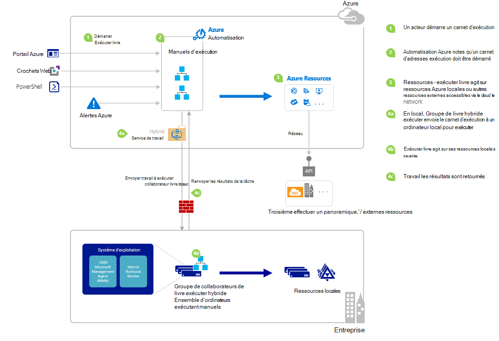

<properties
   pageTitle="Démarrage d’un runbook dans Azure automatisation | Microsoft Azure"
   description="Résume les différentes méthodes qui peuvent être utilisés pour démarrer une procédure opérationnelle dans Azure Automation et fournit des informations sur l’utilisation de portail Azure et Windows PowerShell."
   services="automation"
   documentationCenter=""
   authors="mgoedtel"
   manager="jwhit"
   editor="tysonn" />
<tags
   ms.service="automation"
   ms.devlang="na"
   ms.topic="article"
   ms.tgt_pltfrm="na"
   ms.workload="infrastructure-services"
   ms.date="10/08/2016"
   ms.author="magoedte;bwren"/>

# <a name="starting-a-runbook-in-azure-automation"></a>Démarrage d’un runbook dans Azure Automation

Le tableau suivant vous aidera à déterminer la méthode pour démarrer une procédure opérationnelle dans Automation Azure qui convient le mieux à votre situation. Cet article contient des détails sur le démarrage d’un runbook avec le portail Azure et avec Windows PowerShell. Plus d’informations sur les autres méthodes sont fournies dans les autres documents que vous pouvez accéder depuis les liens ci-dessous.

| **MÉTHODE**                                                                    | **CARACTÉRISTIQUES**                                                                                                                                                                                                                                                                                                                                                |
|-------------------------------------------------------------------------------|--------------------------------------------------------------------------------------------------------------------------------------------------------------------------------------------------------------------------------------------------------------------------------------------------------------------------------------------------------------------|
| [Portail Azure](#starting-a-runbook-with-the-azure-portal)                     | <li>Méthode la plus simple avec interface utilisateur interactive.<br> <li>Formulaire pour fournir des valeurs de paramètre simple.<br> <li>Suivre facilement l’état de la tâche.<br> <li>Accès authentifié avec Azure d’ouverture de session.                                                                                                                                                                               |
| [Windows PowerShell](https://msdn.microsoft.com/library/dn690259.aspx)        | <li>Appelez à partir de la ligne de commande avec les applets de commande Windows PowerShell.<br> <li>Peuvent être incluses dans la solution automatisée avec plusieurs étapes.<br> <li>Demande est authentifiée auprès de certificat ou jeton utilisateur principal / service principal.<br> <li>Indiquez les valeurs de paramètre simples et complexes.<br> <li>Effectuer le suivi d’état de la tâche.<br> <li>Client doit prendre en charge les applets de commande PowerShell. |
| [API d’automatisation Azure](https://msdn.microsoft.com/library/azure/mt662285.aspx) | <li>Méthode la plus flexible, mais également plus complexes.<br> <li>Appelez à partir de n’importe quel code personnalisé qui peut envoyer des demandes HTTP.<br> <li>Demande authentifié avec un certificat ou jeton utilisateur principal / service principal.<br> <li>Indiquez les valeurs de paramètre simples et complexes.<br> <li>Effectuer le suivi d’état de la tâche.                                                                          |
| [Webhooks](automation-webhooks.md)                                            | <li>Démarrez runbook à partir de la requête HTTP unique.<br> <li>Authentifié auprès du jeton de sécurité dans l’URL.<br> <li>Client ne peut pas remplacer les valeurs de paramètre spécifiées lors de la création de webhook. Runbook pouvez définir le paramètre unique qui est remplie avec les détails de demande HTTP.<br> <li>Pas la possibilité pour effectuer le suivi d’état du travail via webhook URL.                                      |
| [Répondre à une alerte Azure](../log-analytics/log-analytics-alerts.md)               | <li>Démarrer un runbook en réponse à une alerte Azure.<br> <li>Configurer webhook pour runbook et lien vers des alertes.<br> <li>Authentifié auprès du jeton de sécurité dans l’URL.<br> <li>Prend actuellement en charge alerte métriques uniquement.                                                                                                                                                       |
| [Planification](automation-schedules.md)                                | <li>Démarrer automatiquement runbook sur planification horaire, quotidienne ou hebdomadaire.<br> <li>Manipuler programmer via le portail Azure applets de commande PowerShell, API ou Azure.<br> <li>Indiquez les valeurs de paramètre à utiliser avec la planification.                                                                                                                                               |
| [À partir d’un autre Runbook](automation-child-runbooks.md)                          | <li>Utiliser un runbook comme une activité dans une autre procédure opérationnelle.<br> <li>Utile pour les fonctionnalités utilisées par plusieurs procédures opérationnelles.<br> <li>Indiquez les valeurs de paramètre à enfant runbook et utilisez sortie runbook parent.                                                                                                                                                               |

L’image suivante illustre le processus pas à pas détaillé dans le cycle de vie d’un runbook. Il inclut un runbook est démarré dans Azure Automation, composants requis pour hybride Runbook collaborateur pour exécuter les procédures opérationnelles Azure Automation et interactions entre les différents composants de différentes manières. Pour en savoir plus sur l’exécution de procédures opérationnelles Automation dans votre centre de données, reportez-vous aux [travailleurs de runbook hybride](automation-hybrid-runbook-worker.md)



## <a name="starting-a-runbook-with-the-azure-portal"></a>Démarrage d’un runbook grâce au portail Azure

1.  Dans le portail Azure, sélectionnez **Automation** et puis cliquez sur le nom d’un compte d’automatisation.
2.  Sélectionnez l’onglet **procédures opérationnelles** .
3.  Sélectionnez un runbook, puis cliquez sur **Démarrer**.
4.  Si la runbook comporte des paramètres, vous devra pour fournir des valeurs avec une zone de texte pour chaque paramètre. Voir [Runbook paramètres](#Runbook-parameters) ci-dessous pour plus d’informations sur les paramètres.
5.  Sélectionnez **Afficher la tâche** en regard du message runbook de **départ** ou sélectionnez l’onglet **tâches** pour la runbook afficher l’état du travail runbook.

## <a name="starting-a-runbook-with-the-azure-portal"></a>Démarrage d’un runbook grâce au portail Azure

1.  À partir de votre compte automatisation, cliquez sur le composant de **procédures opérationnelles** pour ouvrir la carte de **procédures opérationnelles** .
2.  Cliquez sur une procédure opérationnelle pour ouvrir sa carte **Runbook** .
3.  Cliquez sur **Démarrer**.
4.  Si la procédure opérationnelle n’a aucun paramètre, vous devrez confirmer si vous souhaitez démarrer. Si la runbook comporte des paramètres, la carte **Runbook démarrer** s’ouvre pour vous permettre de valeurs de paramètre. Voir [Runbook paramètres](#Runbook-parameters) ci-dessous pour plus d’informations sur les paramètres.
5.  La carte de **projet** est ouvert, afin que vous pouvez effectuer le suivi de statut de la tâche.

## <a name="starting-a-runbook-with-windows-powershell"></a>Démarrage d’un runbook avec Windows PowerShell

Vous pouvez utiliser [Démarrage AzureRmAutomationRunbook](https://msdn.microsoft.com/library/mt603661.aspx) pour démarrer une runbook avec Windows PowerShell. Le code suivant démarre une procédure opérationnelle appelée Runbook de Test.

```
Start-AzureRmAutomationRunbook -AutomationAccountName "MyAutomationAccount" -Name "Test-Runbook" -ResourceGroupName "ResourceGroup01"
```

Démarrage AzureRmAutomationRunbook renvoie un objet de travail que vous pouvez utiliser pour effectuer le suivi de son statut une fois que le runbook est démarré. Vous pouvez ensuite utiliser cet objet travail avec [Get-AzureRmAutomationJob](https://msdn.microsoft.com/library/mt619440.aspx) pour déterminer l’état de la tâche et [Get-AzureRmAutomationJobOutput](https://msdn.microsoft.com/library/mt603476.aspx) pour obtenir le résultat. Le code suivant démarre un runbook appelé Test-Runbook, attend qu’il est terminée et puis affiche le résultat.

```
$runbookName = "Test-Runbook"
$ResourceGroup = "ResourceGroup01"
$AutomationAcct = "MyAutomationAccount"

$job = Start-AzureRmAutomationRunbook –AutomationAccountName $AutomationAcct -Name $runbookName -ResourceGroupName $ResourceGroup

$doLoop = $true
While ($doLoop) {
   $job = Get-AzureRmAutomationJob –AutomationAccountName $AutomationAcct -Id $job.JobId -ResourceGroupName $ResourceGroup
   $status = $job.Status
   $doLoop = (($status -ne "Completed") -and ($status -ne "Failed") -and ($status -ne "Suspended") -and ($status -ne "Stopped"))
}

Get-AzureRmAutomationJobOutput –AutomationAccountName $AutomationAcct -Id $job.JobId -ResourceGroupName $ResourceGroup –Stream Output
```

Si la procédure opérationnelle nécessite des paramètres, vous devez les fournir en tant que [table de hachage](http://technet.microsoft.com/library/hh847780.aspx) où la clé de la table de hachage correspond au nom de paramètre et la valeur est la valeur de paramètre. L’exemple suivant montre comment démarrer une procédure opérationnelle avec deux paramètres de chaîne nommés prénom et nom, un entier nommé RepeatCount et un paramètre booléen nommé Show. Pour plus d’informations sur les paramètres, voir [Paramètres Runbook](#Runbook-parameters) ci-dessous.

```
$params = @{"FirstName"="Joe";"LastName"="Smith";"RepeatCount"=2;"Show"=$true}
Start-AzureRmAutomationRunbook –AutomationAccountName "MyAutomationAccount" –Name "Test-Runbook" -ResourceGroupName "ResourceGroup01" –Parameters $params
```

## <a name="runbook-parameters"></a>Paramètres Runbook

Lorsque vous démarrez une procédure opérationnelle à partir du portail Azure ou Windows PowerShell, l’instruction est envoyée via le service web Automation Azure. Ce service ne prend pas en charge les paramètres avec des types de données complexes. Si vous avez besoin fournir une valeur pour un paramètre complexe, puis vous devez l’appeler en ligne à partir d’un autre runbook comme décrit dans les [procédures opérationnelles enfant dans Azure Automation](automation-child-runbooks.md).

Le service web Azure Automation fournit des fonctionnalités spéciales de paramètres en utilisant certains types de données, comme décrit dans les sections suivantes.

### <a name="named-values"></a>Valeurs nommées

Si le paramètre est de type de données (objet), puis vous pouvez utiliser le format JSON suivant pour envoyer une liste de valeurs nommées : *{nom1 : 'Valeur1', nom 2 : 'Valeur2', Name3 : 'Value3'}*. Ces valeurs doivent être des types simples. La procédure opérationnelle recevra le paramètre sous forme d’un [PSCustomObject](https://msdn.microsoft.com/library/system.management.automation.pscustomobject%28v=vs.85%29.aspx) avec les propriétés qui correspondent à chaque valeur nommée.

Vous pouvez le suivant runbook de test qui accepte un paramètre appelé utilisateur.

```
Workflow Test-Parameters
{
   param (
      [Parameter(Mandatory=$true)][object]$user
   )
    $userObject = $user | ConvertFrom-JSON
    if ($userObject.Show) {
        foreach ($i in 1..$userObject.RepeatCount) {
            $userObject.FirstName
            $userObject.LastName
        }
    }
}
```

Le texte peut être utilisé pour le paramètre utilisateur.

```
{FirstName:'Joe',LastName:'Smith',RepeatCount:'2',Show:'True'}
```

Ce produit le résultat suivant.

```
Joe
Smith
Joe
Smith
```

### <a name="arrays"></a>Tableaux

Si le paramètre est un tableau, par exemple [array] ou [vous pouvez ensuite utiliser au format JSON pour l’envoyer une liste de valeurs de chaîne []] : *[valeur1, valeur2, valeur3]*. Ces valeurs doivent être des types simples.

Vous pouvez le suivant runbook de test qui accepte un paramètre appelé *utilisateur*.

```
Workflow Test-Parameters
{
   param (
      [Parameter(Mandatory=$true)][array]$user
   )
    if ($user[3]) {
        foreach ($i in 1..$user[2]) {
            $ user[0]
            $ user[1]
        }
    }
}
```

Le texte peut être utilisé pour le paramètre utilisateur.

```
["Joe","Smith",2,true]
```

Ce produit le résultat suivant.

```
Joe
Smith
Joe
Smith
```

### <a name="credentials"></a>Informations d’identification

Si le paramètre est de type de données **PSCredential**, vous pouvez fournir le nom d’un Automation Azure [biens d’informations d’identification](automation-credentials.md). La procédure opérationnelle récupère les informations d’identification avec le nom que vous spécifiez.

Vous pouvez le suivant runbook de test qui accepte un paramètre appelé d’informations d’identification.

```
Workflow Test-Parameters
{
   param (
      [Parameter(Mandatory=$true)][PSCredential]$credential
   )
   $credential.UserName
}
```

Le texte peut être utilisé pour le paramètre utilisateur en supposant qu’il y a une ressource d’informations d’identification appelée *Mes informations d’identification*.

```
My Credential
```

En supposant que le nom d’utilisateur dans les informations d’identification a été *jsmith*, ce produit le résultat suivant.

```
jsmith
```

## <a name="next-steps"></a>Étapes suivantes

-   L’architecture runbook dans l’article en cours fournit une vue d’ensemble des procédures opérationnelles de gestion des ressources dans Azure et locales avec le travail Runbook hybride.  Pour en savoir plus sur l’exécution de procédures opérationnelles Automation dans votre centre de données, reportez-vous à [Hybride Runbook travailleurs](automation-hybrid-runbook-worker.md).
-   Pour en savoir plus sur les procédures opérationnelles modulaire création devant être utilisé par d’autres procédures opérationnelles pour les fonctions spécifiques ou courantes, consultez [Procédures opérationnelles enfant](automation-child-runbooks.md).
