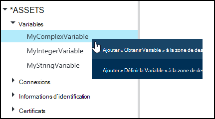
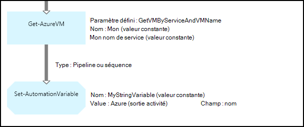
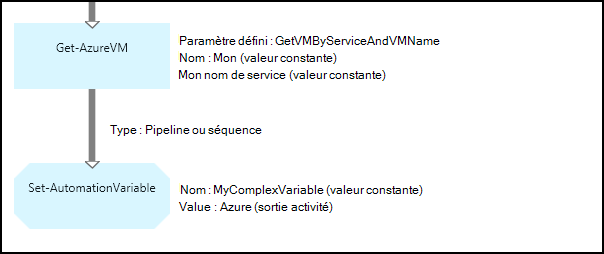
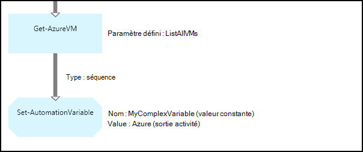
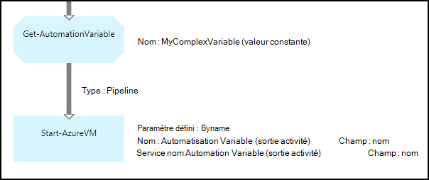
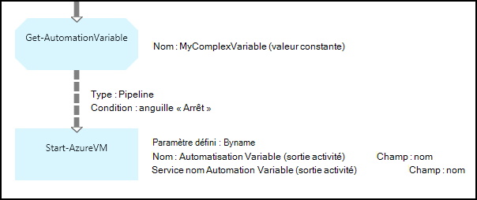

<properties 
   pageTitle="Variables actifs dans Azure automatisation | Microsoft Azure"
   description="Variables actifs sont des valeurs qui sont disponibles pour tous les procédures opérationnelles et configurations DSC dans Azure Automation.  Cet article explique les détails des variables et comment les utiliser dans textuelles et graphiques de création."
   services="automation"
   documentationCenter=""
   authors="mgoedtel"
   manager="jwhit"
   editor="tysonn" />
<tags 
   ms.service="automation"
   ms.devlang="na"
   ms.topic="article"
   ms.tgt_pltfrm="na"
   ms.workload="infrastructure-services"
   ms.date="05/24/2016"
   ms.author="magoedte;bwren" />

# Variables actifs dans Azure Automation

Variables actifs sont des valeurs qui sont disponibles pour tous les procédures opérationnelles et configurations DSC dans votre compte automation. Ils peuvent être créés, modifiés et récupérées à partir du portail Azure, Windows PowerShell et à partir d’une configuration de DSC ou runbook. Automatisation variables sont utiles pour les scénarios suivants :

- Partager une valeur comprise entre plusieurs procédures opérationnelles ou configurations DSC.

- Partager une valeur comprise entre plusieurs tâches à partir de la configuration de DSC ou même runbook.

- Gérer une valeur à partir du portail ou de la ligne de commande Windows PowerShell utilisé par les procédures opérationnelles ou configurations DSC.

Automatisation variables sont conservées afin qu’ils continuent à être disponible même si la configuration de DSC ou runbook échoue.  Ceci permet également d’une valeur à définir en un seul runbook qui est ensuite utilisé par un autre, ou est utilisé par le même runbook ou configuration DSC la prochaine fois qu’elle est exécutée.

Lorsqu’une variable est créée, vous pouvez spécifier qu’il est stocké chiffré.  Lorsqu’une variable est chiffrée, il est stocké en toute sécurité dans Azure Automation, et sa valeur ne sont pas accessibles à partir de l’applet de commande [Get-AzureAutomationVariable](http://msdn.microsoft.com/library/dn913772.aspx) fourni dans le cadre du module Azure PowerShell.  La seule façon qu’une valeur cryptée peut être récupérée consiste à partir de l’activité **Get-AutomationVariable** dans une configuration de DSC ou runbook.

>[AZURE.NOTE]Sécurisation des ressources dans Azure Automation incluent les informations d’identification, des certificats, des connexions et des variables chiffrés. Ces éléments sont chiffrées et stockées dans l’Automation Azure à l’aide d’une clé unique est générée pour chaque compte automation. Cette clé est chiffrée par un certificat maître et stockée dans Azure Automation. Avant de stocker un bien sécurisé, la clé du compte automation est déchiffrée à l’aide du certificat maître et, utilisé pour chiffrer les biens.

## Types de variables

Lorsque vous créez une variable grâce au portail Azure, vous devez spécifier un type de données dans la liste déroulante pour le portail puisse afficher le contrôle approprié pour la saisie de la valeur de la variable. La variable n’est pas limitée à ce type de données, mais vous devez définir la variable à l’aide de Windows PowerShell si vous voulez spécifier une valeur d’un type différent. Si vous spécifiez **non défini**, puis la valeur de la variable est fixée à **$null**, et vous devez définir la valeur avec l’activité de **Jeu AutomationVariable** ou l’applet de commande [Set-AzureAutomationVariable](http://msdn.microsoft.com/library/dn913767.aspx) .  Vous ne pouvez pas créer ou modifier la valeur d’un type de variable complexe dans le portail, mais vous pouvez fournir une valeur de n’importe quel type à l’aide de Windows PowerShell. Types complexes seront retournés comme un [PSCustomObject](http://msdn.microsoft.com/library/system.management.automation.pscustomobject.aspx).

Vous pouvez stocker plusieurs valeurs à une seule variable en créant une matrice ou une table de hachage et l’enregistrer dans la variable.

## Activités de flux de travail et les applets de commande

Les applets de commande dans le tableau suivant sont utilisées pour créer et gérer des variables Automation avec Windows PowerShell. Ils sont fournis dans le cadre du [module Azure PowerShell](../powershell-install-configure.md) qui peut être utilisé dans les procédures opérationnelles Automation et la configuration de DSC.

|Applets de commande|Description|
|:---|:---|
|[Get-AzureAutomationVariable](http://msdn.microsoft.com/library/dn913772.aspx)|Extrait la valeur d’une variable existante.|
|[Nouvelle AzureAutomationVariable](http://msdn.microsoft.com/library/dn913771.aspx)|Crée une nouvelle variable et lui affecte la valeur.|
|[Supprimer AzureAutomationVariable](http://msdn.microsoft.com/library/dn913775.aspx)|Supprime une variable existante.|
|[Jeu de AzureAutomationVariable](http://msdn.microsoft.com/library/dn913767.aspx)|Définit la valeur d’une variable existante.|

Les activités de flux de travail dans le tableau suivant sont utilisées pour accéder aux Automation variables dans une procédure opérationnelle. Ils sont uniquement disponibles pour une utilisation dans une configuration de DSC ou runbook et ne figurent pas dans le cadre du module Azure PowerShell.

|Activités de flux de travail|Description|
|:---|:---|
|Get-AutomationVariable|Extrait la valeur d’une variable existante.|
|Jeu de AutomationVariable|Définit la valeur d’une variable existante.|

>[AZURE.NOTE] Évitez d’utiliser des variables dans le paramètre – Name de **Get-AutomationVariable** dans une procédure opérationnelle ou configuration DSC étant donné que cela peut complique la découverte dépendances entre les procédures opérationnelles ou configuration DSC et aux variables Automation au moment de la conception.

## Création d’une nouvelle variable Automation

### Pour créer une nouvelle variable grâce au portail Azure

1. À partir de votre compte automatisation, cliquez sur **ressources** dans la partie supérieure de la fenêtre.
1. Dans la partie inférieure de la fenêtre, cliquez sur **Ajouter un paramètre**.
1. Cliquez sur **Ajouter une Variable**.
1. Exécuter l’Assistant, cliquez sur la case à cocher pour enregistrer la nouvelle variable.

### Pour créer une nouvelle variable grâce au portail Azure

1. À partir de votre compte automatisation, cliquez sur la partie de **biens** pour ouvrir la carte de **biens** .
1. Cliquez sur le composant **Variables** pour ouvrir la carte de **Variables** .
1. Cliquez sur **Ajouter une variable** en haut de la carte.
1. Remplissez le formulaire, cliquez sur **créer** pour enregistrer la nouvelle variable.

### Pour créer une nouvelle variable avec Windows PowerShell

L’applet de commande [New-AzureAutomationVariable](http://msdn.microsoft.com/library/dn913771.aspx) crée une nouvelle variable et définit sa valeur initiale. Vous pouvez récupérer la valeur à l’aide de [Get-AzureAutomationVariable](http://msdn.microsoft.com/library/dn913772.aspx). Si la valeur est un type simple, ce même type est renvoyé. S’il est un type complexe, un **PSCustomObject** est renvoyée.

Les exemples de commandes suivants montrent comment créer une variable de type chaîne et puis renvoyez sa valeur.

    New-AzureAutomationVariable –AutomationAccountName "MyAutomationAccount" –Name 'MyStringVariable' –Encrypted $false –Value 'My String'
    $string = (Get-AzureAutomationVariable –AutomationAccountName "MyAutomationAccount" –Name 'MyStringVariable').Value

Les exemples de commandes suivants montrent comment créer une variable avec un type complexe et retourner ses propriétés. Dans ce cas, un objet machine virtuelle à partir de **Get-AzureVM** est utilisé.

    $vm = Get-AzureVM –ServiceName "MyVM" –Name "MyVM"
    New-AzureAutomationVariable –AutomationAccountName "MyAutomationAccount" –Name "MyComplexVariable" –Encrypted $false –Value $vm
    
    $vmValue = (Get-AzureAutomationVariable –AutomationAccountName "MyAutomationAccount" –Name "MyComplexVariable").Value
    $vmName = $vmValue.Name
    $vmIpAddress = $vmValue.IpAddress

## Utilisation d’une variable dans une configuration de DSC ou runbook

Utilisez l’activité **Set-AutomationVariable** pour définir la valeur d’une variable d’automatisation dans une procédure opérationnelle ou configuration DSC et **Get-AutomationVariable** pour la récupérer.  Vous n’utilisez pas les applets de commande **Set-AzureAutomationVariable** ou **Get-AzureAutomationVariable** dans une configuration de DSC ou runbook dans la mesure où ils sont moins efficaces que les activités de flux de travail.  Vous ne pouvez pas également récupérer la valeur des variables sécurisés avec **Get-AzureAutomationVariable**.  La seule façon de créer une nouvelle variable à partir d’un runbook ou configuration DSC consiste à utiliser l’applet de commande [New-AzureAutomationVariable](http://msdn.microsoft.com/library/dn913771.aspx) .

### Exemples de runbook textuel

#### Définir et de récupérer une valeur simple à partir d’une variable

Les exemples de commandes suivants montrent comment définir et récupérer une variable dans une procédure opérationnelle textuelle. Dans cet exemple, il est supposé que les variables de type entier nommées *NumberOfIterations* et *NumberOfRunnings* et une variable de type string nommée *SampleMessage* ont déjà été créées.

    $NumberOfIterations = Get-AutomationVariable -Name 'NumberOfIterations'
    $NumberOfRunnings = Get-AutomationVariable -Name 'NumberOfRunnings'
    $SampleMessage = Get-AutomationVariable -Name 'SampleMessage'
    
    Write-Output "Runbook has been run $NumberOfRunnings times."
    
    for ($i = 1; $i -le $NumberOfIterations; $i++) {
       Write-Output "$i`: $SampleMessage"
    }
    Set-AutomationVariable –Name NumberOfRunnings –Value ($NumberOfRunnings += 1)

#### Définir et d’extraire un objet complexe dans une variable

Le code suivant montre comment mettre à jour une variable avec une valeur dans une procédure opérationnelle textuel complexe. Dans cet exemple, une machine virtuelle Azure est récupérée avec **Get-AzureVM** et enregistrée dans une variable Automation existante.  Comme indiqué dans les [types de variables](#variable-types), il est stocké comme une PSCustomObject.

    $vm = Get-AzureVM -ServiceName "MyVM" -Name "MyVM"
    Set-AutomationVariable -Name "MyComplexVariable" -Value $vm

Dans le code suivant, la valeur est extraite de la variable et utilisée pour démarrer la machine virtuelle.

    $vmObject = Get-AutomationVariable -Name "MyComplexVariable"
    if ($vmObject.PowerState -eq 'Stopped') {
       Start-AzureVM -ServiceName $vmObject.ServiceName -Name $vmObject.Name
    }

#### Définir et de récupérer une collection de sites dans une variable

Le code suivant montre comment utiliser une variable avec une collection de valeurs complexes dans une procédure opérationnelle textuelle. Dans cet exemple, plusieurs machines virtuelles Azure sont récupérés avec **Get-AzureVM** et enregistrées dans une variable Automation existante.  Comme indiqué dans les [types de variables](#variable-types), il est stocké comme une collection de PSCustomObjects.

    $vms = Get-AzureVM | Where -FilterScript {$_.Name -match "my"}     
    Set-AutomationVariable -Name 'MyComplexVariable' -Value $vms

Dans le code suivant, la collection de sites est récupérées à partir de la variable et utilisées pour démarrer chaque ordinateur virtuel.

    $vmValues = Get-AutomationVariable -Name "MyComplexVariable"
    ForEach ($vmValue in $vmValues)
    {
       if ($vmValue.PowerState -eq 'Stopped') {
          Start-AzureVM -ServiceName $vmValue.ServiceName -Name $vmValue.Name
       }
    }

### Exemples de graphiques runbook

Dans un graphique runbook, ajoutez la **Get-AutomationVariable** ou **Set-AutomationVariable** par clic droit sur la variable dans le volet de la bibliothèque de l’éditeur de graphique, puis en sélectionnant l’activité souhaitée.

#### Définition des valeurs dans une variable

L’image suivante montre des exemples d’activité pour mettre à jour d’une variable avec une valeur simple dans un graphique runbook. Dans cet exemple, une seule machine virtuelle Azure soient récupérée avec **Get-AzureVM** et le nom de l’ordinateur est enregistré dans une variable Automation existante à un type de chaîne.  Il n’a pas d’importance si [lien est une séquence ou pipeline](automation-graphical-authoring-intro.md#links-and-workflow) étant donné que nous prévoyons uniquement un seul objet dans la sortie.

L’image suivante montre les activités qui permettent de mettre à jour d’une variable avec une valeur complexe dans un graphique runbook. La seule modification à partir de l’exemple précédent est ne pas spécifier un **chemin d’accès de champ** pour la **sortie d’activité** sur l’activité de **Jeu AutomationVariable** afin que l’objet est stocké au lieu de simplement une propriété de l’objet.  Comme indiqué dans les [types de variables](#variable-types), il est stocké comme une PSCustomObject.

Voici une illustration de l’exemple précédent, une fonctionnalité similaire avec plusieurs machines virtuelles enregistrés dans la variable.  Un [lien de séquence](automation-graphical-authoring-intro.md#links-and-workflow) doit être utilisé ici afin que l’activité de **Jeu AutomationVariable** reçoit l’ensemble des machines virtuelles comme une collection de sites.  Si un [lien pipeline](automation-graphical-authoring-intro.md#links-and-workflow) a été utilisée, puis l’activité **Jeu AutomationVariable** s’exécute séparément pour chaque objet avec le résultat que la dernière machine virtuelle dans la collection de sites sont enregistrée.  Comme indiqué dans les [types de variables](#variable-types), il est stocké comme une collection de PSCustomObjects.

#### Extraction de valeurs d’une variable

L’image suivante montre des exemples d’activité qui extraient et utilisent une variable dans un graphique runbook.  La première activité récupère les machines virtuelles ont été enregistrées dans la variable dans l’exemple précédent.  Le lien doit être un [pipeline](automation-graphical-authoring-intro.md#links-and-workflow) de sorte que l’activité **Début AzureVM** s’exécute une fois pour chaque objet envoyé à partir de l’activité **Get-AutomationVariable** .  Ce est prises en charge le même si un un seul objet ou plusieurs objets sont stockées dans la variable.  L’activité **Début AzureVM** utilise des propriétés de la PSCustomObject correspondant à chaque machine virtuelle. 

L’image suivante montre comment filtrer les objets qui sont stockés dans une variable dans un graphique runbook.  Une [condition](automation-graphical-authoring-intro.md#links-and-workflow) est ajoutée au lien dans l’exemple précédent pour filtrer uniquement ces machines virtuelles qui ont été arrêtés lorsque la variable a été définie.

## Étapes suivantes

- Pour en savoir plus sur la connexion d’activités ensemble lors de la création de graphiques, voir [les liens lors de la création de graphique](automation-graphical-authoring-intro.md#links-and-workflow)
- Pour commencer à utiliser les procédures opérationnelles graphiques, voir [Mon premier runbook de graphique](automation-first-runbook-graphical.md) 
