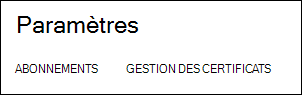
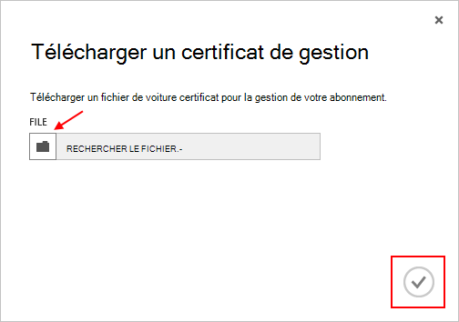

<properties 
    pageTitle="Télécharger un certificat de l’API de gestion Azure | Microsoft Azure" 
    description="Découvrez comment télécharger le certificat de gestion des API athe pour le portail classique Azure." 
    services="cloud-services" 
    documentationCenter=".net" 
    authors="Thraka" 
    manager="timlt" 
    editor=""/>

<tags 
    ms.service="na" 
    ms.workload="tbd" 
    ms.tgt_pltfrm="na" 
    ms.devlang="na" 
    ms.topic="article" 
    ms.date="04/18/2016"
    ms.author="adegeo"/>

# Télécharger un certificat de gestion des API de gestion Azure

Certificats de gestion permettent de vous authentifier avec l’API de gestion de Service fournie par Azure. De nombreux programmes et outils (tels que Visual Studio ou le Kit de développement Azure) utilisera ces certificats pour automatiser la configuration et déploiement de différents services Azure. **Cela s’applique uniquement au portail classique Azure**. 

>[AZURE.WARNING] Fais attention ! Ces types de certificats autoriser les personnes qui authentifie avec eux pour gérer l’abonnement qu'auquel elles sont associées. 

Plus d’informations sur les certificats Azure (y compris la création d’un certificat auto-signé) est [disponible](cloud-services/cloud-services-certs-create.md#what-are-management-certificates) si vous en avez besoin.

Vous pouvez également utiliser [Azure Active Directory](/services/active-directory/) pour authentifier code client fins d’automatisation.

## Télécharger un certificat de gestion

Une fois que vous avez un certificat de gestion créé, (fichier .cer avec uniquement la clé publique) vous pouvez le télécharger sur le portail. Lorsque le certificat est disponible dans le portail, toute personne disposant d’un certficiate correspondante (clé privée) peut se connecter à l’API de gestion et accéder aux ressources de l’abonnement associé.

1. Connectez-vous au [portail classique Azure](http://manage.windowsazure.com).

2. Vérifiez que l’abonnement correcte que vous souhaitez associer un certificat avec. Appuyez sur le texte **d’abonnements** en haut à droite du portail.

    

3. Une fois que vous avez l’abonnement correcte sélectionnée, appuyez sur **paramètres** sur le côté gauche du portail (vous devrez peut-être faire défiler vers le bas). 
    
    

4. Appuyez sur l’onglet **Gestion des certificats** .

    
    
5. Appuyez sur le bouton **Télécharger** .

    
    
6. Renseignez les informations de la boîte de dialogue, puis appuyez sur la **coche**terminé.

    

## Étapes suivantes

Maintenant que vous avez un certificat de gestion associé à un abonnement, vous pouvez (une fois que vous avez installé le certificat correspondant localement) par programme se connecter à l' [API REST de gestion de Service](https://msdn.microsoft.com/library/azure/mt420159.aspx) et automatiser les diverses ressources Azure associés à cet abonnement. 